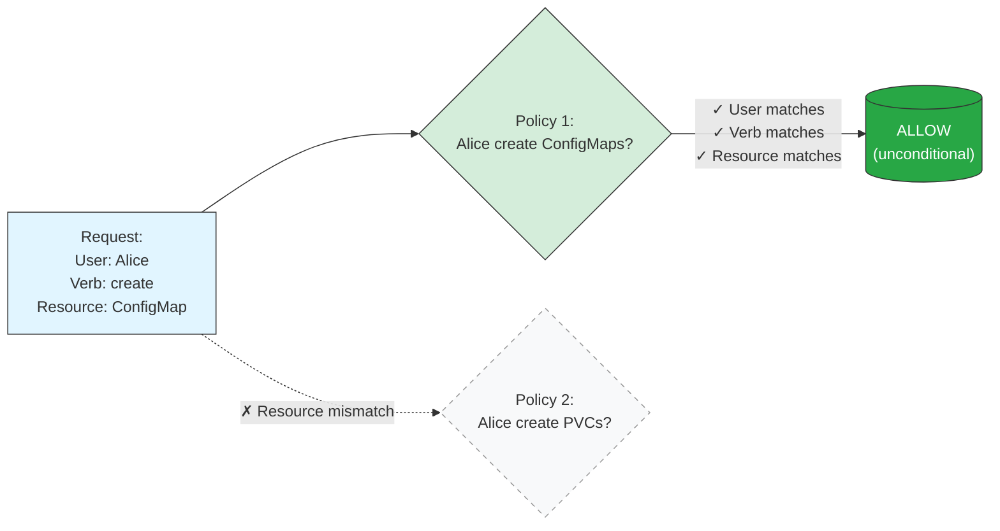
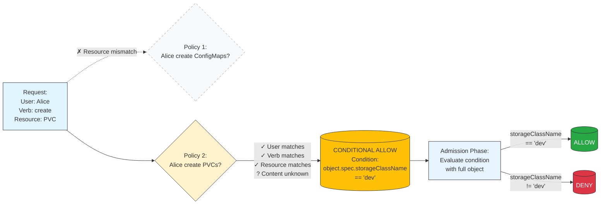
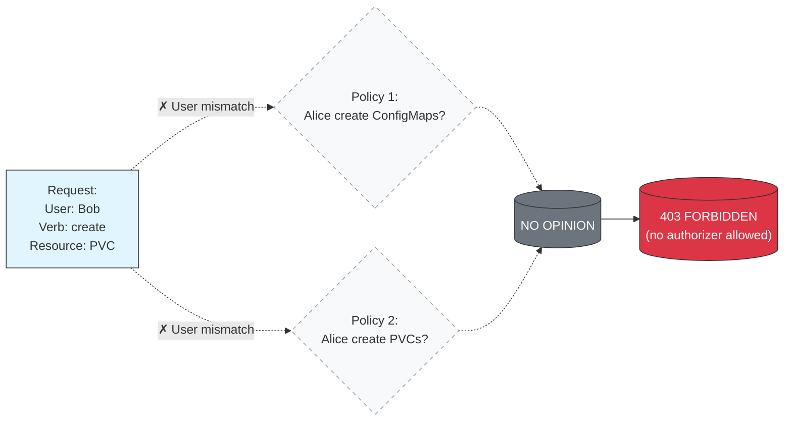
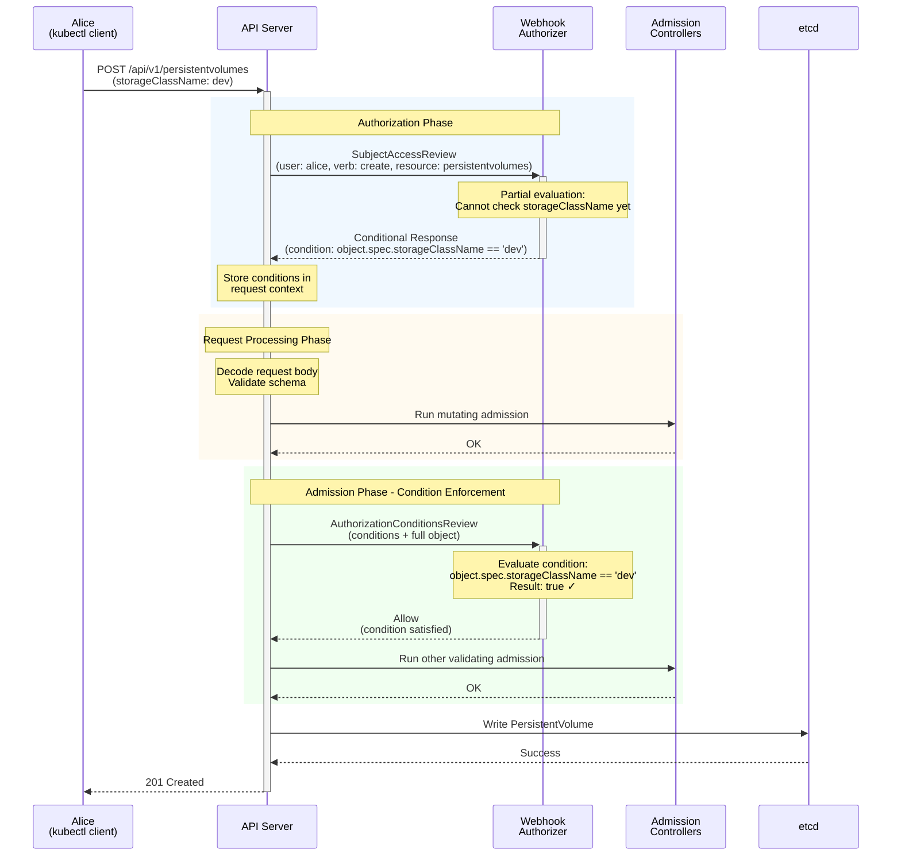
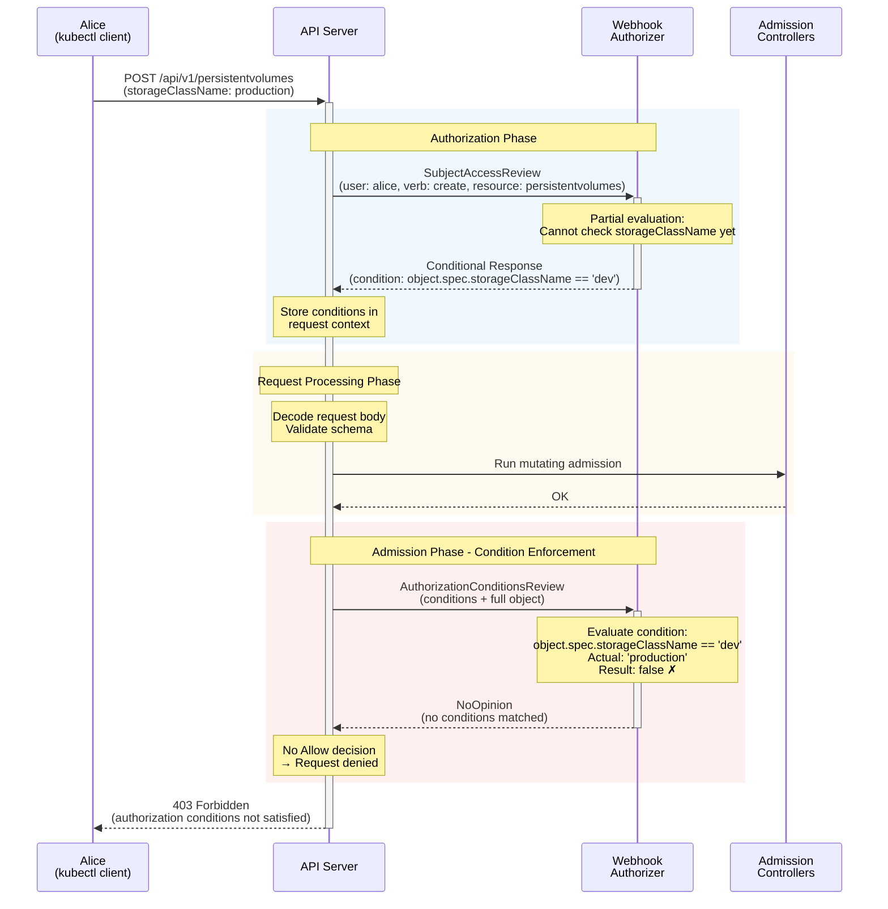
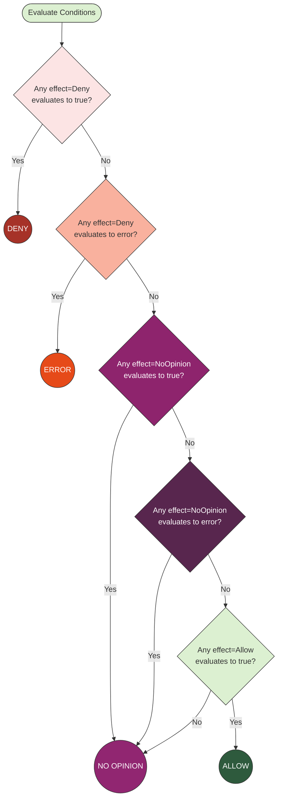

---
reviewers:
- erictune
- lavalamp
- deads2k
- liggitt
title: Authorization
content_type: concept
weight: 30
description: >
  Details of Kubernetes authorization mechanisms and supported authorization modes.
---

<!-- overview -->

Kubernetes authorization takes place following
[authentication](/docs/reference/access-authn-authz/authentication/).
Usually, a client making a request must be authenticated (logged in) before its
request can be allowed; however, Kubernetes also allows anonymous requests in
some circumstances.

For an overview of how authorization fits into the wider context of API access
control, read
[Controlling Access to the Kubernetes API](/docs/concepts/security/controlling-access/).

<!-- body -->

## Authorization verdicts {#determine-whether-a-request-is-allowed-or-denied}

Kubernetes authorization of API requests takes place within the API server.
The API server evaluates all of the request attributes against all policies,
potentially also consulting external services, and then allows or denies the
request.

All parts of an API request must be allowed by some authorization
mechanism in order to proceed. In other words: access is denied by default.

{}
Access controls and policies that
depend on specific fields of specific kinds of objects are handled by
.

Kubernetes admission control happens after authorization has completed (and,
therefore, only when the authorization decision was to allow the request).
{}

When multiple [authorization modules](#authorization-modules) are configured,
each is checked in sequence.
If any authorizer _approves_ or _denies_ a request, that decision is immediately
returned and no other authorizer is consulted. If all modules have _no opinion_
on the request, then the request is denied. An overall deny verdict means that
the API server rejects the request and responds with an HTTP 403 (Forbidden)
status.

### Conditional authorization {#conditional-authorization}



Starting with Kubernetes v1.37, authorizers can return _conditional_ responses
in addition to the standard _allow_, _deny_, or _no opinion_ verdicts. A conditional
response means that the final authorization decision depends on the content of
the API request or stored object, rather than just metadata like resource name
or namespace.

Conditional authorization enables more fine-grained access control policies that
span both the authorization and admission phases. For example, an authorizer can
express: "allow user Alice to create PersistentVolumes, but only when
spec.storageClassName is 'dev'".

When an authorizer returns a conditional response:

1. During the **authorization phase**, the authorizer performs partial evaluation
   of its policies based on available metadata, returning a set of conditions
   that must be satisfied for the request to be allowed.
2. During the **admission phase**, the `AuthorizationConditionsEnforcer` admission 
   controller calls the authorizer back to evaluate the conditions the authorizer 
   produced in the authorization phase, producing a final allow or deny decision.

Conditional authorization is supported for requests that proceed through admission:
- `create`, `update`, `patch`, `delete`, `deletecollection` verbs
- Connect requests (for example, `pods/exec`, `pods/portforward`)

For read requests (`get`, `list`, `watch`) and other operations, authorizers
must return unconditional (Allow, Deny, NoOpinion) decisions only.

## Request attributes used in authorization

Kubernetes reviews only the following API request attributes:

 * **user** - The `user` string provided during authentication.
 * **group** - The list of group names to which the authenticated user belongs.
 * **extra** - A map of arbitrary string keys to string values, provided by the authentication layer.
 * **API** - Indicates whether the request is for an API resource.
 * **Request path** - Path to miscellaneous non-resource endpoints like `/api` or `/healthz`.
 * **API request verb** - API verbs like `get`, `list`, `create`, `update`, `patch`, `watch`, `delete`, and `deletecollection` are used for resource requests. To determine the request verb for a resource API endpoint, see [request verbs and authorization](/docs/reference/access-authn-authz/authorization/#determine-the-request-verb).
 * **HTTP request verb** - Lowercased HTTP methods like `get`, `post`, `put`, and `delete` are used for non-resource requests.
 * **Resource** - The ID or name of the resource that is being accessed (for resource requests only) -- For resource requests using `get`, `update`, `patch`, and `delete` verbs, you must provide the resource name.
 * **Subresource** - The subresource that is being accessed (for resource requests only).
 * **Namespace** - The namespace of the object that is being accessed (for namespaced resource requests only).
 * **API group** - The  being accessed (for resource requests only). An empty string designates the _core_ [API group](/docs/reference/using-api/#api-groups).

### Request verbs and authorization {#determine-the-request-verb}

#### Non-resource requests {#request-verb-non-resource}

Requests to endpoints other than `/api/v1/...` or `/apis/<group>/<version>/...`
are considered _non-resource requests_, and use the lower-cased HTTP method of the request as the verb.
For example, making a `GET` request using HTTP to endpoints such as `/api` or `/healthz` would use **get** as the verb.

#### Resource requests {#request-verb-resource}

To determine the request verb for a resource API endpoint, Kubernetes maps the HTTP verb
used and considers whether or not the request acts on an individual resource or on a
collection of resources:

HTTP verb     | request verb
--------------|---------------
`POST`        | **create**
`GET`, `HEAD` | **get** (for individual resources), **list** (for collections, including full object content), **watch** (for watching an individual resource or collection of resources)
`PUT`         | **update**
`PATCH`       | **patch**
`DELETE`      | **delete** (for individual resources), **deletecollection** (for collections)


+The **get**, **list** and **watch** verbs can all return the full details of a resource. In
terms of access to the returned data they are equivalent. For example, **list** on `secrets`
will reveal the **data** attributes of any returned resources.


Kubernetes sometimes checks authorization for additional permissions using specialized verbs. For example:

* Special cases of [authentication](/docs/reference/access-authn-authz/authentication/)
  * **impersonate** verb on `users`, `groups`, and `serviceaccounts` in the core API group, and the `userextras` in the `authentication.k8s.io` API group.
* [Authorization of CertificateSigningRequests](/docs/reference/access-authn-authz/certificate-signing-requests/#authorization)
  * **approve** verb for CertificateSigningRequests, and **update** for revisions to existing approvals
* [RBAC](/docs/reference/access-authn-authz/rbac/#privilege-escalation-prevention-and-bootstrapping)
  * **bind** and **escalate** verbs on `roles` and `clusterroles` resources in the `rbac.authorization.k8s.io` API group.

## Authorization context

Kubernetes expects attributes that are common to REST API requests. This means
that Kubernetes authorization works with existing organization-wide or
cloud-provider-wide access control systems which may handle other APIs besides
the Kubernetes API.

## Authorization modes {#authorization-modules}

The Kubernetes API server may authorize a request using one of several authorization modes:

`AlwaysAllow`
: This mode allows all requests, which brings [security risks](#warning-always-allow). Use this authorization mode only if you do not require authorization for your API requests (for example, for testing).

`AlwaysDeny`
: This mode blocks all requests. Use this authorization mode only for testing.

`ABAC` ([attribute-based access control](/docs/reference/access-authn-authz/abac/))
: Kubernetes ABAC mode defines an access control paradigm whereby access rights are granted to users through the use of policies which combine attributes together. The policies can use any type of attributes (user attributes, resource attributes, object, environment attributes, etc).

`RBAC` ([role-based access control](/docs/reference/access-authn-authz/rbac/))
: Kubernetes RBAC is a method of regulating access to computer or network resources based on the roles of individual users within an enterprise. In this context, access is the ability of an individual user to perform a specific task, such as view, create, or modify a file.  
  In this mode, Kubernetes uses the `rbac.authorization.k8s.io` API group to drive authorization decisions, allowing you to dynamically configure permission policies through the Kubernetes API.

`Node`
: A special-purpose authorization mode that grants permissions to kubelets based on the pods they are scheduled to run. To learn more about the Node authorization mode, see [Node Authorization](/docs/reference/access-authn-authz/node/).

`Webhook`
: Kubernetes [webhook mode](/docs/reference/access-authn-authz/webhook/) for authorization makes a synchronous HTTP callout, blocking the request until the remote HTTP service responds to the query. You can write your own software to handle the callout, or use solutions from the ecosystem. Webhook authorizers can return [conditional responses](#conditional-authorization) when the `ConditionalAuthorization` feature is enabled.

<a id="warning-always-allow" />


Enabling the `AlwaysAllow` mode bypasses authorization; do not use this on a cluster where
you do not trust **all** potential API clients, including the workloads that you run.

Authorization mechanisms typically return either a _deny_ or _no opinion_ result; see
[authorization verdicts](#determine-whether-a-request-is-allowed-or-denied) for more on this.
Activating the `AlwaysAllow` means that if all other authorizers return “no opinion”,
the request is allowed. For example, `--authorization-mode=AlwaysAllow,RBAC` has the
same effect as `--authorization-mode=AlwaysAllow` because Kubernetes RBAC does not
provide negative (deny) access rules.

You should not use the `AlwaysAllow` mode on a Kubernetes cluster where the API server
is reachable from the public internet.


### The system:masters group

The `system:masters` group is a built-in Kubernetes group that grants unrestricted
access to the API server. Any user assigned to this group has full cluster administrator
privileges, bypassing any authorization restrictions imposed by the RBAC or Webhook mechanisms.
[Avoid adding users](/docs/concepts/security/rbac-good-practices/#least-privilege)
to this group. If you do need to grant a user cluster-admin rights, you can create a
[ClusterRoleBinding](/docs/reference/access-authn-authz/rbac/#user-facing-roles)
to the built-in `cluster-admin` ClusterRole.

### Authorization mode configuration {#choice-of-authz-config}

You can configure the Kubernetes API server's authorizer chain using either
a [configuration file](#using-configuration-file-for-authorization) only or
[command line arguments](#using-flags-for-your-authorization-module).

You have to pick one of the two configuration approaches; setting both `--authorization-config`
path and configuring an authorization webhook using the `--authorization-mode` and
`--authorization-webhook-*` command line arguments is not allowed.
If you try this, the API server reports an error message during startup, then exits immediately.

<!-- keep legacy hyperlinks working -->
<a id="configuring-the-api-server-using-an-authorization-config-file" />

### Configuring the API Server using an authorization config file {#using-configuration-file-for-authorization}



Kubernetes lets you configure authorization chains that can include multiple
webhooks. The authorization items in that chain can have well-defined parameters that validate
requests in a particular order, offering you fine-grained control, such as explicit Deny on failures.

The configuration file approach even allows you to specify
[CEL](/docs/reference/using-api/cel/) rules to pre-filter requests before they are dispatched
to webhooks, helping you to prevent unnecessary invocations. The API server also automatically
reloads the authorizer chain when the configuration file is modified.

You specify the path to the authorization configuration using the
`--authorization-config` command line argument.

If you want to use command line arguments instead of a configuration file, that's also a valid and supported approach.
Some authorization capabilities (for example: multiple webhooks, webhook failure policy, and pre-filter rules)
are only available if you use an authorization configuration file.

#### Example configuration {#authz-config-example}


---
#
# DO NOT USE THE CONFIG AS IS. THIS IS AN EXAMPLE.
#
apiVersion: apiserver.config.k8s.io/v1
kind: AuthorizationConfiguration
authorizers:
  - type: Webhook
    # Name used to describe the authorizer
    # This is explicitly used in monitoring machinery for metrics
    # Note:
    #   - Validation for this field is similar to how K8s labels are validated today.
    # Required, with no default
    name: webhook
    webhook:
      # The duration to cache 'authorized' responses from the webhook
      # authorizer.
      # Same as setting `--authorization-webhook-cache-authorized-ttl` flag
      # Default: 5m0s
      authorizedTTL: 30s
      # If set to false, 'authorized' responses from the webhook are not cached
      # and the specified authorizedTTL is ignored/has no effect.
      # Same as setting `--authorization-webhook-cache-authorized-ttl` flag to `0`.
      # Note: Setting authorizedTTL to `0` results in its default value being used.
      # Default: true
      cacheAuthorizedRequests: true
      # The duration to cache 'unauthorized' responses from the webhook
      # authorizer.
      # Same as setting `--authorization-webhook-cache-unauthorized-ttl` flag
      # Default: 30s
      unauthorizedTTL: 30s
      # If set to false, 'unauthorized' responses from the webhook are not cached
      # and the specified unauthorizedTTL is ignored/has no effect.
      # Same as setting `--authorization-webhook-cache-unauthorized-ttl` flag to `0`.
      # Note: Setting unauthorizedTTL to `0` results in its default value being used.
      # Default: true
      cacheUnauthorizedRequests: true
      # Timeout for the webhook request
      # Maximum allowed is 30s.
      # Required, with no default.
      timeout: 3s
      # The API version of the authorization.k8s.io SubjectAccessReview to
      # send to and expect from the webhook.
      # Same as setting `--authorization-webhook-version` flag
      # Required, with no default
      # Valid values: v1beta1, v1
      subjectAccessReviewVersion: v1
      # MatchConditionSubjectAccessReviewVersion specifies the SubjectAccessReview
      # version the CEL expressions are evaluated against
      # Valid values: v1
      # Required, no default value
      matchConditionSubjectAccessReviewVersion: v1
      # Controls the authorization decision when a webhook request fails to
      # complete or returns a malformed response or errors evaluating
      # matchConditions.
      # Valid values:
      #   - NoOpinion: continue to subsequent authorizers to see if one of
      #     them allows the request
      #   - Deny: reject the request without consulting subsequent authorizers
      # Required, with no default.
      failurePolicy: Deny
      # When ConditionalAuthorization is enabled, conditionsEndpointKubeConfigContext
      # specifies the kubeconfig context to use for evaluating authorization conditions.
      # The authorizer must support evaluating any condition type it returns.
      # Optional; if unset, conditional authorization is not supported by this webhook.
      conditionsEndpointKubeConfigContext: authorization-conditions
      # The API version of the authorization.k8s.io AuthorizationConditionsReview to
      # send to and expect from the webhook when evaluating conditions.
      # Only relevant when conditionsEndpointKubeConfigContext is set.
      # Valid values: v1alpha1
      # This field has no default.
      authorizationConditionsReviewVersion: v1alpha1
      connectionInfo:
        # Controls how the webhook should communicate with the server.
        # Valid values:
        # - KubeConfigFile: use the file specified in kubeConfigFile to locate the
        #   server.
        # - InClusterConfig: use the in-cluster configuration to call the
        #   SubjectAccessReview API hosted by kube-apiserver. This mode is not
        #   allowed for kube-apiserver.
        type: KubeConfigFile
        # Path to KubeConfigFile for connection info
        # Required, if connectionInfo.Type is KubeConfigFile
        kubeConfigFile: /kube-system-authz-webhook.yaml
        # matchConditions is a list of conditions that must be met for a request to be sent to this
        # webhook. An empty list of matchConditions matches all requests.
        # There are a maximum of 64 match conditions allowed.
        #
        # The exact matching logic is (in order):
        #   1. If at least one matchCondition evaluates to FALSE, then the webhook is skipped.
        #   2. If ALL matchConditions evaluate to TRUE, then the webhook is called.
        #   3. If at least one matchCondition evaluates to an error (but none are FALSE):
        #      - If failurePolicy=Deny, then the webhook rejects the request
        #      - If failurePolicy=NoOpinion, then the error is ignored and the webhook is skipped
      matchConditions:
      # expression represents the expression which will be evaluated by CEL. Must evaluate to bool.
      # CEL expressions have access to the contents of the SubjectAccessReview in v1 version.
      # If version specified by subjectAccessReviewVersion in the request variable is v1beta1,
      # the contents would be converted to the v1 version before evaluating the CEL expression.
      #
      # Documentation on CEL: https://kubernetes.io/docs/reference/using-api/cel/
      #
      # only send resource requests to the webhook
      - expression: has(request.resourceAttributes)
      # only intercept requests to kube-system
      - expression: request.resourceAttributes.namespace == 'kube-system'
      # don't intercept requests from kube-system service accounts
      - expression: "!('system:serviceaccounts:kube-system' in request.groups)"
  - type: Node
    name: node
  - type: RBAC
    name: rbac
  - type: Webhook
    name: in-cluster-authorizer
    webhook:
      authorizedTTL: 5m
      unauthorizedTTL: 30s
      timeout: 3s
      subjectAccessReviewVersion: v1
      failurePolicy: NoOpinion
      connectionInfo:
        type: InClusterConfig


When configuring the authorizer chain using a configuration file, make sure all the
control plane nodes have the same file contents. Take a note of the API server
configuration when upgrading / downgrading your clusters. For example, if upgrading
from Kubernetes  to Kubernetes ,
you would need to make sure the config file is in a format that Kubernetes 
can understand, before you upgrade the cluster. If you downgrade to ,
you would need to set the configuration appropriately.

#### Authorization configuration and reloads

Kubernetes reloads the authorization configuration file when the API server observes a change
to the file, and also on a 60 second schedule if no change events were observed.


You must ensure that all non-webhook authorizer types remain unchanged in the file on reload.

A reload **must not** add or remove Node or RBAC authorizers (they can be reordered,
but cannot be added or removed).


### Command line authorization mode configuration {#using-flags-for-your-authorization-module}

You can use the following modes:

* `--authorization-mode=ABAC` (Attribute-based access control mode)
* `--authorization-mode=RBAC` (Role-based access control mode)
* `--authorization-mode=Node` (Node authorizer)
* `--authorization-mode=Webhook` (Webhook authorization mode)
* `--authorization-mode=AlwaysAllow` (always allows requests; carries [security risks](#warning-always-allow))
* `--authorization-mode=AlwaysDeny` (always denies requests)

You can choose more than one authorization mode; for example:
`--authorization-mode=Node,RBAC,Webhook`

Kubernetes checks authorization modules based on the order that you specify them
on the API server's command line, so an earlier module has higher priority to allow
or deny a request.

You cannot combine the `--authorization-mode` command line argument with the
`--authorization-config` command line argument used for
[configuring authorization using a local file](#using-configuration-file-for-authorization-mode).

For more information on command line arguments to the API server, read the
[`kube-apiserver` reference](/docs/reference/command-line-tools-reference/kube-apiserver/).

## Privilege escalation via workload creation or edits {#privilege-escalation-via-pod-creation}

Users who can create/edit pods in a namespace, either directly or through an object that
enables indirect [workload management](/docs/concepts/architecture/controller/), may be
able to escalate their privileges in that namespace. The potential routes to privilege
escalation include Kubernetes [API extensions](/docs/concepts/extend-kubernetes/#api-extensions)
and their associated .


As a cluster administrator, use caution when granting access to create or edit workloads.
Some details of how these can be misused are documented in
[escalation paths](/docs/reference/access-authn-authz/authorization/#escalation-paths).


### Escalation paths {#escalation-paths}

There are different ways that an attacker or untrustworthy user could gain additional
privilege within a namespace, if you allow them to run arbitrary Pods in that namespace:

- Mounting arbitrary Secrets in that namespace
  - Can be used to access confidential information meant for other workloads
  - Can be used to obtain a more privileged ServiceAccount's service account token
- Using arbitrary ServiceAccounts in that namespace
  - Can perform Kubernetes API actions as another workload (impersonation)
  - Can perform any privileged actions that ServiceAccount has
- Mounting or using ConfigMaps meant for other workloads in that namespace
  - Can be used to obtain information meant for other workloads, such as database host names.
- Mounting volumes meant for other workloads in that namespace
  - Can be used to obtain information meant for other workloads, and change it.


As a system administrator, you should be cautious when deploying CustomResourceDefinitions
that let users make changes to the above areas. These may open privilege escalations paths.
Consider the consequences of this kind of change when deciding on your authorization controls.


## How conditional authorization works {#how-conditional-authorization-works}



When the `ConditionalAuthorization` feature is enabled, the authorization and
admission phases work together to enforce fine-grained policies:

1. **Authorization phase**: The authorizer performs _partial evaluation_ of its
   policies based on available metadata (user, verb, resource, namespace, etc.).
   If the policy cannot be fully evaluated without seeing the request content,
   the authorizer returns conditions.

2. **Request processing**: If the authorization decision was a conditional allow
   (meaning the request could be allowed if conditions are met), the API server
   proceeds with normal request processing, including mutation by admission controllers.

3. **Admission phase**: The `AuthorizationConditionsEnforcer` admission controller
   (always enabled when the feature is active) evaluates all returned conditions
   against the fully-mutated request and stored objects. If the conditions evaluate
   to allow, the request proceeds; otherwise, it's denied.

### Partial evaluation examples

To understand how partial evaluation works, consider an authorizer with these two policies:

- **Policy 1**: "Allow Alice to create ConfigMaps (with any content)"
- **Policy 2**: "Allow Alice to create PersistentVolumeClaims, but only when
  `spec.storageClassName == 'dev'`"

Here's how these policies are partially evaluated for different requests during the
authorization phase:

**Request 1: Alice creates a ConfigMap**

- **Policy 1**: Matches completely (user is Alice, verb is create, resource is ConfigMaps).
  No request content is needed. → **Allow**
- **Policy 2**: Does not apply (wrong resource)

Result: The request is **unconditionally allowed** directly at the authorization stage,
just like without conditional authorization. No admission-phase evaluation is needed.



**Request 2: Alice creates a PersistentVolumeClaim**

- **Policy 1**: Does not apply (wrong resource)
- **Policy 2**: Partially matches (user is Alice, verb is create, resource is
  PersistentVolumeClaims), but the request content (specifically `spec.storageClassName`)
  is not yet available. → **Conditional Allow** (condition: `object.spec.storageClassName == 'dev'`)

Result: The request proceeds to admission, where the condition is evaluated. If
`spec.storageClassName` is 'dev', the request is allowed; otherwise, it's denied.



**Request 3: Bob creates a PersistentVolumeClaim**

- **Policy 1**: Does not apply (wrong user)
- **Policy 2**: Does not apply (wrong user)

Result: The authorizer returns **NoOpinion**. If no other authorizer in the chain
allows the request, it's rejected with HTTP 403 (Forbidden) at the authorization stage.



### Example scenario

Consider an admin has configured a webhook authorizer with conditional authorization support:

```yaml
apiVersion: apiserver.config.k8s.io/v1
kind: AuthorizationConfiguration
authorizers:
 - type: Webhook
   name: storage-policy-webhook
   webhook:
    timeout: 3s
    subjectAccessReviewVersion: v1
    failurePolicy: Deny
    # Endpoint for evaluating authorization conditions
    # This endpoint receives AuthorizationConditionsReview requests
    conditionsEndpointKubeConfigContext: authorization-conditions
    authorizationConditionsReviewVersion: v1alpha1
    connectionInfo:
      type: KubeConfigFile
      kubeConfigFile: /etc/kubernetes/authz-webhook.yaml
```

The referenced kubeconfig file `/etc/kubernetes/authz-webhook.yaml` contains:

```yaml
apiVersion: v1
kind: Config
clusters:
- name: storage-webhook
  cluster:
    server: https://storage-authz-webhook.example.com
    certificate-authority: /etc/kubernetes/pki/webhook-ca.crt
contexts:
- name: default
  context:
    cluster: storage-webhook
    user: kube-apiserver
- name: authorization-conditions
  context:
    cluster: storage-webhook
    user: kube-apiserver
current-context: default
users:
- name: kube-apiserver
  user:
    client-certificate: /etc/kubernetes/pki/apiserver-webhook-client.crt
    client-key: /etc/kubernetes/pki/apiserver-webhook-client.key
```

The webhook implements a policy: "allow user Alice to create PersistentVolumes,
but only when `spec.storageClassName` is 'dev'".

#### Sequence diagrams

##### Successful request with condition satisfied

The following diagram shows a request where the authorization condition is satisfied
(storageClassName is 'dev'):



##### Failed request with condition not satisfied

The following diagram shows a request where the authorization condition is not satisfied
(storageClassName is 'production' instead of 'dev'):



#### Step-by-step flow

When Alice attempts to create a PersistentVolume with this manifest:

```yaml
apiVersion: v1
kind: PersistentVolume
metadata:
  name: my-pv
spec:
  capacity:
    storage: 10Gi
  storageClassName: dev
  accessModes:
    - ReadWriteOnce
  hostPath:
    path: /data
```

**Step 1: Authorization phase**

The API server sends a `SubjectAccessReview` to the webhook authorizer:

```yaml
apiVersion: authorization.k8s.io/v1
kind: SubjectAccessReview
spec:
  resourceAttributes:
    namespace: ""
    verb: create
    group: ""
    version: v1
    resource: persistentvolumes
  user: alice
  groups:
  - system:authenticated
  uid: "alice-uid-123"
```

The webhook examines the request and recognizes that:
- Alice is trying to create a PersistentVolume (metadata is available)
- The request body content is not yet available during authorization
- The policy requires checking `spec.storageClassName`

The webhook returns a **conditional response**:

```yaml
apiVersion: authorization.k8s.io/v1
kind: SubjectAccessReview
status:
  allowed: false
  denied: false
  conditionalDecision:
    type: k8s.io/cel
    conditions:
    - id: storage-class-dev-only
      effect: Allow
      condition: "object.spec.storageClassName == 'dev'"
      description: "User alice can only create PersistentVolumes with storageClassName 'dev'"
```

Because the response contains a conditional allow (`effect: Allow`), the API server
proceeds with the request, storing the conditions in the request context.

**Step 2: Request processing**

The request proceeds through the normal request chain:
- Request body is decoded and validated
- Mutating admission controllers run (if any)
- Validating admission controllers begin

**Step 3: Admission phase - condition enforcement**

The `AuthorizationConditionsEnforcer` admission controller runs first among
validating admission controllers. It extracts the conditions from the request
context and sends an `AuthorizationConditionsReview` to the webhook:

```yaml
apiVersion: authorization.k8s.io/v1alpha1
kind: AuthorizationConditionsReview
spec:
  conditionalDecision:
    type: k8s.io/cel
    conditions:
    - id: storage-class-dev-only
      effect: Allow
      condition: "object.spec.storageClassName == 'dev'"
      description: "User alice can only create PersistentVolumes with storageClassName 'dev'"
  operation: CREATE
  object:
    apiVersion: v1
    kind: PersistentVolume
    metadata:
      name: my-pv
    spec:
      capacity:
        storage: 10Gi
      storageClassName: dev
      accessModes:
      - ReadWriteOnce
      hostPath:
        path: /data
  oldObject: null
  options: null
```

**Step 4: Condition evaluation**

The webhook evaluates the condition against the actual request object:
- Condition: `object.spec.storageClassName == 'dev'`
- Actual value: `object.spec.storageClassName` is `'dev'`
- Result: `true`

Because the condition with `effect: Allow` evaluates to `true`, the webhook
returns an allow decision:

```yaml
apiVersion: authorization.k8s.io/v1alpha1
kind: AuthorizationConditionsReview
status:
  allowed: true
  denied: false
  reason: "Condition 'storage-class-dev-only' evaluated to true"
```

**Step 5: Request completion**

Since the conditions evaluated to allow, the `AuthorizationConditionsEnforcer`
allows the request to proceed. Other validating admission controllers run,
and if all succeed, the PersistentVolume is created in etcd.

#### Alternative scenario: denied request

If Alice had instead tried to create a PersistentVolume with
`storageClassName: production`:

1. Steps 1-3 would proceed identically
2. In step 4, the webhook would evaluate:
   - Condition: `object.spec.storageClassName == 'dev'`
   - Actual value: `object.spec.storageClassName` is `'production'`
   - Result: `false`

3. Because no `effect: Allow` conditions evaluated to `true`, the webhook returns:

   ```yaml
   apiVersion: authorization.k8s.io/v1alpha1
   kind: AuthorizationConditionsReview
   status:
     allowed: false
     denied: false
     reason: "No Allow conditions matched"
   ```

4. The `AuthorizationConditionsEnforcer` denies the request with an error message:
   ```
   Error from server (Forbidden): persistentvolumes "my-pv" is forbidden:
   authorization conditions not satisfied: User alice can only create
   PersistentVolumes with storageClassName 'dev'
   ```

#### Built-in CEL evaluation

In this example, the webhook returned conditions with `type: k8s.io/cel`.
When the API server's built-in CEL evaluator supports this condition type, it can
evaluate the conditions in-process without sending an `AuthorizationConditionsReview`
back to the webhook. This provides better performance while maintaining the same
security guarantees.

If the webhook had instead returned a custom condition type (for example,
`type: example.com/custom-policy`), then the `AuthorizationConditionsReview`
callback to the webhook would be required, as only the webhook knows how to
evaluate that condition type.

### Condition evaluation



Conditions can have different effects:

- **Deny effect**: If the condition evaluates to `true`, the request is immediately
  denied, short-circuiting evaluation of other authorizers.
- **NoOpinion effect**: If the condition evaluates to `true`, this authorizer has
  no opinion, but other authorizers in the chain may still allow or deny the request.
  The NoOpinion effect is useful for reducing the influence of Allow conditions by
  factoring out common preconditions.
- **Allow effect**: If the condition evaluates to `true`, it contributes to allowing
  the request (unless overridden by deny conditions).

Multiple authorizers can return conditions for the same request. They are evaluated
in order, and the same short-circuiting logic applies as in the authorization phase.

#### Understanding NoOpinion effect

The NoOpinion effect is useful for factoring out common preconditions from multiple
Allow conditions. Instead of repeating the same precondition in every Allow condition,
you can express it once as a NoOpinion condition.

For example, suppose you want to allow certain operations only when a namespace has
a specific label. Without NoOpinion, you would need to repeat this check:

```yaml
conditions:
- id: allow-create-pods
  effect: Allow
  condition: "namespace.metadata.labels['team'] == 'platform' && object.spec.containers.size() <= 5"
- id: allow-create-deployments
  effect: Allow
  condition: "namespace.metadata.labels['team'] == 'platform' && object.spec.replicas <= 10"
```

Using NoOpinion, you can factor out the common precondition:

```yaml
conditions:
- id: team-precondition
  effect: NoOpinion
  condition: "namespace.metadata.labels['team'] != 'platform'"
- id: allow-create-pods
  effect: Allow
  condition: "object.spec.containers.size() <= 5"
- id: allow-create-deployments
  effect: Allow
  condition: "object.spec.replicas <= 10"
```

When `namespace.metadata.labels['team'] != 'platform'`, the NoOpinion condition
evaluates to true, causing this authorizer to have no opinion (effectively denying
all the Allow conditions). When the label equals 'platform', the NoOpinion condition
evaluates to false and is ignored, allowing the Allow conditions to be evaluated
normally.

This approach is clearer and more maintainable, especially when you have many Allow
conditions that share the same precondition.

## Checking API access

`kubectl` provides the `auth can-i` subcommand for quickly querying the API authorization layer.
The command uses the `SelfSubjectAccessReview` API to determine if the current user can perform
a given action, and works regardless of the authorization mode used.


```bash
kubectl auth can-i create deployments --namespace dev
```

The output is similar to this:

```
yes
```

```shell
kubectl auth can-i create deployments --namespace prod
```

The output is similar to this:

```
no
```

Administrators can combine this with [user impersonation](/docs/reference/access-authn-authz/authentication/#user-impersonation)
to determine what action other users can perform.

```bash
kubectl auth can-i list secrets --namespace dev --as dave
```

The output is similar to this:

```
no
```

Similarly, to check whether a ServiceAccount named `dev-sa` in Namespace `dev`
can list Pods in the Namespace `target`:

```bash
kubectl auth can-i list pods \
    --namespace target \
    --as system:serviceaccount:dev:dev-sa
```

The output is similar to this:

```
yes
```

SelfSubjectAccessReview is part of the `authorization.k8s.io` API group, which
exposes the API server authorization to external services. Other resources in
this group include:

SubjectAccessReview
: Access review for any user, not only the current one. Useful for delegating authorization decisions to the API server. For example, the kubelet and extension API servers use this to determine user access to their own APIs.

LocalSubjectAccessReview
: Like SubjectAccessReview but restricted to a specific namespace.

SelfSubjectRulesReview
: A review which returns the set of actions a user can perform within a namespace. Useful for users to quickly summarize their own access, or for UIs to hide/show actions.

AuthorizationConditionsReview
: () Allows evaluating authorization conditions returned by conditional authorizers. Used internally by the API server during admission, and can be called by aggregated API servers.

These APIs can be queried by creating normal Kubernetes resources, where the response `status`
field of the returned object is the result of the query. For example:

```bash
kubectl create -f - -o yaml << EOF
apiVersion: authorization.k8s.io/v1
kind: SelfSubjectAccessReview
spec:
  resourceAttributes:
    group: apps
    resource: deployments
    verb: create
    namespace: dev
EOF
```

The generated SelfSubjectAccessReview is similar to:


apiVersion: authorization.k8s.io/v1
kind: SelfSubjectAccessReview
metadata:
  creationTimestamp: null
spec:
  resourceAttributes:
    group: apps
    resource: deployments
    namespace: dev
    verb: create
status:
  allowed: true
  denied: false


When the `ConditionalAuthorization` feature is enabled and an authorizer returns
conditional responses, the status includes a `conditionalDecision` field instead of
simple `allowed: true` or `denied: true`. For example:


apiVersion: authorization.k8s.io/v1
kind: SelfSubjectAccessReview
metadata:
  creationTimestamp: null
spec:
  conditionalAuthorization:
    enabled: true
  resourceAttributes:
    group: ""
    resource: persistentvolumes
    verb: create
status:
  allowed: false
  conditionalDecision:
    type: "k8s.io/cel"
    conditions:
    - id: storage-class-restriction
      effect: "Allow"
      condition: object.spec.storageClassName == "dev"
      description: "User can only create PersistentVolumes with storageClassName 'dev'"


The `conditionalDecision` represents an ordered list of condition sets from different
authorizers. Each condition set contains one or more conditions that must be
evaluated against the actual request object during the admission phase.

## {}

* To learn more about Authentication, see [Authentication](/docs/reference/access-authn-authz/authentication/).
* For an overview, read [Controlling Access to the Kubernetes API](/docs/concepts/security/controlling-access/).
* To learn more about Admission Control, see [Using Admission Controllers](/docs/reference/access-authn-authz/admission-controllers/).
* Read more about [Common Expression Language in Kubernetes](/docs/reference/using-api/cel/).
