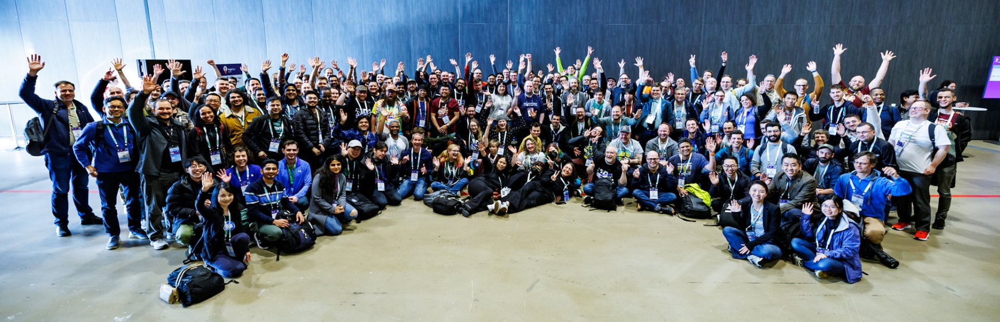

10年前の2014年6月6日、Kubernetesの[最初のコミット](https://github.com/kubernetes/kubernetes/commit/2c4b3a562ce34cddc3f8218a2c4d11c7310e6d56)がGitHubにプッシュされました。
Go、Bash、Markdownで書かれた250のファイルと47,501行のコードを含むその最初のコミットが、今日のKubernetesプロジェクトの始まりでした。
それから10年後の今日、Kubernetesが44か国から[8,000社以上の企業](https://www.cncf.io/reports/kubernetes-project-journey-report/)、[88,000人以上のコントリビューター](https://k8s.devstats.cncf.io/d/24/overall-project-statistics?orgId=1)を有する、これまでで最大のオープンソースプロジェクトの一つに成長するとは誰が予想したでしょうか。

このマイルストーンはKubernetesだけでなく、そこから生まれたクラウドネイティブエコシステムにとっても重要なものです。
CNCFには[約200のプロジェクト](https://all.devstats.cncf.io/d/18/overall-project-statistics-table?orgId=1)があり、[240,000人以上のコントリビューター](https://all.devstats.cncf.io/d/18/overall-project-statistics-table?orgId=1)からのコントリビューションがあります。
また、より広いエコシステムの中でも数千人のコントリビューターがいます。
Kubernetesが今日の姿になれたのは、彼らや[700万人以上の開発者](https://www.cncf.io/blog/2022/05/18/slashdata-cloud-native-continues-to-grow-with-more-than-7-million-developers-worldwide/)、さらに多くのユーザーコミュニティがエコシステムを形作る手助けをしてくれたおかげです。

## Kubernetesの始まり - 技術の収束

Kubernetesの元となるアイディアは、([2013年に登場した](https://blog/2018/07/20/the-history-of-kubernetes-the-community-behind-it/))最初のコミットや最初のプロトタイプの前から存在していました。
2000年代初頭、ムーアの法則が有効に機能していました。
コンピューティングハードウェアは非常に速い速度でますます強力になり、それに対応してアプリケーションもますます複雑化していきました。
このハードウェアのコモディティ化とアプリケーションの複雑化の組み合わせにより、ソフトウェアをハードウェアからさらに抽象化する必要が生じ、解決策が現れ始めました。

当時の多くの企業と同様にGoogleも急速に拡大しており、同社のエンジニアたちはLinuxカーネル内での隔離の形態を作り出すというアイデアに興味を持っていました。
Googleのエンジニア、Rohit Sethはそのコンセプトを[2006年のメール](https://lwn.net/Articles/199643/)で説明しました。

> ワークロードのメモリやタスクなどのシステムリソースの使用を追跡し、課金する構造を示すためにコンテナという用語を使用します。

2013年3月、PyConでSolomon Hykesが行った5分間のライトニングトーク[The future of Linux Containers](https://youtu.be/wW9CAH9nSLs?si=VtK_VFQHymOT7BIB)では、Linuxコンテナを作成および使用するためのオープンソースツールである「Docker」が紹介されました。
DockerはLinuxコンテナに使いやすさをもたらし、これまで以上に多くのユーザーが利用できるようになりました。
Dockerの人気が急上昇し、Linuxコンテナの抽象化を誰もが利用できるようにしたことで、アプリケーションをより移植性が高く、再現性のある方法で実行できるようになりました。
しかし、依然としてスケールの問題は残っていました。

Googleのアプリケーションオーケストレーションをスケールで管理するBorgシステムは、2000年代半ばにLinuxコンテナを採用しました。
その後、GoogleはOmegaと呼ばれるシステムの新バージョンの開発も開始しました。
BorgとOmegaシステムに精通していたGoogleのエンジニアたちは、Dockerによって駆動するコンテナ化の人気を目の当たりにしました。
そしてBrendan Burnsの[ブログ](/blog/2018/07/20/the-history-of-kubernetes-the-community-behind-it/)で説明されているように、オープンソースのコンテナオーケストレーションシステムの必要性だけでなく、その「必然性」を認識しました。
この認識は2013年秋にJoe Beda、Brendan Burns、Craig McLuckie、Ville Aikas、Tim Hockin、Dawn Chen、Brian Grant、Daniel Smithを含む小さなチームにKubernetesのプロジェクトを始めるインスピレーションを与えました。

## Kubernetesの10年間

Kubernetesの歴史は2014年6月6日のその歴史的なコミットと、2014年6月10日の[DockerCon 2014でのGoogleエンジニアEric Brewerによる基調講演](https://youtu.be/YrxnVKZeqK8?si=Q_wYBFn7dsS9H3k3)(およびそれに対応する[Googleブログ](https://cloudplatform.googleblog.com/2014/06/an-update-on-container-support-on-google-cloud-platform.html))でのプロジェクト発表から始まります。

その後の1年間で、主に[GoogleとRed Hatからのコントリビューター](https://k8s.devstats.cncf.io/d/9/companies-table?orgId=1&var-period_name=Before%20joining%20CNCF&var-metric=contributors)による小さなコミュニティがプロジェクトに取り組み、[2015年7月21日にバージョン1.0のリリース](https://cloudplatform.googleblog.com/2015/07/Kubernetes-V1-Released.html)に至りました。
1.0と同時に、GoogleはKubernetesをLinux Foundationの新たに設立された部門である[Cloud Native Computing Foundation (CNCF)](https://www.cncf.io/announcements/2015/06/21/new-cloud-native-computing-foundation-to-drive-alignment-among-container-technologies/)に寄贈することを発表しました。

1.0に到達したものの、Kubernetesプロジェクトは依然として使いにくく理解しにくいものでした。
KubernetesのコントリビューターであるKelsey Hightowerはプロジェクトの使いやすさの欠点に特に注目し、2016年7月7日に彼の有名な["Kubernetes the Hard Way"ガイドの最初のコミット](https://github.com/kelseyhightower/kubernetes-the-hard-way/commit/9d7ace8b186f6ebd2e93e08265f3530ec2fba81c)をプッシュしました。

プロジェクトは最初の1.0リリース以来大きく変わり、いくつかの大きな成果を経験しました。
たとえば、[1.16でのCustom Resource Definition (CRD)のGA](https://kubernetes.io/blog/2019/09/18/kubernetes-1-16-release-announcement/)や、[1.23での完全なデュアルスタックサポートの開始](https://kubernetes.io/blog/2021/12/08/dual-stack-networking-ga/)などです。
また、[1.22での広く使用されているベータ版APIの削除](https://kubernetes.io/blog/2021/07/14/upcoming-changes-in-kubernetes-1-22/)や、[Dockershimの廃止](https://kubernetes.io/blog/2020/12/02/dockershim-faq/)から学んだコミュニティの「教訓」もあります。

1.0以降の注目すべきアップデート、マイルストーン、およびイベントには以下のものがあります。

* 2016年12月 - [Kubernetes 1.5](/blog/2016/12/kubernetes-1-5-supporting-production-workloads/)でCRIの最初のサポートとアルファ版Windowsノードサポートによるランタイムプラグイン機能が導入されました。また、OpenAPIが初めて登場し、クライアントが拡張されたAPIを認識できるようになりました。
  * このリリースでは、StatefulSetとPodDisruptionBudgetがベータ版で導入されました。
* 2017年4月 - [ロールベースアクセス制御(RBAC)](/blog/2017/04/rbac-support-in-kubernetes/)の導入。
* 2017年6月 - [Kubernetes 1.7](/blog/2017/06/kubernetes-1-7-security-hardening-stateful-application-extensibility-updates/)でThirdPartyResource (TPR)がCustomResourceDefinition (CRD)に置き換えられました。
* 2017年12月 - [Kubernetes 1.9](/blog/2017/12/kubernetes-19-workloads-expanded-ecosystem/)ではWorkload APIがGA(一般提供)となりました。リリースブログには「Kubernetesで最もよく使用されるオブジェクトの一つであるDeploymentとReplicaSetは、1年以上の実際の使用とフィードバックを経て安定しました」と書かれています。
* 2018年12月 - Kubernetes 1.13でContainer Storage Interface (CSI)がGAに達しました。また最小限のクラスターをブートストラップするためのkubeadmツールがGAに達し、CoreDNSがデフォルトのDNSサーバーとなりました。
* 2019年9月 - Kubernetes 1.16で[Custom Resource DefinitionがGAに達し](https://kubernetes.io/blog/2019/09/18/kubernetes-1-16-release-announcement/)ました。
* 2020年8月 - [Kubernetes 1.19](/blog/2016/12/kubernetes-1-5-supporting-production-workloads/)でリリースのサポート期間が1年に延長されました。
* 2020年12月 - Kubernetes 1.20で[Dockershimが廃止](https://kubernetes.io/blog/2020/12/18/kubernetes-1.20-pod-impersonation-short-lived-volumes-in-csi/)されました。
* 2021年4月 - [Kubernetesのリリース頻度が変更](https://kubernetes.io/blog/2021/07/20/new-kubernetes-release-cadence/#:~:text=On%20April%2023%2C%202021%2C%20the,Kubernetes%20community's%20contributors%20and%20maintainers.)され、年間4回から3回に減少されました。
* 2021年7月 - 広く使用されているベータ版APIが[Kubernetes 1.22で削除](https://kubernetes.io/blog/2021/07/14/upcoming-changes-in-kubernetes-1-22/)されました。
* 2022年5月 - Kubernetes 1.24で[ベータ版APIがデフォルトで無効](https://kubernetes.io/blog/2022/05/03/kubernetes-1-24-release-announcement/)にされ、アップグレードの競合を減らすとともに[Dockershimが削除](https://kubernetes.io/dockershim)されました。その結果、[多くのユーザーの混乱](https://www.youtube.com/watch?v=a03Hh1kd6KE)を引き起こしました(その後、[コミュニケーションを改善しました](https://github.com/kubernetes/community/tree/master/communication/contributor-comms))。
* 2022年12月 - Kubernetes 1.26ではAI/ML/バッチワークロードのサポートを強化するための大規模なバッチおよび[Job APIのオーバーホール](https://kubernetes.io/blog/2022/12/29/scalable-job-tracking-ga/)が行われました。

**PS:** プロジェクトがどれだけ進化したか自分で見てみたいですか？
コミュニティメンバーのCarlos Santana、Amim Moises Salum Knabben、James Spurinが作成した[Kubernetes 1.0クラスターを立ち上げるためのチュートリアル](https://github.com/spurin/kubernetes-v1.0-lab)をチェックしてみてください。

---

Kubernetesには数え切れないほどの拡張するポイントがあります。
もともとはDocker専用に設計されていましたが、現在ではCRI標準に準拠する任意のコンテナランタイムをプラグインできます。
他にもストレージ用のCSIやネットワーキング用のCNIなどのインターフェースがあります。
そしてこれはできることのほんの一部に過ぎません。
過去10年間で新しいパターンがいくつも登場しました。
例えば、[Custom Resource Definition](/ja/docs/concepts/extend-kubernetes/api-extension/custom-resources/) (CRD)を使用してサードパーティのコントローラーをサポートすることができます。
これは現在Kubernetesエコシステムの大きな一部となっています。

このプロジェクトを構築するコミュニティも、この10年間で非常に大きくなりました。
[DevStats](https://k8s.devstats.cncf.io/d/24/overall-project-statistics?orgId=1)を使用すると、この10年間でKubernetesを[世界で2番目に大きなオープンソースプロジェクト](https://www.cncf.io/reports/kubernetes-project-journey-report/)にした驚異的なコントリビューションの量を確認できます。

* **88,474**人のコントリビューター
* **15,121**人のコードコミッター
* **4,228,347**件のコントリビューション
* **158,530**件のIssue
* **311,787**件のPull Request

## 今日のKubernetes

初期の頃からこのプロジェクトは技術的能力、利用状況、およびコントリビューションの面で驚異的な成長を遂げてきました。
プロジェクトは今もなおユーザーにより良いサービスを提供するために積極的に改善に取り組んでいます。

次回の1.31リリースでは、長期にわたる重要なプロジェクトの完成を祝います。
それはインツリークラウドプロバイダーのコードの削除です。
この[Kubernetesの歴史上最大のマイグレーション](https://kubernetes.io/blog/2024/05/20/completing-cloud-provider-migration/)では、約150万行のコードが削除され、コアコンポーネントのバイナリサイズが約40%削減されました。
プロジェクトの初期には、拡張性が成功の鍵であることは明らかでした。
しかし、その拡張性をどのように実現するかは常に明確ではありませんでした。
このマイグレーションにより、Kubernetesの核となるコードベースからさまざまなベンダー固有の機能が削除されました。
ベンダー固有の機能は、今後は[Custom Resource Definition (CRD)](/ja/docs/concepts/extend-kubernetes/api-extension/custom-resources/)や[Gateway API](https://gateway-api.sigs.k8s.io/)などの他のプラグイン拡張機能やパターンによってよりよく提供されるようになります。

Kubernetesは、膨大なユーザーベースにサービスを提供する上で新たな課題にも直面しており、コミュニティはそれに適応しています。
その一例が、新しいコミュニティ所有のregistry.k8s.ioへのイメージホスティングの移行です。
ユーザーに事前コンパイル済みのバイナリイメージを提供するためのエグレスの帯域幅とコストは非常に大きなものとなっています。
この新しいレジストリの変更により、コミュニティはこれらの便利なイメージをよりコスト効率およびパフォーマンス効率の高い方法で提供し続けることができます。
必ず[ブログ記事](https://kubernetes.io/blog/2022/11/28/registry-k8s-io-faster-cheaper-ga/)をチェックし、registry.k8s.ioを使用するように更新してください！

## Kubernetesの未来

10年が経ち、Kubernetesの未来は依然として明るく見えます。
コミュニティはユーザー体験の改善とプロジェクトの持続可能性を向上させる変更を優先しています。
アプリケーション開発の世界は進化し続けており、Kubernetesもそれに合わせて変化していく準備ができています。

2024年にはAIの登場がかつてニッチなワークロードタイプを重要なものへと変えました。
分散コンピューティングとワークロードスケジューリングは常に人工知能(AI)、機械学習(ML)、および高性能コンピューティング(HPC)ワークロードのリソース集約的なニーズと密接に関連してきました。
コントリビューターは、新しく開発されたワークロードのニーズとそれらにKubernetesがどのように最適に対応できるかに注目しています。
新しい[Serving Working Group](https://github.com/kubernetes/community/tree/master/wg-serving)は、コミュニティがこれらのワークロードのニーズに対処するためにどのように組織化されているかの一例です。
今後数年でKubernetesがさまざまな種類のハードウェアを管理する能力や、ハードウェア全体でチャンクごとに実行される大規模なバッチスタイルのワークロードのスケジューリング能力に関して改善が見られるでしょう。

Kubernetesを取り巻くエコシステムは成長し続け、進化していきます。
将来的にはインツリーベンダーコードのマイグレーションやレジストリの変更など、プロジェクトの持続可能性を維持するための取り組みがますます重要になるでしょう。

Kubernetesの次の10年は、ユーザーとエコシステム、そして何よりもそれに貢献する人々によって導かれるでしょう。
コミュニティは新しいコントリビューターを歓迎しています。
コントリビューションに関する詳細は、[新しいコントリビューター向けのガイド](https://k8s.dev/contributors)で確認できます。

Kubernetesの未来を一緒に築いていくことを楽しみにしています！


