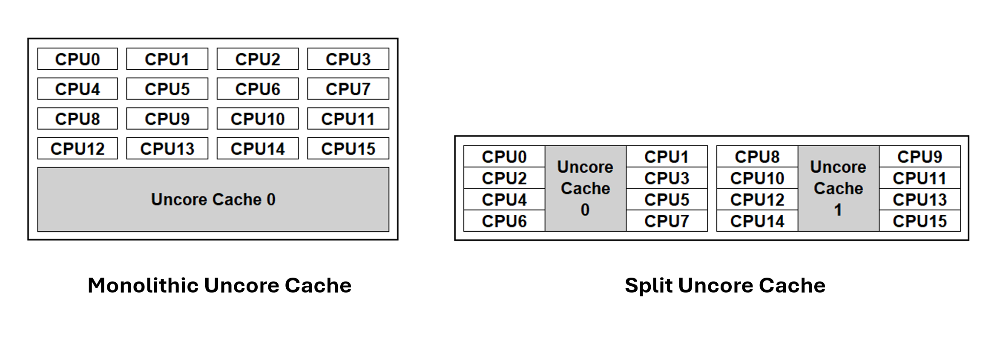
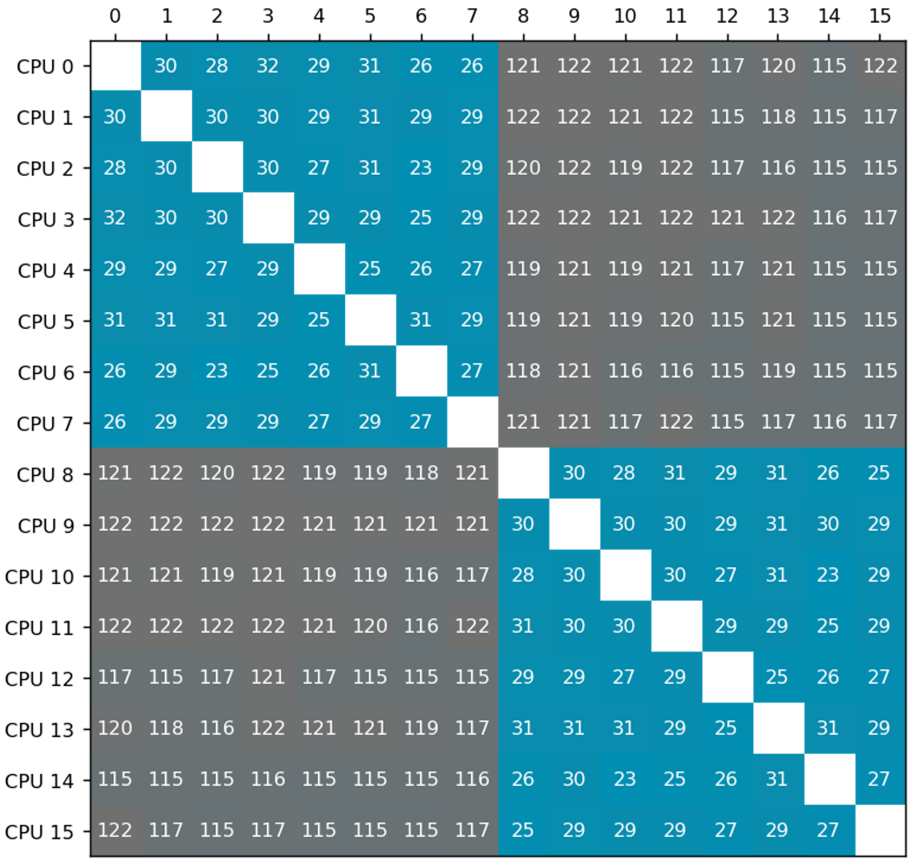
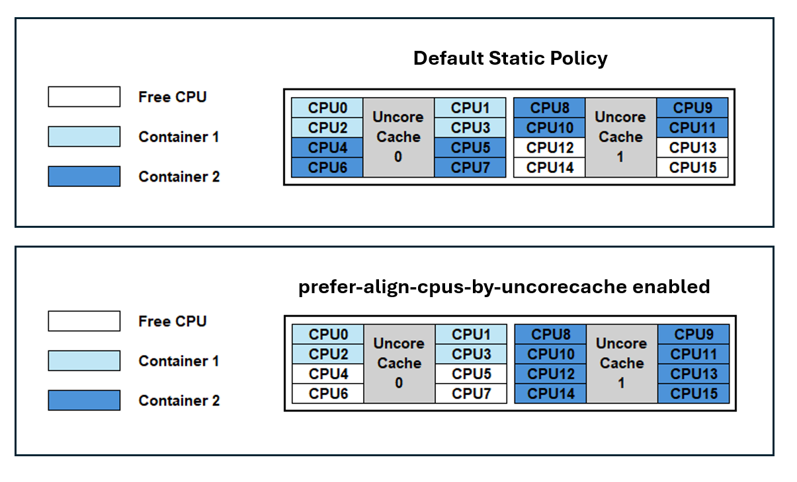

쿠버네티스 v1.32에서 `prefer-align-cpus-by-uncorecache`라는 새로운 CPU 매니저 스태틱 정책 옵션이 알파 기능으로 처음 도입되었고, 쿠버네티스 v1.34에서는 **베타** 단계로 승격되었습니다.
이 CPU 매니저 정책 옵션은 _분할된 언코어 캐시_ 아키텍처를 사용하는 프로세서에서 실행되는 특정 워크로드의 성능을 최적화하도록 설계되었습니다.
이 글에서는 해당 개념이 무엇을 의미하는지, 그리고 왜 유용한지를 설명합니다.

## 기능 이해하기

### 언코어 캐시란 무엇인가?
비교적 최근까지, 거의 모든 주류 컴퓨터 프로세서는
다중 CPU 패키지 내 모든 코어가 공유하는 단일(monolithic)
last-level-cache 캐시를 가지고 있었습니다.
이 단일 캐시는 _언코어(uncore) 캐시_
(특정 코어에 연결되지 않기 때문에) 또는 Level 3 캐시라고도 불립니다.
Level 3 캐시 외에도, 일반적으로 Level 1 및 Level 2 캐시라고 불리는 다른 캐시가 있으며,
이들은 특정 CPU 코어에 연결(associated)되어 **있습니다**.

CPU 코어와 캐시 간의 접근 지연을 줄이기 위해, 최근 AMD64 및 ARM
아키텍처 기반 프로세서들은 _분할된 언코어 캐시_ 아키텍처를 도입했습니다.
last-level-cache를 여러 물리적 캐시로 나누어
물리적 패키지 내의 특정 CPU 그룹에 정렬합니다.
CPU 패키지 내 거리가 짧아지면 지연 시간을 줄이는 데 도움이 됩니다.


쿠버네티스는 CPU 패키지(들) 내 캐시 토폴로지를 고려해
워크로드를 배치할 수 있습니다.

### 캐시 인식(Cache-aware) 워크로드 배치
아래 매트릭스는 분할된 언코어 캐시를 사용하는 프로세서에서
캐시 일관성(coherence) 프로토콜을 통해 CPU 간에 패킷을 전달할 때의
[CPU 간 지연 시간](https://github.com/nviennot/core-to-core-latency)을 나노초(ns) 단위로 보여줍니다(낮을수록 좋음).
이 예시에서 프로세서 패키지는 2개의 언코어 캐시로 구성됩니다.
각 언코어 캐시는 8개의 CPU 코어를 담당합니다.

매트릭스에서 파란색 항목은 동일한 언코어 캐시를 공유하는 CPU 간 지연 시간을 나타내고, 회색 항목은 서로 다른 언코어 캐시에 해당하는 CPU 간 지연 시간을 나타냅니다. 서로 다른 캐시에 해당하는 CPU 간 지연 시간은 동일한 캐시에 속하는 CPU 간 지연 시간보다 높습니다.

`prefer-align-cpus-by-uncorecache`를 활성화하면,
[스태틱 CPU 매니저](/docs/concepts/policy/node-resource-managers/#static-policy)는 컨테이너에 할당된 모든 CPU가 동일한 언코어 캐시를 공유하도록 CPU 리소스를 할당하려고 시도합니다.
이 정책은 best-effort 방식으로 동작하며,
컨테이너의 요구사항과 노드의 할당 가능한 리소스를 고려하여 컨테이너의 CPU 리소스가 여러 언코어 캐시에 분산되는 것을 최소화하는 것을 목표로 합니다.

가능한 가장 적은 수의 언코어 캐시를 사용하는 CPU 집합에서 워크로드를 실행하면, (위 매트릭스에서 볼 수 있듯이) 캐시 지연이 감소하고
다른 워크로드와의 경합도 줄어들어 전체 처리량(throughput)이 향상될 수 있습니다.
이러한 이점은 노드의 프로세서가 분할된 언코어 캐시 토폴로지를 사용하는 경우에만 나타납니다.

아래 다이어그램은 기능이 활성화되었을 때의 언코어 캐시 정렬을 보여줍니다.



기본적으로 쿠버네티스는 언코어 캐시 토폴로지를 고려하지 않으며, 컨테이너에 packed 방식으로 CPU 리소스를 할당합니다.
그 결과, 컨테이너 1과 컨테이너 2는
언코어 캐시 0에서의 캐시 접근 경합으로 인해 noisy neighbor 영향을 받을 수 있습니다. 또한, 컨테이너 2는 두 캐시에 걸쳐 CPU가 분산되어 cross-cache 지연이 발생할 수 있습니다.

`prefer-align-cpus-by-uncorecache`를 활성화하면 각 컨테이너가 개별 캐시에 격리됩니다. 이를 통해 컨테이너 간 캐시 경합이 해소되고, 사용 중인 CPU들의 캐시 지연이 최소화됩니다.

## 사용 사례
일반적인 사용 사례에는 vRAN, 모바일 패킷 코어, 방화벽과 같은 통신(telco) 애플리케이션이 포함될 수 있습니다. `prefer-align-cpus-by-uncorecache`가 제공하는 최적화는 워크로드에 따라 달라질 수 있다는 점에 유의해야 합니다. 예를 들어, 메모리 대역폭에 제약받는 애플리케이션은 더 많은 언코어 캐시를 활용하면 메모리 대역폭 접근이 증가할 수 있으므로 언코어 캐시 정렬의 이점을 얻지 못할 수 있습니다.

## 기능 활성화
이 기능을 활성화하려면, CPU 매니저 정책을 `static`으로 설정하고 CPU 매니저 정책 옵션에서 `prefer-align-cpus-by-uncorecache`를 활성화합니다.

쿠버네티스 1.34의 경우, 이 기능은 베타 단계이며 `CPUManagerPolicyBetaOptions`
[기능 게이트(feature gate)](/docs/reference/command-line-tools-reference/feature-gates/)도 활성화해야 합니다.

아래 내용을 kubelet 설정 파일에 추가하세요.
```yaml
kind: KubeletConfiguration
apiVersion: kubelet.config.k8s.io/v1beta1
featureGates:
  ...
  CPUManagerPolicyBetaOptions: true
cpuManagerPolicy: "static"
cpuManagerPolicyOptions:
  prefer-align-cpus-by-uncorecache: "true"
reservedSystemCPUs: "0"
...
```

기존 노드에 이 변경사항을 적용하는 경우, `cpu_manager_state` 파일을 삭제한 후 kubelet을 재시작하세요.

`prefer-align-cpus-by-uncorecache`는 단일 언코어 캐시 프로세서가 있는 노드에서도 활성화할 수 있습니다. 이 기능은 기본 스태틱 CPU 매니저 정책과 유사하게 소켓에 CPU 리소스를 모아서 할당하는 best-effort 소켓 정렬 효과를 흉내냅니다.

## 더 읽어보기
CPU 매니저와 사용 가능한 정책에 대해 더 알아보려면 [Node Resource Managers](/docs/concepts/policy/node-resource-managers/)를 참조하세요.

`prefer-align-cpus-by-uncorecache`에 대한 문서는 [여기](/docs/concepts/policy/node-resource-managers/#prefer-align-cpus-by-uncorecache)를 참조하세요.

`prefer-align-cpus-by-uncorecache`가 어떻게 구현되었는지에 대한 자세한 내용은 [쿠버네티스 개선 제안](https://github.com/kubernetes/enhancements/tree/master/keps/sig-node/4800-cpumanager-split-uncorecache)을 참조하세요.

## 참여하기
이 기능은 [SIG Node](https://github.com/Kubernetes/community/blob/master/sig-node/README.md)에서 주도하고 있습니다. 이 기능 개발에 관심이 있거나, 피드백을 공유하거나, 다른 SIG Node 프로젝트에 참여하고 싶다면, SIG Node 미팅에 참석해 주세요.
