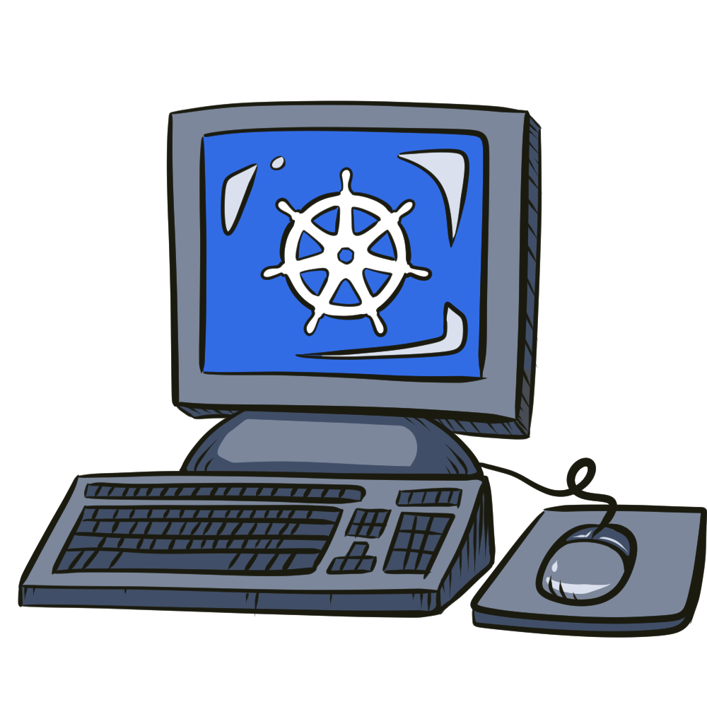
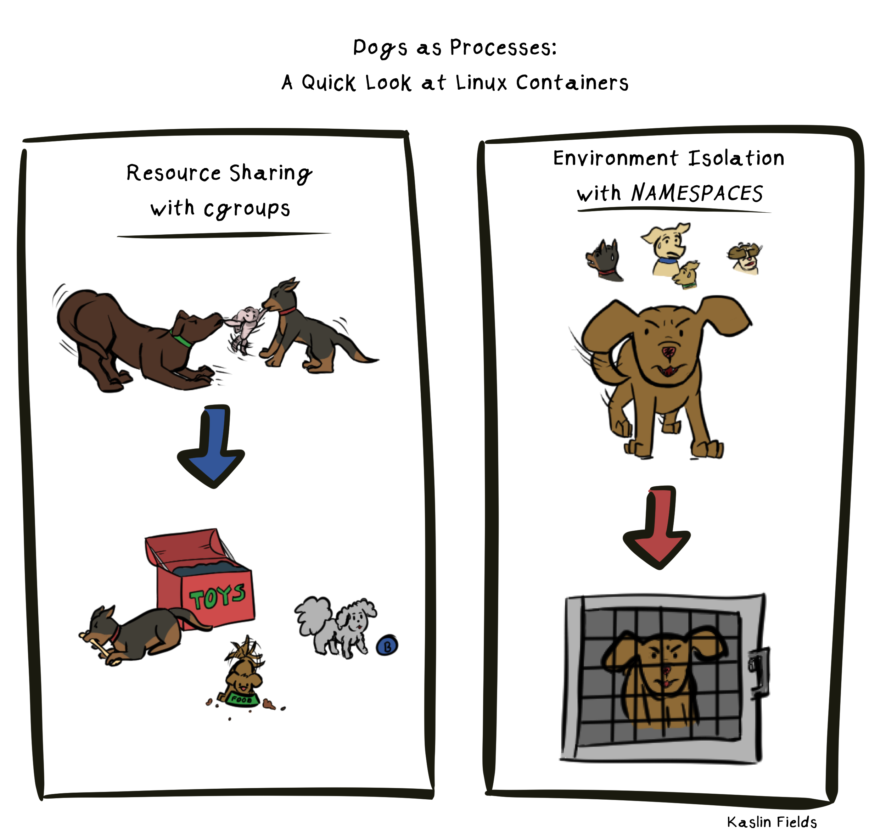

_Bu yazı, Kubernetes katkıcılarının hem Linux hem de Windows için çalışan bir konteyner düzenleyici sağlamak için nasıl birlikte çalıştıklarının hikayesini anlatıyor._

Kubernetes ile tanışık olan çoğu kişi muhtemelen onu Linux ile ilişkilendirmeye alışkındır. Bu bağlantı mantıklıdır, çünkü Kubernetes ilk başından beri Linux üzerinde çalışıyordu. Ancak, Kubernetes'i benimsemeye çalışan birçok ekip ve organizasyon, Windows üzerinde konteynerleri düzenleme yeteneğine ihtiyaç duyar. Docker'ın piyasaya sürülmesi ve konteynerlerin popüler hale gelmesiyle birlikte, hem topluluktan hem de Microsoft'un kendisinden, konteyner teknolojisini Windows sistemlerinde de Linux sistemlerinde olduğu kadar erişilebilir hale getirme çabaları olmuştur.

Kubernetes topluluğu içinde, Kubernetes'i Windows topluluğuna erişilebilir kılmak konusunda tutkulu olanlar, Windows Özel İlgi Grubu'nda bir yuva bulabilirler. SIG-Windows ve Kubernetes'in Windows'taki geleceği hakkında daha fazla bilgi edinmek için, SIG'nin hedefleri ve diğerlerinin nasıl katkıda bulunabileceği hakkında eş başkanlar [Mark Rossetti](https://github.com/marosset) ve [Michael Michael](https://github.com/michmike) ile konuştum.

## Windows Konteynerleri ve Kubernetes'e Giriş

Kubernetes, konteyner iş yüklerini düzenlemek için en popüler araçtır, bu yüzden Kubernetes projesi içindeki Windows Özel İlgi Grubu'nu (SIG) anlamak için, Windows üzerinde konteyner çalıştırmaktan bahsettiğimizde ne demek istediğimizi anlamak önemlidir.

***
_"Kubernetes'te Windows desteğine bakarken," diyor SIG (Özel İlgi Grubu) Eş Başkanları Mark Rossetti ve Michael Michael, "birçok kişi Linux konteynerleri ile karşılaştırmalar yapmaya başlar. Sınırlamaları vurgulayan bazı karşılaştırmalar adil olsa da, operasyonel sınırlamalar ile Windows ve Linux işletim sistemleri arasındaki farkları ayırt etmek önemlidir. Windows konteynerleri Windows işletim sistemini çalıştırır ve Linux konteynerleri Linux'u çalıştırır."_
***

Özünde, herhangi bir "konteyner" sadece ana işletim sisteminde çalışan bir süreçtir, bu süreci ve bağımlılıklarını çevreden izole etmek için bazı anahtar araçlarla birlikte. Amaç, bu çalışan süreci güvenli bir şekilde izole etmek ve bu izolasyonu gerçekleştirmek için sistemden minimum kaynak kullanmaktır. Linux'ta, "konteynerler" oluşturmak için süreçleri izole etmek için kullanılan araçlar genellikle cgroups ve ad alanlarına (birkaç diğerinin yanı sıra) indirgenir, bunlar da Linux Çekirdeği'ne yerleşik araçlardır.

#### _Köpekler süreç olsaydı: konteynerleştirme, her köpeğe cgroups kullanarak oyuncaklar ve yiyecekler gibi kendi kaynaklarını vermek ve sorunlu köpekleri ad alanları kullanarak izole etmek gibi olurdu._

Yerel Windows süreçleri, Windows işletim sisteminde çalışması gereken veya çalışması gereken süreçlerdir. Bu, onları Linux işletim sisteminde çalışan bir süreçten temel olarak farklı kılar. Linux konteynerleri, Linux çekirdek araçları olan cgroups ve ad alanları tarafından izole edilen Linux süreçleridir, bu nedenle yerel Windows süreçlerini konteynerleştirmek, Windows çekirdeği içinde benzer izolasyon araçlarını uygulamak anlamına geliyordu. Böylece, "Windows Konteynerleri" ve "Linux Konteynerleri" temel olarak farklı teknolojilerdir, aynı hedeflere sahip olmalarına (süreçleri izole etmek) ve bazı açılardan benzer şekilde çalışmasına (çekirdek düzeyinde konteynerleştirme kullanarak) rağmen.

Bu nedenle, Windows üzerinde konteyner çalıştırmaya gelince, aslında dikkate alınması gereken iki çok önemli kavram vardır:

* Yerel Windows süreçlerinin yerel Windows Sunucu tarzı konteynerler olarak çalıştırılması,
* ve genellikle hafif bir Hyper-V Sanal Makinesi üzerinde barındırılan bir Linux Çekirdeği üzerinde çalışan geleneksel Linux konteynerleri.

Microsoft'tan bu [eğitimde](https://docs.microsoft.com/en-us/virtualization/windowscontainers/deploy-containers/linux-containers) Linux ve Windows konteynerleri hakkında daha fazla bilgi edinebilirsiniz.

### Windows Üzerinde Kubernetes

Kubernetes başlangıçta Linux konteynerleri düşünülerek tasarlandı ve kendisi de Linux sistemlerinde çalışacak şekilde tasarlandı. Bu nedenle, Kubernetes'in işlevselliğinin çoğu benzersiz Linux işlevselliğini içerir. Linux'a özgü çalışma kasıtlıdır - hepimiz Kubernetes'in Linux üzerinde optimal çalışmasını istiyoruz - ancak Windows sunucuları için benzer optimizasyon talebi artmaktadır. Kullanıcıların Windows üzerinde konteyner düzenlemesine ihtiyaç duyduğu durumlar için, SIG-Windows'un Kubernetes katkıcı topluluğu Windows'a özgü kullanım durumları için işlevsellik eklemiştir.

***
_"Sıkça aldığımız bir soru, sadece Windows'tan oluşan bir küme oluşturabilir miyim. Cevap HAYIR. Kubernetes kontrol düzlemi bileşenleri Linux tabanlı olmaya devam edecek, SIG-Windows ise bir Kubernetes kümesinde Windows işçi düğümlerine sahip olma deneyimine odaklanıyor."_
***

"Windows Kubernetes" ve "Linux Kubernetes" kavramlarını ayırmak yerine, SIG-Windows topluluğu, Windows kullanım durumlarını ele almasına olanak tanıyan işlevselliği ana Kubernetes projesine eklemeye çalışır. Bu Windows yetenekleri, Kubernetes'in 2014'teki sürümünden bu yana hizmet verdiği Linux kullanım durumlarını yansıtır ve bazı durumlarda benzersiz işlevsellik ekler (daha fazla tarih öğrenmek ister misiniz? Bu [orijinal tasarım belgesini](https://github.com/kubernetes/kubernetes/blob/e2b948dbfbba62b8cb681189377157deee93bb43/DESIGN.md) gözden geçirin).

## SIG-Windows Ne Yapar?

***
_"SIG-Windows gerçekten Kubernetes'teki tüm Windows ile ilgili şeylerin merkezidir,"_ diyor SIG başkanları Mark ve Michael, _"Ana olarak hesaplama tarafına odaklanıyoruz, ancak Kubernetes üzerinde Windows çalıştırmakla ilgili her şey SIG-Windows'un kapsamındadır."_
***

Kullanıcılara en iyi şekilde hizmet verebilmek için, SIG-Windows, Kubernetes kullanıcı deneyimini Windows ve Linux kullanıcıları için mümkün olduğunca tutarlı hale getirmeye çalışır. Ancak bazı kullanım durumları yalnızca bir İşletim Sistemine özgüdür ve bu nedenle, SIG-Windows grubu, yalnızca Windows'a özgü iş yükleri için benzersiz işlevsellik oluşturmak için de çalışır.

Kubernetes içindeki birçok SIG veya "Özel İlgi Grubu" dar bir odak alanına sahiptir, bu da üyelerin teknolojinin belirli bir yönüne derinlemesine dalmalarına olanak tanır. Belirli uzmanlık memnuniyetle karşılanırken, SIG-Windows ile ilgilenenler, Kubernetes'in birçok odak alanında geniş bir anlayış oluşturmak için harika bir topluluk bulacaklardır. "SIG'mizden üyeler depolama, ağ, test, küme yaşam döngüsü ve diğer Kubernetes gruplarıyla etkileşimde bulunur."

### SIG-Windows'un Kullanıcıları Kimlerdir?
Bir grubun yaptığı teknolojiyi anlamanın en iyi yolu genellikle müşterilerini veya kullanıcılarını anlamaktır.

#### "Etkileşimde bulunduğumuz kullanıcıların çoğunluğu, yıllar içinde geliştirilmiş ve çeşitli nedenlerle (maliyet, zaman, uyumluluk vb.) bu iş yüklerini Linux'a taşıyamayan iş açısından kritik altyapıya sahip," diyor SIG başkanları. "Bu iş yüklerini Windows konteynerlerine taşıyarak ve Kubernetes'te çalıştırarak, altyapılarını hızla modernize edebilir ve buluta taşıyabilirler."

Kubernetes alanında bulunan herkesin de onaylayabileceği gibi, dünyanın dört bir yanındaki birçok farklı sektördeki şirketler, Kubernetes'i altyapılarını modernize etmenin yolu olarak görüyor. Bu genellikle iş yapma şekillerini yeniden yapılandırmayı veya hatta tamamen yeniden icat etmeyi içerir. Amaç, sistemlerini daha ölçeklenebilir, daha sağlam ve geleceğin getirebileceği her şeye daha hazır hale getirmektir. Ancak her uygulama veya iş yükü, çalıştığı çekirdek işletim sistemini değiştiremez veya değiştirmemelidir, bu nedenle birçok ekip, Windows veya Linux veya her ikisinde de ölçeklenebilir konteynerler çalıştırma yeteneğine ihtiyaç duyar.

"Bazen Windows konteynerlerine geçişin nedeni bir modernizasyon çabasıdır ve bazen de mevcut işletim sistemi için donanım garantilerinin sona ermesi veya destek döngülerinin sona ermesi nedeniyle olur. SIG-Windows'taki çabalarımız, Windows geliştiricilerinin bulut yerel araçlardan ve Kubernetes'ten yararlanarak dağıtılmış uygulamaları daha hızlı oluşturup dağıtmalarını sağlar. Bu heyecan verici! Özünde, kullanıcılar uygulama kullanılabilirliğinin avantajlarını korurken maliyetleri azaltabilirler."

## SIG-Windows Kimdir?

Kubernetes iş yüklerini Windows için etkinleştirmek için çalışan bu katkıcılar kimlerdir? Bu sen olabilirsin!

Diğer Kubernetes SIG'lerinde olduğu gibi, SIG-Windows'a katkıda bulunanlar, bağımsız hobicilerden birçok farklı şirkette çalışan profesyonellere kadar herkes olabilir. Dünyanın birçok farklı yerinden gelirler ve masaya birçok farklı beceri seti getirirler.

_"Diğer Kubernetes SIG'lerinde olduğu gibi, çok misafirperver ve açık bir topluluğuz," diye açıkladı SIG eş başkanları Michael Michael ve Mark Rosetti._

### Katkıda Bulunmak

İlgilenen herkes için, eş başkanlar ekledi, "Yeni katkıcılar eski topluluk toplantılarını GitHub'da izleyebilir (son üç yıla kadar her toplantıyı kaydediyoruz), belgelerimizi okuyabilir, yeni topluluk toplantılarına katılabilir, soruları yüz yüze veya Slack'te sorabilir ve GitHub'da bazı sorunlar açabilir. Ayrıca tüm KubeCon konferanslarına katılıyoruz ve 1-2 oturum, bir katkıcı oturumu ve bakımcılarla tanışma ofis saatleri düzenliyoruz."

Eş başkanlar ayrıca SIG-Windows topluluğunun bir üyesi olma yolunun nasıl göründüğüne dair bir bakış açısı paylaştılar:

"Yeni katkıcıların başlangıçta sadece topluluğumuza katılmalarını ve dinlemelerini, sonra bazı sorular sormaya başlamalarını ve Kubernetes'te Windows hakkında bilgi edinmelerini teşvik ediyoruz. Kendilerini rahat hissettiklerinde, belgelerimizi iyileştirmeye, bazı hatalar/sorunlar açmaya ve sonunda bazı hataları düzelterek kod katkıcısı olabilirler. Windows'a uzun vadeli ve sürekli önemli katkılarda bulunurlarsa, SIG-Windows'un teknik lideri veya başkanı olabilirler. Bu alanı sevip sevmediğinizi başlamadan bilemezsiniz :) Başlamak için, [bu başlangıç sayfasını](https://github.com/kubernetes/community/tree/master/sig-windows) ziyaret edin. Kubernetes'te SIG-Windows ile ilgili her şeye bağlantılar içeren tek durak noktasıdır."

Yeni katkıcılar için herhangi bir faydalı beceri olup olmadığını sorduğumuzda, eş başkanlar şunları söylediler:

"Go ve Ağ ve Depolama konularında uzmanlık arıyoruz, ayrıca Windows'a olan tutku da büyük bir beceri. Ancak, bu tür becerileri zorunlu tutmuyoruz ve her türlü katkıcıyı, çeşitli beceri setleriyle memnuniyetle karşılıyoruz. Bir şeyi bilmiyorsanız, size bunu kazandıracağız."

SIG-Windows'taki insanlarla [Slack kanallarında](https://kubernetes.slack.com/archives/C0SJ4AFB7) iletişime geçebilir veya düzenli toplantılarından birine katılabilirsiniz - şu anda Salı günleri 12:30PM EST'de 30 dakika uzunluğunda! Düzenli toplantılarına bağlantılar ve geçmiş toplantı notları ve kayıtlarını [SIG-Windows README](https://github.com/kubernetes/community/tree/master/sig-windows#readme) sayfasında GitHub'da bulabilirsiniz.

SIG-Windows'tan kapanış mesajı olarak:

***
#### _"Geri bildirim ve dağıtım hikayelerini paylaşmak, kod, belgeler ve her türlü iyileştirmeye katkıda bulunmak için topluluğumuza katılmanızı ve katılmanızı bekliyoruz."_
***
