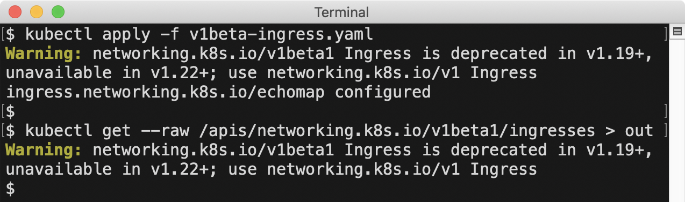
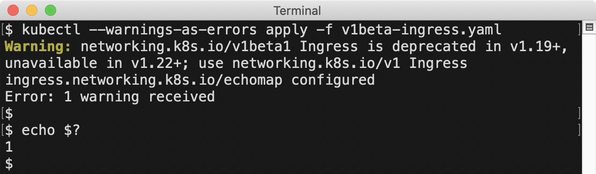

As Kubernetes maintainers, we're always looking for ways to improve usability while preserving compatibility.
As we develop features, triage bugs, and answer support questions, we accumulate information that would be helpful for Kubernetes users to know.
In the past, sharing that information was limited to out-of-band methods like release notes, announcement emails, documentation, and blog posts.
Unless someone knew to seek out that information and managed to find it, they would not benefit from it.

In Kubernetes v1.19, we added a feature that allows the Kubernetes API server to
[send warnings to API clients](https://github.com/kubernetes/enhancements/tree/master/keps/sig-api-machinery/1693-warnings).
The warning is sent using a [standard `Warning` response header](https://tools.ietf.org/html/rfc7234#section-5.5),
so it does not change the status code or response body in any way.
This allows the server to send warnings easily readable by any API client, while remaining compatible with previous client versions.

Warnings are surfaced by `kubectl` v1.19+ in `stderr` output, and by the `k8s.io/client-go` client library v0.19.0+ in log output.
The `k8s.io/client-go` behavior can be [overridden per-process or per-client](#customize-client-handling).

## Deprecation Warnings

The first way we are using this new capability is to send warnings for use of deprecated APIs.

Kubernetes is a [big, fast-moving project](https://www.cncf.io/cncf-kubernetes-project-journey/#development-velocity).
Keeping up with the [changes](https://github.com/kubernetes/kubernetes/blob/master/CHANGELOG/CHANGELOG-1.19.md#changelog-since-v1180)
in each release can be daunting, even for people who work on the project full-time. One important type of change is API deprecations.
As APIs in Kubernetes graduate to GA versions, pre-release API versions are deprecated and eventually removed.

Even though there is an [extended deprecation period](/docs/reference/using-api/deprecation-policy/),
and deprecations are [included in release notes](https://github.com/kubernetes/kubernetes/blob/master/CHANGELOG/CHANGELOG-1.19.md#deprecation),
they can still be hard to track. During the deprecation period, the pre-release API remains functional,
allowing several releases to transition to the stable API version. However, we have found that users often don't even realize
they are depending on a deprecated API version until they upgrade to the release that stops serving it.

Starting in v1.19, whenever a request is made to a deprecated REST API, a warning is returned along with the API response.
This warning includes details about the release in which the API will no longer be available, and the replacement API version.

Because the warning originates at the server, and is intercepted at the client level, it works for all kubectl commands,
including high-level commands like `kubectl apply`, and low-level commands like `kubectl get --raw`:



This helps people affected by the deprecation to know the request they are making is deprecated,
how long they have to address the issue, and what API they should use instead.
This is especially helpful when the user is applying a manifest they didn't create,
so they have time to reach out to the authors to ask for an updated version.

We also realized that the person *using* a deprecated API is often not the same person responsible for upgrading the cluster,
so we added two administrator-facing tools to help track use of deprecated APIs and determine when upgrades are safe.

### Metrics 

Starting in Kubernetes v1.19, when a request is made to a deprecated REST API endpoint,
an `apiserver_requested_deprecated_apis` gauge metric is set to `1` in the kube-apiserver process.
This metric has labels for the API `group`, `version`, `resource`, and `subresource`,
and a `removed_release` label that indicates the Kubernetes release in which the API will no longer be served.

This is an example query using `kubectl`, [prom2json](https://github.com/prometheus/prom2json),
and [jq](https://jqlang.github.io/jq/) to determine which deprecated APIs have been requested
from the current instance of the API server:

```sh
kubectl get --raw /metrics | prom2json | jq '
  .[] | select(.name=="apiserver_requested_deprecated_apis").metrics[].labels
'
```

Output:

```json
{
  "group": "extensions",
  "removed_release": "1.22",
  "resource": "ingresses",
  "subresource": "",
  "version": "v1beta1"
}
{
  "group": "rbac.authorization.k8s.io",
  "removed_release": "1.22",
  "resource": "clusterroles",
  "subresource": "",
  "version": "v1beta1"
}
```

This shows the deprecated `extensions/v1beta1` Ingress and `rbac.authorization.k8s.io/v1beta1` ClusterRole APIs
have been requested on this server, and will be removed in v1.22.

We can join that information with the `apiserver_request_total` metrics to get more details about the requests being made to these APIs:

```sh
kubectl get --raw /metrics | prom2json | jq '
  # set $deprecated to a list of deprecated APIs
  [
    .[] | 
    select(.name=="apiserver_requested_deprecated_apis").metrics[].labels |
    {group,version,resource}
  ] as $deprecated 
  
  |
  
  # select apiserver_request_total metrics which are deprecated
  .[] | select(.name=="apiserver_request_total").metrics[] |
  select(.labels | {group,version,resource} as $key | $deprecated | index($key))
'
```

Output:

```json
{
  "labels": {
    "code": "0",
    "component": "apiserver",
    "contentType": "application/vnd.kubernetes.protobuf;stream=watch",
    "dry_run": "",
    "group": "extensions",
    "resource": "ingresses",
    "scope": "cluster",
    "subresource": "",
    "verb": "WATCH",
    "version": "v1beta1"
  },
  "value": "21"
}
{
  "labels": {
    "code": "200",
    "component": "apiserver",
    "contentType": "application/vnd.kubernetes.protobuf",
    "dry_run": "",
    "group": "extensions",
    "resource": "ingresses",
    "scope": "cluster",
    "subresource": "",
    "verb": "LIST",
    "version": "v1beta1"
  },
  "value": "1"
}
{
  "labels": {
    "code": "200",
    "component": "apiserver",
    "contentType": "application/json",
    "dry_run": "",
    "group": "rbac.authorization.k8s.io",
    "resource": "clusterroles",
    "scope": "cluster",
    "subresource": "",
    "verb": "LIST",
    "version": "v1beta1"
  },
  "value": "1"
}
```

The output shows that only read requests are being made to these APIs, and the most requests have been made to watch the deprecated Ingress API.

You can also find that information through the following Prometheus query,
which returns information about requests made to deprecated APIs which will be removed in v1.22:

```promql
apiserver_requested_deprecated_apis{removed_release="1.22"} * on(group,version,resource,subresource)
group_right() apiserver_request_total
```

### Audit Annotations

Metrics are a fast way to check whether deprecated APIs are being used, and at what rate,
but they don't include enough information to identify particular clients or API objects.
Starting in Kubernetes v1.19, [audit events](/docs/tasks/debug/debug-cluster/audit/)
for requests to deprecated APIs include an audit annotation of `"k8s.io/deprecated":"true"`.
Administrators can use those audit events to identify specific clients or objects that need to be updated.

## Custom Resource Definitions

Along with the API server ability to warn about deprecated API use, starting in v1.19, a CustomResourceDefinition can indicate a 
[particular version of the resource it defines is deprecated](/docs/tasks/extend-kubernetes/custom-resources/custom-resource-definition-versioning/#version-deprecation).
When API requests to a deprecated version of a custom resource are made, a warning message is returned, matching the behavior of built-in APIs.

The author of the CustomResourceDefinition can also customize the warning for each version if they want to.
This allows them to give a pointer to a migration guide or other information if needed.

```yaml
apiVersion: apiextensions.k8s.io/v1
kind: CustomResourceDefinition
  name: crontabs.example.com
spec:
  versions:
  - name: v1alpha1
    # This indicates the v1alpha1 version of the custom resource is deprecated.
    # API requests to this version receive a warning in the server response.
    deprecated: true
    # This overrides the default warning returned to clients making v1alpha1 API requests.
    deprecationWarning: "example.com/v1alpha1 CronTab is deprecated; use example.com/v1 CronTab (see http://example.com/v1alpha1-v1)"
    ...

  - name: v1beta1
    # This indicates the v1beta1 version of the custom resource is deprecated.
    # API requests to this version receive a warning in the server response.
    # A default warning message is returned for this version.
    deprecated: true
    ...

  - name: v1
    ...
```

## Admission Webhooks

[Admission webhooks](/docs/reference/access-authn-authz/extensible-admission-controllers)
are the primary way to integrate custom policies or validation with Kubernetes.
Starting in v1.19, admission webhooks can [return warning messages](/docs/reference/access-authn-authz/extensible-admission-controllers/#response)
that are passed along to the requesting API client. Warnings can be returned with allowed or rejected admission responses.

As an example, to allow a request but warn about a configuration known not to work well, an admission webhook could send this response:

```json
{
  "apiVersion": "admission.k8s.io/v1",
  "kind": "AdmissionReview",
  "response": {
    "uid": "<value from request.uid>",
    "allowed": true,
    "warnings": [
      ".spec.memory: requests >1GB do not work on Fridays"
    ]
  }
}
```

If you are implementing a webhook that returns a warning message, here are some tips:

* Don't include a "Warning:" prefix in the message (that is added by clients on output)
* Use warning messages to describe problems the client making the API request should correct or be aware of
* Be brief; limit warnings to 120 characters if possible

There are many ways admission webhooks could use this new feature, and I'm looking forward to seeing what people come up with.
Here are a couple ideas to get you started:

* webhook implementations adding a "complain" mode, where they return warnings instead of rejections,
  to allow trying out a policy to verify it is working as expected before starting to enforce it
* "lint" or "vet"-style webhooks, inspecting objects and surfacing warnings when best practices are not followed

## Customize Client Handling

Applications that use the `k8s.io/client-go` library to make API requests can customize
how warnings returned from the server are handled. By default, warnings are logged to
stderr as they are received, but this behavior can be customized 
[per-process](https://godoc.org/k8s.io/client-go/rest#SetDefaultWarningHandler)
or [per-client](https://godoc.org/k8s.io/client-go/rest#Config).

This example shows how to make your application behave like `kubectl`,
overriding message handling process-wide to deduplicate warnings 
and highlighting messages using colored output where supported:

```go
import (
  "os"
  "k8s.io/client-go/rest"
  "k8s.io/kubectl/pkg/util/term"
  ...
)

func main() {
  rest.SetDefaultWarningHandler(
    rest.NewWarningWriter(os.Stderr, rest.WarningWriterOptions{
        // only print a given warning the first time we receive it
        Deduplicate: true,
        // highlight the output with color when the output supports it
        Color: term.AllowsColorOutput(os.Stderr),
      },
    ),
  )

  ...
```

The next example shows how to construct a client that ignores warnings.
This is useful for clients that operate on metadata for all resource types
(found dynamically at runtime using the discovery API)
and do not benefit from warnings about a particular resource being deprecated.
Suppressing deprecation warnings is not recommended for clients that require use of particular APIs.

```go
import (
  "k8s.io/client-go/rest"
  "k8s.io/client-go/kubernetes"
)

func getClientWithoutWarnings(config *rest.Config) (kubernetes.Interface, error) {
  // copy to avoid mutating the passed-in config
  config = rest.CopyConfig(config)
  // set the warning handler for this client to ignore warnings
  config.WarningHandler = rest.NoWarnings{}
  // construct and return the client
  return kubernetes.NewForConfig(config)
}
```

## Kubectl Strict Mode

If you want to be sure you notice deprecations as soon as possible and get a jump start on addressing them,
`kubectl` added a `--warnings-as-errors` option in v1.19. When invoked with this option,
`kubectl` treats any warnings it receives from the server as errors and exits with a non-zero exit code:



This could be used in a CI job to apply manifests to a current server,
and required to pass with a zero exit code in order for the CI job to succeed.

## Future Possibilities

Now that we have a way to communicate helpful information to users in context,
we're already considering other ways we can use this to improve people's experience with Kubernetes.
A couple areas we're looking at next are warning about [known problematic values](http://issue.k8s.io/64841#issuecomment-395141013)
we cannot reject outright for compatibility reasons, and warning about use of deprecated fields or field values
(like selectors using beta os/arch node labels, [deprecated in v1.14](/docs/reference/labels-annotations-taints/#beta-kubernetes-io-arch-deprecated)).
I'm excited to see progress in this area, continuing to make it easier to use Kubernetes.
