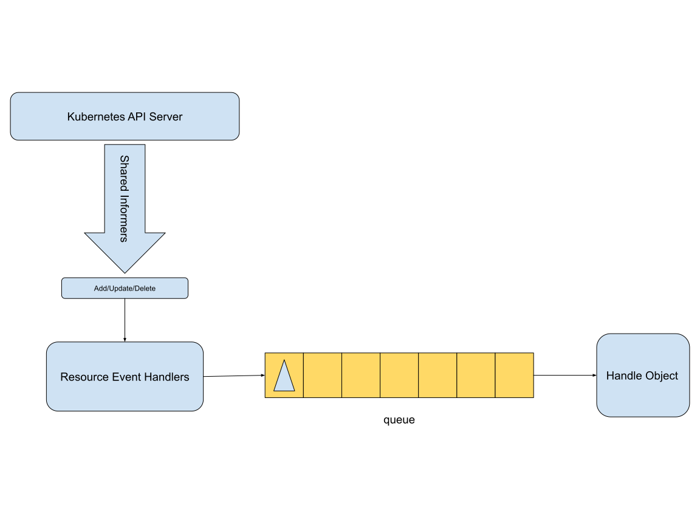
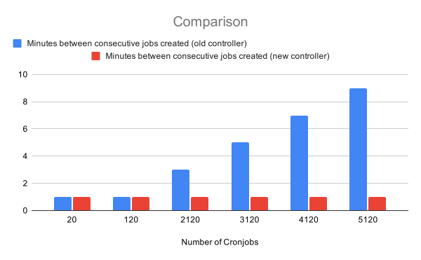

In Kubernetes v1.21, the 
[CronJob](/docs/concepts/workloads/controllers/cron-jobs/) resource
reached general availability (GA). We've also substantially improved the 
performance of CronJobs since Kubernetes v1.19, by implementing a new
controller.

In Kubernetes v1.20 we launched a revised v2 controller for CronJobs, 
initially as an alpha feature. Kubernetes 1.21 uses the newer controller by
default, and the CronJob resource itself is now GA (group version: `batch/v1`).

In this article, we'll take you through the driving forces behind this new
development, give you a brief description of controller design for core 
Kubernetes, and we'll outline what you will gain from this improved controller.

The driving force behind promoting the API was Kubernetes' policy choice to
[ensure APIs move beyond beta](/blog/2020/08/21/moving-forward-from-beta/).
That policy aims to prevent APIs from being stuck in a “permanent beta” state.
Over the years the old CronJob controller implementation had received healthy
feedback from the community, with reports of several widely recognized
[issues](https://github.com/kubernetes/kubernetes/issues/82659).

If the beta API for CronJob was to be supported as GA, the existing controller
code would need substantial rework. Instead, the SIG Apps community decided
to introduce a new controller and gradually replace the old one.

## How do controllers work?

Kubernetes [controllers](/docs/concepts/architecture/controller/) are control
loops that watch the state of resource(s) in your cluster, then make or
request changes where needed. Each controller tries to move part of the
current cluster state closer to the desired state.

The v1 CronJob controller works by performing a periodic poll and sweep of all
the CronJob objects in your cluster, in order to act on them. It is a single
worker implementation that gets all CronJobs  every 10 seconds, iterates over
each one of them, and syncs them to their desired state. This was the default 
way of doing things almost 5 years ago when the controller was initially
written. In hindsight, we can certainly say that such an approach can
overload the API server at scale.

These days, every core controller in kubernetes must follow the guidelines 
described in [Writing Controllers](https://github.com/kubernetes/community/blob/master/contributors/devel/sig-api-machinery/controllers.md#readme).
Among many details, that document prescribes using
[shared informers](https://www.cncf.io/blog/2019/10/15/extend-kubernetes-via-a-shared-informer/)
to “receive notifications of adds, updates, and deletes for a particular
resource”. Upon any such events, the related object(s) is placed in a queue. 
Workers pull items from the queue and process them one at a time. This
approach ensures consistency and scalability.
 
The picture below shows the flow of information from kubernetes API server, 
through shared informers and queue, to the main part of a controller - a 
reconciliation loop which is responsible for performing the core functionality.

The CronJob controller V2 uses a queue that implements the DelayingInterface to 
handle the scheduling aspect. This queue allows processing an element after a 
specific time interval. Every time there is a change in a CronJob or its related
Jobs, the key that represents the CronJob is pushed to the queue. The main 
handler pops the key, processes the CronJob, and after completion 
pushes the key back into the queue for the next scheduled time interval. This is
immediately a more performant implementation, as it no longer requires a linear 
scan of all the CronJobs. On top of that, this controller can be scaled by 
increasing the number of workers processing the CronJobs in parallel.

## Performance impact of the new controller {#performance-impact}

In order to test the performance difference of the two controllers a VM instance
with 128 GiB RAM and 64 vCPUs was used to set up a single node Kubernetes cluster.
Initially, a sample workload was created with 20 CronJob instances with a schedule
to run every minute, and 2100 CronJobs running every 20 hours. Additionally, 
over the next few minutes we added 1000 CronJobs with a schedule to run every 
20 hours, until we reached a total of 5120 CronJobs. 

We observed that for every 1000 CronJobs added, the old controller used 
around 90 to 120 seconds more wall-clock time to schedule 20 Jobs every cycle.
That is, at 5120 CronJobs, the old controller took approximately 9 minutes
to create 20 Jobs. Hence, during each cycle, about 8 schedules were missed.
The new controller, implemented with architectural change explained above, 
created 20 Jobs without any delay, even when we created an additional batch
of 1000 CronJobs reaching a total of 6120. 

As a closing remark, the new controller exposes a histogram metric 
`cronjob_controller_cronjob_job_creation_skew_duration_seconds` which helps 
monitor the time difference between when a CronJob is meant to run and when 
the actual Job is created.

Hopefully the above description is a sufficient argument to follow the 
guidelines and standards set in the Kubernetes project, even for your own 
controllers. As mentioned before, the new controller is on by default starting
from Kubernetes v1.21; if you want to check it out in the previous release (1.20),
you can enable the `CronJobControllerV2`
[feature gate](/docs/reference/command-line-tools-reference/feature-gates/) 
for the kube-controller-manager: `--feature-gate="CronJobControllerV2=true"`.
