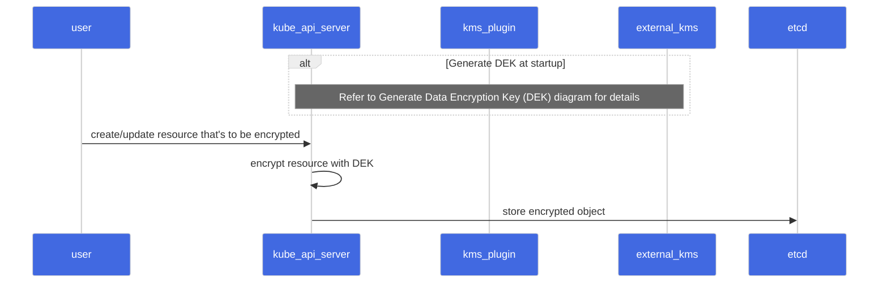
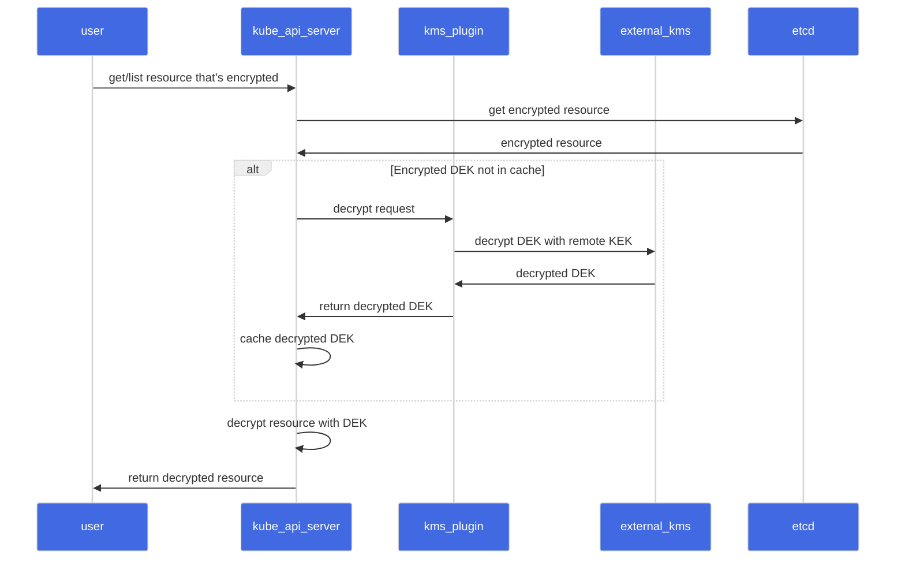
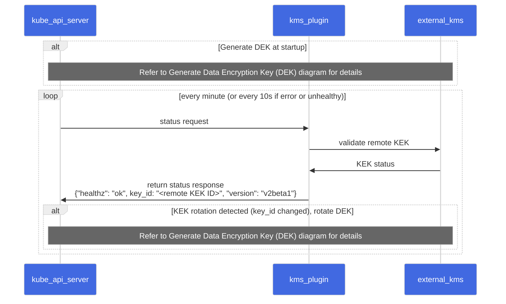
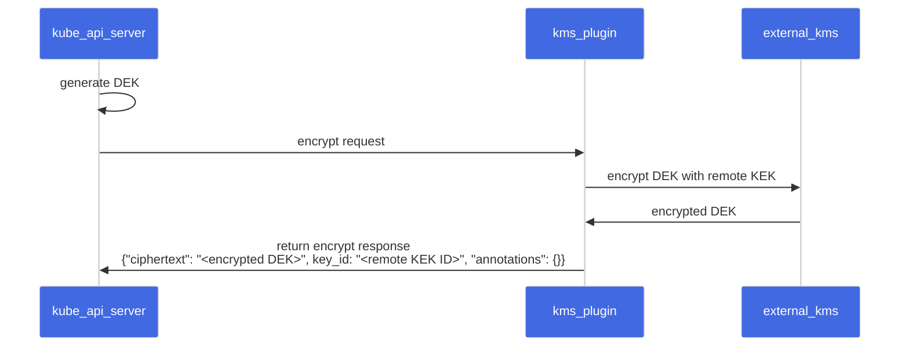

With Kubernetes 1.27, we (SIG Auth) are moving Key Management Service (KMS) v2 API to beta.

## What is KMS?
One of the first things to consider when securing a Kubernetes cluster is encrypting etcd data at
rest. KMS provides an interface for a provider to utilize a key stored in an external key service to
perform this encryption.

KMS v1 has been a feature of Kubernetes since version 1.10, and is currently in beta as of version
v1.12. KMS v2 was introduced as alpha in v1.25.

{}
The KMS v2 API and implementation changed in incompatible
ways in-between the alpha release in v1.25 and the beta release in v1.27. The design of KMS v2 has
changed since [the previous blog post](https://kubernetes.io/blog/2022/09/09/kms-v2-improvements/)
was written and it is not compatible with the design in this blog post. Attempting to upgrade from
old versions with the alpha feature enabled will result in data loss.
{}

## What’s new in `v2beta1`?
The KMS encryption provider uses an envelope encryption scheme to encrypt data in etcd. The data is
encrypted using a data encryption key (DEK). The DEKs are encrypted with a key encryption key (KEK)
that is stored and managed in a remote KMS. With KMS v1, a new DEK is generated for each encryption.
With KMS v2, a new DEK is only generated on server startup and when the KMS plugin informs the API
server that a KEK rotation has occurred.

{}
If you are running virtual machine (VM) based nodes
that leverage VM state store with this feature, you must not use KMS v2.

With KMS v2, the API server uses AES-GCM with a 12 byte nonce (8 byte atomic counter and 4 bytes
random data) for encryption. The following issues could occur if the VM is saved and restored:

1. The counter value may be lost or corrupted if the VM is saved in an inconsistent state or
   restored improperly. This can lead to a situation where the same counter value is used twice,
   resulting in the same nonce being used for two different messages.
2. If the VM is restored to a previous state, the counter value may be set back to its previous
   value, resulting in the same nonce being used again.

Although both of these cases are partially mitigated by the 4 byte random nonce, this can compromise
the security of the encryption.
{}

### Sequence Diagram

#### Encrypt Request

<!-- source

-->



#### Decrypt Request

<!-- source

-->



#### Status Request

<!-- source

-->



#### Generate Data Encryption Key (DEK)

<!-- source

-->



### Performance Improvements
With KMS v2, we have made significant improvements to the performance of the KMS encryption
provider. In case of KMS v1, a new DEK is generated for every encryption. This means that for every
write request, the API server makes a call to the KMS plugin to encrypt the DEK using the remote
KEK. The API server also has to cache the DEKs to avoid making a call to the KMS plugin for every
read request. When the API server restarts, it has to populate the cache by making a call to the KMS
plugin for every DEK in the etcd store based on the cache size. This is a significant overhead for
the API server. With KMS v2, the API server generates a DEK at startup and caches it. The API server
also makes a call to the KMS plugin to encrypt the DEK using the remote KEK. This is a one-time call
at startup and on KEK rotation. The API server then uses the cached DEK to encrypt the resources.
This reduces the number of calls to the KMS plugin and improves the overall latency of the API
server requests.

We conducted a test that created 12k secrets and measured the time taken for the API server to
encrypt the resources. The metric used was
[`apiserver_storage_transformation_duration_seconds`](/docs/reference/instrumentation/metrics/).
For KMS v1, the test was run on a managed Kubernetes v1.25 cluster with 2 nodes. There was no
additional load on the cluster during the test. For KMS v2, the test was run in the Kubernetes CI
environment with the following [cluster
configuration](https://github.com/kubernetes/kubernetes/blob/release-1.27/test/e2e/testing-manifests/auth/encrypt/kind.yaml).

| KMS Provider | Time taken by 95 percentile |
| ------------ | --------------------------- |
| KMS v1       | 160ms                       |
| KMS v2       | 80μs                        |

The results show that the KMS v2 encryption provider is three orders of magnitude faster than the
KMS v1 encryption provider.

## What's next?
For Kubernetes v1.28, we expect the feature to stay in beta. In the coming releases we want to
investigate:
- Cryptographic changes to remove the limitation on VM state store.
- Kubernetes REST API changes to enable a more robust story around key rotation.
- Handling undecryptable resources. Refer to the
  [KEP](https://github.com/kubernetes/enhancements/pull/3927) for details.

You can learn more about KMS v2 by reading [Using a KMS provider for data
encryption](/docs/tasks/administer-cluster/kms-provider/). You can also follow along on the
[KEP](https://github.com/kubernetes/enhancements/blob/master/keps/sig-auth/3299-kms-v2-improvements/#readme)
to track progress across the coming Kubernetes releases.

## Call to action

In this blog post, we have covered the improvements made to the KMS encryption provider in
Kubernetes v1.27. We have also discussed the new KMS v2 API and how it works. We would love to hear
your feedback on this feature. In particular, we would like feedback from Kubernetes KMS plugin
implementors as they go through the process of building their integrations with this new API. Please
reach out to us on the [#sig-auth-kms-dev](https://kubernetes.slack.com/archives/C03035EH4VB)
channel on Kubernetes Slack.

## How to get involved
If you are interested in getting involved in the development of this feature, share feedback, or
participate in any other ongoing SIG Auth projects, please reach out on the
[#sig-auth](https://kubernetes.slack.com/archives/C0EN96KUY) channel on Kubernetes Slack.

You are also welcome to join the bi-weekly [SIG Auth
meetings](https://github.com/kubernetes/community/blob/master/sig-auth/README.md#meetings), held
every-other Wednesday.

## Acknowledgements
This feature has been an effort driven by contributors from several different companies. We would
like to extend a huge thank you to everyone that contributed their time and effort to help make this
possible.
