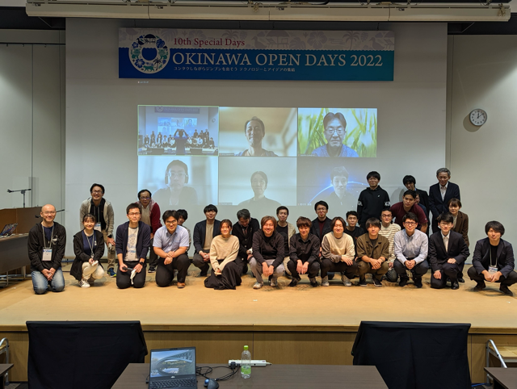

We are organizers of [Kubernetes Upstream Training in Japan](https://github.com/kubernetes-sigs/contributor-playground/tree/master/japan).
Our team is composed of members who actively contribute to Kubernetes, including individuals who hold roles such as member, reviewer, approver, and chair.

Our goal is to increase the number of Kubernetes contributors and foster the growth of the community.
While Kubernetes community is friendly and collaborative, newcomers may find the first step of contributing to be a bit challenging.
Our training program aims to lower that barrier and create an environment where even beginners can participate smoothly.

## What is Kubernetes upstream training in Japan?

Our training started in 2019 and is held 1 to 2 times a year.
Initially, Kubernetes Upstream Training was conducted as a co-located event of KubeCon (Kubernetes Contributor Summit),
but we launched Kubernetes Upstream Training in Japan with the aim of increasing Japanese contributors by hosting a similar event in Japan.

Before the pandemic, the training was held in person, but since 2020, it has been conducted online.
The training offers the following content for those who have not yet contributed to Kubernetes:

* Introduction to Kubernetes community
* Overview of Kubernetes codebase and how to create your first PR
* Tips and encouragement to lower participation barriers, such as language
* How to set up the development environment
* Hands-on session using [kubernetes-sigs/contributor-playground](https://github.com/kubernetes-sigs/contributor-playground)

At the beginning of the program, we explain why contributing to Kubernetes is important and who can contribute.
We emphasize that contributing to Kubernetes allows you to make a global impact and that Kubernetes community is looking forward to your contributions!

We also explain Kubernetes community, SIGs, and Working Groups.
Next, we explain the roles and responsibilities of Member, Reviewer, Approver, Tech Lead, and Chair.
Additionally, we introduce the communication tools we primarily use, such as Slack, GitHub, and mailing lists.
Some Japanese speakers may feel that communicating in English is a barrier.
Additionally, those who are new to the community need to understand where and how communication takes place.
We emphasize the importance of taking that first step, which is the most important aspect we focus on in our training!

We then go over the structure of Kubernetes codebase, the main repositories, how to create a PR, and the CI/CD process using [Prow](https://docs.prow.k8s.io/).
We explain in detail the process from creating a PR to getting it merged.

After several lectures, participants get to experience hands-on work using [kubernetes-sigs/contributor-playground](https://github.com/kubernetes-sigs/contributor-playground), where they can create a simple PR.
The goal is for participants to get a feel for the process of contributing to Kubernetes.

At the end of the program, we also provide a detailed explanation of setting up the development environment for contributing to the `kubernetes/kubernetes` repository,
including building code locally, running tests efficiently, and setting up clusters.

## Interview with participants

We conducted interviews with those who participated in our training program.
We asked them about their reasons for joining, their impressions, and their future goals.

### [Keita Mochizuki](https://github.com/mochizuki875) ([NTT DATA Group Corporation](https://www.nttdata.com/global/en/about-us/profile))

Keita Mochizuki is a contributor who consistently contributes to Kubernetes and related projects.
Keita is also a professional in container security and has recently published a book.
Additionally, he has made available a [Roadmap for New Contributors](https://github.com/mochizuki875/KubernetesFirstContributionRoadMap), which is highly beneficial for those new to contributing.

**Junya:** Why did you decide to participate in Kubernetes Upstream Training?

**Keita:** Actually, I participated twice, in 2020 and 2022.
In 2020, I had just started learning about Kubernetes and wanted to try getting involved in activities outside of work, so I signed up after seeing the event on Twitter by chance.
However, I didn't have much knowledge at the time, and contributing to OSS felt like something beyond my reach.
As a result, my understanding after the training was shallow, and I left with more of a "hmm, okay" feeling.

In 2022, I participated again when I was at a stage where I was seriously considering starting contributions.
This time, I did prior research and was able to resolve my questions during the lectures, making it a very productive experience.

**Junya:** How did you feel after participating?

**Keita:** I felt that the significance of this training greatly depends on the participant's mindset.
The training itself consists of general explanations and simple hands-on exercises, but it doesn't mean that attending the training will immediately lead to contributions.

**Junya:** What is your purpose for contributing?

**Keita:** My initial motivation was to "gain a deep understanding of Kubernetes and build a track record," meaning "contributing itself was the goal."
Nowadays, I also contribute to address bugs or constraints I discover during my work.
Additionally, through contributing, I've become less hesitant to analyze undocumented features directly from the source code.

**Junya:** What has been challenging about contributing?

**Keita:** The most difficult part was taking the first step. Contributing to OSS requires a certain level of knowledge, and leveraging resources like this training and support from others was essential.
One phrase that stuck with me was, "Once you take the first step, it becomes easier to move forward."
Also, in terms of continuing contributions as part of my job, the most challenging aspect is presenting the outcomes as achievements.
To keep contributing over time, it's important to align it with business goals and strategies, but upstream contributions don't always lead to immediate results that can be directly tied to performance.
Therefore, it's crucial to ensure mutual understanding with managers and gain their support.

**Junya:** What are your future goals?

**Keita:** My goal is to contribute to areas with a larger impact.
So far, I've mainly contributed by fixing smaller bugs as my primary focus was building a track record,
but moving forward, I'd like to challenge myself with contributions that have a greater impact on Kubernetes users or that address issues related to my work.
Recently, I've also been working on reflecting the changes I've made to the codebase into the official documentation,
and I see this as a step toward achieving my goals.

**Junya:** Thank you very much!

### [Yoshiki Fujikane](https://github.com/ffjlabo) ([CyberAgent, Inc.](https://www.cyberagent.co.jp/en/))

Yoshiki Fujikane is one of the maintainers of [PipeCD](https://pipecd.dev/), a CNCF Sandbox project.
In addition to developing new features for Kubernetes support in PipeCD,
Yoshiki actively participates in community management and speaks at various technical conferences.

**Junya:** Why did you decide to participate in the Kubernetes Upstream Training?

**Yoshiki:** At the time I participated, I was still a student.
I had only briefly worked with EKS, but I thought Kubernetes seemed complex yet cool, and I was casually interested in it.
Back then, OSS felt like something out of reach, and upstream development for Kubernetes seemed incredibly daunting.
While I had always been interested in OSS, I didn't know where to start.
It was during this time that I learned about the Kubernetes Upstream Training and decided to take the challenge of contributing to Kubernetes.

**Junya:** What were your impressions after participating?

**Yoshiki:** I found it extremely valuable as a way to understand what it's like to be part of an OSS community.
At the time, my English skills weren't very strong, so accessing primary sources of information felt like a big hurdle for me.
Kubernetes is a very large project, and I didn't have a clear understanding of the overall structure, let alone what was necessary for contributing.
The upstream training provided a Japanese explanation of the community structure and allowed me to gain hands-on experience with actual contributions.
Thanks to the guidance I received, I was able to learn how to approach primary sources and use them as entry points for further investigation, which was incredibly helpful.
This experience made me realize the importance of organizing and reviewing primary sources, and now I often dive into GitHub issues and documentation when something piques my interest.
As a result, while I am no longer contributing to Kubernetes itself, the experience has been a great foundation for contributing to other projects.

**Junya:** What areas are you currently contributing to, and what are the other projects you're involved in?

**Yoshiki:** Right now, I'm no longer working with Kubernetes, but instead, I'm a maintainer of PipeCD, a CNCF Sandbox project.
PipeCD is a CD tool that supports GitOps-style deployments for various application platforms.
The tool originally started as an internal project at CyberAgent.
With different teams adopting different platforms, PipeCD was developed to provide a unified CD platform with a consistent user experience.
Currently, it supports Kubernetes, AWS ECS, Lambda, Cloud Run, and Terraform.

**Junya:** What role do you play within the PipeCD team?

**Yoshiki:** I work full-time on improving and developing Kubernetes-related features within the team.
Since we provide PipeCD as a SaaS internally, my main focus is on adding new features and improving existing ones as part of that support.
In addition to code contributions, I also contribute by giving talks at various events and managing community meetings to help grow the PipeCD community.

**Junya:** Could you explain what kind of improvements or developments you are working on with regards to Kubernetes?

**Yoshiki:** PipeCD supports GitOps and Progressive Delivery for Kubernetes, so I'm involved in the development of those features.
Recently, I've been working on features that streamline deployments across multiple clusters.

**Junya:** Have you encountered any challenges while contributing to OSS?

**Yoshiki:** One challenge is developing features that maintain generality while meeting user use cases.
When we receive feature requests while operating the internal SaaS, we first consider adding features to solve those issues.
At the same time, we want PipeCD to be used by a broader audience as an OSS tool.
So, I always think about whether a feature designed for one use case could be applied to another, ensuring the software remains flexible and widely usable.

**Junya:** What are your goals moving forward?

**Yoshiki:** I want to focus on expanding PipeCD's functionality.
Currently, we are developing PipeCD under the slogan "One CD for All."
As I mentioned earlier, it supports Kubernetes, AWS ECS, Lambda, Cloud Run, and Terraform, but there are many other platforms out there, and new platforms may emerge in the future.
For this reason, we are currently developing a plugin system that will allow users to extend PipeCD on their own, and I want to push this effort forward.
I'm also working on features for multi-cluster deployments in Kubernetes, and I aim to continue making impactful contributions.

**Junya:** Thank you very much!

## Future of Kubernetes upstream training

We plan to continue hosting Kubernetes Upstream Training in Japan and look forward to welcoming many new contributors.
Our next session is scheduled to take place at the end of November during [CloudNative Days Winter 2024](https://event.cloudnativedays.jp/cndw2024).

Moreover, our goal is to expand these training programs not only in Japan but also around the world.
[Kubernetes celebrated its 10th anniversary](https://kubernetes.io/blog/2024/06/06/10-years-of-kubernetes/) this year, and for the community to become even more active, it's crucial for people across the globe to continue contributing.
While Upstream Training is already held in several regions, we aim to bring it to even more places.

We hope that as more people join Kubernetes community and contribute, our community will become even more vibrant!
