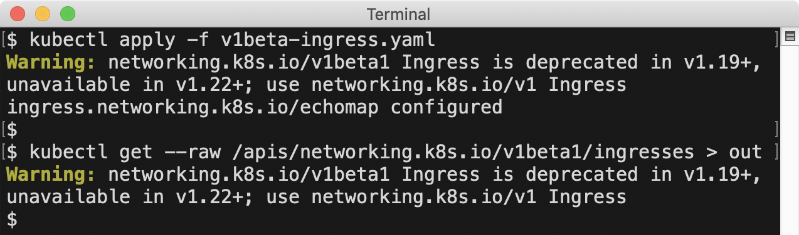
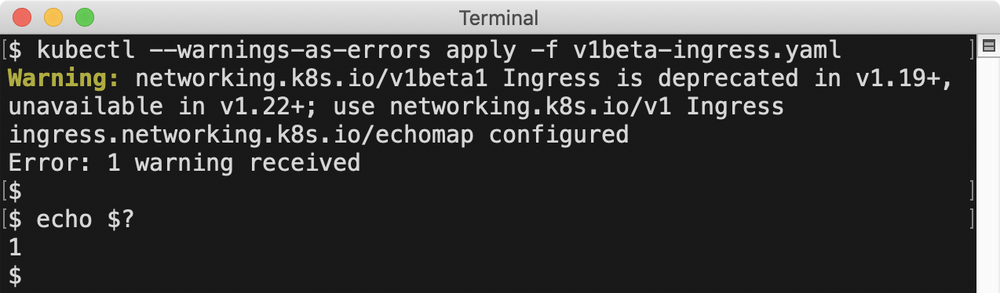

<!--
layout: blog
title: "Warning: Helpful Warnings Ahead"
date: 2020-09-03
slug: warnings
evergreen: true
-->

<!--
**Author**: [Jordan Liggitt](https://github.com/liggitt) (Google)
-->
**作者**: [Jordan Liggitt](https://github.com/liggitt) (Google)

<!--
As Kubernetes maintainers, we're always looking for ways to improve usability while preserving compatibility.
As we develop features, triage bugs, and answer support questions, we accumulate information that would be helpful for Kubernetes users to know.
In the past, sharing that information was limited to out-of-band methods like release notes, announcement emails, documentation, and blog posts.
Unless someone knew to seek out that information and managed to find it, they would not benefit from it.
-->
作为 Kubernetes 维护者，我们一直在寻找在保持兼容性的同时提高可用性的方法。
在开发功能、分类 Bug、和回答支持问题的过程中，我们积累了有助于 Kubernetes 用户了解的信息。
过去，共享这些信息仅限于发布说明、公告电子邮件、文档和博客文章等带外方法。
除非有人知道需要寻找这些信息并成功找到它们，否则他们不会从中受益。

<!--
In Kubernetes v1.19, we added a feature that allows the Kubernetes API server to
[send warnings to API clients](https://github.com/kubernetes/enhancements/tree/master/keps/sig-api-machinery/1693-warnings).
The warning is sent using a [standard `Warning` response header](https://tools.ietf.org/html/rfc7234#section-5.5),
so it does not change the status code or response body in any way.
This allows the server to send warnings easily readable by any API client, while remaining compatible with previous client versions.
-->
在 Kubernetes v1.19 中，我们添加了一个功能，允许 Kubernetes API
服务器[向 API 客户端发送警告](https://github.com/kubernetes/enhancements/tree/master/keps/sig-api-machinery/1693-warnings)。
警告信息使用[标准 `Warning` 响应头](https://tools.ietf.org/html/rfc7234#section-5.5)发送，
因此它不会以任何方式更改状态代码或响应体。
这一设计使得服务能够发送任何 API 客户端都可以轻松读取的警告，同时保持与以前的客户端版本兼容。

<!--
Warnings are surfaced by `kubectl` v1.19+ in `stderr` output, and by the `k8s.io/client-go` client library v0.19.0+ in log output.
The `k8s.io/client-go` behavior can be [overridden per-process or per-client](#customize-client-handling).
-->
警告在 `kubectl` v1.19+ 的 `stderr` 输出中和 `k8s.io/client-go` v0.19.0+ 客户端库的日志中出现。
`k8s.io/client-go` 行为可以[在进程或客户端层面重载](#customize-client-handling)。

<!--
## Deprecation Warnings
-->
## 弃用警告    {#deprecation-warnings}

<!--
The first way we are using this new capability is to send warnings for use of deprecated APIs.
-->
我们第一次使用此新功能是针对已弃用的 API 调用发送警告。

<!--
Kubernetes is a [big, fast-moving project](https://www.cncf.io/cncf-kubernetes-project-journey/#development-velocity).
Keeping up with the [changes](https://github.com/kubernetes/kubernetes/blob/master/CHANGELOG/CHANGELOG-1.19.md#changelog-since-v1180)
in each release can be daunting, even for people who work on the project full-time. One important type of change is API deprecations.
As APIs in Kubernetes graduate to GA versions, pre-release API versions are deprecated and eventually removed.
-->
Kubernetes 是一个[大型、快速发展的项目](https://www.cncf.io/cncf-kubernetes-project-journey/#development-velocity)。
跟上每个版本的[变更](https://github.com/kubernetes/kubernetes/blob/master/CHANGELOG/CHANGELOG-1.19.md#changelog-since-v1180)可能是令人生畏的，
即使对于全职从事该项目的人来说也是如此。一种重要的变更是 API 弃用。
随着 Kubernetes 中的 API 升级到 GA 版本，预发布的 API 版本会被弃用并最终被删除。

<!--
Even though there is an [extended deprecation period](/docs/reference/using-api/deprecation-policy/),
and deprecations are [included in release notes](https://github.com/kubernetes/kubernetes/blob/master/CHANGELOG/CHANGELOG-1.19.md#deprecation),
they can still be hard to track. During the deprecation period, the pre-release API remains functional,
allowing several releases to transition to the stable API version. However, we have found that users often don't even realize
they are depending on a deprecated API version until they upgrade to the release that stops serving it.
-->
即使有[延长的弃用期](/zh-cn/docs/reference/using-api/deprecation-policy/)，
并且[在发布说明中](https://github.com/kubernetes/kubernetes/blob/master/CHANGELOG/CHANGELOG-1.19.md#deprecation)也包含了弃用信息，
他们仍然很难被追踪。在弃用期内，预发布 API 仍然有效，
允许多个版本过渡到稳定的 API 版本。
然而，我们发现用户往往甚至没有意识到他们依赖于已弃用的 API 版本，
直到升级到不再提供相应服务的新版本。

<!--
Starting in v1.19, whenever a request is made to a deprecated REST API, a warning is returned along with the API response.
This warning includes details about the release in which the API will no longer be available, and the replacement API version.
-->
从 v1.19 开始，系统每当收到针对已弃用的 REST API 的请求时，都会返回警告以及 API 响应。
此警告包括有关 API 将不再可用的版本以及替换 API 版本的详细信息。

<!--
Because the warning originates at the server, and is intercepted at the client level, it works for all kubectl commands,
including high-level commands like `kubectl apply`, and low-level commands like `kubectl get --raw`:


-->
因为警告源自服务器端，并在客户端层级被拦截，所以它适用于所有 kubectl 命令，
包括像 `kubectl apply` 这样的高级命令，以及像 `kubectl get --raw` 这样的低级命令：


<!--
This helps people affected by the deprecation to know the request they are making is deprecated,
how long they have to address the issue, and what API they should use instead.
This is especially helpful when the user is applying a manifest they didn't create,
so they have time to reach out to the authors to ask for an updated version.
-->
这有助于受弃用影响的人们知道他们所请求的API已被弃用，
他们有多长时间来解决这个问题，以及他们应该使用什么 API。
这在用户应用不是由他们创建的清单文件时特别有用，
所以他们有时间联系作者要一个更新的版本。

<!--
We also realized that the person *using* a deprecated API is often not the same person responsible for upgrading the cluster,
so we added two administrator-facing tools to help track use of deprecated APIs and determine when upgrades are safe.
-->
我们还意识到**使用**已弃用的 API 的人通常不是负责升级集群的人，
因此，我们添加了两个面向管理员的工具来帮助跟踪已弃用的 API 的使用情况并确定何时升级安全。

<!--
### Metrics
-->

### 度量指标    {#metrics}

<!--
Starting in Kubernetes v1.19, when a request is made to a deprecated REST API endpoint,
an `apiserver_requested_deprecated_apis` gauge metric is set to `1` in the kube-apiserver process.
This metric has labels for the API `group`, `version`, `resource`, and `subresource`,
and a `removed_release` label that indicates the Kubernetes release in which the API will no longer be served.
-->
从 Kubernetes v1.19 开始，当向已弃用的 REST API 端点发出请求时，
在 kube-apiserver 进程中，`apiserver_requested_deprecated_apis` 度量指标会被设置为 `1`。
该指标具有 API `group`、`version`、`resource` 和 `subresource` 的标签，
和一个 `removed_release` 标签，表明不再提供 API 的 Kubernetes 版本。

<!--
This is an example query using `kubectl`, [prom2json](https://github.com/prometheus/prom2json),
and [jq](https://stedolan.github.io/jq/) to determine which deprecated APIs have been requested
from the current instance of the API server:
-->
下面是一个使用 `kubectl` 的查询示例，[prom2json](https://github.com/prometheus/prom2json)
和 [jq](https://stedolan.github.io/jq/) 用来确定当前 API
服务器实例上收到了哪些对已弃用的 API 请求：

```sh
kubectl get --raw /metrics | prom2json | jq '
  .[] | select(.name=="apiserver_requested_deprecated_apis").metrics[].labels
'
```

<!--
Output:
-->
输出：

```json
{
  "group": "extensions",
  "removed_release": "1.22",
  "resource": "ingresses",
  "subresource": "",
  "version": "v1beta1"
}
{
  "group": "rbac.authorization.k8s.io",
  "removed_release": "1.22",
  "resource": "clusterroles",
  "subresource": "",
  "version": "v1beta1"
}
```

<!--
This shows the deprecated `extensions/v1beta1` Ingress and `rbac.authorization.k8s.io/v1beta1` ClusterRole APIs
have been requested on this server, and will be removed in v1.22.

We can join that information with the `apiserver_request_total` metrics to get more details about the requests being made to these APIs:
-->
输出展示在此服务器上请求了已弃用的 `extensions/v1beta1` Ingress 和 `rbac.authorization.k8s.io/v1beta1`
ClusterRole API，这两个 API 都将在 v1.22 中被删除。

我们可以将该信息与 `apiserver_request_total` 指标结合起来，以获取有关这些 API 请求的更多详细信息：

```sh
kubectl get --raw /metrics | prom2json | jq '
  # set $deprecated to a list of deprecated APIs
  [
    .[] | 
    select(.name=="apiserver_requested_deprecated_apis").metrics[].labels |
    {group,version,resource}
  ] as $deprecated 
  
  |
  
  # select apiserver_request_total metrics which are deprecated
  .[] | select(.name=="apiserver_request_total").metrics[] |
  select(.labels | {group,version,resource} as $key | $deprecated | index($key))
'
```

<!--
Output:
-->
输出：

```json
{
  "labels": {
    "code": "0",
    "component": "apiserver",
    "contentType": "application/vnd.kubernetes.protobuf;stream=watch",
    "dry_run": "",
    "group": "extensions",
    "resource": "ingresses",
    "scope": "cluster",
    "subresource": "",
    "verb": "WATCH",
    "version": "v1beta1"
  },
  "value": "21"
}
{
  "labels": {
    "code": "200",
    "component": "apiserver",
    "contentType": "application/vnd.kubernetes.protobuf",
    "dry_run": "",
    "group": "extensions",
    "resource": "ingresses",
    "scope": "cluster",
    "subresource": "",
    "verb": "LIST",
    "version": "v1beta1"
  },
  "value": "1"
}
{
  "labels": {
    "code": "200",
    "component": "apiserver",
    "contentType": "application/json",
    "dry_run": "",
    "group": "rbac.authorization.k8s.io",
    "resource": "clusterroles",
    "scope": "cluster",
    "subresource": "",
    "verb": "LIST",
    "version": "v1beta1"
  },
  "value": "1"
}
```

<!--
The output shows that only read requests are being made to these APIs, and the most requests have been made to watch the deprecated Ingress API.

You can also find that information through the following Prometheus query,
which returns information about requests made to deprecated APIs which will be removed in v1.22:
-->
上面的输出展示，对这些 API 发出的都只是读请求，并且大多数请求都用来监测已弃用的 Ingress API。

你还可以通过以下 Prometheus 查询获取这一信息，
该查询返回关于已弃用的、将在 v1.22 中删除的 API 请求的信息：

```promql
apiserver_requested_deprecated_apis{removed_release="1.22"} * on(group,version,resource,subresource)
group_right() apiserver_request_total
```

<!--
### Audit Annotations
-->
### 审计注解    {#audit-annotations}

<!--
Metrics are a fast way to check whether deprecated APIs are being used, and at what rate,
but they don't include enough information to identify particular clients or API objects.
Starting in Kubernetes v1.19, [audit events](/docs/tasks/debug/debug-cluster/audit/)
for requests to deprecated APIs include an audit annotation of `"k8s.io/deprecated":"true"`.
Administrators can use those audit events to identify specific clients or objects that need to be updated.
-->
度量指标是检查是否正在使用已弃用的 API 以及使用率如何的快速方法，
但它们没有包含足够的信息来识别特定的客户端或 API 对象。
从 Kubernetes v1.19 开始，
对已弃用的 API 的请求进行审计时，[审计事件](/zh-cn/docs/tasks/debug/debug-cluster/audit/)中会包括
审计注解 `"k8s.io/deprecated":"true"`。
管理员可以使用这些审计事件来识别需要更新的特定客户端或对象。

<!--
## Custom Resource Definitions
-->
## 自定义资源定义    {#custom-resource-definitions}

<!--
Along with the API server ability to warn about deprecated API use, starting in v1.19, a CustomResourceDefinition can indicate a 
[particular version of the resource it defines is deprecated](/docs/tasks/extend-kubernetes/custom-resources/custom-resource-definition-versioning/#version-deprecation).
When API requests to a deprecated version of a custom resource are made, a warning message is returned, matching the behavior of built-in APIs.

The author of the CustomResourceDefinition can also customize the warning for each version if they want to.
This allows them to give a pointer to a migration guide or other information if needed.
-->
除了 API 服务器对已弃用的 API 使用发出警告的能力外，从 v1.19 开始，CustomResourceDefinition
可以指示[它定义的资源的特定版本已被弃用](/zh-cn/docs/tasks/extend-kubernetes/custom-resources/custom-resource-definition-versioning/#version-deprecation)。
当对自定义资源的已弃用的版本发出 API 请求时，将返回一条警告消息，与内置 API 的行为相匹配。

CustomResourceDefinition 的作者还可以根据需要自定义每个版本的警告。
这允许他们在需要时提供指向迁移指南的信息或其他信息。

<!--
```yaml
apiVersion: apiextensions.k8s.io/v1
kind: CustomResourceDefinition
  name: crontabs.example.com
spec:
  versions:
  - name: v1alpha1
    # This indicates the v1alpha1 version of the custom resource is deprecated.
    # API requests to this version receive a warning in the server response.
    deprecated: true
    # This overrides the default warning returned to clients making v1alpha1 API requests.
    deprecationWarning: "example.com/v1alpha1 CronTab is deprecated; use example.com/v1 CronTab (see http://example.com/v1alpha1-v1)"
    ...

  - name: v1beta1
    # This indicates the v1beta1 version of the custom resource is deprecated.
    # API requests to this version receive a warning in the server response.
    # A default warning message is returned for this version.
    deprecated: true
    ...

  - name: v1
    ...
```
-->
```yaml
apiVersion: apiextensions.k8s.io/v1
kind: CustomResourceDefinition
  name: crontabs.example.com
spec:
  versions:
  - name: v1alpha1
    # 这表示 v1alpha1 版本的自定义资源已经废弃了。
    # 对此版本的 API 请求会在服务器响应中收到警告。
    deprecated: true
    # 这会把返回给发出 v1alpha1 API 请求的客户端的默认警告覆盖。
    deprecationWarning: "example.com/v1alpha1 CronTab is deprecated; use example.com/v1 CronTab (see http://example.com/v1alpha1-v1)"
    ...

  - name: v1beta1
    # 这表示 v1beta1 版本的自定义资源已经废弃了。
    # 对此版本的 API 请求会在服务器响应中收到警告。
    # 此版本返回默认警告消息。
    deprecated: true
    ...

  - name: v1
    ...
```

<!--
## Admission Webhooks
-->
## 准入 Webhook    {#admission-webhooks}

<!--
[Admission webhooks](/docs/reference/access-authn-authz/extensible-admission-controllers)
are the primary way to integrate custom policies or validation with Kubernetes.
Starting in v1.19, admission webhooks can [return warning messages](/docs/reference/access-authn-authz/extensible-admission-controllers/#response)
that are passed along to the requesting API client. Warnings can be returned with allowed or rejected admission responses.

As an example, to allow a request but warn about a configuration known not to work well, an admission webhook could send this response:
-->
[准入 Webhook](/zh-cn/docs/reference/access-authn-authz/extensible-admission-controllers)是将自定义策略或验证与
Kubernetes 集成的主要方式。
从 v1.19 开始，Admission Webhook 可以[返回警告消息](/zh-cn/docs/reference/access-authn-authz/extensible-admission-controllers/#response)，
传递给发送请求的 API 客户端。警告可以与允许或拒绝的响应一起返回。

例如，允许请求但警告已知某个配置无法正常运行时，准入 Webhook 可以发送以下响应：

```json
{
  "apiVersion": "admission.k8s.io/v1",
  "kind": "AdmissionReview",
  "response": {
    "uid": "<value from request.uid>",
    "allowed": true,
    "warnings": [
      ".spec.memory: requests >1GB do not work on Fridays"
    ]
  }
}
```

<!--
If you are implementing a webhook that returns a warning message, here are some tips:

* Don't include a "Warning:" prefix in the message (that is added by clients on output)
* Use warning messages to describe problems the client making the API request should correct or be aware of
* Be brief; limit warnings to 120 characters if possible
-->
如果你在实现一个返回警告消息的 Webhook，这里有一些提示：

* 不要在消息中包含 “Warning:” 前缀（由客户端在输出时添加）
* 使用警告消息来正确描述能被发出 API 请求的客户端纠正或了解的问题
* 保持简洁；如果可能，将警告限制为 120 个字符以内

<!--
There are many ways admission webhooks could use this new feature, and I'm looking forward to seeing what people come up with.
Here are a couple ideas to get you started:

* webhook implementations adding a "complain" mode, where they return warnings instead of rejections,
  to allow trying out a policy to verify it is working as expected before starting to enforce it
* "lint" or "vet"-style webhooks, inspecting objects and surfacing warnings when best practices are not followed
-->
准入 Webhook 可以通过多种方式使用这个新功能，我期待看到大家想出来的方法。
这里有一些想法可以帮助你入门：

* 添加 “complain” 模式的 Webhook 实现，它们返回警告而不是拒绝，
  允许在开始执行之前尝试策略以验证它是否按预期工作
* “lint” 或 “vet” 风格的 Webhook，检查对象并在未遵循最佳实践时显示警告

<!--
## Customize Client Handling
-->
## 自定义客户端处理方式    {#customize-client-handling}

<!--
Applications that use the `k8s.io/client-go` library to make API requests can customize
how warnings returned from the server are handled. By default, warnings are logged to
stderr as they are received, but this behavior can be customized 
[per-process](https://godoc.org/k8s.io/client-go/rest#SetDefaultWarningHandler)
or [per-client](https://godoc.org/k8s.io/client-go/rest#Config).
-->
使用 `k8s.io/client-go` 库发出 API 请求的应用程序可以定制如何处理从服务器返回的警告。
默认情况下，收到的警告会以日志形式输出到 stderr，
但[在进程层面](https://godoc.org/k8s.io/client-go/rest#SetDefaultWarningHandler)或[客户端层面]
(https://godoc.org/k8s.io/client-go/rest#Config)均可定制这一行为。

<!--
This example shows how to make your application behave like `kubectl`,
overriding message handling process-wide to deduplicate warnings 
and highlighting messages using colored output where supported:
-->
这个例子展示了如何让你的应用程序表现得像 `kubectl`，
在进程层面重载整个消息处理逻辑以删除重复的警告，
并在支持的情况下使用彩色输出突出显示消息：

```go
import (
  "os"
  "k8s.io/client-go/rest"
  "k8s.io/kubectl/pkg/util/term"
  ...
)

func main() {
  rest.SetDefaultWarningHandler(
    rest.NewWarningWriter(os.Stderr, rest.WarningWriterOptions{
        // only print a given warning the first time we receive it
        Deduplicate: true,
        // highlight the output with color when the output supports it
        Color: term.AllowsColorOutput(os.Stderr),
      },
    ),
  )

  ...
```

<!--
The next example shows how to construct a client that ignores warnings.
This is useful for clients that operate on metadata for all resource types
(found dynamically at runtime using the discovery API)
and do not benefit from warnings about a particular resource being deprecated.
Suppressing deprecation warnings is not recommended for clients that require use of particular APIs.
-->
下一个示例展示如何构建一个忽略警告的客户端。
这对于那些操作所有资源类型（使用发现 API 在运行时动态发现）
的元数据并且不会从已弃用的特定资源的警告中受益的客户端很有用。
对于需要使用特定 API 的客户端，不建议抑制弃用警告。

```go
import (
  "k8s.io/client-go/rest"
  "k8s.io/client-go/kubernetes"
)

func getClientWithoutWarnings(config *rest.Config) (kubernetes.Interface, error) {
  // copy to avoid mutating the passed-in config
  config = rest.CopyConfig(config)
  // set the warning handler for this client to ignore warnings
  config.WarningHandler = rest.NoWarnings{}
  // construct and return the client
  return kubernetes.NewForConfig(config)
}
```

<!--
## Kubectl Strict Mode
-->
## Kubectl 强制模式    {#kubectl-strict-mode}

<!--
If you want to be sure you notice deprecations as soon as possible and get a jump start on addressing them,
`kubectl` added a `--warnings-as-errors` option in v1.19. When invoked with this option,
`kubectl` treats any warnings it receives from the server as errors and exits with a non-zero exit code:



This could be used in a CI job to apply manifests to a current server,
and required to pass with a zero exit code in order for the CI job to succeed.
-->
如果你想确保及时注意到弃用问题并立即着手解决它们，
`kubectl` 在 v1.19 中添加了 `--warnings-as-errors` 选项。使用此选项调用时，
`kubectl` 将从服务器收到的所有警告视为错误，并以非零码退出：


这可以在 CI 作业中用于将清单文件应用到当前服务器，
其中要求通过零退出码才能使 CI 作业成功。

<!--
## Future Possibilities
-->
## 未来的可能性    {#future-possibilities}

<!--
Now that we have a way to communicate helpful information to users in context,
we're already considering other ways we can use this to improve people's experience with Kubernetes.
A couple areas we're looking at next are warning about [known problematic values](http://issue.k8s.io/64841#issuecomment-395141013)
we cannot reject outright for compatibility reasons, and warning about use of deprecated fields or field values
(like selectors using beta os/arch node labels, [deprecated in v1.14](/docs/reference/labels-annotations-taints/#beta-kubernetes-io-arch-deprecated)).
I'm excited to see progress in this area, continuing to make it easier to use Kubernetes.
-->
现在我们有了一种在上下文中向用户传达有用信息的方法，
我们已经在考虑使用其他方法来改善人们使用 Kubernetes 的体验。
我们接下来要研究的几个领域是关于[已知有问题的值](http://issue.k8s.io/64841#issuecomment-395141013)的警告。
出于兼容性原因，我们不能直接拒绝，而应就使用已弃用的字段或字段值
（例如使用 beta os/arch 节点标签的选择器，
[在 v1.14 中已弃用](/zh-cn/docs/reference/labels-annotations-taints/#beta-kubernetes-io-arch-deprecated)）
给出警告。
我很高兴看到这方面的进展，继续让 Kubernetes 更容易使用。
