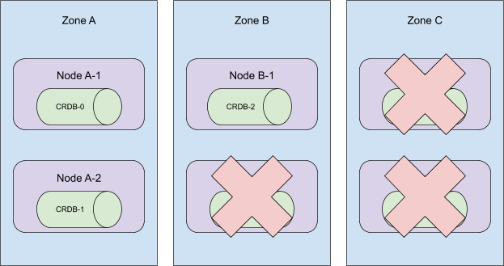

<!--
---
layout: blog
title: "A Custom Kubernetes Scheduler to Orchestrate Highly Available Applications"
date: 2020-12-21
slug: writing-crl-scheduler
---
-->
**作者**: Chris Seto (Cockroach Labs)
<!--
**Author**: Chris Seto (Cockroach Labs)
-->

<!--
As long as you're willing to follow the rules, deploying on Kubernetes and air travel can be quite pleasant. More often than not, things will "just work". However, if one is interested in travelling with an alligator that must remain alive or scaling a database that must remain available, the situation is likely to become a bit more complicated. It may even be easier to build one's own plane or database for that matter. Travelling with reptiles aside, scaling a highly available stateful system is no trivial task.
-->
只要你愿意遵守规则，那么在 Kubernetes 上的部署和探索可以是相当愉快的。更多时候，事情会 "顺利进行"。
然而，如果一个人对与必须保持存活的鳄鱼一起旅行或者是对必须保持可用的数据库进行扩展有兴趣，
情况可能会变得更复杂一点。
相较于这个问题，建立自己的飞机或数据库甚至还可能更容易一些。撇开与鳄鱼的旅行不谈，扩展一个高可用的有状态系统也不是一件小事。

<!--
Scaling any system has two main components:
1. Adding or removing infrastructure that the system will run on, and
2. Ensuring that the system knows how to handle additional instances of itself being added and removed.
-->
任何系统的扩展都有两个主要组成部分。
1. 增加或删除系统将运行的基础架构，以及
2. 确保系统知道如何处理自身额外实例的添加和删除。

<!--
Most stateless systems, web servers for example, are created without the need to be aware of peers. Stateful systems, which includes databases like CockroachDB, have to coordinate with their peer instances and shuffle around data. As luck would have it, CockroachDB handles data redistribution and replication. The tricky part is being able to tolerate failures during these operations by ensuring that data and instances are distributed across many failure domains (availability zones).
-->
大多数无状态系统，例如网络服务器，在创建时不需要意识到对等实例。而有状态的系统，包括像 CockroachDB 这样的数据库，
必须与它们的对等实例协调，并对数据进行 shuffle。运气好的话，CockroachDB 可以处理数据的再分布和复制。
棘手的部分是在确保数据和实例分布在许多故障域（可用性区域）的操作过程中能够容忍故障的发生。

<!--
One of Kubernetes' responsibilities is to place "resources" (e.g, a disk or container) into the cluster and satisfy the constraints they request. For example: "I must be in availability zone _A_" (see [Running in multiple zones](/docs/setup/best-practices/multiple-zones/#nodes-are-labeled)), or "I can't be placed onto the same node as this other Pod" (see [Affinity and anti-affinity](/docs/concepts/scheduling-eviction/assign-pod-node/#affinity-and-anti-affinity)).
-->
Kubernetes 的职责之一是将 "资源"（如磁盘或容器）放入集群中，并满足其请求的约束。
例如。"我必须在可用性区域 _A_"（见[在多个区域运行](/zh-cn/docs/setup/best-practices/multiple-zones/#nodes-are-labeled)），
或者 "我不能被放置到与某个 Pod 相同的节点上"
（见[亲和与反亲和](/zh-cn/docs/setup/best-practices/multiple-zones/#nodes-are-labeled)）。

<!--
As an addition to those constraints, Kubernetes offers [Statefulsets](/docs/concepts/workloads/controllers/statefulset/) that provide identity to Pods as well as persistent storage that "follows" these identified pods. Identity in a StatefulSet is handled by an increasing integer at the end of a pod's name. It's important to note that this integer must always be contiguous: in a StatefulSet, if pods 1 and 3 exist then pod 2 must also exist.
-->
作为对这些约束的补充，Kubernetes 提供了 [StatefulSets](/zh-cn/docs/concepts/workloads/controllers/statefulset/)，
为 Pod 提供身份，以及 "跟随" 这些指定 Pod 的持久化存储。
在 StatefulSet 中，身份是由 Pod 名称末尾一个呈增序的整数处理的。
值得注意的是，这个整数必须始终是连续的：在一个 StatefulSet 中，
如果 Pod 1 和 3 存在，那么 Pod 2 也必须存在。

<!--
Under the hood, CockroachCloud deploys each region of CockroachDB as a StatefulSet in its own Kubernetes cluster - see [Orchestrate CockroachDB in a Single Kubernetes Cluster](https://www.cockroachlabs.com/docs/stable/orchestrate-cockroachdb-with-kubernetes.html).
In this article, I'll be looking at an individual region, one StatefulSet and one Kubernetes cluster which is distributed across at least three availability zones.
-->
在架构上，CockroachCloud 将 CockroachDB 的每个区域作为 StatefulSet 部署在自己的 Kubernetes 集群中 -- 
参见 [Orchestrate CockroachDB in a Single Kubernetes Cluster](https://www.cockroachlabs.com/docs/stable/orchestrate-cockroachdb-with-kubernetes.html)。
在这篇文章中，我将着眼于一个单独的区域，一个 StatefulSet 和一个至少分布有三个可用区的 Kubernetes 集群。

<!--
A three-node CockroachCloud cluster would look something like this:
-->
一个三节点的 CockroachCloud 集群如下所示：

<!--

-->

<!--
When adding additional resources to the cluster we also distribute them across zones. For the speediest user experience, we add all Kubernetes nodes at the same time and then scale up the StatefulSet.
-->
在向集群增加额外的资源时，我们也会将它们分布在各个区域。
为了获得最快的用户体验，我们同时添加所有 Kubernetes 节点，然后扩大 StatefulSet 的规模。

<!--

-->

<!--
Note that anti-affinities are satisfied no matter the order in which pods are assigned to Kubernetes nodes. In the example, pods 0, 1 and 2 were assigned to zones A, B, and C respectively, but pods 3 and 4 were assigned in a different order, to zones B and A respectively. The anti-affinity is still satisfied because the pods are still placed in different zones.
-->
请注意，无论 Pod 被分配到 Kubernetes 节点的顺序如何，都会满足反亲和性。
在这个例子中，Pod 0、1、2 分别被分配到 A、B、C 区，但 Pod 3 和 4 以不同的顺序被分配到 B 和 A 区。
反亲和性仍然得到满足，因为 Pod 仍然被放置在不同的区域。

<!--
To remove resources from a cluster, we perform these operations in reverse order.
-->
要从集群中移除资源，我们以相反的顺序执行这些操作。

<!--
We first scale down the StatefulSet and then remove from the cluster any nodes lacking a CockroachDB pod.
-->
我们首先缩小 StatefulSet 的规模，然后从集群中移除任何缺少 CockroachDB Pod 的节点。

<!--

-->

<!--
Now, remember that pods in a StatefulSet of size _n_ must have ids in the range `[0,n)`. When scaling down a StatefulSet by _m_, Kubernetes removes _m_ pods, starting from the highest ordinals and moving towards the lowest, [the reverse in which they were added](/docs/concepts/workloads/controllers/statefulset/#deployment-and-scaling-guarantees).
Consider the cluster topology below:
-->
现在，请记住，规模为 _n_ 的 StatefulSet 中的 Pods 一定具有 `[0,n)` 范围内的 id。
当把一个 StatefulSet 规模缩减了 _m_ 时，Kubernetes 会移除 _m_ 个 Pod，从最高的序号开始，向最低的序号移动，
[与它们被添加的顺序相反](/zh-cn/docs/concepts/workloads/controllers/statefulset/#deployment-and-scaling-guarantees)。
考虑一下下面的集群拓扑结构。

<!--

-->

<!--
As ordinals 5 through 3 are removed from this cluster, the statefulset continues to have a presence across all 3 availability zones.
-->
当从这个集群中移除 5 号到 3 号 Pod 时，这个 StatefulSet 仍然横跨三个可用区。

<!--

-->

<!--
However, Kubernetes' scheduler doesn't _guarantee_ the placement above as we expected at first.
-->
然而，Kubernetes 的调度器并不像我们一开始预期的那样 _保证_ 上面的分布。

<!--
Our combined knowledge of the following is what lead to this misconception.
* Kubernetes' ability to [automatically spread Pods across zone](/docs/setup/best-practices/multiple-zones/#pods-are-spread-across-zones)
* The behavior that a StatefulSet with _n_ replicas, when Pods are being deployed, they are created sequentially, in order from `{0..n-1}`. See [StatefulSet](https://kubernetes.io/docs/concepts/workloads/controllers/statefulset/#deployment-and-scaling-guarantees) for more details.
-->
我们对以下内容的综合认识是导致这种误解的原因。
* Kubernetes [自动跨区分配 Pod](/zh-cn/docs/setup/best-practices/multiple-zones/#pods-are-spread-across-zones) 的能力
* 一个有 _n_ 个副本的 StatefulSet，当 Pod 被部署时，它们会按照 `{0...n-1}` 的顺序依次创建。
更多细节见 [StatefulSet](/zh-cn/docs/concepts/workloads/controllers/statefulset/#deployment-and-scaling-guarantees)。

<!--
Consider the following topology:
-->
考虑以下拓扑结构：

<!--

-->

<!--
These pods were created in order and they are spread across all availability zones in the cluster. When ordinals 5 through 3 are terminated, this cluster will lose its presence in zone C!
-->
这些 Pod 是按顺序创建的，它们分布在集群里所有可用区。当序号 5 到 3 的 Pod 被终止时，
这个集群将从 C 区消失!

<!--

-->

<!--
Worse yet, our automation, at the time, would remove Nodes A-2, B-2, and C-2. Leaving CRDB-1 in an unscheduled state as persistent volumes are only available in the zone they are initially created in.
-->
更糟糕的是，在这个时候，我们的自动化机制将删除节点 A-2，B-2，和 C-2。
并让 CRDB-1 处于未调度状态，因为持久性卷只在其创建时所处的区域内可用。

<!--
To correct the latter issue, we now employ a "hunt and peck" approach to removing machines from a cluster. Rather than blindly removing Kubernetes nodes from the cluster, only nodes without a CockroachDB pod would be removed. The much more daunting task was to wrangle the Kubernetes scheduler.
-->
为了纠正后一个问题，我们现在采用了一种“狩猎和啄食”的方法来从集群中移除机器。
与其盲目地从集群中移除 Kubernetes 节点，不如只移除没有 CockroachDB Pod 的节点。
更为艰巨的任务是管理 Kubernetes 的调度器。

<!--
## A session of brainstorming left us with 3 options:

### 1. Upgrade to kubernetes 1.18 and make use of Pod Topology Spread Constraints

While this seems like it could have been the perfect solution, at the time of writing Kubernetes 1.18 was unavailable on the two most common managed Kubernetes services in public cloud, EKS and GKE.
Furthermore, [pod topology spread constraints](/docs/concepts/scheduling-eviction/topology-spread-constraints/) were still a beta feature in 1.18 which meant that it [wasn't guaranteed to be available in managed clusters](https://cloud.google.com/kubernetes-engine/docs/concepts/types-of-clusters#kubernetes_feature_choices) even when v1.18 became available.
The entire endeavour was concerningly reminiscent of checking [caniuse.com](https://caniuse.com/) when Internet Explorer 8 was still around.
-->
## 一场头脑风暴后我们有了 3 个选择。

### 1. 升级到 kubernetes 1.18 并利用 Pod 拓扑分布约束

虽然这似乎是一个完美的解决方案，但在写这篇文章的时候，Kubernetes 1.18 在公有云中两个最常见的
托管 Kubernetes 服务（ EKS 和 GKE ）上是不可用的。
此外，[Pod 拓扑分布约束](/zh-cn/docs/concepts/scheduling-eviction/topology-spread-constraints/)在 1.18 中仍是测试版功能，
这意味着即使在 v1.18 可用时，它[也不能保证在托管集群中可用](https://cloud.google.com/kubernetes-engine/docs/concepts/types-of-clusters#kubernetes_feature_choices)。
整个努力让人联想到在 Internet Explorer 8 还存在的时候访问 [caniuse.com](https://caniuse.com/)。

<!--
### 2. Deploy a statefulset _per zone_.

Rather than having one StatefulSet distributed across all availability zones, a single StatefulSet with node affinities per zone would allow manual control over our zonal topology.
Our team had considered this as an option in the past which made it particularly appealing.
Ultimately, we decided to forego this option as it would have required a massive overhaul to our codebase and performing the migration on existing customer clusters would have been an equally large undertaking.
-->
### 2. 在每个区部署一个 StatefulSet。

与跨所有可用区部署一个 StatefulSet 相比，在每个区部署一个带有节点亲和性的 StatefulSet 可以实现手动控制分区拓扑结构。
我们的团队过去曾考虑过这个选项，我们也倾向此选项。
但最终，我们决定放弃这个方案，因为这需要对我们的代码库进行大规模的修改，而且在现有的客户集群上进行迁移也是一个同样大的工程。

<!--
### 3. Write a custom Kubernetes scheduler.

Thanks to an example from [Kelsey Hightower](https://github.com/kelseyhightower/scheduler) and a blog post from [Banzai Cloud](https://banzaicloud.com/blog/k8s-custom-scheduler/), we decided to dive in head first and write our own [custom Kubernetes scheduler](/docs/tasks/extend-kubernetes/configure-multiple-schedulers/).
Once our proof-of-concept was deployed and running, we quickly discovered that the Kubernetes' scheduler is also responsible for mapping persistent volumes to the Pods that it schedules.
The output of [`kubectl get events`](/docs/tasks/extend-kubernetes/configure-multiple-schedulers/#verifying-that-the-pods-were-scheduled-using-the-desired-schedulers) had led us to believe there was another system at play.
In our journey to find the component responsible for storage claim mapping, we discovered the [kube-scheduler plugin system](/docs/concepts/scheduling-eviction/scheduling-framework/). Our next POC was a `Filter` plugin that determined the appropriate availability zone by pod ordinal, and it worked flawlessly!

Our [custom scheduler plugin](https://github.com/cockroachlabs/crl-scheduler) is open source and runs in all of our CockroachCloud clusters.
Having control over how our StatefulSet pods are being scheduled has let us scale out with confidence.
We may look into retiring our plugin once pod topology spread constraints are available in GKE and EKS, but the maintenance overhead has been surprisingly low.
Better still: the plugin's implementation is orthogonal to our business logic. Deploying it, or retiring it for that matter, is as simple as changing the `schedulerName` field in our StatefulSet definitions.

---

_[Chris Seto](https://twitter.com/_ostriches) is a software engineer at Cockroach Labs and works on their Kubernetes automation for [CockroachCloud](https://cockroachlabs.cloud), CockroachDB._
-->

### 3. 编写一个自定义的 Kubernetes 调度器

感谢 [Kelsey Hightower](https://github.com/kelseyhightower/scheduler) 的例子和 
[Banzai Cloud](https://banzaicloud.com/blog/k8s-custom-scheduler/) 的博文，我们决定投入进去，编写自己的[自定义 Kubernetes 调度器](/zh-cn/docs/tasks/extend-kubernetes/configure-multiple-schedulers/)。
一旦我们的概念验证被部署和运行，我们很快就发现，Kubernetes 的调度器也负责将持久化卷映射到它所调度的 Pod 上。
[`kubectl get events`](/zh-cn/docs/tasks/extend-kubernetes/configure-multiple-schedulers/#verifying-that-the-pods-wer-scheduled-using-the-desired-schedulers)
的输出让我们相信有另一个系统在发挥作用。
在我们寻找负责存储声明映射的组件的过程中，我们发现了 
[kube-scheduler 插件系统](/zh-cn/docs/concepts/scheduling-eviction/scheduling-framework/)。
我们的下一个 POC 是一个"过滤器"插件，它通过 Pod 的序号来确定适当的可用区域，并且工作得非常完美。

我们的[自定义调度器插件](https://github.com/cockroachlabs/crl-scheduler)是开源的，并在我们所有的 CockroachCloud 集群中运行。
对 StatefulSet Pod 的调度方式有掌控力，让我们有信心扩大规模。
一旦 GKE 和 EKS 中的 Pod 拓扑分布约束可用，我们可能会考虑让我们的插件退役，但其维护的开销出乎意料地低。
更好的是：该插件的实现与我们的业务逻辑是横向的。部署它，或取消它，就像改变 StatefulSet 定义中的 "schedulerName" 字段一样简单。

---

[Chris Seto](https://twitter.com/_ostriches) 是 Cockroach 实验室的一名软件工程师，负责 
[CockroachCloud](https://cockroachlabs.cloud) CockroachDB 的 Kubernetes 自动化。
