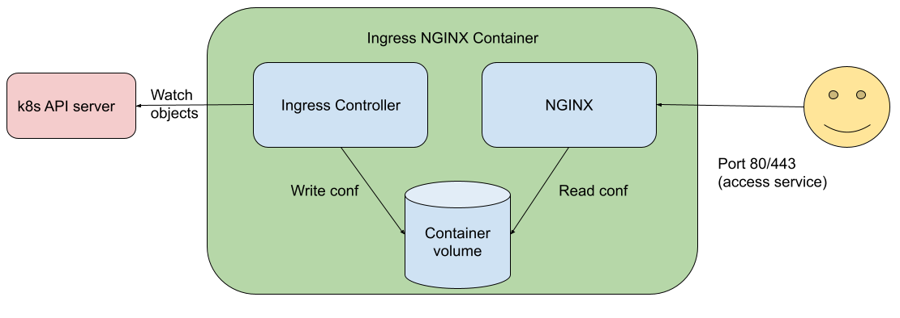
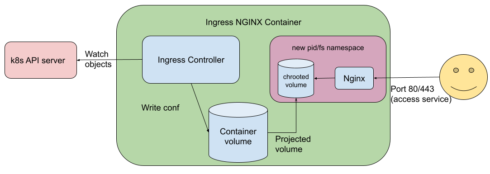

<!--
layout: blog
title: 'Increasing the security bar in Ingress-NGINX v1.2.0'
date: 2022-04-28
slug: ingress-nginx-1-2-0
-->

<!--
**Authors:** Ricardo Katz (VMware), James Strong (Chainguard)
-->
**作者：** Ricardo Katz (VMware), James Strong (Chainguard)

<!--
The [Ingress](/docs/concepts/services-networking/ingress/) may be one of the most targeted components
of Kubernetes. An Ingress typically defines an HTTP reverse proxy, exposed to the Internet, containing
multiple websites, and with some privileged access to Kubernetes API (such as to read Secrets relating to
TLS certificates and their private keys).
-->
[Ingress](/zh-cn/docs/concepts/services-networking/ingress/) 可能是 Kubernetes 最容易受攻击的组件之一。
Ingress 通常定义一个 HTTP 反向代理，暴露在互联网上，包含多个网站，并具有对 Kubernetes API
的一些特权访问（例如读取与 TLS 证书及其私钥相关的 Secret）。

<!--
While it is a risky component in your architecture, it is still the most popular way to properly expose your services.
-->
虽然它是架构中的一个风险组件，但它仍然是正常公开服务的最流行方式。

<!--
Ingress-NGINX has been part of security assessments that figured out we have a big problem: we don't
do all proper sanitization before turning the configuration into an `nginx.conf` file, which may lead to information
disclosure risks.
-->
Ingress-NGINX 一直是安全评估的重头戏，这类评估会发现我们有着很大的问题：
在将配置转换为 `nginx.conf` 文件之前，我们没有进行所有适当的清理，这可能会导致信息泄露风险。

<!--
While we understand this risk and the real need to fix this, it's not an easy process to do, so we took another approach to reduce (but not remove!) this risk in the current (v1.2.0) release.
-->
虽然我们了解此风险以及解决此问题的真正需求，但这并不是一个容易的过程，
因此我们在当前(v1.2.0)版本中采取了另一种方法来减少（但不是消除！）这种风险。

<!--
## Meet Ingress NGINX v1.2.0 and the chrooted NGINX process
-->
## 了解 Ingress NGINX v1.2.0 和 chrooted NGINX 进程

<!--
One of the main challenges is that Ingress-NGINX runs the web proxy server (NGINX) alongside the Ingress
controller (the component that has access to Kubernetes API that and that creates the `nginx.conf` file).
-->
主要挑战之一是 Ingress-NGINX 运行着 Web 代理服务器（NGINX），并与 Ingress 控制器一起运行
（后者是一个可以访问 Kubernetes API 并创建 `nginx.conf` 的组件）。

<!--
So, NGINX does have the same access to the filesystem of the controller (and Kubernetes service account token, and other configurations from the container). While splitting those components is our end goal, the project needed a fast response; that lead us to the idea of using `chroot()`.
-->
因此，NGINX 对控制器的文件系统（和 Kubernetes 服务帐户令牌，以及容器中的其他配置）具有相同的访问权限。 
虽然拆分这些组件是我们的最终目标，但该项目需要快速响应；这让我们想到了使用 `chroot()`。

<!--
Let's take a look into what an Ingress-NGINX container looked like before this change:
-->
让我们看一下 Ingress-NGINX 容器在此更改之前的样子：



<!--
As we can see, the same container (not the Pod, the container!) that provides HTTP Proxy is the one that watches Ingress objects and writes the Container Volume
-->
正如我们所见，用来提供 HTTP Proxy 的容器（不是 Pod，是容器！）也是是监视 Ingress
对象并将数据写入容器卷的容器。

<!--
Now, meet the new architecture:
-->
现在，见识一下新架构：



<!--
What does all of this mean? A basic summary is: that we are isolating the NGINX service as a container inside the
controller container.
-->
这一切意味着什么？一个基本的总结是：我们将 NGINX 服务隔离为控制器容器内的容器。

<!--
While this is not strictly true, to understand what was done here, it's good to understand how
Linux containers (and underlying mechanisms such as kernel namespaces) work.
You can read about cgroups in the Kubernetes glossary: [`cgroup`](https://kubernetes.io/docs/reference/glossary/?fundamental=true#term-cgroup) and learn more about cgroups interact with namespaces in the NGINX project article
[What Are Namespaces and cgroups, and How Do They Work?](https://www.nginx.com/blog/what-are-namespaces-cgroups-how-do-they-work/).
(As you read that, bear in mind that Linux kernel namespaces are a different thing from
[Kubernetes namespaces](/docs/concepts/overview/working-with-objects/namespaces/)).
-->
虽然这并不完全正确，但要了解这里所做的事情，最好了解 Linux 容器（以及内核命名空间等底层机制）是如何工作的。
你可以在 Kubernetes 词汇表中阅读有关 cgroup 的信息：[`cgroup`](/zh-cn/docs/reference/glossary/?fundamental=true#term-cgroup)，
并在 NGINX 项目文章[什么是命名空间和 cgroup，以及它们如何工作？](https://www.nginx.com/blog/what-are-namespaces-cgroups-how-do-they-work/)
中了解有关 cgroup 与命名空间交互的更多信息。（当你阅读时，请记住 Linux 内核命名空间与 
[Kubernetes 命名空间](/zh-cn/docs/concepts/overview/working-with-objects/namespaces/)不同）。

<!--
## Skip the talk, what do I need to use this new approach?
-->
## 跳过谈话，我需要什么才能使用这种新方法？

<!--
While this increases the security, we made this feature an opt-in in this release so you can have
time to make the right adjustments in your environment(s). This new feature is only available from
release v1.2.0 of the Ingress-NGINX controller.
-->
虽然这增加了安全性，但我们在这个版本中把这个功能作为一个选项，这样你就可以有时间在你的环境中做出正确的调整。
此新功能仅在 Ingress-NGINX 控制器的 v1.2.0 版本中可用。

<!--
There are two required changes in your deployments to use this feature:
* Append the suffix "-chroot" to the container image name. For example: `gcr.io/k8s-staging-ingress-nginx/controller-chroot:v1.2.0`
* In your Pod template for the Ingress controller, find where you add the capability `NET_BIND_SERVICE` and add the capability `SYS_CHROOT`. After you edit the manifest, you'll see a snippet like:
-->
要使用这个功能，在你的部署中有两个必要的改变：
* 将后缀 "-chroot" 添加到容器镜像名称中。例如：`gcr.io/k8s-staging-ingress-nginx/controller-chroot:v1.2.0`
* 在你的 Ingress 控制器的 Pod 模板中，找到添加 `NET_BIND_SERVICE` 权能的位置并添加 `SYS_CHROOT` 权能。
  编辑清单后，你将看到如下代码段：

```yaml
capabilities:
  drop:
  - ALL
  add:
  - NET_BIND_SERVICE
  - SYS_CHROOT
```
<!--
If you deploy the controller using the official Helm chart then change the following setting in
`values.yaml`:
-->
如果你使用官方 Helm Chart 部署控制器，则在 `values.yaml` 中更改以下设置：

```yaml
controller:
  image:
    chroot: true
```
<!--
Ingress controllers are normally set up cluster-wide (the IngressClass API is cluster scoped). If you manage the
Ingress-NGINX controller but you're not the overall cluster operator, then check with your cluster admin about
whether you can use the `SYS_CHROOT` capability, **before** you enable it in your deployment.
-->
Ingress 控制器通常部署在集群作用域（IngressClass API 是集群作用域的）。
如果你管理 Ingress-NGINX 控制器但你不是整个集群的操作员，
请在部署中启用它**之前**与集群管理员确认你是否可以使用 `SYS_CHROOT` 功能。

<!--
## OK, but how does this increase the security of my Ingress controller?

Take the following configuration snippet and imagine, for some reason it was added to your `nginx.conf`:
-->
## 好吧，但这如何能提高我的 Ingress 控制器的安全性呢？

以下面的配置片段为例，想象一下，由于某种原因，它被添加到你的 `nginx.conf` 中：

```
location /randomthing/ {
      alias /;
      autoindex on;
}
```
<!--
If you deploy this configuration, someone can call `http://website.example/randomthing` and get some listing (and access) to the whole filesystem of the Ingress controller.

Now, can you spot the difference between chrooted and non chrooted Nginx on the listings below?
-->
如果你部署了这种配置，有人可以调用 `http://website.example/randomthing` 并获取对 Ingress 控制器的整个文件系统的一些列表（和访问权限）。

现在，你能在下面的列表中发现 chroot 处理过和未经 chroot 处理过的 Nginx 之间的区别吗？

| 不额外调用 `chroot()`             | 额外调用 `chroot()` |
|----------------------------|--------|
| `bin`                      | `bin`  |
| `dev`                      | `dev`  |
| `etc`                      | `etc`  |
| `home`                     |        |
| `lib`                      | `lib`  |
| `media`                    |        |
| `mnt`                      |        |
| `opt`                      | `opt`  |
| `proc`                     | `proc` |
| `root`                     |        |
| `run`                      | `run`  |
| `sbin`                     |        |
| `srv`                      |        |
| `sys`                      |        |
| `tmp`                      | `tmp`  |
| `usr`                      | `usr`  |
| `var`                      | `var`  |
| `dbg`                      |        |
| `nginx-ingress-controller` |        |
| `wait-shutdown`            |        |

<!--
The one in left side is not chrooted. So NGINX has full access to the filesystem. The one in right side is chrooted, so a new filesystem with only the required files to make NGINX work is created.
-->
左侧的那个没有 chroot 处理。所以 NGINX 可以完全访问文件系统。右侧的那个经过 chroot 处理，
因此创建了一个新文件系统，其中只有使 NGINX 工作所需的文件。

<!--
## What about other security improvements in this release?
-->
## 此版本中的其他安全改进如何？

<!--
We know that the new `chroot()` mechanism helps address some portion of the risk, but still, someone
can try to inject commands to read, for example, the `nginx.conf` file and extract sensitive information.
-->
我们知道新的 `chroot()` 机制有助于解决部分风险，但仍然有人可以尝试注入命令来读取，例如 `nginx.conf` 文件并提取敏感信息。

<!--
So, another change in this release (this is opt-out!) is the _deep inspector_.
We know that some directives or regular expressions may be dangerous to NGINX, so the deep inspector
checks all fields from an Ingress object (during its reconciliation, and also with a
[validating admission webhook](/docs/reference/access-authn-authz/admission-controllers/#validatingadmissionwebhook))
to verify if any fields contains these dangerous directives.
-->
所以，这个版本的另一个变化（可选择取消）是 **深度探测（Deep Inspector）**。
我们知道某些指令或正则表达式可能对 NGINX 造成危险，因此深度探测器会检查 Ingress 对象中的所有字段
（在其协调期间，并且还使用[验证准入 webhook](/zh-cn/docs/reference/access-authn-authz/admission-controllers/#validatingadmissionwebhook))
验证是否有任何字段包含这些危险指令。

<!--
The ingress controller already does this for annotations, and our goal is to move this existing validation to happen inside
deep inspection as part of a future release.
-->
Ingress 控制器已经通过注解做了这个工作，我们的目标是把现有的验证转移到深度探测中，作为未来版本的一部分。

<!--
You can take a look into the existing rules in [https://github.com/kubernetes/ingress-nginx/blob/main/internal/ingress/inspector/rules.go](https://github.com/kubernetes/ingress-nginx/blob/main/internal/ingress/inspector/rules.go).
-->
你可以在 [https://github.com/kubernetes/ingress-nginx/blob/main/internal/ingress/inspector/rules.go](https://github.com/kubernetes/ingress-nginx/blob/main/internal/ingress/inspector/rules.go) 中查看现有规则。

<!--
Due to the nature of inspecting and matching all strings within relevant Ingress objects, this new feature may consume a bit more CPU. You can disable it by running the ingress controller with the command line argument `--deep-inspect=false`.
-->
由于检查和匹配相关 Ingress 对象中的所有字符串的性质，此新功能可能会消耗更多 CPU。
你可以通过使用命令行参数 `--deep-inspect=false` 运行 Ingress 控制器来禁用它。

<!--
## What's next?

This is not our final goal. Our final goal is to split the control plane and the data plane processes.
In fact, doing so will help us also achieve a [Gateway](https://gateway-api.sigs.k8s.io/) API implementation,
as we may have a different controller as soon as it "knows" what to provide to the data plane
(we need some help here!!)
-->
## 下一步是什么?

这不是我们的最终目标。我们的最终目标是拆分控制平面和数据平面进程。
事实上，这样做也将帮助我们实现 [Gateway](https://gateway-api.sigs.k8s.io/) API 实现，
因为一旦它“知道”要提供什么，我们可能会有不同的控制器 数据平面（我们需要一些帮助！！）

<!--
Some other projects in Kubernetes already take this approach
(like [KPNG](https://github.com/kubernetes-sigs/kpng), the proposed replacement for `kube-proxy`),
and we plan to align with them and get the same experience for Ingress-NGINX.
-->
Kubernetes 中的其他一些项目已经采用了这种方法（如 [KPNG](https://github.com/kubernetes-sigs/kpng)，
建议替换 `kube-proxy`），我们计划与他们保持一致，并为 Ingress-NGINX 获得相同的体验。

<!--
## Further reading

If you want to take a look into how chrooting was done in Ingress NGINX, take a look 
into [https://github.com/kubernetes/ingress-nginx/pull/8337](https://github.com/kubernetes/ingress-nginx/pull/8337)
The release v1.2.0 containing all the changes can be found at 
[https://github.com/kubernetes/ingress-nginx/releases/tag/controller-v1.2.0](https://github.com/kubernetes/ingress-nginx/releases/tag/controller-v1.2.0)
-->
## 延伸阅读

如果你想了解如何在 Ingress NGINX 中完成 chrooting，请查看
[https://github.com/kubernetes/ingress-nginx/pull/8337](https://github.com/kubernetes/ingress-nginx/pull/8337)。
包含所有更改的版本 v1.2.0 可以在以下位置找到
[https://github.com/kubernetes/ingress-nginx/releases/tag/controller-v1.2.0](https://github.com/kubernetes/ingress-nginx/releases/tag/controller-v1.2.0)
