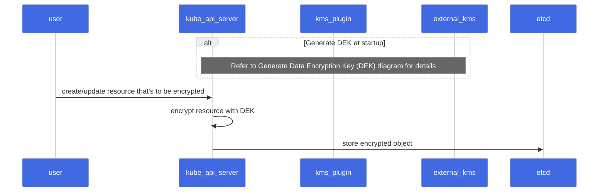
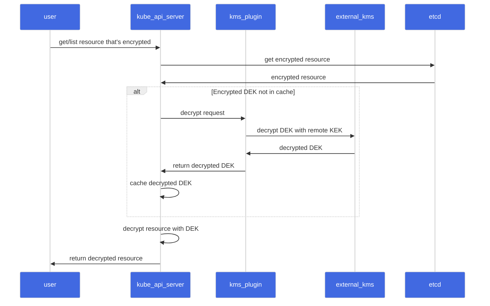
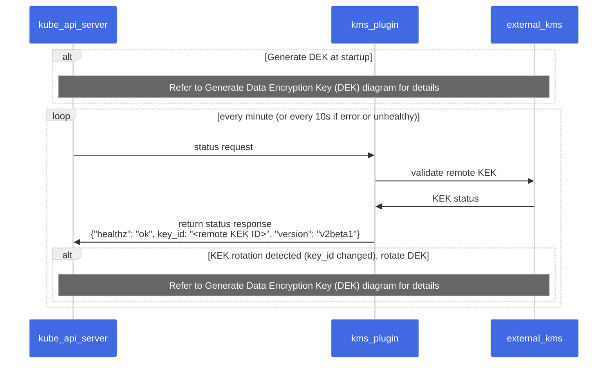
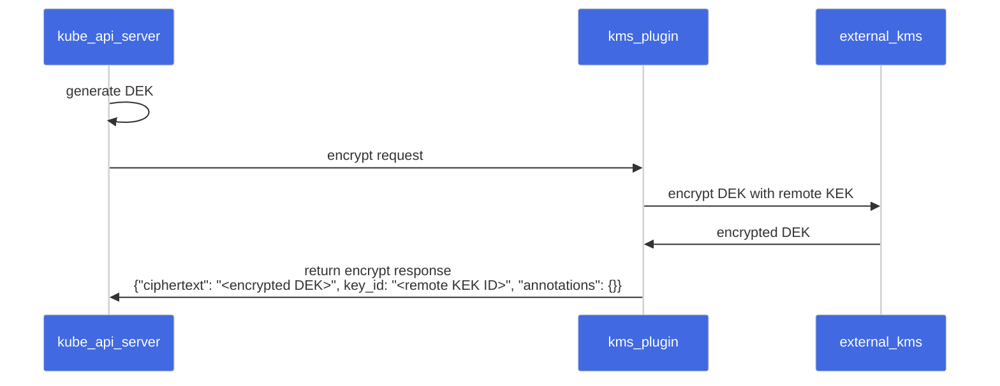

<!--
layout: blog
title: "Kubernetes 1.27: KMS V2 Moves to Beta"
date: 2023-05-16
slug: kms-v2-moves-to-beta
-->

<!--
**Authors:** Anish Ramasekar, Mo Khan, and Rita Zhang (Microsoft)
-->
**作者：** Anish Ramasekar, Mo Khan, and Rita Zhang (Microsoft)

**译者：** Xin Li (DaoCloud)

<!--
With Kubernetes 1.27, we (SIG Auth) are moving Key Management Service (KMS) v2 API to beta.
-->
在 Kubernetes 1.27 中，我们（SIG Auth）将密钥管理服务（KMS）v2 API 带入 Beta 阶段。

<!--
## What is KMS?
One of the first things to consider when securing a Kubernetes cluster is encrypting etcd data at
rest. KMS provides an interface for a provider to utilize a key stored in an external key service to
perform this encryption.
-->
## KMS 是什么？

保护 Kubernetes 集群时首先要考虑的事情之一是加密静态的 etcd 数据。
KMS 为供应商提供了一个接口，以便利用存储在外部密钥服务中的密钥来执行此加密。

<!--
KMS v1 has been a feature of Kubernetes since version 1.10, and is currently in beta as of version
v1.12. KMS v2 was introduced as alpha in v1.25.
-->
KMS v1 自 1.10 版以来一直是 Kubernetes 的一项功能特性，该特性从 v1.12
版开始处于 Beta 阶段。KMS v2 在 v1.25 中作为 Alpha 特性引入。

{}
<!--
The KMS v2 API and implementation changed in incompatible
ways in-between the alpha release in v1.25 and the beta release in v1.27. The design of KMS v2 has
changed since [the previous blog post](https://kubernetes.io/blog/2022/09/09/kms-v2-improvements/)
was written and it is not compatible with the design in this blog post. Attempting to upgrade from
old versions with the alpha feature enabled will result in data loss.
-->
KMS v2 API 与实现在 v1.25 的 Alpha 版本和 v1.27 的 Beta 版本之间发生了一些不兼容的变化。
自[上一篇博文](https://kubernetes.io/blog/2022/09/09/kms-v2-improvements/)撰写以来，
KMS v2 的设计发生了变化，与本博文中的设计不兼容。如果尝试从启用了 Alpha 特性的旧版本升级到
Beta 版本，将会导致数据丢失。
{}

<!--
## What’s new in `v2beta1`?
The KMS encryption provider uses an envelope encryption scheme to encrypt data in etcd. The data is
encrypted using a data encryption key (DEK). The DEKs are encrypted with a key encryption key (KEK)
that is stored and managed in a remote KMS. With KMS v1, a new DEK is generated for each encryption.
With KMS v2, a new DEK is only generated on server startup and when the KMS plugin informs the API
server that a KEK rotation has occurred.
-->
## `v2beta1` 有什么新内容？

KMS 加密驱动使用信封加密方式来加密 etcd 中的数据，使用数据加密密钥（DEK）对数据进行加密。
DEK 使用在远程 KMS 中存储和管理的密钥加密密钥（KEK）进行加密。
使用 KMS v1，每次加密都会生成一个新的 DEK。
使用 KMS v2，只有在服务器启动时且 KMS 插件通知 API 服务器发生 KEK 轮换时才会生成新的 DEK。

{}
<!--
If you are running virtual machine (VM) based nodes
that leverage VM state store with this feature, you must not use KMS v2.

With KMS v2, the API server uses AES-GCM with a 12 byte nonce (8 byte atomic counter and 4 bytes
random data) for encryption. The following issues could occur if the VM is saved and restored:
-->
如果你运行的是虚拟机（VM）节点，其中启用此特性的节点使用了 VM 的状态存储，
则不得使用 KMS v2。

对于 KMS v2，API 服务器使用带有 12 字节随机数（8 字节原子计数器和 4 字节随机数据）的
AES-GCM 进行加密。在保存和恢复虚拟机时，可能会出现以下问题：

<!--
1. The counter value may be lost or corrupted if the VM is saved in an inconsistent state or
   restored improperly. This can lead to a situation where the same counter value is used twice,
   resulting in the same nonce being used for two different messages.
2. If the VM is restored to a previous state, the counter value may be set back to its previous
   value, resulting in the same nonce being used again.
-->
1. 如果 VM 的保存状态不一致或其恢复不正确，计数器值可能会丢失或损坏。
   这可能会导致系统再次使用同一计数器值，进而在两个不同的消息中使用相同的随机数。
2. 如果 VM 恢复到以前的状态，则计数器值可能会设置回其以前的值，
   导致再次使用相同的随机数。

<!--
Although both of these cases are partially mitigated by the 4 byte random nonce, this can compromise
the security of the encryption.
-->
虽然这两种情况都可以通过 4 字节随机数部分缓解，但这仍可能会危及加密的安全性。
{}

<!--
### Sequence Diagram

#### Encrypt Request
-->
### 时序图

#### 加密请求

<!-- source

-->

<!--

-->


<!--
#### Decrypt Request
-->
#### 解密请求

<!-- source

-->

<!--

-->


<!--
#### Status Request
-->
#### 状态请求

<!-- source

-->

<!--

-->


<!--
#### Generate Data Encryption Key (DEK)
-->
#### 生成数据加密密钥（DKE）

<!-- source

-->

<!--

-->


<!--
### Performance Improvements
With KMS v2, we have made significant improvements to the performance of the KMS encryption
provider. In case of KMS v1, a new DEK is generated for every encryption. This means that for every
write request, the API server makes a call to the KMS plugin to encrypt the DEK using the remote
KEK. The API server also has to cache the DEKs to avoid making a call to the KMS plugin for every
read request. When the API server restarts, it has to populate the cache by making a call to the KMS
plugin for every DEK in the etcd store based on the cache size. This is a significant overhead for
the API server. With KMS v2, the API server generates a DEK at startup and caches it. The API server
also makes a call to the KMS plugin to encrypt the DEK using the remote KEK. This is a one-time call
at startup and on KEK rotation. The API server then uses the cached DEK to encrypt the resources.
This reduces the number of calls to the KMS plugin and improves the overall latency of the API
server requests.
-->
### 性能改进

在 KMS v2 中，我们对 KMS 加密提供程序的性能进行了重大改进。对于 KMS v1，
每次加密都会生成一个新的 DEK。这意味着对于每个写入请求，API 服务器都会调用
KMS 插件以使用远程 KEK 加密 DEK。为避免每个读取请求都会调用 KMS 插件，
API 服务器必须缓存 DEK。当 API 服务器重新启动时，
它必须根据缓存大小为 etcd 存储中的每个 DEK 调用 KMS 插件来填充缓存。
这对 API 服务器来说是一个很大的开销。使用 KMS v2，API 服务器在启动时生成一个 DEK 并将其缓存。
API 服务器还调用 KMS 插件以使用远程 KEK 加密 DEK。这是启动时和 KEK 轮换时的一次性调用。
在此之后，API 服务器使用缓存的 DEK 来加密资源。这样做减少了对 KMS 插件的调用次数，
并改善了 API 服务器请求的整体延迟。

<!--
We conducted a test that created 12k secrets and measured the time taken for the API server to
encrypt the resources. The metric used was
[`apiserver_storage_transformation_duration_seconds`](https://kubernetes.io/docs/reference/instrumentation/metrics/).
For KMS v1, the test was run on a managed Kubernetes v1.25 cluster with 2 nodes. There was no
additional load on the cluster during the test. For KMS v2, the test was run in the Kubernetes CI
environment with the following [cluster
configuration](https://github.com/kubernetes/kubernetes/blob/release-1.27/test/e2e/testing-manifests/auth/encrypt/kind.yaml).
-->
我们进行了一项创建 12,000 个 Secret 的测试，并检测了 API
服务器加密资源所花费的时间。使用的指标是
[`apiserver_storage_transformation_duration_seconds`](https://kubernetes.io/zh-cn/docs/reference/instrumentation/metrics/)。
对于 KMS v1，测试在具有 2 个节点的托管 Kubernetes v1.25 集群上运行。
测试期间集群上没有额外的负载。对于 KMS v2，
测试是在具有以下[集群配置](https://github.com/kubernetes/kubernetes/blob/release-1.27/test/e2e/testing-manifests/auth/encrypt/kind.yaml)的
Kubernetes CI 环境中运行的

<!--
| KMS Provider | Time taken by 95 percentile |
| ------------ | --------------------------- |
| KMS v1       | 160ms                       |
| KMS v2       | 80μs                        |

The results show that the KMS v2 encryption provider is three orders of magnitude faster than the
KMS v1 encryption provider.
-->
| KMS 驱动     | 95 分位请求所用时间            |
| ------------ | --------------------------- |
| KMS v1       | 160ms                       |
| KMS v2       | 80μs                        |

结果表明，KMS v2 加密驱动比 KMS v1 快三个数量级。

<!--
## What's next?
For Kubernetes v1.28, we expect the feature to stay in beta. In the coming releases we want to
investigate:
- Cryptographic changes to remove the limitation on VM state store.
- Kubernetes REST API changes to enable a more robust story around key rotation.
- Handling undecryptable resources. Refer to the
  [KEP](https://github.com/kubernetes/enhancements/pull/3927) for details.
-->
## 下一步计划

对于 Kubernetes v1.28，我们预计该功能仍处于测试阶段。在即将发布的版本中，我们将致力于：

- 修改加密程序以消除对 VM 状态存储的限制。
- 针对密钥轮换，修改 Kubernetes REST API 以实现更强大的特性。
- 处理无法解密的资源，更多细节参考：[KEP](https://github.com/kubernetes/enhancements/pull/3927)

<!--
You can learn more about KMS v2 by reading [Using a KMS provider for data
encryption](/docs/tasks/administer-cluster/kms-provider/). You can also follow along on the
[KEP](https://github.com/kubernetes/enhancements/blob/master/keps/sig-auth/3299-kms-v2-improvements/#readme)
to track progress across the coming Kubernetes releases.
-->
你可以通过阅读[使用 KMS 驱动进行数据加密](/zh-cn/docs/tasks/administer-cluster/kms-provider/)，
还可以关注 [KEP](https://github.com/kubernetes/enhancements/blob/master/keps/sig-auth/3299-kms-v2-improvements/#readme)
来跟踪即将发布的 Kubernetes 版本进度。

<!--
## Call to action

In this blog post, we have covered the improvements made to the KMS encryption provider in
Kubernetes v1.27. We have also discussed the new KMS v2 API and how it works. We would love to hear
your feedback on this feature. In particular, we would like feedback from Kubernetes KMS plugin
implementors as they go through the process of building their integrations with this new API. Please
reach out to us on the [#sig-auth-kms-dev](https://kubernetes.slack.com/archives/C03035EH4VB)
channel on Kubernetes Slack.
-->
## 行动号召

在这篇博文中，我们介绍了 Kubernetes v1.27 中对 KMS 加密驱动所做的改进。
我们还讨论了新的 KMS v2 API 及其工作原理。我们很想听听你对此功能的反馈，
特别是，我们希望 Kubernetes KMS 插件实现者在构建与这个新 API 的集成过程中得到反馈。
请通过 Kubernetes Slack 上的 [#sig-auth-kms-dev](https://kubernetes.slack.com/archives/C03035EH4VB)
频道与我们联系。

<!--
## How to get involved
If you are interested in getting involved in the development of this feature, share feedback, or
participate in any other ongoing SIG Auth projects, please reach out on the
[#sig-auth](https://kubernetes.slack.com/archives/C0EN96KUY) channel on Kubernetes Slack.
-->
## 如何参与

如果你有兴趣参与此功能的开发、分享反馈或参与任何其他正在进行的 SIG Auth 项目，
请联系 Kubernetes Slack 上的 [#sig-auth](https://kubernetes.slack.com/archives /C0EN96KUY) 频道。

<!--
You are also welcome to join the bi-weekly [SIG Auth
meetings](https://github.com/kubernetes/community/blob/master/sig-auth/README.md#meetings), held
every-other Wednesday.
-->
也欢迎你加入每两周举行一次的
[SIG Auth 会议](https://github.com/kubernetes/community/blob/master/sig-auth/README.md#meetings)，
每隔一个星期三举行一次。

<!--
## Acknowledgements
This feature has been an effort driven by contributors from several different companies. We would
like to extend a huge thank you to everyone that contributed their time and effort to help make this
possible.
-->
## 致谢

此功能是由来自几家不同公司的贡献者推动的，我们非常感谢所有贡献时间和精力帮助实现这一目标的人。

