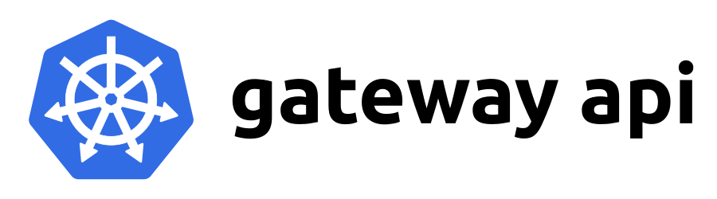

<!--
layout: blog
title: "Gateway API v1.0: GA Release"
date: 2023-10-31T10:00:00-08:00
slug: gateway-api-ga
-->

<!--
**Authors:** Shane Utt (Kong), Nick Young (Isovalent), Rob Scott (Google)
-->
**作者：** Shane Utt (Kong), Nick Young (Isovalent), Rob Scott (Google)

**译者：** Xin Li (Daocloud)

<!--
On behalf of Kubernetes SIG Network, we are pleased to announce the v1.0 release of [Gateway
API](https://gateway-api.sigs.k8s.io/)! This release marks a huge milestone for
this project. Several key APIs are graduating to GA (generally available), while
other significant features have been added to the Experimental channel.
-->
我们代表 Kubernetes SIG Network 很高兴地宣布 [Gateway API](https://gateway-api.sigs.k8s.io/)
v1.0 版本发布！此版本是该项目的一个重要里程碑。几个关键的 API 正在逐步进入 GA（正式发布）阶段，
同时其他重要特性已添加到实验（Experimental）通道中。

<!--
## What's new

### Graduation to v1
This release includes the graduation of
[Gateway](https://gateway-api.sigs.k8s.io/api-types/gateway/),
[GatewayClass](https://gateway-api.sigs.k8s.io/api-types/gatewayclass/), and
[HTTPRoute](https://gateway-api.sigs.k8s.io/api-types/httproute/) to v1, which
means they are now generally available (GA). This API version denotes a high
level of confidence in the API surface and provides guarantees of backwards
compatibility. Note that although, the version of these APIs included in the
Standard channel are now considered stable, that does not mean that they are
complete. These APIs will continue to receive new features via the Experimental
channel as they meet graduation criteria. For more information on how all of
this works, refer to the [Gateway API Versioning
Policy](https://gateway-api.sigs.k8s.io/concepts/versioning/).
-->
## 新增内容

### 升级到 v1

此版本将 [Gateway](https://gateway-api.sigs.k8s.io/api-types/gateway/)、
[GatewayClass](https://gateway-api.sigs.k8s.io/api-types/gatewayclass/) 和
[HTTPRoute](https://gateway-api.sigs.k8s.io/api-types/httproute/) 升级到 v1 版本，
这意味着它们现在是正式发布（GA）的版本。这个 API 版本表明我们对 API 的可感知方面具有较强的信心，并提供向后兼容的保证。
需要注意的是，虽然标准（Standard）通道中所包含的这个版本的 API 集合现在被认为是稳定的，但这并不意味着它们是完整的。
即便这些 API 已满足毕业标准，仍将继续通过实验（Experimental）通道接收新特性。要了解相关工作的组织方式的进一步信息，请参阅
[Gateway API 版本控制策略](https://gateway-api.sigs.k8s.io/concepts/versioning/)。

<!--
### Logo
Gateway API now has a logo! This logo was designed through a collaborative
process, and is intended to represent the idea that this is a set of Kubernetes
APIs for routing traffic both north-south and east-west:
-->
Gateway API 现在有了自己的 Logo！这个 Logo 是通过协作方式设计的，
旨在表达这是一组用于路由南北向和东西向流量的 Kubernetes API：

<!--
### CEL Validation
Historically, Gateway API has bundled a validating webhook as part of installing
the API. Starting in v1.0, webhook installation is optional and only recommended
for Kubernetes 1.24. Gateway API now includes
[CEL](/docs/reference/using-api/cel/) validation rules as
part of the
[CRDs](/docs/concepts/extend-kubernetes/api-extension/custom-resources/).
This new form of validation is supported in Kubernetes 1.25+, and thus the
validating webhook is no longer required in most installations.
-->
### CEL 验证

过去，Gateway API 在安装 API 时绑定了一个验证性质（Validation）的 Webhook。
从 v1.0 开始，Webhook 的安装是可选的，仅建议在 Kubernetes 1.24 版本上使用。
Gateway API 现在将 [CEL](/zh-cn/docs/reference/using-api/cel/) 验证规则包含在
[CRD](/zh-cn/docs/concepts/extend-kubernetes/api-extension/custom-resources/)
中。Kubernetes 1.25 及以上版本支持这种新形式的验证，因此大多数安装中不再需要验证性质的 Webhook。

<!--
### Standard channel
This release was primarily focused on ensuring that the existing beta APIs were
well defined and sufficiently stable to graduate to GA. That led to a variety of
spec clarifications, as well as some improvements to status to improve the
overall UX when interacting with Gateway API.
-->
### 标准（Standard）通道

此发行版本主要侧重于确保现有 Beta 级别 API 定义良好且足够稳定，可以升级为 GA。
其背后意味着为了提高与 Gateway API 交互时的整体用户体验而作的各种规范的澄清以及一些改进。

<!--
### Experimental channel
Most of the changes included in this release were limited to the experimental
channel. These include HTTPRoute timeouts, TLS config from Gateways to backends,
WebSocket support, Gateway infrastructure labels, and more. Stay tuned for a
follow up blog post that will cover each of these new features in detail.
-->
## 实验（Experimental）通道

此发行版本中包含的大部分更改都限于实验通道。这些更改包括 HTTPRoute
超时、用于 Gateway 访问后端的 TLS 配置、WebSocket 支持、Gateway 基础设施的标签等等。
请继续关注后续博客，我们将详细介绍这些新特性。

<!--
### Everything else
For a full list of the changes included in this release, please refer to the
[v1.0.0 release
notes](https://github.com/kubernetes-sigs/gateway-api/releases/tag/v1.0.0).
-->
## 其他内容

有关此版本中包含的所有更改的完整列表，请参阅
[v1.0.0 版本说明](https://github.com/kubernetes-sigs/gateway-api/releases/tag/v1.0.0)。

<!--
## How we got here

The idea of Gateway API was initially [proposed](https://youtu.be/Ne9UJL6irXY?si=wgtC9w8PMB5ZHil2)
4 years ago at KubeCon San Diego as the next generation
of Ingress API. Since then, an incredible community has formed to develop what
has likely become the most collaborative API in Kubernetes history. Over 170
people have contributed to this API so far, and that number continues to grow.
-->
## 发展历程

Gateway API 的想法最初是在 4 年前的 KubeCon 圣地亚哥[提出](https://youtu.be/Ne9UJL6irXY?si=wgtC9w8PMB5ZHil2)的，
下一代 Ingress API。那次会议之后，诞生了一个令人难以置信的社区，致力于开发一种可能是 Kubernetes
历史上协作关系最密切的 API。
迄今为止，已有超过 170 人为此 API 做出了贡献，而且这个数字还在不断增长。

<!--
A special thank you to the 20+ [community members who agreed to take on an
official role in the
project](https://github.com/kubernetes-sigs/gateway-api/blob/main/OWNERS_ALIASES),
providing some time for reviews and sharing the load of maintaining the project!

We especially want to highlight the emeritus maintainers that played a pivotal
role in the early development of this project:
-->
特别感谢 20 多位[愿意在项目中担任正式角色](https://github.com/kubernetes-sigs/gateway-api/blob/main/OWNERS_ALIASES)的社区成员，
他们付出了时间进行评审并分担项目维护的负担！

我们特别要强调那些在项目早期发展中起到关键作用的荣誉维护者：

* [Bowei Du](https://github.com/bowei)
* [Daneyon Hansen](https://github.com/danehans)
* [Harry Bagdi](https://github.com/hbagdi)

<!--
## Try it out

Unlike other Kubernetes APIs, you don't need to upgrade to the latest version of
Kubernetes to get the latest version of Gateway API. As long as you're running
one of the 5 most recent minor versions of Kubernetes (1.24+), you'll be able to
get up and running with the latest version of Gateway API.

To try out the API, follow our [Getting Started
guide](https://gateway-api.sigs.k8s.io/guides/).
-->
## 尝试一下

与其他 Kubernetes API 不同，你无需升级到最新版本的 Kubernetes 即可获取最新版本的
Gateway API。只要运行的是 Kubernetes 最新的 5 个次要版本之一（1.24+），
就可以使用最新版本的 Gateway API。

要尝试此 API，请参照我们的[入门指南](https://gateway-api.sigs.k8s.io/guides/)。

<!--
## What's next

This release is just the beginning of a much larger journey for Gateway API, and
there are still plenty of new features and new ideas in flight for future
releases of the API.
-->
## 下一步

此版本只是 Gateway API 更广泛前景的开始，将来的 API 版本中还有很多新特性和新想法。

<!--
One of our key goals going forward is to work to stabilize and graduate other
experimental features of the API. These include [support for service
mesh](https://gateway-api.sigs.k8s.io/concepts/gamma/), additional route types
([GRPCRoute](https://gateway-api.sigs.k8s.io/references/spec/#gateway.networking.k8s.io/v1alpha2.GRPCRoute),
[TCPRoute](https://gateway-api.sigs.k8s.io/references/spec/#gateway.networking.k8s.io/v1alpha2.TCPRoute),
[TLSRoute](https://gateway-api.sigs.k8s.io/references/spec/#gateway.networking.k8s.io/v1alpha2.TLSRoute),
[UDPRoute](https://gateway-api.sigs.k8s.io/references/spec/#gateway.networking.k8s.io/v1alpha2.UDPRoute)),
and a variety of experimental features.
-->
我们未来的一个关键目标是努力稳定和升级 API 的其他实验级特性。
这些特性包括支持[服务网格](https://gateway-api.sigs.k8s.io/concepts/gamma/)、
额外的路由类型（[GRPCRoute](https://gateway-api.sigs.k8s.io/references/spec/#gateway.networking.k8s.io/v1alpha2.GRPCRoute)、
[TCPRoute](https://gateway-api.sigs.k8s.io/references/spec/#gateway.networking.k8s.io/v1alpha2.TCPRoute)、
[TLSRoute](https://gateway-api.sigs.k8s.io/references/spec/#gateway.networking.k8s.io/v1alpha2.TLSRoute)、
[UDPRoute](https://gateway-api.sigs.k8s.io/references/spec/#gateway.networking.k8s.io/v1alpha2.UDPRoute)）以及各种实验级特性。

<!--
We've also been working towards moving
[ReferenceGrant](https://gateway-api.sigs.k8s.io/api-types/referencegrant/) into
a built-in Kubernetes API that can be used for more than just Gateway API.
Within Gateway API, we've used this resource to safely enable cross-namespace
references, and that concept is now being adopted by other SIGs. The new version
of this API will be owned by SIG Auth and will likely include at least some
modifications as it migrates to a built-in Kubernetes API.
-->
我们还致力于将 [ReferenceGrant](https://gateway-api.sigs.k8s.io/api-types/referencegrant/)
移入内置的 Kubernetes API 中，使其不仅仅可用于网关 API。在 Gateway API 中，我们使用这个资源来安全地实现跨命名空间引用，
而这个概念现在被其他 SIG 采纳。这个 API 的新版本将归 SIG Auth 所有，在移到内置的
Kubernetes API 时可能至少包含一些修改。

<!--
### Gateway API at KubeCon + CloudNativeCon

At [KubeCon North America
(Chicago)](https://events.linuxfoundation.org/kubecon-cloudnativecon-north-america/)
and the adjacent [Contributor
Summit](https://www.kubernetes.dev/events/2023/kcsna/) there are several talks
related to Gateway API that will go into more detail on these topics. If you're
attending either of these events this year, considering adding these to your
schedule.
-->
### Gateway API 现身于 KubeCon + CloudNativeCon

在 [KubeCon 北美（芝加哥）](https://events.linuxfoundation.org/kubecon-cloudnativecon-north-america/)
和同场的[贡献者峰会](https://www.kubernetes.dev/events/2023/kcsna/)上，
有几个与 Gateway API 相关的演讲将详细介绍这些主题。如果你今年要参加其中的一场活动，
请考虑将它们添加到你的日程安排中。

<!--
**Contributor Summit:**

- [Lessons Learned Building a GA API with CRDs](https://sched.co/1Sp9u)
- [Conformance Profiles: Building a generic conformance test reporting framework](https://sched.co/1Sp9l)
- [Gateway API: Beyond GA](https://sched.co/1SpA9)
-->
**贡献者峰会：**

- [使用 CRD 构建 GA API 的经验教训](https://sched.co/1Sp9u)
- [合规性配置文件：构建通用合规性测试报告框架](https://sched.co/1Sp9l)
- [Gateway API：GA 以后](https://sched.co/1SpA9)

<!--
**KubeCon Main Event:**

- [Gateway API: The Most Collaborative API in Kubernetes History Is GA](https://sched.co/1R2qM)
-->
**KubeCon 主要活动：**

- [Gateway API：Kubernetes 历史上协作性最强的 API 已经正式发布](https://sched.co/1R2qM)

<!--
**KubeCon Office Hours:**

Gateway API maintainers will be holding office hours sessions at KubeCon if
you'd like to discuss or brainstorm any related topics. To get the latest
updates on these sessions, join the `#sig-network-gateway-api` channel on
[Kubernetes Slack](https://slack.kubernetes.io/).
-->
**KubeCon 办公时间：**

如果你想就相关主题发起讨论或参与头脑风暴，请参加 Gateway API 维护人员在 KubeCon 上举行办公时间会议。
要获取有关这些会议的最新更新，请加入 [Kubernetes Slack](https://slack.kubernetes.io/)
上的 `#sig-network-gateway-api` 频道。

<!--
## Get involved

We've only barely scratched the surface of what's in flight with Gateway API.
There are lots of opportunities to get involved and help define the future of
Kubernetes routing APIs for both Ingress and Mesh.
-->
## 参与其中

我们只是初步介绍了 Gateway API 正在进行的工作。
有很多机会参与并帮助定义 Ingress 和 Mesh 的 Kubernetes 路由 API 的未来。

<!--
If this is interesting to you, please [join us in the
community](https://gateway-api.sigs.k8s.io/contributing/) and help us build the
future of Gateway API together!
-->
如果你对此感兴趣，请[加入我们的社区](https://gateway-api.sigs.k8s.io/contributing/)并帮助我们共同构建
Gateway API 的未来！
