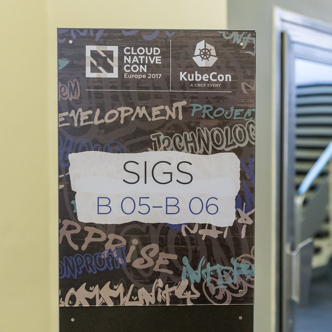
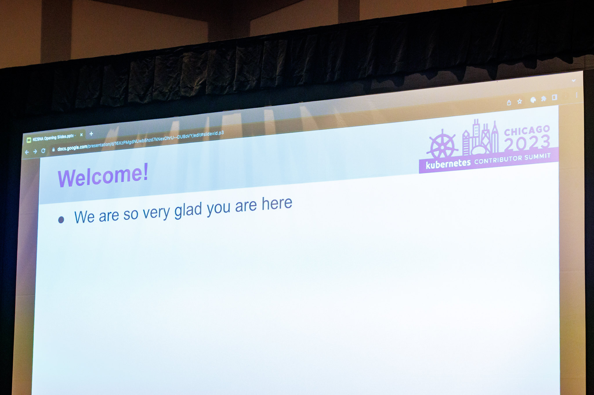
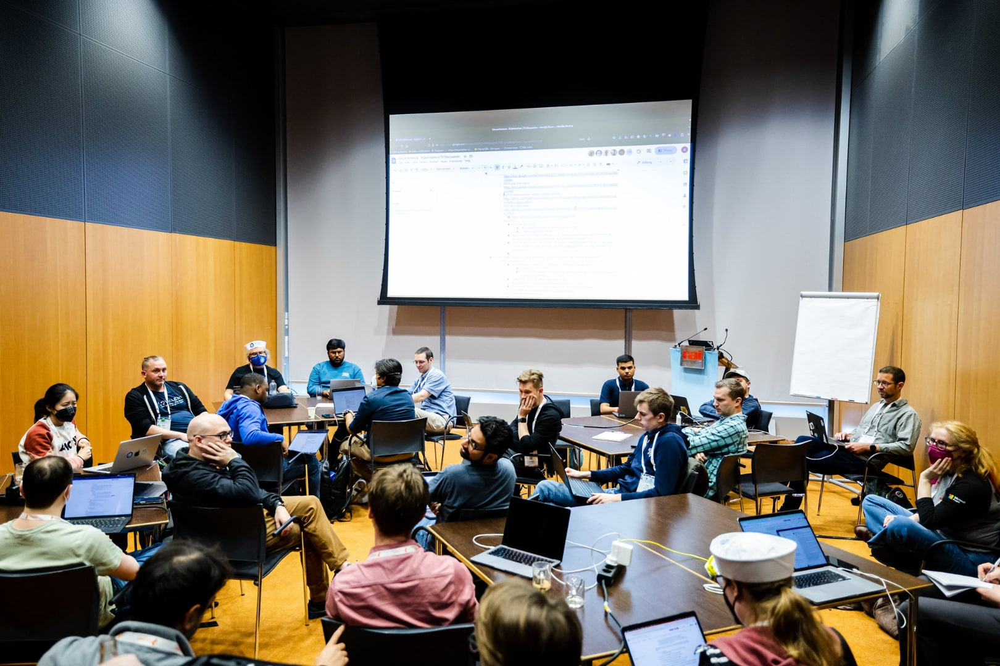

<!--
layout: blog
title: "10 Years of Kubernetes"
date: 2024-06-06
slug: 10-years-of-kubernetes
author: >
  [Bob Killen](https://github.com/mybobbytables) (CNCF),
  [Chris Short](https://github.com/chris-short) (AWS),
  [Frederico Muñoz](https://github.com/fsmunoz) (SAS),
  [Kaslin Fields](https://github.com/kaslin) (Google),
  [Tim Bannister](https://github.com/sftim) (The Scale Factory),
  and every contributor across the globe
-->

<!--

Ten (10) years ago, on June 6th, 2014, the
[first commit](https://github.com/kubernetes/kubernetes/commit/2c4b3a562ce34cddc3f8218a2c4d11c7310e6d56)
of Kubernetes was pushed to GitHub. That first commit with 250 files and 47,501 lines of go, bash
and markdown kicked off the project we have today. Who could have predicted that 10 years later,
Kubernetes would grow to become one of the largest Open Source projects to date with over
[88,000 contributors](https://k8s.devstats.cncf.io/d/24/overall-project-statistics?orgId=1) from
more than [8,000 companies](https://www.cncf.io/reports/kubernetes-project-journey-report/), across
44 countries.
-->

十年前的 2014 年 6 月 6 日，Kubernetes
的[第一次提交](https://github.com/kubernetes/kubernetes/commit/2c4b3a562ce34cddc3f8218a2c4d11c7310e6d56)被推送到 GitHub。
第一次提交包含了 250 个文件和 47,501 行的 Go、Bash 和 Markdown 代码，
开启了我们今天所拥有的项目。谁能预测到 10 年后，Kubernetes 会成长为迄今为止最大的开源项目之一，
拥有来自超过 8,000 家公司、来自 44 个国家的
[88,000 名贡献者](https://k8s.devstats.cncf.io/d/24/overall-project-statistics?orgId=1)。

<!--
This milestone isn't just for Kubernetes but for the Cloud Native ecosystem that blossomed from
it. There are close to [200 projects](https://all.devstats.cncf.io/d/18/overall-project-statistics-table?orgId=1)
within the CNCF itself, with contributions from
[240,000+ individual contributors](https://all.devstats.cncf.io/d/18/overall-project-statistics-table?orgId=1) and
thousands more in the greater ecosystem. Kubernetes would not be where it is today without them, the
[7M+ Developers](https://www.cncf.io/blog/2022/05/18/slashdata-cloud-native-continues-to-grow-with-more-than-7-million-developers-worldwide/),
and the even larger user community that have all helped shape the ecosystem that it is today.
-->
这一里程碑不仅属于 Kubernetes，也属于由此蓬勃发展的云原生生态系统。
在 CNCF 本身就有近 [200 个项目](https://all.devstats.cncf.io/d/18/overall-project-statistics-table?orgId=1)，有来自
[240,000 多名个人贡献者](https://all.devstats.cncf.io/d/18/overall-project-statistics-table?orgId=1)，
还有数千名来自更大的生态系统的贡献者的贡献。
如果没有 [700 多万开发者](https://www.cncf.io/blog/2022/05/18/slashdata-cloud-native-continues-to-grow-with-more-than-7-million-developers-worldwide/)和更庞大的用户社区，
Kubernetes 就不会达到今天的成就，他们一起帮助塑造了今天的生态系统。

<!--
## Kubernetes' beginnings - a converging of technologies

The ideas underlying Kubernetes started well before the first commit, or even the first prototype
([which came about in 2013](/blog/2018/07/20/the-history-of-kubernetes-the-community-behind-it/)).
In the early 2000s, Moore's Law was well in effect. Computing hardware was becoming more and more
powerful at an incredibly fast rate. Correspondingly, applications were growing more and more
complex. This combination of hardware commoditization and application complexity pointed to a need
to further abstract software from hardware, and solutions started to emerge.
-->
## Kubernetes 的起源 - 技术的融合

Kubernetes 背后的理念早在第一次提交之前，
甚至第一个原型（[在 2013 年问世](/blog/2018/07/20/the-history-of-kubernetes-the-community-behind-it/)之前就已经存在。
在 21 世纪初，摩尔定律仍然成立。计算硬件正以惊人的速度变得越来越强大。
相应地，应用程序变得越来越复杂。硬件商品化和应用程序复杂性的结合表明需要进一步将软件从硬件中抽象出来，
因此解决方案开始出现。

<!--
Like many companies at the time, Google was scaling rapidly, and its engineers were interested in
the idea of creating a form of isolation in the Linux kernel. Google engineer Rohit Seth described
the concept in an [email in 2006](https://lwn.net/Articles/199643/):
-->
像当时的许多公司一样，Google 正在快速扩张，其工程师对在 Linux 内核中创建一种隔离形式的想法很感兴趣。
Google 工程师 Rohit Seth 在 [2006 年的一封电子邮件](https://lwn.net/Articles/199643/)中描述了这个概念：

<!--
> We use the term container to indicate a structure against which we track and charge utilization of
system resources like memory, tasks, etc. for a Workload.
-->
> 我们使用术语 “容器” 来表示一种结构，通过该结构我们可以对负载的系统资源（如内存、任务等）利用情况进行跟踪和计费。

<!--
In March of 2013, a 5-minute lightning talk called
["The future of Linux Containers," presented by Solomon Hykes at PyCon](https://youtu.be/wW9CAH9nSLs?si=VtK_VFQHymOT7BIB),
introduced an upcoming open source tool called "Docker" for creating and using Linux
Containers. Docker introduced a level of usability to Linux Containers that made them accessible to
more users than ever before, and the popularity of Docker, and thus of Linux Containers,
skyrocketed. With Docker making the abstraction of Linux Containers accessible to all, running
applications in much more portable and repeatable ways was suddenly possible, but the question of
scale remained.
-->
2013 年 3 月，[Solomon Hykes 在 PyCon 上进行了一场名为 “Linux容器的未来”](https://youtu.be/wW9CAH9nSLs?si=VtK_VFQHymOT7BIB)的
5 分钟闪电演讲，介绍了名为 “Docker” 的一款即将被推出的开源工具，用于创建和使用 Linux 容器。Docker
提升了 Linux 容器的可用性，使其比以往更容易被更多用户使用，从而使
Docker 和Linux 容器的流行度飙升。随着 Docker 使 Linux 容器的抽象概念可供所有人使用，
以更便于移植且可重复的方式运行应用突然成为可能，但大规模使用的问题仍然存在。

<!--
Google's Borg system for managing application orchestration at scale had adopted Linux containers as
they were developed in the mid-2000s. Since then, the company had also started working on a new
version of the system called "Omega." Engineers at Google who were familiar with the Borg and Omega
systems saw the popularity of containerization driven by Docker. They recognized not only the need
for an open source container orchestration system but its "inevitability," as described by Brendan
Burns in this [blog post](/blog/2018/07/20/the-history-of-kubernetes-the-community-behind-it/). That
realization in the fall of 2013 inspired a small team to start working on a project that would later
become **Kubernetes**. That team included Joe Beda, Brendan Burns, Craig McLuckie, Ville Aikas, Tim
Hockin, Dawn Chen, Brian Grant, and Daniel Smith.
-->
Google 用来管理大规模应用编排的 Borg 系统在 2000 年代中期采用当时所开发的 Linux 容器技术。
此后，该公司还开始研发该系统的一个新版本，名为 “Omega”。
熟悉 Borg 和 Omega 系统的 Google 工程师们看到了 Docker 所推动的容器化技术的流行。
他们意识到对一个开源的容器编排系统的需求，而且意识到这一系统的“必然性”，正如
Brendan Burns 在这篇[博文](/blog/2018/07/20/the-history-of-kubernetes-the-community-behind-it/)中所描述的。
这一认识在 2013 年秋天激发了一个小团队开始着手一个后来成为 **Kubernetes**
的项目。该团队包括 Joe Beda、Brendan Burns、Craig McLuckie、Ville Aikas、Tim Hockin、Dawn Chen、Brian Grant
和 Daniel Smith。

<!--
## A decade of Kubernetes

Kubernetes' history begins with that historic commit on June 6th, 2014, and the subsequent
announcement of the project in a June 10th
[keynote by Google engineer Eric Brewer at DockerCon 2014](https://youtu.be/YrxnVKZeqK8?si=Q_wYBFn7dsS9H3k3)
(and its corresponding [Google blog](https://cloudplatform.googleblog.com/2014/06/an-update-on-container-support-on-google-cloud-platform.html)).
-->
## Kubernetes 十年回顾

Kubernetes 的历史始于 2014 年 6 月 6 日的那次历史性提交，随后，
[Google 工程师 Eric Brewer 在 2014 年 6 月 10 日的 DockerCon 2014
上的主题演讲](https://youtu.be/YrxnVKZeqK8?si=Q_wYBFn7dsS9H3k3)([及其相应的 Google 博客](https://cloudplatform.googleblog.com/2014/06/an-update-on-container-support-on-google-cloud-platform.html))中由宣布了该项目。

<!--
Over the next year, a small community of
[contributors, largely from Google and Red Hat](https://k8s.devstats.cncf.io/d/9/companies-table?orgId=1&var-period_name=Before%20joining%20CNCF&var-metric=contributors),
worked hard on the project, culminating in a [version 1.0 release on July 21st, 2015](https://cloudplatform.googleblog.com/2015/07/Kubernetes-V1-Released.html).
Alongside 1.0, Google announced that Kubernetes would be donated to a newly formed branch of the
Linux Foundation called the
[Cloud Native Computing Foundation (CNCF)](https://www.cncf.io/announcements/2015/06/21/new-cloud-native-computing-foundation-to-drive-alignment-among-container-technologies/).
-->
在接下来的一年里，一个由[主要来自 Google 和 Red Hat 等公司的贡献者](https://k8s.devstats.cncf.io/d/9/companies-table?orgId=1&var-period_name=Before%20joining%20CNCF&var-metric=contributors)组成的小型社区为该项目付出了辛勤的努力，最终在
2015 年 7 月 21 日发布了 [1.0 版本](https://cloudplatform.googleblog.com/2015/07/Kubernetes-V1-Released.html)。
在发布 1.0 版本的同时，Google 宣布将 Kubernetes 捐赠给 Linux 基金会下的一个新成立的分支，
即[云原生计算基金会 (Cloud Native Computing Foundation，CNCF)](https://www.cncf.io/announcements/2015/06/21/new-cloud-native-computing-foundation-to-drive-alignment-among-container-technologies/)。

<!--
Despite reaching 1.0, the Kubernetes project was still very challenging to use and
understand. Kubernetes contributor Kelsey Hightower took special note of the project's shortcomings
in ease of use and on July 7, 2016, he pushed the
[first commit of his famed "Kubernetes the Hard Way" guide](https://github.com/kelseyhightower/kubernetes-the-hard-way/commit/9d7ace8b186f6ebd2e93e08265f3530ec2fba81c).
-->
尽管到了 1.0 版本，但 Kubernetes 项目的使用和理解仍然很困难。Kubernetes
贡献者 Kelsey Hightower 特别注意到了该项目在易用性方面的不足，并于 2016 年 7 月 7 日推出了他著名的
“Kubernetes the Hard Way” 指南的[第一次提交](https://github.com/kelseyhightower/kubernetes-the-hard-way/commit/9d7ace8b186f6ebd2e93e08265f3530ec2fba81c)。

<!--
The project has changed enormously since its original 1.0 release; experiencing a number of big wins
such as
[Custom Resource Definitions (CRD) going GA in 1.16](/blog/2019/09/18/kubernetes-1-16-release-announcement/)
or [full dual stack support launching in 1.23](/blog/2021/12/08/dual-stack-networking-ga/) and
community "lessons learned" from the [removal of widely used beta APIs in 1.22](/blog/2021/07/14/upcoming-changes-in-kubernetes-1-22/)
or the deprecation of [Dockershim](/blog/2020/12/02/dockershim-faq/
-->
自从最初的 1.0 版本发布以来，项目经历了巨大的变化，取得了许多重大的成就，例如
[在 1.16 版本中正式发布的 Custom Resource Definitions (CRD) ](/blog/2019/09/18/kubernetes-1-16-release-announcement/)，
或者[在 1.23 版本中推出的全面双栈支持](/blog/2021/12/08/dual-stack-networking-ga/)，以及社区从
[1.22 版本中移除广泛使用的 Beta API](/blog/2021/07/14/upcoming-changes-in-kubernetes-1-22/)
和[弃用 Dockershim](/blog/2020/12/02/dockershim-faq/) 中吸取的“教训”。

<!--
Some notable updates, milestones and events since 1.0 include:

* December 2016 - [Kubernetes 1.5](/blog/2016/12/kubernetes-1-5-supporting-production-workloads/) introduces runtime pluggability with initial CRI support and alpha Windows node support. OpenAPI also appears for the first time, paving the way for clients to be able to discover extension APIs.
  * This release also introduced StatefulSets and PodDisruptionBudgets in Beta.
-->
自 1.0 版本以来的一些值得注意的更新、里程碑和事件包括：

* 2016 年 12 月 - [Kubernetes 1.5](/blog/2016/12/kubernetes-1-5-supporting-production-workloads/)
  引入了运行时可插拔性，初步支持 CRI 和 Alpha 版 Windows 节点支持。
  OpenAPI 也首次出现，为客户端能够发现扩展 API 铺平了道路。
  * 此版本还引入了 Beta 版的 StatefulSet 和 PodDisruptionBudget。
<!--
* April 2017 — [Introduction of Role-Based Access Controls or RBAC](/blog/2017/04/rbac-support-in-kubernetes/).
* June 2017 — In [Kubernetes 1.7](/blog/2017/06/kubernetes-1-7-security-hardening-stateful-application-extensibility-updates/), ThirdPartyResources or "TPRs" are replaced with CustomResourceDefinitions (CRDs).
* December 2017 — [Kubernetes 1.9](/blog/2017/12/kubernetes-19-workloads-expanded-ecosystem/) sees the Workloads API becoming GA (Generally Available). The release blog states: _"Deployment and ReplicaSet, two of the most commonly used objects in Kubernetes, are now stabilized after more than a year of real-world use and feedback."_
-->
* 2017 年 4 月 — [引入基于角色的访问控制（RBAC）](/blog/2017/04/rbac-support-in-kubernetes/)。
* 2017 年 6 月 — 在 [Kubernetes 1.7](/blog/2017/06/kubernetes-1-7-security-hardening-stateful-application-extensibility-updates/)
  中，ThirdPartyResources 或 "TPRs" 被 CustomResourceDefinitions（CRD）取代。
* 2017 年 12 月 — [Kubernetes 1.9](/blog/2017/12/kubernetes-19-workloads-expanded-ecosystem/) 中，
  工作负载 API 成为 GA（正式可用）。发布博客中指出：“Deployment 和 ReplicaSet 是 Kubernetes 中最常用的两个对象，
  在经过一年多的实际使用和反馈后，现在已经稳定下来。”
<!--
* December 2018 — In 1.13, the Container Storage Interface (CSI) reaches GA, kubeadm tool for bootstrapping minimum viable clusters reaches GA, and CoreDNS becomes the default DNS server.
* September 2019 — [Custom Resource Definitions go GA](/blog/2019/09/18/kubernetes-1-16-release-announcement/) in Kubernetes 1.16.
* August 2020 — [Kubernetes 1.19](/blog/2020/08/31/kubernetes-1-19-feature-one-year-support/) increases the support window for releases to 1 year.
* December 2020 — [Dockershim is deprecated](/blog/2020/12/18/kubernetes-1.20-pod-impersonation-short-lived-volumes-in-csi/)  in 1.20
-->
* 2018 年 12 月 — 在 1.13 版本中，容器存储接口（CSI）达到 GA，用于引导最小可用集群的 kubeadm 工具达到 GA，并且 CoreDNS 成为默认的 DNS 服务器。
* 2019 年 9 月 — [自定义资源定义（Custom Resource Definition）在 Kubernetes 1.16 中正式发布](/blog/2019/09/18/kubernetes-1-16-release-announcement/)。
* 2020 年 8 月 — [Kubernetes 1.19](/blog/2020/08/31/kubernetes-1-19-feature-one-year-support/) 将发布支持窗口增加到 1 年。
* 2020 年 12 月 — [Dockershim 在 1.20 版本中被弃用](/zh-cn/blog/2020/12/18/kubernetes-1.20-pod-impersonation-short-lived-volumes-in-csi/)。
<!--
* April 2021 — the [Kubernetes release cadence changes](/blog/2021/07/20/new-kubernetes-release-cadence/#:~:text=On%20April%2023%2C%202021%2C%20the,Kubernetes%20community's%20contributors%20and%20maintainers.) from 4 releases per year to 3 releases per year.
* July 2021 — Widely used beta APIs are [removed](/blog/2021/07/14/upcoming-changes-in-kubernetes-1-22/)  in Kubernetes 1.22.
* May 2022 — Kubernetes 1.24 sees  [beta APIs become disabled by default](/blog/2022/05/03/kubernetes-1-24-release-announcement/) to reduce upgrade conflicts and removal of [Dockershim](/dockershim), leading to [widespread user confusion](https://www.youtube.com/watch?v=a03Hh1kd6KE) (we've since [improved our communication!](https://github.com/kubernetes/community/tree/master/communication/contributor-comms))
* December 2022 — In 1.26, there was a significant batch and  [Job API overhaul](/blog/2022/12/29/scalable-job-tracking-ga/) that paved the way for better support for AI  /ML / batch workloads.
-->
* 2021 年 4 月 - [Kubernetes 发布节奏变更](/blog/2021/07/20/new-kubernetes-release-cadence/#:~:text=On%20April%2023%2C%202021%2C%20the,Kubernetes%20community's%20contributors%20and%20maintainers.)，从每年发布 4 个版本变为每年发布 3 个版本。
* 2021 年 7 月 - 在 Kubernetes 1.22 中[移除了广泛使用的 Beta API](/blog/2021/07/14/upcoming-changes-in-kubernetes-1-22/)。
* 2022 年 5 月 - 在 Kubernetes 1.24 中，[Beta API 默认被禁用](/zh-cn/blog/2022/05/03/kubernetes-1-24-release-announcement/)，
  以减少升级冲突，并移除了 [Dockershim](/zh-cn/dockershim)，导致[用户普遍感到困惑](https://www.youtube.com/watch?v=a03Hh1kd6KE)
  （我们已经[改进了我们的沟通方式！](https://github.com/kubernetes/community/tree/master/communication/contributor-comms)）
* 2022 年 12 月 - 在 1.26 版本中，进行了重大的[批处理和作业 API 改进](/blog/2022/12/29/scalable-job-tracking-ga/)，
  为更好地支持 AI/ML/批处理工作负载铺平了道路。

<!--
**PS:** Curious to see how far the project has come for yourself? Check out this [tutorial for spinning up a Kubernetes 1.0 cluster](https://github.com/spurin/kubernetes-v1.0-lab) created by community members Carlos Santana, Amim Moises Salum Knabben, and James Spurin.
-->
**附言:** 想亲自体会一下这个项目的进展么？可以查看由社区成员 Carlos Santana、Amim Moises Salum Knabben 和 James Spurin
创建的 [Kubernetes 1.0 集群搭建教程](https://github.com/spurin/kubernetes-v1.0-lab)。

---
<!--
Kubernetes offers more extension points than we can count. Originally designed to work with Docker
and only Docker, now you can plug in any container runtime that adheres to the CRI standard. There
are other similar interfaces: CSI for storage and CNI for networking. And that's far from all you
can do. In the last decade, whole new patterns have emerged, such as using

[Custom Resource Definitions](/docs/concepts/extend-kubernetes/api-extension/custom-resources/)
(CRDs) to support third-party controllers - now a huge part of the Kubernetes ecosystem.
-->
Kubernetes 提供的扩展点多得数不胜数。最初设计用于与 Docker 一起工作，现在你可以插入任何符合
CRI 标准的容器运行时。还有其他类似的接口：用于存储的 CSI 和用于网络的 CNI。
而且这还远远不是全部。在过去的十年中，出现了全新的模式，例如使用[自定义资源定义](/docs/concepts/extend-kubernetes/api-extension/custom-resources/)（CRD）
来支持第三方控制器 - 这现在是 Kubernetes 生态系统的重要组成部分。

<!--
The community building the project has also expanded immensely over the last decade. Using
[DevStats](https://k8s.devstats.cncf.io/d/24/overall-project-statistics?orgId=1), we can see the
incredible volume of contribution over the last decade that has made Kubernetes the
[second-largest open source project in the world](https://www.cncf.io/reports/kubernetes-project-journey-report/):

* **88,474** contributors
* **15,121** code committers
* **4,228,347** contributions
* **158,530** issues
* **311,787** pull requests
-->
在过去十年间，参与构建该项目的社区也得到了巨大的扩展。通过使用
[DevStats](https://k8s.devstats.cncf.io/d/24/overall-project-statistics?orgId=1)，我们可以看到过去十年中令人难以置信的贡献量，这使得
Kubernetes 成为了[全球第二大开源项目](https://www.cncf.io/reports/kubernetes-project-journey-report/)：

* **88,474** 位贡献者
* **15,121** 位代码提交者
* **4,228,347** 次贡献
* **158,530** 个问题
* **311,787** 个拉取请求

<!--
## Kubernetes today

Since its early days, the project has seen enormous growth in technical capability, usage, and
contribution. The project is still actively working to improve and better serve its users.
-->
## Kubernetes 现状

自项目初期以来，项目在技术能力、使用率和贡献方面取得了巨大的增长。
项目仍在积极努力改进并更好地为用户服务。

<!--
In the upcoming 1.31 release, the project will celebrate the culmination of an important long-term
project: the removal of in-tree cloud provider code. In this
[largest migration in Kubernetes history](/blog/2024/05/20/completing-cloud-provider-migration/),
roughly 1.5 million lines of code have been removed, reducing the binary sizes of core components
by approximately 40%. In the project's early days, it was clear that extensibility would be key to
success. However, it wasn't always clear how that extensibility should be achieved. This migration
removes a variety of vendor-specific capabilities from the core Kubernetes code
base. Vendor-specific capabilities can now be better served by other pluggable extensibility
features or patterns, such as
[Custom Resource Definitions (CRDs)](https://kubernetes.io/docs/concepts/extend-kubernetes/api-extension/custom-resources/)
or API standards like the [Gateway API](https://gateway-api.sigs.k8s.io/).
Kubernetes also faces new challenges in serving its vast user base, and the community is adapting
accordingly. One example of this is the migration of image hosting to the new, community-owned
registry.k8s.io. The egress bandwidth and costs of providing pre-compiled binary images for user
consumption have become immense. This new registry change enables the community to continue
providing these convenient images in more cost- and performance-efficient ways. Make sure you check
out the [blog post](/blog/2022/11/28/registry-k8s-io-faster-cheaper-ga/) and
update any automation you have to use registry.k8s.io!
-->
在即将发布的 1.31 版本中，该项目将庆祝一个重要的长期项目的完成：移除内部云提供商代码。在这个
[Kubernetes 历史上最大的迁移](/zh-cn/blog/2024/05/20/completing-cloud-provider-migration/)中，大约删除了
150 万行代码，将核心组件的二进制文件大小减小了约 40%。在项目早期，很明显可扩展性是成功的关键。
然而，如何实现这种可扩展性并不总是很清楚。此次迁移从核心 Kubernetes 代码库中删除了各种特定于供应商的功能。
现在，特定于供应商的功能可以通过其他可插拔的扩展功能或模式更好地提供，例如[自定义资源定义（CRD）](https://https://kubernetes.io/zh-cn/docs/concepts/extend-kubernetes/api-extension/custom-resources/) 
或 [Gateway API](https://gateway-api.sigs.k8s.io/) 等 API 标准。
Kubernetes 在为其庞大的用户群体提供服务时也面临着新的挑战，社区正在相应地进行调整。其中一个例子是将镜像托管迁移到新的、由社区拥有的
registry.k8s.io。为用户提供预编译二进制镜像的出口带宽和成本已经变得非常巨大。这一新的仓库变更使社区能够以更具成本效益和性能高效的方式继续提供这些便利的镜像。
请务必查看[此博客文章](/blog/2022/11/28/registry-k8s-io-faster-cheaper-ga/)并更新你必须使用 registry.k8s.io 仓库的任何自动化设施！

<!--
## The future of Kubernetes

A decade in, the future of Kubernetes still looks bright. The community is prioritizing changes that
both improve the user experiences, and enhance the sustainability of the project. The world of
application development continues to evolve, and Kubernetes is poised to change along with it.
-->
## Kubernetes 的未来

十年过去了，Kubernetes 的未来依然光明。社区正在优先考虑改进用户体验和增强项目可持续性的变革。
应用程序开发的世界不断演变，Kubernetes 正准备随之变化。

<!--
In 2024, the advent of AI changed a once-niche workload type into one of prominent
importance. Distributed computing and workload scheduling has always gone hand-in-hand with the
resource-intensive needs of Artificial Intelligence, Machine Learning, and High Performance
Computing workloads. Contributors are paying close attention to the needs of newly developed
workloads and how Kubernetes can best serve them. The new
[Serving Working Group](https://github.com/kubernetes/community/tree/master/wg-serving) is one
example of how the community is organizing to address these workloads' needs. It's likely that the
next few years will see improvements to Kubernetes' ability to manage various types of hardware, and
its ability to manage the scheduling of large batch-style workloads which are run across hardware in
chunks.
-->
2024 年，人工智能的进展将一种曾经小众的工作负载类型变成了一种非常重要的工作负载类型。
分布式计算和工作负载调度一直与人工智能、机器学习和高性能计算工作负载的资源密集需求密切相关。
贡献者们密切关注新开发的工作负载的需求以及 Kubernetes 如何为它们提供最佳服务。新成立的
[Serving 工作组](https://github.com/kubernetes/community/tree/master/wg-serving)
就是社区组织来解决这些工作负载需求的一个例子。未来几年可能会看到
Kubernetes 在管理各种类型的硬件以及管理跨硬件运行的大型批处理工作负载的调度能力方面的改进。

<!--
The ecosystem around Kubernetes will continue to grow and evolve. In the future, initiatives to
maintain the sustainability of the project, like the migration of in-tree vendor code and the
registry change, will be ever more important.
-->
Kubernetes 周围的生态系统将继续发展壮大。未来，为了保持项目的可持续性，
像内部供应商代码的迁移和仓库变更这样的举措将变得更加重要。

<!--
The next 10 years of Kubernetes will be guided by its users and the ecosystem, but most of all, by
the people who contribute to it. The community remains open to new contributors. You can find more
information about contributing in our New Contributor Course at
[https://k8s.dev/docs/onboarding](https://k8s.dev/docs/onboarding).

We look forward to building the future of Kubernetes with you!


-->
Kubernetes 的未来 10 年将由其用户和生态系统引领，但最重要的是，由为其做出贡献的人引领。
社区对新贡献者持开放态度。你可以在我们的新贡献者课程
[https://k8s.dev/docs/onboarding](https://k8s.dev/docs/onboarding) 中找到更多有关贡献的信息。

我们期待与你一起构建 Kubernetes 的未来！


