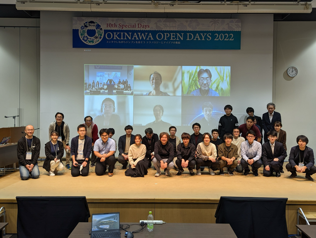

<!--
layout: blog
title: "Spotlight on Kubernetes Upstream Training in Japan"
slug: k8s-upstream-training-japan-spotlight
date: 2024-10-28
canonicalUrl: https://www.k8s.dev/blog/2024/10/28/k8s-upstream-training-japan-spotlight/
author: >
  [Junya Okabe](https://github.com/Okabe-Junya) (University of Tsukuba) / 
  Organizing team of Kubernetes Upstream Training in Japan
-->

<!--
We are organizers of [Kubernetes Upstream Training in Japan](https://github.com/kubernetes-sigs/contributor-playground/tree/master/japan).
Our team is composed of members who actively contribute to Kubernetes, including individuals who hold roles such as member, reviewer, approver, and chair.
-->
我们是[日本 Kubernetes 上游培训](https://github.com/kubernetes-sigs/contributor-playground/tree/master/japan)的组织者。
我们的团队由积极向 Kubernetes 做贡献的成员组成，他们在社区中担任了 Member、Reviewer、Approver 和 Chair 等角色。

<!--
Our goal is to increase the number of Kubernetes contributors and foster the growth of the community.
While Kubernetes community is friendly and collaborative, newcomers may find the first step of contributing to be a bit challenging.
Our training program aims to lower that barrier and create an environment where even beginners can participate smoothly.
-->
我们的目标是增加 Kubernetes 贡献者的数量，并促进社区的成长。
虽然 Kubernetes 社区友好协作，但新手可能会发现迈出贡献的第一步有些困难。
我们的培训项目旨在降低壁垒，创造一个即使是初学者也能顺利参与的环境。

<!--
## What is Kubernetes upstream training in Japan?

Our training started in 2019 and is held 1 to 2 times a year.
Initially, Kubernetes Upstream Training was conducted as a co-located event of KubeCon (Kubernetes Contributor Summit),
but we launched Kubernetes Upstream Training in Japan with the aim of increasing Japanese contributors by hosting a similar event in Japan.
-->
## 日本 Kubernetes 上游培训是什么？   {#what-is-kubernetes-upstream-training-in-japan}

我们的培训始于 2019 年，每年举办 1 到 2 次。
最初，Kubernetes 上游培训曾作为 KubeCon（Kubernetes 贡献者峰会）的同场地活动进行，
后来我们在日本推出了 Kubernetes 上游培训，目的是通过在日本举办类似活动来增加日本的贡献者。

<!--
Before the pandemic, the training was held in person, but since 2020, it has been conducted online.
The training offers the following content for those who have not yet contributed to Kubernetes:

* Introduction to Kubernetes community
* Overview of Kubernetes codebase and how to create your first PR
* Tips and encouragement to lower participation barriers, such as language
* How to set up the development environment
* Hands-on session using [kubernetes-sigs/contributor-playground](https://github.com/kubernetes-sigs/contributor-playground)
-->
在疫情之前，培训是面对面进行的，但自 2020 年以来，我们已转为在线上进行。
培训为尚未参与过 Kubernetes 贡献的学员提供以下内容：

* Kubernetes 社区简介
* Kubernetes 代码库概述以及如何创建你的第一个 PR
* 各种降低参与壁垒（如语言）的提示和鼓励
* 如何搭建开发环境
* 使用 [kubernetes-sigs/contributor-playground](https://github.com/kubernetes-sigs/contributor-playground)
  开展实践课程

<!--
At the beginning of the program, we explain why contributing to Kubernetes is important and who can contribute.
We emphasize that contributing to Kubernetes allows you to make a global impact and that Kubernetes community is looking forward to your contributions!

We also explain Kubernetes community, SIGs, and Working Groups.
Next, we explain the roles and responsibilities of Member, Reviewer, Approver, Tech Lead, and Chair.
Additionally, we introduce the communication tools we primarily use, such as Slack, GitHub, and mailing lists.
Some Japanese speakers may feel that communicating in English is a barrier.
Additionally, those who are new to the community need to understand where and how communication takes place.
We emphasize the importance of taking that first step, which is the most important aspect we focus on in our training!
-->
在培训开始时，我们讲解为什么贡献 Kubernetes 很重要以及谁可以做贡献。
我们强调，贡献 Kubernetes 可以让你产生全球影响，而 Kubernetes 社区期待着你的贡献！

我们还讲解 Kubernetes 社区、SIG（特别兴趣小组）和 WG（工作组）。
接下来，我们讲解 Member、Reviewer、Approver、Tech Lead 和 Chair 的角色与职责。
此外，我们介绍大家所使用的主要沟通工具，如 Slack、GitHub 和邮件列表。
一些讲日语的人可能会觉得用英语沟通是一个障碍。
此外，社区的新人需要理解在哪儿以及如何与人交流。
我们强调迈出第一步的重要性，这是我们培训中最关注的方面！

<!--
We then go over the structure of Kubernetes codebase, the main repositories, how to create a PR, and the CI/CD process using [Prow](https://docs.prow.k8s.io/).
We explain in detail the process from creating a PR to getting it merged.

After several lectures, participants get to experience hands-on work using [kubernetes-sigs/contributor-playground](https://github.com/kubernetes-sigs/contributor-playground), where they can create a simple PR.
The goal is for participants to get a feel for the process of contributing to Kubernetes.

At the end of the program, we also provide a detailed explanation of setting up the development environment for contributing to the `kubernetes/kubernetes` repository,
including building code locally, running tests efficiently, and setting up clusters.
-->
然后，我们讲解 Kubernetes 代码库的结构、主要的仓库、如何创建 PR 以及使用
[Prow](https://docs.prow.k8s.io/) 的 CI/CD 流程。
我们详细讲解从创建 PR 到合并 PR 的过程。

经过几节课后，参与者将体验使用
[kubernetes-sigs/contributor-playground](https://github.com/kubernetes-sigs/contributor-playground)
开展实践工作，在那里他们可以创建一个简单的 PR。
目标是让参与者体验贡献 Kubernetes 的过程。

在项目结束时，我们还提供关于为贡献 `kubernetes/kubernetes` 仓库搭建开发环境的详细说明，
包括如何在本地构建代码、如何高效运行测试以及如何搭建集群。

<!--
## Interview with participants

We conducted interviews with those who participated in our training program.
We asked them about their reasons for joining, their impressions, and their future goals.
-->
## 与参与者的访谈   {#interview-with-participants}

我们对参与我们培训项目的人进行了访谈。
我们询问了他们参加的原因、印象和未来目标。

<!--
### [Keita Mochizuki](https://github.com/mochizuki875) ([NTT DATA Group Corporation](https://www.nttdata.com/global/en/about-us/profile))

Keita Mochizuki is a contributor who consistently contributes to Kubernetes and related projects.
Keita is also a professional in container security and has recently published a book.
Additionally, he has made available a [Roadmap for New Contributors](https://github.com/mochizuki875/KubernetesFirstContributionRoadMap), which is highly beneficial for those new to contributing.

**Junya:** Why did you decide to participate in Kubernetes Upstream Training?
-->
### [Keita Mochizuki](https://github.com/mochizuki875)（[NTT DATA 集团公司](https://www.nttdata.com/global/en/about-us/profile)）

Keita Mochizuki 是一位持续为 Kubernetes 及相关项目做贡献的贡献者。
他还是容器安全领域的专业人士，他最近出版了一本书。此外，
他还发布了一份[新贡献者路线图](https://github.com/mochizuki875/KubernetesFirstContributionRoadMap)，
对新贡献者非常有帮助。

**Junya：** 你为什么决定参加 Kubernetes 上游培训？

<!--
**Keita:** Actually, I participated twice, in 2020 and 2022.
In 2020, I had just started learning about Kubernetes and wanted to try getting involved in activities outside of work, so I signed up after seeing the event on Twitter by chance.
However, I didn't have much knowledge at the time, and contributing to OSS felt like something beyond my reach.
As a result, my understanding after the training was shallow, and I left with more of a "hmm, okay" feeling.

In 2022, I participated again when I was at a stage where I was seriously considering starting contributions.
This time, I did prior research and was able to resolve my questions during the lectures, making it a very productive experience.
-->
**Keita：** 实际上，我分别在 2020 年和 2022 年参加过两次培训。
在 2020 年，我刚开始学习 Kubernetes，想尝试参与工作以外的活动，
所以在 Twitter 上偶然看到活动后报了名参加了活动。
然而，那时我的知识积累还不多，贡献 OSS 感觉超出了我的能力。
因此，在培训后的理解比较肤浅，离开时更多是“嗯，好吧”的感觉。

在 2022 年，我再次参加，那时我认真考虑开始贡献。
我事先进行了研究，并能够在讲座中解决我的问题，那次经历非常有成效。

<!--
**Junya:** How did you feel after participating?

**Keita:** I felt that the significance of this training greatly depends on the participant's mindset.
The training itself consists of general explanations and simple hands-on exercises, but it doesn't mean that attending the training will immediately lead to contributions.

**Junya:** What is your purpose for contributing?

**Keita:** My initial motivation was to "gain a deep understanding of Kubernetes and build a track record," meaning "contributing itself was the goal."
Nowadays, I also contribute to address bugs or constraints I discover during my work.
Additionally, through contributing, I've become less hesitant to analyze undocumented features directly from the source code.
-->
**Junya：** 参加后你有什么感受？

**Keita：** 我觉得培训的意义很大程度上取决于参与者的心态。
培训本身包括常规的讲解和简单的实践练习，但这并不意味着参加培训就会立即会去做贡献。

**Junya：** 你贡献的目的是什么？

**Keita：** 我最初的动机是“深入理解 Kubernetes 并生成成绩记录”，也就是说“贡献本身就是目标”。
如今，我还会通过贡献来解决我在工作中发现的 Bug 或约束。
此外，通过贡献，我变得不再那么犹豫，会去直接基于源代码分析了解没有文档记录的特性。

<!--
**Junya:** What has been challenging about contributing?

**Keita:** The most difficult part was taking the first step. Contributing to OSS requires a certain level of knowledge, and leveraging resources like this training and support from others was essential.
One phrase that stuck with me was, "Once you take the first step, it becomes easier to move forward."
Also, in terms of continuing contributions as part of my job, the most challenging aspect is presenting the outcomes as achievements.
To keep contributing over time, it's important to align it with business goals and strategies, but upstream contributions don't always lead to immediate results that can be directly tied to performance.
Therefore, it's crucial to ensure mutual understanding with managers and gain their support.
-->
**Junya：** 贡献中遇到的挑战是什么？

**Keita：** 最困难的部分是迈出第一步。贡献 OSS 需要一定的知识水平，利用像这样的培训和他人的支持至关重要。
一句让我印象深刻的话是，“一旦你迈出第一步，后续就会变得更容易。”  
此外，在作为工作的一部分继续贡献时，最具挑战性的是将输出的结果变为成就感。
要保持长期贡献，将贡献与业务目标和策略对齐非常重要，但上游贡献并不总是能直接产生与表现相关的即时结果。
因此，确保与管理人员的相互理解并获得他们的支持至关重要。

<!--
**Junya:** What are your future goals?

**Keita:** My goal is to contribute to areas with a larger impact.
So far, I've mainly contributed by fixing smaller bugs as my primary focus was building a track record,
but moving forward, I'd like to challenge myself with contributions that have a greater impact on Kubernetes users or that address issues related to my work.
Recently, I've also been working on reflecting the changes I've made to the codebase into the official documentation,
and I see this as a step toward achieving my goals.

**Junya:** Thank you very much!
-->
**Junya：** 你未来的目标是什么？

**Keita：** 我的目标是对影响更大的领域做出贡献。
到目前为止，我主要通过修复较小的 Bug 来做贡献，因为我的主要关注是生成一份成绩单，
但未来，我希望挑战自己对 Kubernetes 用户产生更大影响的贡献，或解决与我工作相关的问题。
最近，我还在努力将我对代码库所做的更改反映到官方文档中，
我将这视为实现我目标的一步。

**Junya：** 非常感谢！

<!--
### [Yoshiki Fujikane](https://github.com/ffjlabo) ([CyberAgent, Inc.](https://www.cyberagent.co.jp/en/))

Yoshiki Fujikane is one of the maintainers of [PipeCD](https://pipecd.dev/), a CNCF Sandbox project.
In addition to developing new features for Kubernetes support in PipeCD,
Yoshiki actively participates in community management and speaks at various technical conferences.
-->
### [Yoshiki Fujikane](https://github.com/ffjlabo)（[CyberAgent, Inc.](https://www.cyberagent.co.jp/en/)）

Yoshiki Fujikane 是 CNCF 沙盒项目 [PipeCD](https://pipecd.dev/) 的维护者之一。
除了在 PipeCD 中开发对 Kubernetes 支持的新特性外，
Yoshiki 还积极参与社区管理，并在各种技术会议上发言。

<!--
**Junya:** Why did you decide to participate in the Kubernetes Upstream Training?

**Yoshiki:** At the time I participated, I was still a student.
I had only briefly worked with EKS, but I thought Kubernetes seemed complex yet cool, and I was casually interested in it.
Back then, OSS felt like something out of reach, and upstream development for Kubernetes seemed incredibly daunting.
While I had always been interested in OSS, I didn't know where to start.
It was during this time that I learned about the Kubernetes Upstream Training and decided to take the challenge of contributing to Kubernetes.
-->
**Junya：** 你为什么决定参加 Kubernetes 上游培训？

**Yoshiki：** 当我参与培训时，我还是一名学生。
我只简短地接触过 EKS，我觉得 Kubernetes 看起来复杂但很酷，我对此有一种随意的兴趣。
当时，OSS 对我来说感觉像是遥不可及，而 Kubernetes 的上游开发似乎非常令人生畏。
虽然我一直对 OSS 感兴趣，但我不知道从哪里开始。
也就在那个时候，我了解到 Kubernetes 上游培训，并决定挑战自己为 Kubernetes 做贡献。

<!--
**Junya:** What were your impressions after participating?

**Yoshiki:** I found it extremely valuable as a way to understand what it's like to be part of an OSS community.
At the time, my English skills weren't very strong, so accessing primary sources of information felt like a big hurdle for me.
Kubernetes is a very large project, and I didn't have a clear understanding of the overall structure, let alone what was necessary for contributing.
The upstream training provided a Japanese explanation of the community structure and allowed me to gain hands-on experience with actual contributions.
Thanks to the guidance I received, I was able to learn how to approach primary sources and use them as entry points for further investigation, which was incredibly helpful.
This experience made me realize the importance of organizing and reviewing primary sources, and now I often dive into GitHub issues and documentation when something piques my interest.
As a result, while I am no longer contributing to Kubernetes itself, the experience has been a great foundation for contributing to other projects.
-->
**Junya：** 参加后你的印象是什么？

**Yoshiki：** 我发现对于了解如何成为 OSS 社区的一部分，这种培训是一种非常有价值的方式。
当时，我的英语水平不是很好，所以获取主要信息源对我来说是一个很大的障碍。
Kubernetes 是一个非常大的项目，我对整体结构没有清晰的理解，更不用说贡献所需的内容了。
上游培训提供了对社区结构的日文解释，并让我获得了实际贡献的实践经验。
得益于我所得到的指导，我学会了如何接触主要信息源，并将其作为进一步研究的切入点，这对我帮助很大。
这次经历让我意识到组织和评审主要信息源的重要性，现在我经常在 GitHub Issue 和文档中深入研究我感兴趣的内容。
因此，虽然我不再直接向 Kubernetes 做贡献，但这次经历为我在其他项目中做贡献奠定了很好的基础。

<!--
**Junya:** What areas are you currently contributing to, and what are the other projects you're involved in?

**Yoshiki:** Right now, I'm no longer working with Kubernetes, but instead, I'm a maintainer of PipeCD, a CNCF Sandbox project.
PipeCD is a CD tool that supports GitOps-style deployments for various application platforms.
The tool originally started as an internal project at CyberAgent.
With different teams adopting different platforms, PipeCD was developed to provide a unified CD platform with a consistent user experience.
Currently, it supports Kubernetes, AWS ECS, Lambda, Cloud Run, and Terraform.
-->
**Junya：** 你目前在哪些领域做贡献？你参与了哪些其他项目？

**Yoshiki：** 目前，我不再从事 Kubernetes 的工作，而是担任 CNCF 沙盒项目 PipeCD 的维护者。
PipeCD 是一个支持各种应用平台的 GitOps 式部署的 CD 工具。
此工具最初作为 CyberAgent 的内部项目启动。
随着不同团队采用不同的平台，PipeCD 设计为提供一个统一的 CD 平台，确保用户体验一致。
目前，它支持 Kubernetes、AWS ECS、Lambda、Cloud Run 和 Terraform。

<!--
**Junya:** What role do you play within the PipeCD team?

**Yoshiki:** I work full-time on improving and developing Kubernetes-related features within the team.
Since we provide PipeCD as a SaaS internally, my main focus is on adding new features and improving existing ones as part of that support.
In addition to code contributions, I also contribute by giving talks at various events and managing community meetings to help grow the PipeCD community.
-->
**Junya：** 你在 PipeCD 团队中扮演什么角色？

**Yoshiki：** 我全职负责团队中与 Kubernetes 相关特性的改进和开发。
由于我们将 PipeCD 作为内部 SaaS 提供，我的主要关注点是添加新特性和改进现有特性，
确保 PipeCD 能够持续良好支持 Kubernetes 等平台。
除了代码贡献外，我还通过在各种活动上发言和管理社区会议来帮助发展 PipeCD 社区。

<!--
**Junya:** Could you explain what kind of improvements or developments you are working on with regards to Kubernetes?

**Yoshiki:** PipeCD supports GitOps and Progressive Delivery for Kubernetes, so I'm involved in the development of those features.
Recently, I've been working on features that streamline deployments across multiple clusters.
-->
**Junya：** 你能讲解一下你对于 Kubernetes 正在进行哪些改进或开发吗？

**Yoshiki：** PipeCD 支持 Kubernetes 的 GitOps 和渐进式交付，因此我参与这些特性的开发。
最近，我一直在开发简化跨多个集群部署的特性。

<!--
**Junya:** Have you encountered any challenges while contributing to OSS?

**Yoshiki:** One challenge is developing features that maintain generality while meeting user use cases.
When we receive feature requests while operating the internal SaaS, we first consider adding features to solve those issues.
At the same time, we want PipeCD to be used by a broader audience as an OSS tool.
So, I always think about whether a feature designed for one use case could be applied to another, ensuring the software remains flexible and widely usable.
-->
**Junya：** 在贡献 OSS 的过程中，你遇到过哪些挑战？

**Yoshiki：** 一个挑战是开发在满足用户用例的同时保持通用性的特性。
当我们在运营内部 SaaS 期间收到特性请求时，我们首先考虑添加特性来解决这些问题。
与此同时，我们希望 PipeCD 作为一个 OSS 工具被更广泛的受众使用。
因此，我总是思考为一个用例设计的特性是否可以应用于其他用例，以确保 PipeCD 这个软件保持灵活且广泛可用。

<!--
**Junya:** What are your goals moving forward?

**Yoshiki:** I want to focus on expanding PipeCD's functionality.
Currently, we are developing PipeCD under the slogan "One CD for All."
As I mentioned earlier, it supports Kubernetes, AWS ECS, Lambda, Cloud Run, and Terraform, but there are many other platforms out there, and new platforms may emerge in the future.
For this reason, we are currently developing a plugin system that will allow users to extend PipeCD on their own, and I want to push this effort forward.
I'm also working on features for multi-cluster deployments in Kubernetes, and I aim to continue making impactful contributions.

**Junya:** Thank you very much!
-->
**Junya：** 你未来的目标是什么？

**Yoshiki：** 我希望专注于扩展 PipeCD 的功能。
目前，我们正在以“普遍可用的持续交付”（One CD for All）的口号开发 PipeCD。
正如我之前提到的，它支持 Kubernetes、AWS ECS、Lambda、Cloud Run 和 Terraform，
但还有许多其他平台，以及未来可能会出现的新平台。
因此，我们目前正在开发一个插件系统，允许用户自行扩展 PipeCD，我希望将这一努力向前推进。
我也在处理 Kubernetes 的多集群部署特性，目标是继续做出有影响力的贡献。

**Junya：** 非常感谢！

<!--
## Future of Kubernetes upstream training

We plan to continue hosting Kubernetes Upstream Training in Japan and look forward to welcoming many new contributors.
Our next session is scheduled to take place at the end of November during [CloudNative Days Winter 2024](https://event.cloudnativedays.jp/cndw2024).
-->
## Kubernetes 上游培训的未来   {#future-of-kubernetes-upstream-training}

我们计划继续在日本举办 Kubernetes 上游培训，并期待欢迎更多的新贡献者。
我们的下一次培训定于 11 月底在
[CloudNative Days Winter 2024](https://event.cloudnativedays.jp/cndw2024) 期间举行。

<!--
Moreover, our goal is to expand these training programs not only in Japan but also around the world.
[Kubernetes celebrated its 10th anniversary](https://kubernetes.io/blog/2024/06/06/10-years-of-kubernetes/) this year, and for the community to become even more active, it's crucial for people across the globe to continue contributing.
While Upstream Training is already held in several regions, we aim to bring it to even more places.

We hope that as more people join Kubernetes community and contribute, our community will become even more vibrant!
-->
此外，我们的目标不仅是在日本推广这些培训项目，还希望推广到全球。
今年的 [Kubernetes 十周年庆](/zh-cn/blog/2024/06/06/10-years-of-kubernetes/)，
以及为了使社区更加活跃，让全球各地的人们持续贡献至关重要。
虽然上游培训已经在多个地区举行，但我们希望将其带到更多地方。

我们希望随着越来越多的人加入 Kubernetes 社区并做出贡献，我们的社区将变得更加生机勃勃！
