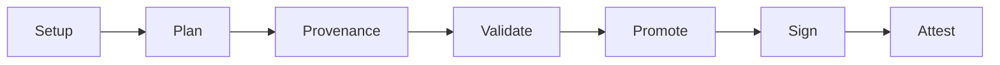

<!--
layout: blog
title: "The Invisible Rewrite: Modernizing the Kubernetes Image Promoter"
date: 2026-03-17
slug: image-promoter-rewrite
author: >
  Sascha Grunert (Red Hat)
-->

<!--
Every container image you pull from `registry.k8s.io` got there through
[`kpromo`](https://github.com/kubernetes-sigs/promo-tools), the Kubernetes image
promoter. It copies images from staging registries to
production, signs them with [cosign](https://sigstore.dev), replicates
signatures across more than 20 regional mirrors, and generates
[SLSA](https://slsa.dev) provenance attestations. If this tool breaks, no
Kubernetes release ships. Over the past few weeks, we rewrote its core from
scratch, deleted 20% of the codebase, made it dramatically faster, and
nobody noticed. That was the whole point.
-->
你从 `registry.k8s.io` 拉取的每个容器镜像都是通过
[`kpromo`](https://github.com/kubernetes-sigs/promo-tools)（Kubernetes 镜像推广工具）完成的。
它将镜像从临时仓库复制到生产环境，使用 [cosign](https://sigstore.dev) 进行签名，
在 20 多个区域镜像间复制签名，并生成 [SLSA](https://slsa.dev) 来源证明。
如果这个工具出问题，Kubernetes 就无法发布。在过去几周里，我们从零开始重写了它的核心，
删除了 20% 的代码库，使其速度大幅提升，而没有人注意到。这正是我们的目的。

<!--
## A bit of history
-->
## 一点历史

<!--
The image promoter started in late 2018 as an internal Google project by
[Linus Arver](https://github.com/listx). The goal was simple: replace the
manual, Googler-gated process of copying container images into `k8s.gcr.io` with
a community-owned, GitOps-based workflow. Push to a staging registry, open a PR
with a YAML manifest, get it reviewed and merged, and automation handles the
rest. [KEP-1734](https://github.com/kubernetes/enhancements/blob/master/keps/sig-release/1734-k8s-image-promoter/README.md)
formalized this proposal.
-->
镜像推广工具始于 2018 年末，是由 [Linus Arver](https://github.com/listx) 发起的 Google 内部项目。
目标很简单：用社区拥有的、基于 GitOps 的工作流程取代手动的、由 Google 员工控制的容器镜像复制到 `k8s.gcr.io` 的过程。
推送到临时仓库，打开一个包含 YAML 清单的 PR，获得审查和合并，自动化处理其余部分。
[KEP-1734](https://github.com/kubernetes/enhancements/blob/master/keps/sig-release/1734-k8s-image-promoter/README.md) 将此提议正式化。

<!--
In early 2019, the code moved to `kubernetes-sigs/k8s-container-image-promoter`
and grew quickly. Over the next few years,
[Stephen Augustus](https://github.com/justaugustus) consolidated multiple tools
(`cip`, `gh2gcs`, `krel promote-images`, `promobot-files`) into a single CLI
called `kpromo`. The repository was renamed to
[`promo-tools`](https://github.com/kubernetes-sigs/promo-tools).
[Adolfo Garcia Veytia (Puerco)](https://github.com/puerco) added cosign signing
and SBOM support. [Tyler Ferrara](https://github.com/tylerferrara) built
vulnerability scanning. [Carlos Panato](https://github.com/cpanato) kept the project in a healthy and
releasable state. 42 contributors made about 3,500 commits across more than 60 releases.
-->
2019 年初，代码迁移到 `kubernetes-sigs/k8s-container-image-promoter` 并快速发展。
在接下来的几年里，[Stephen Augustus](https://github.com/justaugustus) 将多个工具
（`cip`、`gh2gcs`、`krel promote-images`、`promobot-files`）整合到一个名为 `kpromo` 的 CLI 中。
仓库更名为 [`promo-tools`](https://github.com/kubernetes-sigs/promo-tools)。
[Adolfo Garcia Veytia (Puerco)](https://github.com/puerco) 添加了 cosign 签名和 SBOM 支持。
[Tyler Ferrara](https://github.com/tylerferrara) 构建了漏洞扫描功能。
[Carlos Panato](https://github.com/cpanato) 保持项目健康且可发布的状态。
42 位贡献者在 60 多个版本中做出了约 3,500 次提交。

<!--
It worked. But by 2025 the codebase carried the weight of seven years of
incremental additions from multiple SIGs and subprojects. The README
[said it plainly](https://github.com/kubernetes-sigs/promo-tools/blob/7b6d515b78aadd617c8060a223786f8e57aa061f/README.md#disclaimer):
you will see duplicated code, multiple techniques for accomplishing the same
thing, and several TODOs.
-->
它运行得很好。但到 2025 年，代码库承载了来自多个 SIG 和子项目七年增量添加的负担。
README [直白地说](https://github.com/kubernetes-sigs/promo-tools/blob/7b6d515b78aadd617c8060a223786f8e57aa061f/README.md#disclaimer)：
你会看到重复的代码、多种完成相同任务的技术以及多个 TODO。

<!--
## The problems we needed to solve
-->
## 我们需要解决的问题

<!--
Production promotion jobs for Kubernetes core images regularly took over 30
minutes and frequently failed with rate limit errors. The core promotion logic
had grown into a monolith that was
[hard to extend](https://github.com/kubernetes-sigs/promo-tools/issues/1177)
and difficult to test, making new features like provenance or vulnerability
scanning painful to add.
-->
Kubernetes 核心镜像的生产推广任务通常需要 30 分钟以上，并且经常因速率限制错误而失败。
核心推广逻辑已经变成一个难以扩展的单体，
[难以扩展](https://github.com/kubernetes-sigs/promo-tools/issues/1177)且难以测试，
使得添加来源证明或漏洞扫描等新功能变得非常困难。

<!--
On the [SIG Release roadmap](https://github.com/kubernetes/sig-release/blob/master/roadmap.md),
two work items had been sitting for a while: "Rewrite artifact promoter" and
"Make artifact validation more robust". We had discussed these at SIG Release
meetings and KubeCons, and the open research spikes on
[project board #171](https://github.com/orgs/kubernetes/projects/171) captured
eight questions that needed answers before we could move forward.
-->
在 [SIG Release 路线图](https://github.com/kubernetes/sig-release/blob/master/roadmap.md)上，
有两个工作项已经搁置了一段时间："重写制品推广工具"和"使制品验证更健壮"。
我们在 SIG Release 会议和 KubeCon 上讨论过这些问题，
[项目看板 #171](https://github.com/orgs/kubernetes/projects/171)
上的开放研究问题记录了八个需要回答的问题，然后才能继续。

<!--
## One issue to answer them all
-->
## 一个问题解决所有疑问

<!--
In February 2026, we opened [issue #1701](https://github.com/kubernetes-sigs/promo-tools/issues/1701)
("Rewrite artifact promoter pipeline") and answered all eight spikes in a single
tracking issue. The rewrite was deliberately phased so that each step could be
reviewed, merged, and validated independently. Here is what we did:
-->
2026 年 2 月，我们打开了 [Issue #1701](https://github.com/kubernetes-sigs/promo-tools/issues/1701)
（"重写制品推广流水线"），并在一个跟踪 Issue 中回答了所有八个研究问题。
重写是分阶段进行的，以便每个步骤都可以独立审查、合并和验证。以下是我们所做的：

<!--
**Phase 1: Rate Limiting** ([#1702](https://github.com/kubernetes-sigs/promo-tools/pull/1702)).
Rewrote rate limiting to properly throttle all registry operations with adaptive
backoff.
-->
**Phase 1: 速率限制** ([#1702](https://github.com/kubernetes-sigs/promo-tools/pull/1702))。
重写了速率限制，使用自适应退避正确限制所有仓库操作。

<!--
**Phase 2: Interfaces** ([#1704](https://github.com/kubernetes-sigs/promo-tools/pull/1704)).
Put registry and auth operations behind clean interfaces so they can be swapped
out and tested independently.
-->
**Phase 2: 接口** ([#1704](https://github.com/kubernetes-sigs/promo-tools/pull/1704))。
将仓库和认证操作放在清晰的接口后面，以便可以独立替换和测试。

<!--
**Phase 3: Pipeline Engine** ([#1705](https://github.com/kubernetes-sigs/promo-tools/pull/1705)).
Built a pipeline engine that runs promotion as a sequence of distinct phases
instead of one large function.
-->
**Phase 3: 流水线引擎** ([#1705](https://github.com/kubernetes-sigs/promo-tools/pull/1705))。
构建了一个流水线引擎，将推广作为一系列不同阶段运行，而不是一个大函数。

<!--
**Phase 4: Provenance** ([#1706](https://github.com/kubernetes-sigs/promo-tools/pull/1706)).
Added SLSA provenance verification for staging images.
-->
**Phase 4: 来源证明** ([#1706](https://github.com/kubernetes-sigs/promo-tools/pull/1706))。
为临时镜像添加了 SLSA 来源验证。

<!--
**Phase 5: Scanner and SBOMs** ([#1709](https://github.com/kubernetes-sigs/promo-tools/pull/1709)).
Added vulnerability scanning and SBOM support. Flipped the default to the new
pipeline engine. At this point we cut
[v4.2.0](https://github.com/kubernetes-sigs/promo-tools/releases/tag/v4.2.0) and let it
soak in production before continuing.
-->
**Phase 5: 扫描器和 SBOM** ([#1709](https://github.com/kubernetes-sigs/promo-tools/pull/1709))。
添加了漏洞扫描和 SBOM 支持。将默认值切换到新的流水线引擎。此时我们发布了
[v4.2.0](https://github.com/kubernetes-sigs/promo-tools/releases/tag/v4.2.0)，让它在生产环境中试运行后再继续。

<!--
**Phase 6: Split Signing from Replication** ([#1713](https://github.com/kubernetes-sigs/promo-tools/pull/1713)).
Separated image signing from signature replication into their own pipeline
phases, eliminating the rate limit contention that caused most production
failures.
-->
**Phase 6: 分离签名和复制** ([#1713](https://github.com/kubernetes-sigs/promo-tools/pull/1713))。
将镜像签名与签名复制分离到各自的流水线阶段，消除了导致大多数生产失败的速率限制争用。

<!--
**Phase 7: Remove Legacy Pipeline** ([#1712](https://github.com/kubernetes-sigs/promo-tools/pull/1712)).
Deleted the old code path entirely.
-->
**Phase 7: 移除旧流水线** ([#1712](https://github.com/kubernetes-sigs/promo-tools/pull/1712))。
完全删除了旧的代码路径。

<!--
**Phase 8: Remove Legacy Dependencies** ([#1716](https://github.com/kubernetes-sigs/promo-tools/pull/1716)).
Deleted the audit subsystem, deprecated tools, and e2e test infrastructure.
-->
**Phase 8: 移除旧依赖** ([#1716](https://github.com/kubernetes-sigs/promo-tools/pull/1716))。
删除了审计子系统、已弃用的工具和端到端测试基础设施。

<!--
**Phase 9: Delete the Monolith** ([#1718](https://github.com/kubernetes-sigs/promo-tools/pull/1718)).
Removed the old monolithic core and its supporting packages. Thousands of lines
deleted across phases 7 through 9.
-->
**Phase 9: 删除单体** ([#1718](https://github.com/kubernetes-sigs/promo-tools/pull/1718))。
移除了旧的单体核心及其支持包。在第 7 到第 9 阶段删除了数千行代码。

<!--
Each phase shipped independently.
[v4.3.0](https://github.com/kubernetes-sigs/promo-tools/releases/tag/v4.3.0) followed
the next day with the legacy code fully removed.
-->
每个阶段独立发布。第二天发布了
[v4.3.0](https://github.com/kubernetes-sigs/promo-tools/releases/tag/v4.3.0)，完全移除了旧代码。

<!--
With the new architecture in place, a series of follow-up improvements landed:
parallelized registry reads
([#1736](https://github.com/kubernetes-sigs/promo-tools/pull/1736)),
retry logic for all network operations
([#1742](https://github.com/kubernetes-sigs/promo-tools/pull/1742)),
per-request timeouts to prevent pipeline hangs
([#1763](https://github.com/kubernetes-sigs/promo-tools/pull/1763)),
HTTP connection reuse
([#1759](https://github.com/kubernetes-sigs/promo-tools/pull/1759)),
local registry integration tests
([#1746](https://github.com/kubernetes-sigs/promo-tools/pull/1746)),
the removal of deprecated credential file support
([#1758](https://github.com/kubernetes-sigs/promo-tools/pull/1758)),
a rework of attestation handling to use cosign's OCI APIs and the removal of
deprecated SBOM support
([#1764](https://github.com/kubernetes-sigs/promo-tools/pull/1764)),
and a dedicated promotion record predicate type registered with the
[in-toto attestation framework](https://github.com/in-toto/attestation)
([#1767](https://github.com/kubernetes-sigs/promo-tools/pull/1767)).
These would have been much harder to land without the clean separation the
rewrite provided.
[v4.4.0](https://github.com/kubernetes-sigs/promo-tools/releases/tag/v4.4.0)
shipped all of these improvements and enabled provenance generation and
verification by default.
-->
新架构就位后，一系列后续改进得以实现：并行化仓库读取
([#1736](https://github.com/kubernetes-sigs/promo-tools/pull/1736))、
所有网络操作的重试逻辑
([#1742](https://github.com/kubernetes-sigs/promo-tools/pull/1742))、
防止流水线挂起的每请求超时
([#1763](https://github.com/kubernetes-sigs/promo-tools/pull/1763))、
HTTP 连接复用
([#1759](https://github.com/kubernetes-sigs/promo-tools/pull/1759))、
本地仓库集成测试
([#1746](https://github.com/kubernetes-sigs/promo-tools/pull/1746))、
移除已弃用的凭证文件支持
([#1758](https://github.com/kubernetes-sigs/promo-tools/pull/1758))、
重新设计证明处理以使用 cosign 的 OCI API 并移除已弃用的 SBOM 支持
([#1764](https://github.com/kubernetes-sigs/promo-tools/pull/1764))，
以及在 [in-toto 证明框架](https://github.com/in-toto/attestation) 中注册的专用推广记录谓词类型
([#1767](https://github.com/kubernetes-sigs/promo-tools/pull/1767))。
如果没有重写提供的清晰分离，这些改进会难上加难。
[v4.4.0](https://github.com/kubernetes-sigs/promo-tools/releases/tag/v4.4.0)
发布了所有这些改进，并默认启用了来源证明生成和验证。

<!--
## The new pipeline
-->
## 新的流水线

<!--
The promotion pipeline now has seven clearly separated phases:
-->
推广流水线现在有七个清晰分离的阶段：

<!--
| Phase | What it does |
|-------|-------------|
| **Setup** | Validate options, prewarm TUF cache. |
| **Plan** | Parse manifests, read registries, compute which images need promotion. |
| **Provenance** | Verify SLSA attestations on staging images. |
| **Validate** | Check cosign signatures, exit here for dry runs. |
| **Promote** | Copy images server-side, preserving digests. |
| **Sign** | Sign promoted images with keyless cosign. |
| **Attest** | Generate promotion provenance attestations using a dedicated [in-toto](https://in-toto.io) predicate type. |
-->
| 阶段 | 功能 |
|-------|-------------|
| **Setup** | 验证选项，预热 TUF 缓存。 |
| **Plan** | 解析清单，读取仓库，计算需要推广的镜像。 |
| **Provenance** | 验证临时镜像上的 SLSA 证明。 |
| **Validate** | 检查 cosign 签名，模拟运行在此退出。 |
| **Promote** | 服务端复制镜像，保留摘要。 |
| **Sign** | 使用无密钥 cosign 签名推广的镜像。 |
| **Attest** | 使用专用的 [in-toto](https://in-toto.io) 谓词类型生成推广来源证明。 |

<!--
Phases run sequentially, so each one gets exclusive access to the full rate
limit budget. No more contention. Signature replication to mirror registries is
no longer part of this pipeline and runs as a
[dedicated periodic Prow job](https://prow.k8s.io/?job=ci-k8sio-image-signature-replication)
instead.
-->
阶段按顺序运行，因此每个阶段都获得对完整速率限制预算的独占访问权。不再有争用。
镜像仓库的签名复制不再是此流水线的一部分，而是作为一个
[专门的定期 Prow job](https://prow.k8s.io/?job=ci-k8sio-image-signature-replication) 运行。

<!--
## Making it fast
-->
## 使其更快

<!--
With the architecture in place, we turned to performance.
-->
架构就位后，我们转向性能优化。

<!--
**Parallel registry reads** ([#1736](https://github.com/kubernetes-sigs/promo-tools/pull/1736)):
The plan phase reads 1,350 registries. We parallelized this and the plan phase
dropped from about 20 minutes to about 2 minutes.
-->
**并行仓库读取** ([#1736](https://github.com/kubernetes-sigs/promo-tools/pull/1736))：
计划阶段读取 1,350 个仓库。我们将其并行化，计划阶段从大约 20 分钟降至约 2 分钟。

<!--
**Two-phase tag listing** ([#1761](https://github.com/kubernetes-sigs/promo-tools/pull/1761)):
Instead of checking all 46,000 image groups across more than 20 mirrors, we first check
only the source repositories. About 57% of images have no signatures at all
because they were promoted before signing was enabled. We skip those entirely,
cutting API calls roughly in half.
-->
**两阶段标签列出** ([#1761](https://github.com/kubernetes-sigs/promo-tools/pull/1761))：
不是检查 20 多个镜像上的所有 46,000 个镜像组，我们首先只检查源仓库。
大约 57% 的镜像根本没有签名，因为它们是在签名启用之前推广的。
我们完全跳过这些，将 API 调用减少大约一半。

<!--
**Source check before replication** ([#1727](https://github.com/kubernetes-sigs/promo-tools/pull/1727)):
Before iterating all mirrors for a given image, we check if the signature
exists on the primary registry first. In steady state where most signatures are
already replicated, this reduced the work from about 17 hours to about 15
minutes.
-->
**复制前的源检查** ([#1727](https://github.com/kubernetes-sigs/promo-tools/pull/1727))：
在遍历给定镜像的所有镜像仓库之前，我们首先检查签名是否存在于主仓库上。
在大多数签名已经复制的稳定状态下，这将工作从大约 17 小时减少到约 15 分钟。

<!--
**Per-request timeouts** ([#1763](https://github.com/kubernetes-sigs/promo-tools/pull/1763)):
We observed intermittent hangs where a stalled connection blocked the pipeline
for over 9 hours. Every network operation now has its own timeout and transient
failures are retried automatically.
-->
**每请求超时** ([#1763](https://github.com/kubernetes-sigs/promo-tools/pull/1763))：
我们观察到间歇性挂起，停滞的连接阻塞流水线超过 9 小时。
现在每个网络操作都有自己的超时，临时失败会自动重试。

<!--
**Connection reuse** ([#1759](https://github.com/kubernetes-sigs/promo-tools/pull/1759)):
We started reusing HTTP connections and auth state across operations, eliminating
redundant token negotiations. This closed a
[long-standing request](https://github.com/kubernetes-sigs/promo-tools/issues/842)
from 2023.
-->
**连接复用** ([#1759](https://github.com/kubernetes-sigs/promo-tools/pull/1759))：
我们开始在操作间复用 HTTP 连接和认证状态，消除了冗余的令牌协商。
这解决了一个[长期存在的请求](https://github.com/kubernetes-sigs/promo-tools/issues/842)（始于 2023 年）。

<!--
## By the numbers
-->
## 数字说明

<!--
Here is what the rewrite looks like in aggregate.

- Over 40 PRs merged, 3 releases shipped ([v4.2.0](https://github.com/kubernetes-sigs/promo-tools/releases/tag/v4.2.0), [v4.3.0](https://github.com/kubernetes-sigs/promo-tools/releases/tag/v4.3.0), [v4.4.0](https://github.com/kubernetes-sigs/promo-tools/releases/tag/v4.4.0))
- Over 10,000 lines added and over 16,000 lines deleted, a net reduction
  of about 5,000 lines (20% smaller codebase)
- Performance drastically improved across the board
- Robustness improved with retry logic, per-request timeouts, and adaptive rate limiting
- 19 long-standing issues closed
-->
以下是重写的总体情况。

- 合并了 40 多个 PR，发布了 3 个版本
  （[v4.2.0](https://github.com/kubernetes-sigs/promo-tools/releases/tag/v4.2.0)、
  [v4.3.0](https://github.com/kubernetes-sigs/promo-tools/releases/tag/v4.3.0)、
  [v4.4.0](https://github.com/kubernetes-sigs/promo-tools/releases/tag/v4.4.0)）
- 添加了超过 10,000 行代码，删除了超过 16,000 行代码，净减少约 5,000 行（代码库缩小 20%）
- 性能全面大幅提升
- 通过重试逻辑、每请求超时和自适应速率限制提高了健壮性
- 关闭了 19 个长期存在的问题

<!--
The codebase shrank by a fifth while gaining provenance attestations, a pipeline
engine, vulnerability scanning integration, parallelized operations, retry
logic, integration tests against local registries, and a standalone signature
replication mode.
-->
代码库缩小了五分之一，同时获得了来源证明、流水线引擎、漏洞扫描集成、并行化操作、重试逻辑、针对本地仓库的集成测试以及独立的签名复制模式。

<!--
## No user-facing changes
-->
## 非用户可见的变更

<!--
This was a hard requirement. The `kpromo cip` command accepts the same flags and
reads the same YAML manifests. The
[`post-k8sio-image-promo`](https://prow.k8s.io/?job=post-k8sio-image-promo)
Prow job continued working throughout. The promotion manifests in
[kubernetes/k8s.io](https://github.com/kubernetes/k8s.io) did not change. Nobody
had to update their workflows or configuration.
-->
这是一个硬性要求。`kpromo cip` 命令接受相同的标志并读取相同的 YAML 清单。
[`post-k8sio-image-promo`](https://prow.k8s.io/?job=post-k8sio-image-promo)
Prow 作业在整个过程中继续工作。
[kubernetes/k8s.io](https://github.com/kubernetes/k8s.io) 中的推广清单没有变化。
没有人需要更新他们的工作流程或配置。

<!--
We caught two regressions early in production. One ([#1731](https://github.com/kubernetes-sigs/promo-tools/pull/1731))
caused a registry key mismatch that made every image appear as "lost" so that
nothing was promoted. Another ([#1733](https://github.com/kubernetes-sigs/promo-tools/pull/1733))
set the default thread count to zero, blocking all goroutines. Both were fixed
within hours. The phased release strategy ([v4.2.0](https://github.com/kubernetes-sigs/promo-tools/releases/tag/v4.2.0) with the new engine, [v4.3.0](https://github.com/kubernetes-sigs/promo-tools/releases/tag/v4.3.0)
with legacy code removed) gave us a clear rollback path that we fortunately
never needed.
-->
我们在生产环境早期发现了两个回归问题。一个 ([#1731](https://github.com/kubernetes-sigs/promo-tools/pull/1731))
导致仓库密钥不匹配，使每个镜像都显示为"丢失"，因此没有任何镜像被推广。
另一个 ([#1733](https://github.com/kubernetes-sigs/promo-tools/pull/1733))
将默认线程数设置为零，阻塞了所有 goroutine。两者都在几小时内修复。
分阶段发布策略（[v4.2.0](https://github.com/kubernetes-sigs/promo-tools/releases/tag/v4.2.0) 包含新引擎，
[v4.3.0](https://github.com/kubernetes-sigs/promo-tools/releases/tag/v4.3.0) 移除旧代码）
为我们提供了一条清晰的回滚路径，幸运的是我们从未需要使用它。

<!--
## What comes next
-->
## 下一步

<!--
Signature replication across all mirror registries remains the most expensive
part of the promotion cycle. [Issue #1762](https://github.com/kubernetes-sigs/promo-tools/issues/1762)
proposes eliminating it entirely by having
[archeio](https://github.com/kubernetes/registry.k8s.io) (the `registry.k8s.io`
redirect service) route signature tag requests to a single canonical upstream
instead of per-region backends. Another option would be to move signing closer
to the registry infrastructure itself. Both approaches need further discussion
with the SIG Release and infrastructure teams, but either one would remove
thousands of API calls per promotion cycle and simplify the codebase even
further.
-->
跨所有镜像仓库的签名复制仍然是推广周期中最昂贵的部分。
[Issue #1762](https://github.com/kubernetes-sigs/promo-tools/issues/1762)
提议通过让 [archeio](https://github.com/kubernetes/registry.k8s.io)（`registry.k8s.io`
重定向服务）将签名标签请求路由到单个规范上游，而不是每个区域的后端，来完全消除它。
另一个选择是将签名移到更接近仓库基础设施本身的位置。
这两种方法都需要与 SIG Release 和基础设施团队进一步讨论，
但任何一种都会在每个推广周期中减少数千次 API 调用，并进一步简化代码库。

<!--
## Thank you
-->
## 致谢

<!--
This project has been a community effort spanning seven years. Thank you to
[Linus](https://github.com/listx),
[Stephen](https://github.com/justaugustus),
[Adolfo](https://github.com/puerco),
[Carlos](https://github.com/cpanato),
[Ben](https://github.com/BenTheElder),
[Marko](https://github.com/xmudrii),
[Lauri](https://github.com/lasomethingsomething),
[Tyler](https://github.com/tylerferrara),
[Arnaud](https://github.com/ameukam), and many others who contributed
code, reviews, and planning over the years. The SIG Release and Release
Engineering communities provided the context, the discussions, and the patience
for a rewrite of infrastructure that every Kubernetes release depends on.

If you want to get involved, join us in
[`#release-management`](https://kubernetes.slack.com/archives/C2C40FMNF) on the
Kubernetes Slack or check out the
[repository](https://github.com/kubernetes-sigs/promo-tools).
-->
这个项目是一个跨越七年的社区努力。感谢
[Linus](https://github.com/listx)、
[Stephen](https://github.com/justaugustus)、
[Adolfo](https://github.com/puerco)、
[Carlos](https://github.com/cpanato)、
[Ben](https://github.com/BenTheElder)、
[Marko](https://github.com/xmudrii)、
[Lauri](https://github.com/lasomethingsomething)、
[Tyler](https://github.com/tylerferrara)、
[Arnaud](https://github.com/ameukam)，以及多年来贡献代码、审查和规划的许多其他人。
SIG Release 和发布工程社区为重写每个 Kubernetes 版本都依赖的基础设施提供了背景、讨论和耐心。

如果你想参与，请加入 Kubernetes Slack 上的
[`#release-management`](https://kubernetes.slack.com/archives/C2C40FMNF) 频道，
或查看 [仓库](https://github.com/kubernetes-sigs/promo-tools)。
