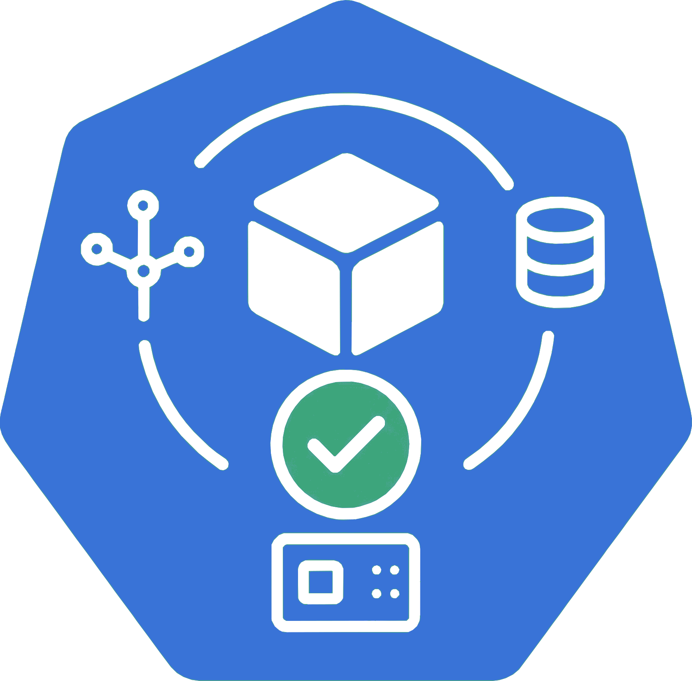

<!--
layout: blog
title: "Introducing Node Readiness Controller"
date: 2026-02-03T10:00:00+08:00
slug: introducing-node-readiness-controller
author: >
  Ajay Sundar Karuppasamy (Google)
-->


<!--
In the standard Kubernetes model, a node's suitability for workloads hinges on a single binary "Ready" condition. However, in modern Kubernetes environments, nodes require complex infrastructure dependencies—such as network agents, storage drivers, GPU firmware, or custom health checks—to be fully operational before they can reliably host pods.
-->
在标准的 Kubernetes 模型中，节点是否适合承载工作负载取决于单一的二进制 "Ready" 状态。
然而，在现代 Kubernetes 环境中，
节点需要复杂的基础设施依赖——如网络代理、存储驱动、GPU 固件或自定义健康检查——才能完全运行，
从而可靠地托管 Pod。

<!--
Today, on behalf of the Kubernetes project, I am announcing the [Node Readiness Controller](https://node-readiness-controller.sigs.k8s.io/).
This project introduces a declarative system for managing node taints, extending the readiness guardrails during node bootstrapping beyond standard conditions.
By dynamically managing taints based on custom health signals, the controller ensures that workloads are only placed on nodes that met all infrastructure-specific requirements.
-->
今天，我代表 Kubernetes 项目宣布推出 [Node Readiness Controller](https://node-readiness-controller.sigs.k8s.io/)。
该项目引入了一个声明式的节点污点管理系统，在节点引导期间将就绪性保护扩展到标准条件之外。
通过基于自定义健康信号动态管理污点，控制器确保工作负载只被调度到满足所有基础设施特定要求的节点上。

<!--
## Why the Node Readiness Controller?
-->
## 为什么需要 Node Readiness Controller？

<!--
Core Kubernetes Node "Ready" status is often insufficient for clusters with sophisticated bootstrapping requirements. Operators frequently struggle to ensure that specific DaemonSets or local services are healthy before a node enters the scheduling pool.
-->
核心 Kubernetes 节点的 "Ready" 状态对于具有复杂引导要求的集群来说往往不够。
运维人员常常难以确保在节点进入调度池之前，特定的 DaemonSet 或本地服务是健康的。

<!--
The Node Readiness Controller fills this gap by allowing operators to define custom scheduling gates tailored to specific node groups. This enables you to enforce
distinct readiness requirements across heterogeneous clusters, ensuring for example, that GPU equipped nodes only accept pods once specialized drivers are verified,
while general purpose nodes follow a standard path.
-->
Node Readiness Controller 通过允许运维人员为特定节点组定义自定义调度门控来填补这一空白。
这使你能够在异构集群中强制执行不同的就绪性要求，例如确保配备 GPU 的节点仅在验证了专用驱动后才接受 Pod，
而通用节点则遵循标准路径。

<!--
It provides three primary advantages:

- **Custom Readiness Definitions**: Define what _ready_ means for your specific platform.
- **Automated Taint Management**: The controller automatically applies or removes node taints based on condition status, preventing pods from landing on unready infrastructure.
- **Declarative Node Bootstrapping**: Manage multi-step node initialization reliably, with a clear observability into the bootstrapping process.
-->
它提供三个主要优势：

- **自定义就绪性定义**：定义适合你特定平台的**就绪**含义。
- **自动化污点管理**：控制器根据状态自动应用或移除节点污点，防止 Pod 被调度到未就绪的基础设施上。
- **声明式节点引导**：可靠地管理多步骤节点初始化，并对引导过程提供清晰的可观测性。

<!--
## Core concepts and features
-->
## 核心概念和功能

<!--
The controller centers around the NodeReadinessRule (NRR) API, which allows you to define declarative _gates_ for your nodes.
-->
该控制器围绕 NodeReadinessRule（NRR）API 构建，允许你为节点定义声明式**门控**。

<!--
### Flexible enforcement modes
-->
### 灵活的执行模式

<!--
The controller supports two distinct operational modes:

Continuous enforcement
: Actively maintains the readiness guarantee throughout the node's entire lifecycle. If a critical dependency (like a device driver) fails later, the node is immediately tainted to prevent new scheduling.

Bootstrap-only enforcement
: Specifically for one-time initialization steps, such as pre-pulling heavy images or hardware provisioning. Once conditions are met, the controller marks the bootstrap as complete and stops monitoring that specific rule for the node.
-->
控制器支持两种不同的操作模式：

持续执行
: 在节点的整个生命周期内主动维护就绪性保证。如果关键依赖（如设备驱动）稍后失败，
  节点会立即被添加污点以防止新的调度。

仅引导执行
: 专门用于一次性初始化步骤，如预拉取大型镜像或硬件配置。一旦条件满足，
  控制器将标记引导完成并停止监控该节点的特定规则。

<!--
### Condition reporting
-->
### 状况报告

<!--
The controller reacts to Node Conditions rather than performing health checks itself. This decoupled design allows it to integrate seamlessly with other tools existing in the ecosystem as well as custom solutions:

- **[Node Problem Detector](https://github.com/kubernetes/node-problem-detector) (NPD)**: Use existing NPD setups and custom scripts to report node health.
- **Readiness Condition Reporter**: A lightweight agent provided by the project that can be deployed to periodically check local HTTP endpoints and patch node conditions accordingly.
-->
控制器对节点状况做出反应，而不是自己执行健康检查。
这种解耦设计使其能够与生态系统中现有的其他工具以及自定义解决方案无缝集成：

- **[Node Problem Detector](https://github.com/kubernetes/node-problem-detector)（NPD）**：使用现有的
  NPD 设置和自定义脚本来报告节点健康状况。
- **Readiness Condition Reporter**：项目提供的轻量级代理，可以部署为定期检查本地 HTTP
  端点并相应地更新节点状态。

<!--
### Operational safety with dry run
-->
### 试运行模式保障操作安全

<!--
Deploying new readiness rules across a fleet carries inherent risk. To mitigate this, _dry run_ mode allows operators to first simulate impact on the cluster.
In this mode, the controller logs intended actions and updates the rule's status to show affected nodes without applying actual taints, enabling safe validation before enforcement.
-->
在整个集群中部署新的就绪性规则存在固有风险。为了缓解这一点，**试运行**模式允许运维人员首先模拟对集群的影响。
在此模式下，控制器记录预期的操作并更新规则状态以显示受影响的节点，但不应用实际的污点，从而在执行前实现安全验证。

<!--
## Example: CNI bootstrapping
-->
## 示例：CNI 引导

<!--
The following NodeReadinessRule ensures a node remains unschedulable until its CNI agent is functional. The controller monitors a custom `cniplugin.example.net/NetworkReady` condition and only removes the `readiness.k8s.io/acme.com/network-unavailable` taint once the status is True.
-->
以下 NodeReadinessRule 确保节点在其 CNI 代理正常工作之前保持不可调度状态。
控制器监控自定义的 `cniplugin.example.net/NetworkReady` 状态，
只有在状态为 True 时才移除 `readiness.k8s.io/acme.com/network-unavailable` 污点。

```yaml
apiVersion: readiness.node.x-k8s.io/v1alpha1
kind: NodeReadinessRule
metadata:
  name: network-readiness-rule
spec:
  conditions:
    - type: "cniplugin.example.net/NetworkReady"
      requiredStatus: "True"
  taint:
    key: "readiness.k8s.io/acme.com/network-unavailable"
    effect: "NoSchedule"
    value: "pending"
  enforcementMode: "bootstrap-only"
  nodeSelector:
    matchLabels:
      node-role.kubernetes.io/worker: ""
```
**演示**：



<!--
## Getting involved
-->
## 参与方式

<!--
The Node Readiness Controller is just getting started, with our [initial releases](https://github.com/kubernetes-sigs/node-readiness-controller/releases/tag/v0.1.1) out, and we are seeking community feedback to refine the roadmap. Following our productive Unconference discussions at KubeCon NA 2025, we are excited to continue the conversation in person.
-->
Node Readiness Controller 刚刚起步，
我们的[初始版本](https://github.com/kubernetes-sigs/node-readiness-controller/releases/tag/v0.1.1)已经发布，
我们正在寻求社区反馈来完善路线图。继 2025 年 KubeCon NA 的高效非正式讨论之后，
我们很高兴能够面对面继续交流。

<!--
Join us at KubeCon + CloudNativeCon Europe 2026 for our maintainer track session: *[Addressing Non-Deterministic Scheduling: Introducing the Node Readiness Controller](https://sched.co/2EF6E)*.

In the meantime, you can contribute or track our progress here:

- GitHub: https://sigs.k8s.io/node-readiness-controller
- Slack: Join the conversation in [#sig-node-readiness-controller](https://kubernetes.slack.com/messages/sig-node-readiness-controller) 
- Documentation: [Getting Started](https://node-readiness-controller.sigs.k8s.io/)
-->
欢迎参加 KubeCon + CloudNativeCon Europe 2026 的维护者专场：
**[Addressing Non-Deterministic Scheduling: Introducing the Node Readiness Controller](https://sched.co/2EF6E)**。

同时，你可以通过以下方式贡献或跟踪我们的进展：

- GitHub: https://sigs.k8s.io/node-readiness-controller
- Slack: 加入 [#sig-node-readiness-controller](https://kubernetes.slack.com/messages/sig-node-readiness-controller) 频道参与讨论
- 文档: [Getting Started](https://node-readiness-controller.sigs.k8s.io/)
