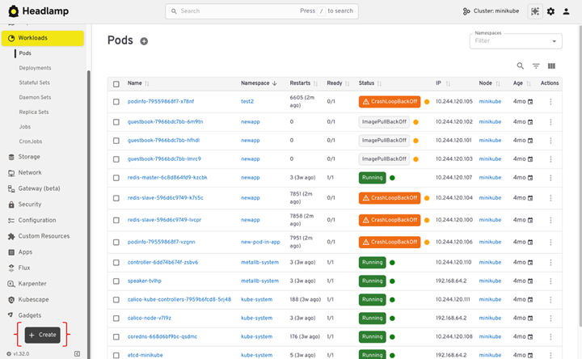

<!--
layout: blog
title: "Kubernetes Dashboard to Headlamp: A Step-by-Step Guide"
date: 2026-07-13T10:00:00-08:00
slug: kubernetes-dashboard-to-headlamp
author: >
  Vincent T. (Microsoft)
-->

<!--
## 1. Before you start: know what is changing

Kubernetes Dashboard and Headlamp both show what is running in a cluster,
but they work differently. When Headlamp runs on the desktop,
it uses your existing kubeconfig to connect to one or more clusters
and can be extended with plugins. When Headlamp runs inside a cluster,
it uses a Kubernetes ServiceAccount to access the API and follow RBAC rules.
Kubernetes Dashboard, in contrast, only runs in-cluster
and always relies on service account tokens. Understanding these models early
helps you choose the right setup and permissions.
-->
## 1. 开始之前：了解变化内容

Kubernetes Dashboard 和 Headlamp 都显示集群中运行的内容，但它们的工作方式不同。
当 Headlamp 在桌面上运行时，它使用你现有的 kubeconfig 连接到一个或多个集群，
并可以通过插件进行扩展。当 Headlamp 在集群内运行时，它使用 Kubernetes ServiceAccount
来访问 API 并遵循 RBAC 规则。相比之下，Kubernetes Dashboard 仅在集群内运行，
并且始终依赖服务账号令牌。尽早了解这些模型有助于你选择正确的设置和权限。

<!--
### 1.1 How Kubernetes Dashboard works

Dashboard is a web app that runs inside your cluster.
-->
### 1.1 Kubernetes Dashboard 的工作方式

Dashboard 是一个在你的集群内部运行的 Web 应用。

<!--
- You install it in the cluster, often with Helm.
- You usually run one Dashboard per cluster.
- You often reach it with `kubectl port-forward` or an ingress.
- You log in with a Bearer token. That token is often from a service account.
- It includes forms that help you create resources.
- It leans on tables and lists for navigation.
-->
- 你在集群中安装它，通常使用 Helm。
- 通常每个集群运行一个 Dashboard。
- 你通常通过 `kubectl port-forward` 或 ingress 访问它。
- 你使用 Bearer 令牌登录，该令牌通常来自服务账号。
- 它包含帮助你创建资源的表单。
- 它依靠表格和列表进行导航。

<!--
It feels like this: a UI that lives with the cluster.
-->
感觉就像这样：一个与集群共存的 UI。

<!--
### 1.2 How Headlamp works

Headlamp acts more like a Kubernetes client with a UI.
-->
### 1.2 Headlamp 的工作方式

Headlamp 更像是一个带有 UI 的 Kubernetes 客户端。

<!--
- It can run on your desktop or in a cluster.
- It reads your kubeconfig, like kubectl does.
- It can show more than one cluster in one place.
- It favors YAML when you create or change resources.
- It includes list views and a visual map.
- You can add features with plugins.
-->
- 它可以在你的桌面或集群中运行。
- 它像 kubectl 一样读取你的 kubeconfig。
- 它可以在一个地方显示多个集群。
- 在创建或更改资源时，它更倾向于使用 YAML。
- 它包括列表视图和可视化 Map。
- 你可以通过插件添加功能。

<!--
Headlamp is a UI that follows your identity, not your cluster.
-->
Headlamp 是一个跟随你的身份而非集群的 UI。

<!--
### 1.3 What stays the same

Many workflows will feel familiar:
-->
### 1.3 保持不变的内容

许多工作流程会让你感到熟悉：

<!--
- Browse workloads and resources
- Filter by namespace
- Inspect YAML, events, and status
- View logs
- Take actions your RBAC allows
-->
- 浏览工作负载和资源
- 按命名空间过滤
- 检查 YAML、事件和状态
- 查看日志
- 执行 RBAC 允许的操作

<!--
### 1.4 What changes

A few things will feel different:
-->
### 1.4 变化的内容

有几件事会感觉不同：

<!--
- Login shifts from pasted tokens to kubeconfig (and sometimes SSO).
- Creation shifts from forms to "apply YAML."
- Multi-cluster becomes normal, not a special case.
- The map view helps you see how resources connect.
-->
- 登录从粘贴令牌转变为使用 kubeconfig（有时是 SSO）。
- 创建从表单转变为 "apply YAML"。
- 多集群成为常态，而非特例。
- 地图视图帮助你查看资源之间的连接方式。

<!--
## 2. Pre-migration checklist

This checklist helps you avoid surprises during the switch.
It makes sure Headlamp can use the same identity and permissions
you already trust in Kubernetes. It also gives you a quick way
to prove the migration worked before you turn off Dashboard.
-->
## 2. 迁移前检查清单

此检查清单帮助你在切换过程中避免意外。它确保 Headlamp 能够使用你在 Kubernetes
中已经信任的相同身份和权限。它还为你提供了一种快速验证迁移是否成功的方法，然后再关闭 Dashboard。

<!--
### 2.1 Write down what you use today

List the basics:
-->
### 2.1 记录你当前的使用情况

列出基本信息：

<!--
- Which clusters you use (dev, staging, prod)
- Which namespaces you touch most
- What you do most often (view, edit, scale, delete, debug)
- How you access Dashboard today (port-forward or ingress)
- How you log in (service account token, and which RBAC bindings)
-->
- 你使用哪些集群（开发、测试、生产）
- 你最常接触哪些命名空间
- 你最常做什么（查看、编辑、缩放、删除、调试）
- 你当前如何访问 Dashboard（port-forward 或 ingress）
- 你如何登录（服务账号令牌，以及哪些 RBAC 绑定）

<!--
This is your baseline.
-->
这是你的基准。

<!--
### 2.2 Check that kubeconfig works

Headlamp uses kubeconfig, especially on desktop.
Make sure yours works before you install anything.
-->
### 2.2 检查 kubeconfig 是否正常工作

Headlamp 使用 kubeconfig，尤其是在桌面上。在安装任何东西之前，请确保你的 kubeconfig 正常工作。

<!--
Run:
-->
运行：

```shell
kubectl config current-context
```

<!--
Then try:
-->
然后尝试：

```shell
kubectl get nodes
```

<!--
If you cannot list nodes, test in a namespace you can access:
-->
如果你无法列出节点，请在你可以访问的命名空间中测试：

```shell
kubectl get pods -n <namespace>
```

<!--
If these work, Headlamp can use the same identity and RBAC.
-->
如果这些命令正常工作，Headlamp 可以使用相同的身份和 RBAC。

<!--
### 2.3 Pick a rollout plan

There is no need to rush. Most teams choose one of these:
-->
### 2.3 选择推出计划

无需急于求成。大多数团队会选择以下方案之一：

<!--
**Parallel rollout (recommended)**

- Install Headlamp
- Let people try it
- Keep Dashboard for a short time
- Remove Dashboard after the team is ready
-->
**并行推出（推荐）**

- 安装 Headlamp
- 让大家试用
- 短时间内保留 Dashboard
- 在团队准备好后移除 Dashboard

<!--
**Cutover**

- Install Headlamp
- Switch docs and links
- Remove Dashboard soon after
-->
**直接切换**

- 安装 Headlamp
- 切换文档和链接
- 之后不久移除 Dashboard

<!--
Parallel rollout is safer for shared clusters.
-->
对于共享集群，并行推出更安全。

<!--
### 2.4 Decide where Headlamp will run

You can use either option. Many teams use both.
-->
### 2.4 决定 Headlamp 的运行位置

你可以选择任一选项，许多团队两者都使用。

<!--
**Desktop**

- Uses your kubeconfig
- Uses no cluster resources
- No port-forward needed
- Multi-cluster works out of the box
-->
**桌面端**

- 使用你的 kubeconfig
- 不使用集群资源
- 无需 port-forward
- 多集群开箱即用

<!--
**In-cluster**

- Works well for shared, browser access
- Can be managed like other cluster apps
- Often paired with ingress and SSO
-->
**集群内**

- 适用于共享的浏览器访问
- 可以像其他集群应用一样进行管理
- 通常与 ingress 和 SSO 配合使用

<!--
### 2.5 Note optional dependencies

These are common. You can handle them later.
-->
### 2.5 注意可选依赖项

这些很常见，你可以稍后处理。

<!--
- `metrics-server` (for CPU and memory graphs)
- ingress (for an in-cluster URL)
- OIDC / SSO (for browser sign-in)
- cleanup of old Dashboard service accounts and RBAC
-->
- `metrics-server`（用于 CPU 和内存图表）
- ingress（用于集群内 URL）
- OIDC / SSO（用于浏览器登录）
- 清理旧的 Dashboard 服务账号和 RBAC

<!--
## 3. Choose where Headlamp will run (desktop or in-cluster)

Headlamp can run on your desktop or inside a cluster.
Both work well, but they fit different needs. Desktop is the fastest way
to start because it uses your kubeconfig and does not run in the cluster.
In-cluster is best when you need a shared URL
and want the platform team to manage upgrades and access.
-->
## 3. 选择 Headlamp 的运行位置（桌面或集群内）

Headlamp 可以在你的桌面或集群内部运行。两者都很好用，但适用于不同的需求。
桌面端是最快的启动方式，因为它使用你的 kubeconfig 且不在集群中运行。
当你需要一个共享 URL 并希望平台团队管理升级和访问时，集群内运行是最佳选择。

<!--
### Option A: Desktop (user-managed)

Desktop Headlamp runs on each user's machine.
It reads the same kubeconfig you use with kubectl.
This keeps access tied to each user's identity and RBAC.
-->
### 选项 A：桌面端（用户管理）

桌面端 Headlamp 在每个用户的机器上运行。它读取你与 kubectl 相同的 kubeconfig。
这将访问权限与每个用户的身份和 RBAC 绑定。

<!--
**Why teams pick it**

- No in-cluster service to deploy or expose.
- It uses no cluster CPU or memory.
- It uses your kubeconfig and RBAC.
- It works with many clusters in one app.
- You do not need port-forward for day-to-day use.
-->
**团队选择它的原因**

- 无需部署或暴露集群内服务。
- 不使用集群的 CPU 或内存。
- 使用你的 kubeconfig 和 RBAC。
- 在一个应用中支持多个集群。
- 日常使用无需 port-forward。

<!--
### Option B: In-cluster (best for shared access)

In-cluster Headlamp is installed as a Kubernetes workload
(often via Helm). This lets cluster admins manage it
like other in-cluster apps.
-->
### 选项 B：集群内（最适合共享访问）

集群内 Headlamp 作为 Kubernetes 工作负载安装（通常通过 Helm）。
这使得集群管理员可以像管理其他集群内应用一样管理它。

<!--
- Cluster admins manage install, upgrades, and configuration
  through the Helm chart and standard Kubernetes tooling.
- Admins control ingress and can set up OIDC login for shared access.
- It supports shared use in team environments.
-->
- 集群管理员通过 Helm chart 和标准 Kubernetes 工具管理安装、升级和配置。
- 管理员控制 ingress，并可以为共享访问设置 OIDC 登录。
- 它支持团队环境中的共享使用。

<!--
## 4. Install Headlamp (desktop and in-cluster)

This section gets Headlamp running. Follow the path you chose in Section 3.
-->
## 4. 安装 Headlamp（桌面端和集群内）

本节将让 Headlamp 运行起来。请遵循你在第 3 节中选择的路径。

<!--
### 4.1 Desktop install (fastest way to start)

Install Headlamp on your machine. Then open it like any other app.
Headlamp reads your kubeconfig and uses the same identity
and RBAC rules as kubectl.
-->
### 4.1 桌面端安装（最快的启动方式）

在你的机器上安装 Headlamp，然后像打开其他应用一样打开它。
Headlamp 读取你的 kubeconfig，并使用与 kubectl 相同的身份和 RBAC 规则。

<!--
**Windows**

Install with WinGet:
-->
**Windows**

使用 WinGet 安装：

```shell
winget install headlamp
```

<!--
Or with Chocolatey:
-->
或者使用 Chocolatey：

```shell
choco install headlamp
```

<!--
**macOS**

Install with Homebrew:
-->
**macOS**

使用 Homebrew 安装：

```shell
brew install --cask headlamp
```

<!--
**Linux**

Install with Flatpak (Flathub):
-->
**Linux**

使用 Flatpak（Flathub）安装：

```shell
flatpak install flathub io.kinvolk.Headlamp
```

<!--
**Quick check**

1. Launch Headlamp.
2. Confirm you can see a cluster context.
3. Open a namespace you can access and confirm you can list workloads.
   Headlamp will only show actions your RBAC allows.
-->
**快速检查**

1. 启动 Headlamp。
2. 确认你可以看到集群上下文。
3. 打开一个你可以访问的命名空间，并确认你可以列出工作负载。
   Headlamp 只会显示你的 RBAC 允许的操作。

<!--
### 4.2 In-cluster install (shared access)

Use this path when you want a shared UI that the platform team can manage.
Headlamp supports in-cluster deployment with Helm or a YAML manifest.
-->
### 4.2 集群内安装（共享访问）

当你需要一个平台团队可以管理的共享 UI 时，请使用此路径。
Headlamp 支持通过 Helm 或 YAML 清单进行集群内部署。

<!--
**Install with Helm**

Add the repo and update:
-->
**使用 Helm 安装**

添加仓库并更新：

```shell
helm repo add headlamp https://kubernetes-sigs.github.io/headlamp/
helm repo update
```

<!--
Create a namespace (example):
-->
创建一个命名空间（示例）：

```shell
kubectl create namespace headlamp
```

<!--
Install the chart:
-->
安装 Chart：

```shell
helm install headlamp headlamp/headlamp --namespace headlamp
```

<!--
**Install with a YAML manifest (optional)**

Headlamp also provides a YAML manifest you can apply
and then adjust to your needs.
-->
**使用 YAML 清单安装（可选）**

Headlamp 还提供了一个 YAML 清单，你可以应用它，然后根据需要进行调整。

<!--
**Check the install**

Confirm the pod is running:
-->
**检查安装**

确认 Pod 正在运行：

```shell
kubectl get pods -n headlamp
```

<!--
Confirm the service exists:
-->
确认服务存在：

```shell
kubectl get svc -n headlamp
```

<!--
**Access it (two common ways)**

_Quick test with port-forward_

This is the fastest way to verify the service works:
-->
**访问它（两种常见方式）**

**使用 port-forward 快速测试**

这是验证服务是否正常工作的最快方式：

```shell
kubectl port-forward -n headlamp svc/headlamp 8080:80
```

<!--
Then open: http://localhost:8080
-->
然后打开：http://localhost:8080

<!--
_Shared access with ingress_

If you want a stable URL, expose the service through your ingress controller.
Your exact ingress YAML depends on your setup.
Headlamp's OIDC callback URL is your public URL plus `/oidc-callback`,
so ingress and TLS settings matter.
-->
**通过 ingress 共享访问**

如果你想要一个稳定的 URL，请通过你的 ingress 控制器暴露服务。
你的确切 ingress YAML 取决于你的设置。
Headlamp 的 OIDC 回调 URL 是你的公共 URL 加上 `/oidc-callback`，
因此 ingress 和 TLS 设置很重要。

<!--
### 4.3 Updating Headlamp

Updates depend on how you installed Headlamp.
Package managers upgrade in place.
DMG or EXE installs update by reinstalling the newer download.
-->
### 4.3 更新 Headlamp

更新方式取决于你安装 Headlamp 的方式。包管理器就地升级。
DMG 或 EXE 安装通过重新安装较新的下载来更新。

<!--
**macOS**

If you installed with Homebrew, run:
-->
**macOS**

如果你使用 Homebrew 安装，请运行：

```shell
brew upgrade headlamp
```

<!--
If you installed from a DMG, download the newest DMG
and drag Headlamp into `/Applications`, replacing the old version.
DMG installs do not auto upgrade.
-->
如果你从 DMG 安装，请下载最新的 DMG 并将 Headlamp 拖到 `/Applications`，
替换旧版本。DMG 安装不会自动升级。

<!--
**Windows**

If you installed with WinGet, run:
-->
**Windows**

如果你使用 WinGet 安装，请运行：

```shell
winget upgrade headlamp
```

<!--
If you installed with Chocolatey, run:
-->
如果你使用 Chocolatey 安装，请运行：

```shell
choco upgrade headlamp
```

<!--
If you installed from the EXE, download the newest installer
and run it again. EXE installs do not auto upgrade.
-->
如果你从 EXE 安装，请下载最新的安装程序并再次运行。EXE 安装不会自动升级。

<!--
**Linux**

If you installed with Flatpak, run:
-->
**Linux**

如果你使用 Flatpak 安装，请运行：

```shell
flatpak update io.kinvolk.Headlamp
```

<!--
If you installed with AppImage, download the newest AppImage
and run that file instead.

If you installed with a tarball, download the newest tarball,
extract it, and run the new headlamp binary.
-->
如果你使用 AppImage 安装，请下载最新的 AppImage 并运行该文件。

如果你使用 tarball 安装，请下载最新的 tarball，解压缩，然后运行新的 Headlamp 二进制文件。

<!--
### 4.4 Notes for in-cluster access (keep it safe)

Treat an in-cluster UI like any other cluster-facing service.
Use TLS, lock down who can reach it, and rely on Kubernetes auth
and RBAC to control what users can do.
-->
### 4.4 集群内访问注意事项（确保安全）

将集群内 UI 视为任何其他面向集群的服务。使用 TLS，限制谁可以访问它，
并依靠 Kubernetes 认证和 RBAC 来控制用户可以做什么。

<!--
## 5. Authentication and RBAC

Headlamp uses the Kubernetes API the same way kubectl does.
Your cluster still decides who can do what.
Headlamp only shows actions your identity is allowed to take.

This section covers two setups: desktop and in-cluster.
-->
## 5. 认证和 RBAC

Headlamp 使用 Kubernetes API 的方式与 kubectl 相同。你的集群仍然决定谁可以做什么。
Headlamp 只显示你的身份被允许执行的操作。

本节涵盖两种设置：桌面端和集群内。

<!--
### 5.1 Desktop: use kubeconfig

On desktop, Headlamp reads your kubeconfig and uses
the same credentials you use with kubectl.
There is no separate token login flow to manage.
-->
### 5.1 桌面端：使用 kubeconfig

在桌面上，Headlamp 读取你的 kubeconfig 并使用与 kubectl 相同的凭证。
无需管理单独的令牌登录流程。

<!--
**Step 1: Confirm your kubeconfig works**

Run:
-->
**步骤 1：确认你的 kubeconfig 正常工作**

运行：

```shell
kubectl config current-context
```

<!--
Then test access:
-->
然后测试访问：

```shell
kubectl get nodes
```

<!--
If you cannot list nodes, test a namespace you can access:
-->
如果你无法列出节点，请在你可以访问的命名空间中测试：

```shell
kubectl get pods -n <namespace>
```

<!--
If these commands work, your kubeconfig and credentials
are valid for Headlamp too.
-->
如果这些命令正常工作，你的 kubeconfig 和凭证对 Headlamp 也是有效的。

<!--
**Step 2: Point Headlamp at the right kubeconfig (if needed)**

Headlamp can use the default kubeconfig path.
It can also use a custom file path. You can set `KUBECONFIG`
to choose a specific file.

Example:
-->
**步骤 2：将 Headlamp 指向正确的 kubeconfig（如有需要）**

Headlamp 可以使用默认的 kubeconfig 路径，也可以使用自定义文件路径。
你可以设置 `KUBECONFIG` 来选择特定文件。

示例：

```shell
KUBECONFIG=/path/to/config headlamp
```

<!--
You can also use more than one kubeconfig file at once.
On Unix systems, separate paths with `:`.
On Windows, separate paths with `;`.
-->
你也可以同时使用多个 kubeconfig 文件。在 Unix 系统上，使用 `:` 分隔路径。
在 Windows 上，使用 `;` 分隔路径。

<!--
**What to expect in the UI**

Headlamp adapts to your RBAC permissions.
If you do not have permission to edit or delete a resource,
Headlamp will not offer those actions.
-->
**UI 中的预期行为**

Headlamp 会根据你的 RBAC 权限进行调整。如果你没有编辑或删除资源的权限，
Headlamp 将不会提供这些操作。

<!--
### 5.2 In-cluster: shared access needs a sign-in plan

In-cluster Headlamp is shared by many users.
You need a clear plan for sign-in and access.
Headlamp supports OpenID Connect (OIDC) for a "Sign in" flow.

You will usually choose one of these patterns:

- **A.** Configure Headlamp with OIDC (built-in).
- **B.** Put an auth layer in front of Headlamp (common in enterprises).
-->
### 5.2 集群内：共享访问需要登录计划

集群内 Headlamp 由许多用户共享。你需要一个明确的登录和访问计划。
Headlamp 支持 OpenID Connect (OIDC) 用于 "Sign in" 流程。

你通常会选择以下模式之一：

- **A.** 使用 OIDC 配置 Headlamp（内置）。
- **B.** 在 Headlamp 前面放置认证层（在企业中很常见）。

<!--
**A. Built-in OIDC (Headlamp)**

To use OIDC, Headlamp needs:

- Client ID
- Client secret
- Issuer URL
- (Optional) scopes
-->
**A. 内置 OIDC（Headlamp）**

要使用 OIDC，Headlamp 需要：

- Client ID
- Client secret
- Issuer URL
- （可选）scopes

<!--
Your OIDC provider must also allow Headlamp's callback URL.
The callback is your Headlamp URL plus:

- `/oidc-callback`

Example:

- `https://headlamp.example.com/oidc-callback`
-->
你的 OIDC 提供商还必须允许 Headlamp 的回调 URL。回调是你的 Headlamp URL 加上：

- `/oidc-callback`

示例：

- `https://headlamp.example.com/oidc-callback`

<!--
**Ingress note**

If Headlamp is behind an ingress or load balancer,
make sure it forwards `X-Forwarded-Proto`.
If it does not, Headlamp may generate an `http` callback URL
instead of `https`. That can break login.
-->
**Ingress 注意事项**

如果 Headlamp 在 ingress 或负载均衡器后面，请确保它转发 `X-Forwarded-Proto`。
如果不转发，Headlamp 可能会生成 `http` 回调 URL 而不是 `https`，这会导致登录失败。

<!--
**B. Auth layer in front of Headlamp**

Some teams protect Headlamp with an identity-aware proxy
or a platform auth system. This keeps sign-in consistent across tools.
Headlamp docs include an example using OpenUnison,
which can deploy Headlamp with hardened defaults
and integrate with identity providers.
-->
**B. Headlamp 前面的认证层**

一些团队使用身份感知代理或平台认证系统来保护 Headlamp。
这使得跨工具的登录保持一致。Headlamp 文档包含一个使用 OpenUnison 的示例，
它可以使用强化的默认值部署 Headlamp 并与身份提供商集成。

<!--
### 5.3 RBAC: keep it least privilege

Kubernetes security starts with API authentication and authorization (RBAC).
Headlamp respects those rules.

Practical guidance:

- Start with the lowest permissions that still let users do their job.
- If Dashboard used a high-privilege service account token,
  plan to remove or tighten that access after the move.
- For in-cluster, treat the UI like any other endpoint.
  Use TLS and limit network access.
-->
### 5.3 RBAC：保持最小权限原则

Kubernetes 安全始于 API 认证和授权（RBAC）。Headlamp 遵守这些规则。

实用指南：

- 从仍然允许用户完成工作的最低权限开始。
- 如果 Dashboard 使用了高权限服务账号令牌，计划在迁移后移除或收紧该访问权限。
- 对于集群内部署，将 UI 视为任何其他端点，使用 TLS 并限制网络访问。

<!--
### 5.4 Quick troubleshooting

**Desktop: "I do not see my cluster"**

Your kubeconfig may not be in the default location.
Point Headlamp to the file with `KUBECONFIG` or a file path.
-->
### 5.4 快速故障排除

**桌面端："我看不到我的集群"**

你的 kubeconfig 可能不在默认位置。使用 `KUBECONFIG` 或文件路径将 Headlamp 指向该文件。

<!--
**In-cluster: "OIDC login fails after redirect"**

Confirm your provider allows `https://YOUR_URL/oidc-callback`.
If you use ingress, make sure it forwards `X-Forwarded-Proto`.
-->
**集群内："OIDC 登录在重定向后失败"**

确认你的提供商允许 `https://YOUR_URL/oidc-callback`。
如果你使用 ingress，请确保它转发 `X-Forwarded-Proto`。

<!--
## 6. Manage multiple clusters

Kubernetes Dashboard is usually tied to one cluster at a time.
Headlamp is built for multi-cluster work. It is a client
that follows your kubeconfig, not a single cluster install.
That means you can keep one UI open and switch clusters as you work.
-->
## 6. 管理多个集群

Kubernetes Dashboard 通常一次只绑定到一个集群。Headlamp 专为多集群工作而构建。
它是一个跟随你的 kubeconfig 的客户端，而不是单一集群安装。
这意味着你可以保持一个 UI 打开，并在工作时切换集群。

<!--
### Clusters come from your kubeconfig

Headlamp reads clusters from your kubeconfig files.
That means the clusters you can access with kubectl
can also show up in Headlamp.
-->
### 集群来自你的 kubeconfig

Headlamp 从你的 kubeconfig 文件中读取集群。这意味着你可以使用 kubectl 访问的集群，
也可以在 Headlamp 中显示。

<!--
### Switch clusters in the UI

Once Headlamp loads your kubeconfig, you can switch clusters
using the cluster selector. This makes it easier to move
between dev, staging, and prod without changing tools.
-->
### 在 UI 中切换集群

一旦 Headlamp 加载你的 kubeconfig，你可以使用集群选择器切换集群。
这使得在开发、测试和生产环境之间切换更加容易，无需更换工具。

<!--
### Optional: use more than one kubeconfig file

If you keep separate kubeconfig files, you can load them together.
Headlamp supports multiple kubeconfig paths in `KUBECONFIG`.
-->
### 可选：使用多个 kubeconfig 文件

如果你保留单独的 kubeconfig 文件，你可以一起加载它们。
Headlamp 支持 `KUBECONFIG` 中的多个 kubeconfig 路径。

<!--
Unix/macOS/Linux (`:` separator):
-->
Unix/macOS/Linux（`:` 分隔符）：

```shell
KUBECONFIG=~/.kube/dev:~/.kube/prod headlamp
```

<!--
Windows (`;` separator):
-->
Windows（`;` 分隔符）：

```powershell
$env:KUBECONFIG="$HOME\.kube\dev;$HOME\.kube\prod"
```

<!--
### Optional: add a cluster from inside Headlamp

You can also add clusters by loading additional kubeconfig files
from the UI.
-->
### 可选：从 Headlamp 内部添加集群

你也可以通过从 UI 加载额外的 kubeconfig 文件来添加集群。

<!--
### Permissions stay the same

Multi-cluster does not change security rules.
Each cluster still enforces its own RBAC.
Headlamp shows only what your identity can do in the selected cluster.
-->
### 权限保持不变

多集群不会改变安全规则。每个集群仍然强制执行自己的 RBAC。
Headlamp 只显示你的身份在选定集群中可以做的事情。

<!--
## 7. Navigate and understand resources

If you used Kubernetes Dashboard, this part will feel familiar.
Headlamp keeps the same core resource views,
but makes it easier to move around and understand what is connected.
-->
## 7. 导航和理解资源

如果你使用过 Kubernetes Dashboard，这部分会让你感到熟悉。
Headlamp 保持相同的核心资源视图，但使导航和理解资源连接更加容易。

<!--
### Find resources in familiar places

Headlamp groups resources in a way that maps closely to Dashboard:
-->
### 在熟悉的地方查找资源

Headlamp 以与 Dashboard 紧密映射的方式对资源进行分组：

<!--
- **Workloads** for Pods, Deployments, StatefulSets, and Jobs
- **Network** for Services and Ingress
- **Storage** for PersistentVolumes and Claims
- **Configuration** for ConfigMaps and Secrets
- **Nodes** for cluster infrastructure
-->
- **Workloads**（工作负载）用于 Pod、Deployment、StatefulSet 和 Job
- **Network**（网络）用于 Service 和 Ingress
- **Storage**（存储）用于 PersistentVolume 和 PersistentVolumeClaim
- **Configuration**（配置）用于 ConfigMap 和 Secret
- **Nodes**（节点）用于集群基础设施

<!--
You can filter by namespace at the top of the UI,
just like in Dashboard.
-->
你可以在 UI 顶部按命名空间过滤，就像在 Dashboard 中一样。

<!--
### Inspect and edit resources

From any list, you can click into a resource to see details:
-->
### 检查和编辑资源

从任何列表中，你可以点击资源查看详细信息：

<!--
- Status and conditions
- Events
- Labels and annotations
- The full YAML definition
-->
- 状态和条件
- 事件
- 标签和注解
- 完整的 YAML 定义

<!--
If your RBAC allows it, you can edit YAML directly from the UI.
If it does not, Headlamp shows the resource as read-only.
This matches how kubectl behaves.
-->
如果你的 RBAC 允许，你可以直接从 UI 编辑 YAML。如果不允许，
Headlamp 将资源显示为只读。这与 kubectl 的行为一致。

<!--
### Use search and filters to move faster

Headlamp adds faster search and filtering across lists.
This helps when clusters or namespaces get large.
You can narrow views without jumping between pages.
-->
### 使用搜索和过滤器加快操作

Headlamp 添加了跨列表的快速搜索和过滤功能。当集群或命名空间变大时，
这很有帮助。你可以在不跳页的情况下缩小视图范围。

<!--
### Understand relationships with Map View

Dashboard mostly shows resources as lists.
Headlamp also includes a Map View.

Map View shows how resources relate to each other:

- Deployments
- ReplicaSets
- Pods
- Services
-->
### 使用地图视图理解关系

Dashboard 主要以列表形式显示资源。Headlamp 还包括地图视图（Map View）。

地图视图显示资源之间的关系：

- Deployment
- ReplicaSet
- Pod
- Service

<!--
This helps when you are troubleshooting.
Instead of clicking through several pages,
you can see the connections at once.
You can spot missing links or broken relationships faster.
-->
这在故障排除时很有帮助。你可以一次看到所有连接，而无需点击多个页面。
你可以更快地发现缺失的链接或损坏的关系。

<!--
### When to use lists vs Map View

- Use **lists** when you know what resource you are looking for.
- Use **Map View** when you are trying to understand
  why something is not working.

Both views work on the same data.
You are just choosing how much context you want at that moment.
-->
### 何时使用列表 vs 地图视图

- 当你知道要找什么资源时，使用**列表**。
- 当你试图理解为什么某些东西不工作时，使用**地图视图**。

两个视图都使用相同的数据。你只是选择在那一刻需要多少上下文。

<!--
## 8. Deploy applications with YAML

This is the biggest change for most Kubernetes Dashboard users.
Dashboard relied on forms. Headlamp relies on manifests.
The goal is not to slow you down. It is to align the UI
with how Kubernetes is usually run in practice.
-->
## 8. 使用 YAML 部署应用

这是大多数 Kubernetes Dashboard 用户最大的变化。Dashboard 依赖表单。
Headlamp 依赖清单（manifest）。目标不是减慢你的速度，而是使 UI 与 Kubernetes
在实际中的运行方式保持一致。

<!--
### From forms to manifests

In Kubernetes Dashboard, you often deployed an app by filling in a form:

- container image
- replicas
- service type

Headlamp does not include the same wizard.
Instead, it lets you apply YAML directly from the UI.
-->
### 从表单到清单

在 Kubernetes Dashboard 中，你通常通过填写表单来部署应用：

- 容器镜像
- 副本数
- 服务类型

Headlamp 不包含相同的向导。相反，它允许你直接从 UI 应用 YAML。

<!--
This matches how most teams deploy today:

- manifests live in Git
- CI/CD applies them
- Helm or GitOps tools manage changes

Headlamp fits into that flow rather than replacing it.
-->
这与大多数团队今天的部署方式一致：

- 清单存储在 Git 中
- CI/CD 应用它们
- Helm 或 GitOps 工具管理变更

Headlamp 融入该流程，而不是替换它。

<!--
### Create resources using YAML

To deploy an application in Headlamp:

1. Select a cluster and namespace.
2. Click **Create**.
3. Paste or upload a YAML manifest.
4. Review it.
5. Click **Apply**.
-->
### 使用 YAML 创建资源

要在 Headlamp 中部署应用：

1. 选择一个集群和命名空间。
2. 点击 **Create**。
3. 粘贴或上传 YAML 清单。
4. 查看它。
5. 点击 **Apply**。



<!--
The resource appears immediately in the UI.

If the manifest is not valid, Headlamp shows the same errors
you would see from the Kubernetes API.
-->
资源会立即出现在 UI 中。

如果清单无效，Headlamp 会显示与 Kubernetes API 相同的错误。

<!--
### Generate YAML the easy way

If you miss the Dashboard wizard, you can still generate YAML quickly.

For example:
-->
### 轻松生成 YAML

如果你想念 Dashboard 向导，你仍然可以快速生成 YAML。

例如：

```shell
kubectl create deployment nginx \
  --image=nginx \
  --dry-run=client \
  -o yaml > nginx.yaml
```

<!--
You can edit the file if needed, then paste it into Headlamp and apply it.

This gives you a repeatable manifest instead of an object
created only through a UI.
-->
你可以根据需要编辑文件，然后将其粘贴到 Headlamp 中并应用。

这为你提供了一个可重复使用的清单，而不是仅通过 UI 创建的对象。

<!--
### What if you use Helm or GitOps?

That works well with Headlamp.

- Install with Helm as usual.
- Deploy with GitOps pipelines as usual.
- Use Headlamp to view, inspect, and debug what is running.

Headlamp does not replace those tools.
It gives you visibility into what they create.
-->
### 如果你使用 Helm 或 GitOps 怎么办？

这与 Headlamp 配合良好。

- 像往常一样使用 Helm 安装。
- 像往常一样使用 GitOps 流水线部署。
- 使用 Headlamp 查看、检查和调试正在运行的内容。

Headlamp 不替换这些工具。它让你看到它们创建的内容。

<!--
### What to expect compared to Dashboard

- You will not see a multi-step deploy form.
- You will work more with YAML.
- You gain clarity about what is actually applied to the cluster.
- The same manifest can be reused in CI, Git, or other tools.
-->
### 与 Dashboard 相比的预期变化

- 你不会看到多步骤部署表单。
- 你将更多地使用 YAML。
- 你会更清楚实际应用到集群的内容。
- 相同的清单可以在 CI、Git 或其他工具中重复使用。

<!--
## 9. Deploy and debug workloads

One of the main reasons people used Kubernetes Dashboard
was day-to-day debugging. Headlamp covers the same tasks
and adds a few useful upgrades.
-->
## 9. 部署和调试工作负载

人们使用 Kubernetes Dashboard 的主要原因之一是日常调试。
Headlamp 涵盖相同的任务，并添加了一些有用的升级。

<!--
### View logs

You can view pod logs directly in the UI.

To check logs:

1. Open **Workloads**.
2. Select **Pods**.
3. Click a pod.
4. Open the **Logs** tab.
-->
### 查看日志

你可以直接在 UI 中查看 Pod 日志。

要检查日志：

1. 打开 **Workloads**。
2. 选择 **Pods**。
3. 点击一个 Pod。
4. 打开 **Logs** 选项卡。


<!--
If the pod has more than one container, you can switch between containers.
Logs stream live, which helps during rollouts or active incidents.
-->
如果 Pod 有多个容器，你可以在容器之间切换。日志实时流式传输，
这在部署或活动事件期间很有帮助。

<!--
### Exec into running pods

Headlamp also lets you open a shell inside a container.

From a pod view:

- Open the pod actions menu.
- Choose **Terminal** or **Exec**.
-->
### 在运行中的 Pod 中执行命令

Headlamp 还允许你在容器内打开 shell。

从 Pod 视图：

- 打开 Pod 操作菜单。
- 选择 **Terminal** 或 **Exec**。

<!--
This opens an interactive session inside the container.
It replaces the need to switch back to the terminal for quick checks.

This action follows RBAC rules.
If you cannot run `kubectl exec`, Headlamp will not allow it either.
-->
这会在容器内打开一个交互式会话。它取代了为快速检查而切换回终端的需要。

此操作遵循 RBAC 规则。如果你无法运行 `kubectl exec`，Headlamp 也不允许。

<!--
### Check metrics and resource usage

Headlamp can show CPU and memory usage for pods and nodes.
This works the same way it did in Dashboard.

A few things to know:

- Metrics require `metrics-server` to be installed in the cluster.
- If metrics are missing, Headlamp shows a clear notice.
- Once metrics are available, usage appears on pod and node views.
-->
### 检查指标和资源使用情况

Headlamp 可以显示 Pod 和节点的 CPU 和内存使用情况。这与 Dashboard 中的工作方式相同。

需要了解的几点：

- 指标需要在集群中安装 `metrics-server`。
- 如果指标缺失，Headlamp 会显示清晰的通知。
- 一旦指标可用，使用情况会出现在 Pod 和节点视图中。

<!--
This makes it easy to answer simple questions:

- Is this pod using too much memory?
- Is a node under pressure?
-->
这使得回答简单问题变得容易：

- 这个 Pod 是否使用了过多的内存？
- 某个节点是否处于压力之下？

<!--
### View events when something goes wrong

Events are often the fastest way to understand failures.

In Headlamp, you can:

- View events on resource detail pages.
- See warnings and errors tied to pods, nodes, or deployments.
-->
### 出问题时查看事件

事件通常是了解故障的最快方式。

在 Headlamp 中，你可以：

- 在资源详情页面查看事件。
- 查看与 Pod、节点或 Deployment 相关的警告和错误。

<!--
This is often the first place to look
when a workload is stuck or crashes.
-->
当工作负载卡住或崩溃时，这通常是首先查看的地方。

<!--
### How this compares to Dashboard

**What stays the same:**

- Log viewing
- Event inspection
- RBAC-aware actions

**What improves:**

- Built-in exec sessions
- Clearer layout and filtering
- Fewer context switches between UI and CLI
-->
### 与 Dashboard 相比如何

**保持不变：**

- 日志查看
- 事件检查
- RBAC 感知操作

**改进之处：**

- 内置执行会话
- 更清晰的布局和过滤
- UI 和 CLI 之间的上下文切换更少

<!--
## 10. Remove Kubernetes Dashboard

After Headlamp is working and your team is comfortable using it,
you can remove Kubernetes Dashboard.
This is the final cleanup step.

Removing Dashboard reduces clutter
and avoids keeping unused access paths around.
-->
## 10. 移除 Kubernetes Dashboard

在 Headlamp 正常工作且你的团队熟悉使用它之后，你可以移除 Kubernetes Dashboard。
这是最后的清理步骤。

移除 Dashboard 可以减少混乱，并避免保留未使用的访问路径。

<!--
### Confirm Headlamp covers your needs

Before uninstalling anything, make sure:

- Users can access the clusters they need in Headlamp.
- Common tasks work:
  - browse resources
  - deploy with YAML
  - view logs and events
  - exec into pods (if allowed)
- RBAC behaves as expected for different roles.

Once these checks pass, you are ready to remove Dashboard.
-->
### 确认 Headlamp 满足你的需求

在卸载任何东西之前，请确保：

- 用户可以在 Headlamp 中访问他们需要的集群。
- 常见任务正常工作：
  - 浏览资源
  - 使用 YAML 部署
  - 查看日志和事件
  - 在 Pod 中执行命令（如果允许）
- RBAC 对于不同角色的行为符合预期。

一旦这些检查通过，你就可以移除 Dashboard 了。

<!--
### Uninstall the Dashboard

If you installed Kubernetes Dashboard with Helm, remove it with:
-->
### 卸载 Dashboard

如果你使用 Helm 安装了 Kubernetes Dashboard，请使用以下命令移除它：

```shell
helm uninstall kubernetes-dashboard -n kubernetes-dashboard
```

<!--
If Dashboard was installed by a manifest or addon,
remove it using the same method you used to install it.

After removal, confirm the resources are gone:
-->
如果 Dashboard 是通过清单或插件安装的，请使用你安装它的相同方法移除它。

移除后，确认资源已消失：

```shell
kubectl get pods -n kubernetes-dashboard
```

<!--
### Clean up access artifacts (recommended)

Many Dashboard setups used dedicated service accounts and cluster-wide roles.

Review and remove anything that was created only for Dashboard access,
such as:

- service accounts
- role bindings or cluster role bindings
- old documentation that points users to Dashboard URLs or port-forward commands

This reduces long-lived credentials and unused permissions.
-->
### 清理访问工件（推荐）

许多 Dashboard 设置使用了专用的服务账号和集群级角色。

审查并移除任何仅为 Dashboard 访问创建的内容，例如：

- 服务账号
- RoleBinding 或 ClusterRoleBinding
- 指向 Dashboard URL 或 port-forward 命令的旧文档

这减少了长期存在的凭证和未使用的权限。

<!--
### Communicate the change

Make sure your team knows:

- Headlamp is now the primary Kubernetes UI.
- How to access it (desktop or URL).
- Where to go for help if something feels different.
-->
### 传达变更

确保你的团队知道：

- Headlamp 现在是主要的 Kubernetes UI。
- 如何访问它（桌面端或 URL）。
- 如果有什么感觉不同，去哪里寻求帮助。

<!--
## 11. Post-migration checklist

This final checklist helps you confirm the migration is complete.
It gives you confidence that Headlamp is working as expected
and that nothing important was left behind.
-->
## 11. 迁移后检查清单

此最终检查清单帮助你确认迁移已完成。它让你有信心 Headlamp 按预期工作，
并且没有遗漏任何重要内容。

<!--
### Access and visibility

- [ ] Headlamp opens without errors.
- [ ] Users can access the correct clusters.
- [ ] Namespace filtering works as expected.
- [ ] Multi-cluster switching behaves correctly.
-->
### 访问和可见性

- [ ] Headlamp 打开时没有错误。
- [ ] 用户可以访问正确的集群。
- [ ] 命名空间过滤按预期工作。
- [ ] 多集群切换行为正确。

<!--
### Authentication and RBAC

- [ ] Desktop users access clusters using kubeconfig.
- [ ] In-cluster users can sign in using the chosen auth method.
- [ ] Users only see actions their RBAC allows.
- [ ] No unexpected permission errors appear during normal use.
-->
### 认证和 RBAC

- [ ] 桌面用户使用 kubeconfig 访问集群。
- [ ] 集群内用户可以使用所选的认证方法登录。
- [ ] 用户只看到他们的 RBAC 允许的操作。
- [ ] 正常使用期间没有出现意外的权限错误。

<!--
### Core workflows

- [ ] Resources load under Workloads, Network, and Configuration.
- [ ] YAML can be viewed and edited where permissions allow.
- [ ] Applications can be deployed using Create and YAML.
- [ ] Logs load correctly for running pods.
- [ ] Exec works for users who are allowed to use it.
- [ ] Metrics appear if metrics-server is installed.
-->
### 核心工作流程

- [ ] 资源在 Workloads、Network 和 Configuration 下正常加载。
- [ ] 在权限允许的情况下可以查看和编辑 YAML。
- [ ] 可以使用 Create 和 YAML 部署应用。
- [ ] 运行中的 Pod 的日志正确加载。
- [ ] Exec 对允许使用它的用户正常工作。
- [ ] 如果安装了 metrics-server，指标会显示。

<!--
### Operational confidence

- [ ] Teams can troubleshoot without switching tools.
- [ ] Map View helps explain relationships during debugging.
- [ ] Platform or DevOps teams know how Headlamp is installed and managed.
-->
### 运营信心

- [ ] 团队可以在不切换工具的情况下进行故障排除。
- [ ] 地图视图在调试期间有助于解释关系。
- [ ] 平台或 DevOps 团队知道如何安装和管理 Headlamp。

<!--
### Cleanup confirmation

- [ ] Kubernetes Dashboard is no longer running.
- [ ] Dashboard-only service accounts and RBAC bindings are removed.
- [ ] Internal docs no longer reference Dashboard URLs
  or port-forward commands.
-->
### 清理确认

- [ ] Kubernetes Dashboard 不再运行。
- [ ] 仅用于 Dashboard 的服务账号和 RBAC 绑定已移除。
- [ ] 内部文档不再引用 Dashboard URL 或 port-forward 命令。

<!--
### Team alignment

- [ ] The team knows Headlamp is the default Kubernetes UI.
- [ ] Onboarding docs point new users to Headlamp.
- [ ] There is a clear path for feedback or questions.
-->
### 团队共识

- [ ] 团队知道 Headlamp 是默认的 Kubernetes UI。
- [ ] 入职文档指引新用户使用 Headlamp。
- [ ] 有清晰的反馈或问题渠道。

<!--
You've now completed the move from Kubernetes Dashboard to Headlamp.
Your team can use the same Kubernetes access model,
work across clusters, and rely on workflows that match
how Kubernetes is used today. From here, Headlamp becomes
your default UI, whether on the desktop or in shared environments.
As your needs grow, you can keep using it as-is
or extend it with plugins and new views over time.

If you want to help shape what comes next,
join the Headlamp community and contribute at [headlamp.dev](https://headlamp.dev).
-->
你现在已经完成了从 Kubernetes Dashboard 到 Headlamp 的迁移。
你的团队可以使用相同的 Kubernetes 访问模型，跨集群工作，并依赖与当今 Kubernetes
使用方式相匹配的工作流程。从现在开始，无论是在桌面端还是共享环境中，
Headlamp 都将成为你的默认 UI。随着你的需求增长，你可以继续按原样使用它，
或随着时间的推移通过插件和新视图扩展它。

如果你想帮助塑造未来的发展方向，请加入 Headlamp 社区并在
[headlamp.dev](https://headlamp.dev) 上贡献力量。