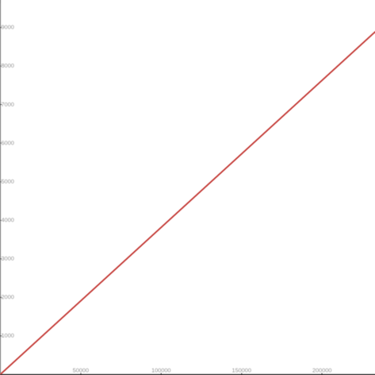
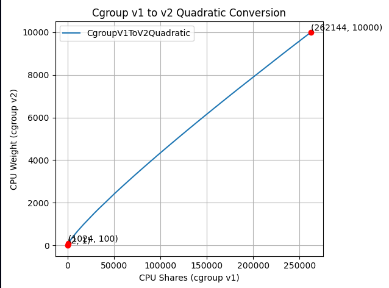
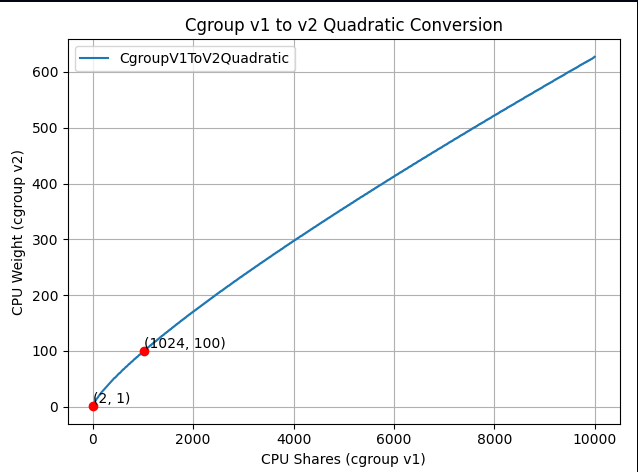

<!--
layout: blog
title: 'New Conversion from cgroup v1 CPU Shares to v2 CPU Weight'
date: 2026-01-30T08:00:00-08:00
slug: new-cgroup-v1-to-v2-cpu-conversion-formula
author: >
   [Itamar Holder](https://github.com/iholder101) (Red Hat)
---
-->

<!--
I'm excited to announce the implementation of an improved conversion formula 
from cgroup v1 CPU shares to cgroup v2 CPU weight. This enhancement addresses 
critical issues with CPU priority allocation for Kubernetes workloads when 
running on systems with cgroup v2.
-->
我很高兴地宣布，已实现从 CGroup v1 CPU 份额（shares）到 CGroup v2 CPU 权重（weight）的改进转换公式。
这一增强解决了在支持 CGroup v2 的系统上运行 Kubernetes 工作负载时的 CPU 优先级分配关键问题。

<!--
## Background
-->
## 背景

<!--
Kubernetes was originally designed with cgroup v1 in mind, where CPU shares
were derived from a container's CPU requests using the following formula:
-->
Kubernetes 最初设计时考虑的是 CGroup v1，
其中 CPU 份额 是根据容器的 CPU 请求使用以下公式得出的：

```math
cpu.shares = milliCPU \times \frac{1024}{1000}
```

<!--
Note that the value 1024 in this formula is the default `cpu.shares` value
in cgroup v1, and is unrelated to millicores. For example, a container
requesting 1 CPU (1000m) would get \(cpu.shares = 1000 \times 1024 / 1000 = 1024\),
and a container requesting 100m would get \(cpu.shares = 100 \times 1024 / 1000 = 102\).
-->
请注意，此公式中的值 1024 是 CGroup v1 中 `cpu.shares` 的默认值，与毫核无关。
例如，请求 1 CPU（1000m）的容器将获得 \(cpu.shares = 1000 \times 1024 / 1000 = 1024\)，
而请求 100m 的容器将获得 \(cpu.shares = 100 \times 1024 / 1000 = 102\)。

<!--
After a while, cgroup v1 started being replaced by its successor, 
cgroup v2. In cgroup v2, the concept of CPU shares (which ranges from 2 to 
262144, or from 2¹ to 2¹⁸) was replaced with CPU weight (which ranges from 
[1, 10000], or 10⁰ to 10⁴).
-->
一段时间后，CGroup v1 开始被其后继者 CGroup v2 取代。
在 CGroup v2 中，CPU 份额（范围从 2 到 262144，或从 2¹ 到 2¹⁸）的概念被
CPU 权重（范围从 [1, 10000]，即 10⁰ 到 10⁴）取代。

<!--
With the transition to cgroup v2, 
[KEP-2254](https://github.com/kubernetes/enhancements/tree/master/keps/sig-node/2254-cgroup-v2) 
introduced a conversion formula to map cgroup v1 CPU shares to cgroup v2 CPU 
weight. The conversion formula was defined as: `cpu.weight = (1 + ((cpu.shares - 2) * 9999) / 262142)`
-->
随着向 CGroup v2 的过渡，
[KEP-2254](https://github.com/kubernetes/enhancements/tree/master/keps/sig-node/2254-cgroup-v2)
引入了一个转换公式，将 CGroup v1 CPU 份额 映射到 CGroup v2 CPU 权重。
转换公式定义为：`cpu.weight = (1 + ((cpu.shares - 2) * 9999) / 262142)`

<!--
This formula linearly maps values from [2¹, 2¹⁸] to [10⁰, 10⁴].
-->
此公式将 [2¹, 2¹⁸] 范围的值线性映射到 [10⁰, 10⁴]。



<!--
While this approach is simple, the linear mapping imposes a few significant 
problems and impacts both performance and configuration granularity.
-->
虽然这种方法很简单，但线性映射带来了一些重大问题，影响了性能和配置粒度。

<!--
## Problems with previous conversion formula
-->
## 之前转换公式的问题

<!--
The current conversion formula creates two major issues:
-->
当前转换公式产生两个主要问题：

<!--
### 1. Reduced priority against non-Kubernetes workloads
-->
### 1. 相对于非 Kubernetes 工作负载的优先级降低

<!--
In cgroup v1, the default value for CPU shares is `1024`, meaning a container 
requesting 1 CPU has equal priority with system processes that live outside 
of Kubernetes' scope.
However, in cgroup v2, the default CPU weight is `100`, but the current 
formula converts 1 CPU (1000m) to only `≈39` weight - less than 40% of the 
default.
-->
在 CGroup v1 中，CPU 份额 的默认值是 `1024`，
这意味着请求 1 CPU 的容器与 Kubernetes 范围之外的系统进程具有相同的优先级。
然而，在 CGroup v2 中，默认 CPU 权重 是 `100`，
但当前公式将 1 CPU（1000m）仅转换为 `≈39` 权重——不到默认值的 40%。

<!--
**Example:**
- Container requesting 1 CPU (1000m)
- cgroup v1: `cpu.shares = 1024` (equal to default)
- cgroup v2 (current): `cpu.weight = 39` (much lower than default 100)
-->
**示例：**
- 请求 1 CPU（1000m）的容器
- CGroup v1：`cpu.shares = 1024`（等于默认值）
- CGroup v2（当前）：`cpu.weight = 39`（远低于默认值 100）

<!--
This means that after moving to cgroup v2, Kubernetes (or OCI) workloads would 
de-facto reduce their CPU priority against non-Kubernetes processes. The 
problem can be severe for setups with many system daemons that run 
outside of Kubernetes' scope and expect Kubernetes workloads to have 
priority, especially in situations of resource starvation.
-->
这意味着在迁移到 CGroup v2 后，
Kubernetes（或 OCI）工作负载相对于非 Kubernetes 进程会实际上降低其 CPU 优先级。
对于有许多系统守护进程在 Kubernetes 范围之外运行并期望 Kubernetes 工作负载具有优先级的设置来说，
问题可能很严重，尤其是在资源匮乏的情况下。

<!--
### 2. Unmanageable granularity
-->
### 2. 无法管理的粒度

<!--
The current formula produces very low values for small CPU requests, 
limiting the ability to create sub-cgroups within containers for 
fine-grained resource distribution (which will possibly be much easier moving
forward, see [KEP #5474](https://github.com/kubernetes/enhancements/issues/5474) for more info).
-->
当前公式为较小的 CPU 请求产生非常低的值，
限制了在容器内创建子 CGroup 以进行细粒度资源分配的能力（这可能在未来会更容易实现，
请参阅 [KEP #5474](https://github.com/kubernetes/enhancements/issues/5474) 了解更多）。

<!--
**Example:**
- Container requesting 100m CPU
- cgroup v1: `cpu.shares = 102`
- cgroup v2 (current): `cpu.weight = 4` (too low for sub-cgroup 
  configuration)
-->
**示例：**
- 请求 100m CPU 的容器
- CGroup v1：`cpu.shares = 102`
- CGroup v2（当前）：`cpu.weight = 4`（对于子 CGroup 配置太低）

<!--
With cgroup v1, requesting 100m CPU which led to 102 CPU shares was manageable 
in the sense that sub-cgroups could have been created inside the main 
container, assigning fine-grained CPU priorities for different groups of 
processes. With cgroup v2 however, having 4 shares is very hard to 
distribute between sub-cgroups since it's not granular enough.
-->
使用 CGroup v1，请求 100m CPU 导致 102 个 CPU 份额 是可控的，
因为可以在主容器内创建子 CGroup，为不同组的进程分配细粒度的 CPU 优先级。
然而，使用 CGroup v2，拥有 4 个份额 很难在子 CGroup 之间分配，因为粒度不够。

<!--
With plans to allow [writable cgroups for unprivileged containers](https://github.com/kubernetes/enhancements/issues/5474),
this becomes even 
more relevant.
-->
随着计划允许[非特权容器的可写 CGroup](https://github.com/kubernetes/enhancements/issues/5474)，
这一点变得更加重要。

<!--
## New conversion formula
-->
## 新转换公式

<!--
### Description
The new formula is more complicated, but does a much better job mapping 
between cgroup v1 CPU shares and cgroup v2 CPU weight:
-->
### 描述

新公式更复杂，但在 CGroup v1 CPU 份额和 CGroup v2 CPU 权重之间映射方面做得更好：

```math
cpu.weight = \lceil 10^{(L^{2}/612 + 125L/612 - 7/34)} \rceil, \text{ where: } L = \log_2(cpu.shares)
```

<!--
The idea is that this is a quadratic function to cross the following values:
-->
这个想法是，这是一个二次函数，需要经过以下值：

<!--
- (2, 1): The minimum values for both ranges.
- (1024, 100): The default values for both ranges.
- (262144, 10000): The maximum values for both ranges.
-->
- (2, 1)：两个范围的最小值。
- (1024, 100)：两个范围的默认值。
- (262144, 10000)：两个范围的最大值。

<!--
Visually, the new function looks as follows:
-->
从视觉上看，新函数如下所示：



<!--
And if you zoom in to the important part:
-->
如果你放大重要部分：



<!--
The new formula is "close to linear", yet it is carefully designed to 
map the ranges in a clever way so the three important points above would 
cross.
-->
新公式“接近线性”，但经过精心设计，以一种巧妙的方式映射范围，使上述三个重要点经过。

<!--
### How it solves the problems
-->
### 它如何解决问题

<!--
1. **Better priority alignment:**
   - A container requesting 1 CPU (1000m) will now get a `cpu.weight = 102`. This 
     value is close to cgroup v2's default 100.
     This restores the intended priority relationship between Kubernetes 
     workloads and system processes.
-->
1. **更好的优先级对齐：**
   - 请求 1 CPU（1000m）的容器现在将获得 `cpu.weight = 102`。此值接近 CGroup v2 的默认值 100。
     这恢复了 Kubernetes 工作负载与系统进程之间预期的优先级关系。

<!--
2. **Improved granularity:**
   - A container requesting 100m CPU will get `cpu.weight = 17`, (see 
     [here](https://go.dev/play/p/sLlAfCg54Eg)).
     Enables better fine-grained resource distribution within containers.
-->
2. **改进的粒度：**
   - 请求 100m CPU 的容器将获得 `cpu.weight = 17`（请参阅[此处](https://go.dev/play/p/sLlAfCg54Eg)）。
     能够在容器内实现更好的细粒度资源分配。

<!--
## Adoption and integration
-->
## 采用和集成

<!--
This change was implemented at the OCI layer.
In other words, this is not implemented in Kubernetes itself; therefore the 
adoption of the new conversion formula depends solely on the OCI runtime 
adoption.
-->
此更改在 OCI 层实现。换句话说，这不是在 Kubernetes 本身中实现的；
因此，新转换公式的采用完全取决于 OCI 运行时的采用。

<!--
For example:
* runc: The new formula is enabled from version [1.3.2](https://github.com/opencontainers/runc/releases/tag/v1.3.2).
* crun: The new formula is enabled from version [1.23](https://github.com/containers/crun/releases/tag/1.23).
-->
例如：
* runc：新公式从版本 [1.3.2](https://github.com/opencontainers/runc/releases/tag/v1.3.2) 开始启用。
* crun：新公式从版本 [1.23](https://github.com/containers/crun/releases/tag/1.23) 开始启用。

<!--
### Impact on existing deployments
-->
### 对现有部署的影响

<!--
**Important:** Some consumers may be affected if they assume the older linear conversion formula.
Applications or monitoring tools that directly calculate expected CPU weight values based on the
previous formula may need updates to account for the new quadratic conversion.
This is particularly relevant for:
-->
**重要提示：**如果用户依赖旧的线性转换公式，某些使用者可能会受到影响。
直接根据先前公式计算预期 CPU weight 值的应用程序或监控工具可能需要更新以适应新的二次转换。
这尤其与以下相关：

<!--
- Custom resource management tools that predict CPU weight values.
- Monitoring systems that validate or expect specific weight values.
- Applications that programmatically set or verify CPU weight values.
-->
- 预测 CPU 权重 值的自定义资源管理工具。
- 验证或期望特定权重的监控系统。
- 以编程方式设置或验证 CPU 权重的应用程序。

<!--
Also note that reversing the conversion from `cpu.weight` back to milliCPU
will not always yield the exact original value. There are two sources of
information loss: the milliCPU to `cpu.shares` conversion involves integer
truncation (e.g. 100m becomes 102 shares, not 102.4), and more significantly,
the shares-to-weight mapping is many-to-one (e.g. milliCPU values 90
through 109 all map to `cpu.weight = 17`). Tools that need precise CPU
request values should read them directly from the pod spec rather than
deriving them from cgroup parameters.
-->
另请注意，将转换从 `cpu.weight` 反向转换回 milliCPU 并不总是能得到完全相同的原始值。
有两个信息丢失来源：milliCPU 到 `cpu.shares` 的转换涉及整数截断（例如 100m 变成 102 份额，而不是 102.4），
更重要的是，份额到权重映射是多对一的（例如，milliCPU 值 90 到 109 都映射到 `cpu.weight = 17`）。
需要精确 CPU 请求值的工具应该直接从 pod spec 读取，而不是从 CGroup 参数派生。

<!--
The Kubernetes project recommends testing the new conversion formula in non-production
environments before upgrading OCI runtimes to ensure compatibility with existing tooling.
-->
Kubernetes 项目建议在升级 OCI 运行时之前在非生产环境中测试新转换公式，
以确保与现有工具的兼容性。

<!--
## Where can I learn more?
-->
## 我可以了解更多吗？

<!--
For those interested in this enhancement:
-->
对于对此增强感兴趣的人：

<!--
- [Kubernetes GitHub Issue #131216](https://github.com/kubernetes/kubernetes/issues/131216) - Detailed technical 
analysis and examples, including discussions and reasoning for choosing the 
above formula.
- [KEP-2254: cgroup v2](https://github.com/kubernetes/enhancements/tree/master/keps/sig-node/2254-cgroup-v2) - 
Original cgroup v2 implementation in Kubernetes.
- [Kubernetes cgroup documentation](https://kubernetes.io/docs/concepts/configuration/manage-resources-containers/) - 
Current resource management guidance.
-->
- [Kubernetes GitHub Issue #131216](https://github.com/kubernetes/kubernetes/issues/131216) - 详细的技术分析和示例，包括选择上述公式的讨论和推理。
- [KEP-2254: CGroup v2](https://github.com/kubernetes/enhancements/tree/master/keps/sig-node/2254-cgroup-v2) - Kubernetes 中原始的 CGroup v2 实现。
- [Kubernetes CGroup 文档](https://kubernetes.io/zh-cn/docs/concepts/configuration/manage-resources-containers/) - 当前的资源管理指南。

<!--
## How do I get involved?
-->
## 我如何参与？

<!--
For those interested in getting involved with Kubernetes node-level 
features, join the [Kubernetes Node Special Interest Group](https://github.com/kubernetes/community/tree/master/sig-node).
We always welcome new contributors and diverse perspectives on resource management 
challenges.
-->
对于有兴趣参与 Kubernetes 节点级功能的人，请加入
[Kubernetes 节点特别兴趣小组](https://github.com/kubernetes/community/tree/master/sig-node)。
我们始终欢迎新的贡献者和对资源管理挑战的不同观点。
