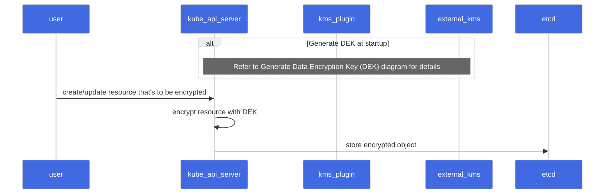
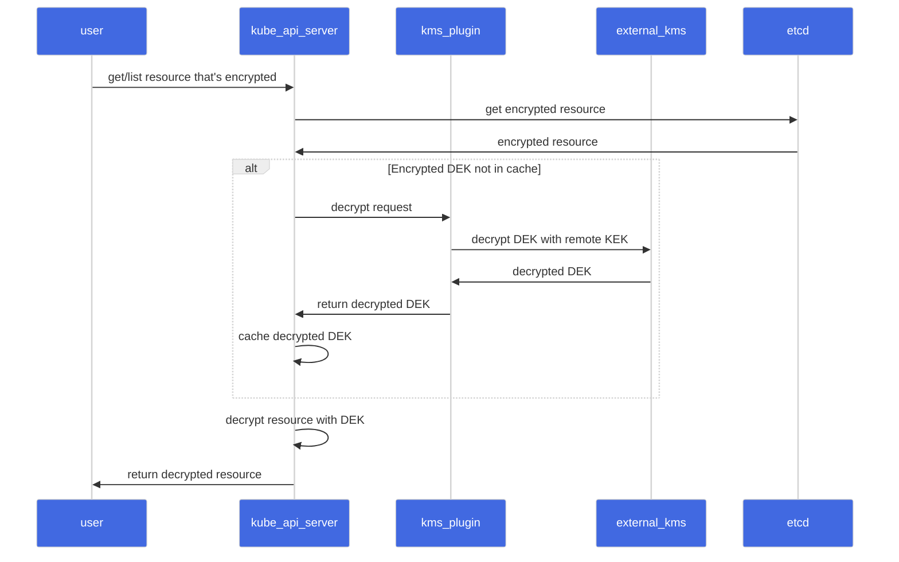
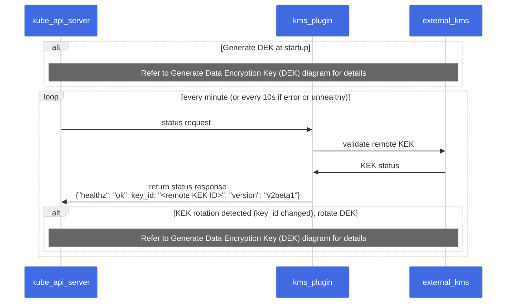
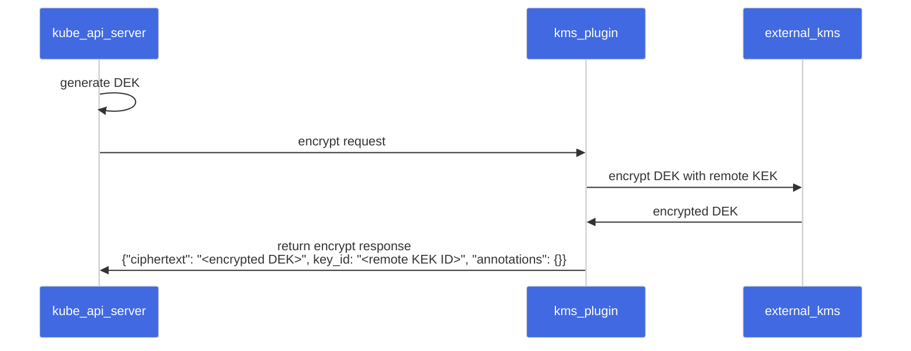

<!--
layout: blog
title: "Kubernetes 1.27: KMS V2 Moves to Beta"
date: 2023-05-16
slug: kms-v2-moves-to-beta
-->

<!--
**Authors:** Anish Ramasekar, Mo Khan, and Rita Zhang (Microsoft)
-->
**作者：** Anish Ramasekar, Mo Khan, and Rita Zhang (Microsoft)

**譯者：** Xin Li (DaoCloud)

<!--
With Kubernetes 1.27, we (SIG Auth) are moving Key Management Service (KMS) v2 API to beta.
-->
在 Kubernetes 1.27 中，我們（SIG Auth）將密鑰管理服務（KMS）v2 API 帶入 Beta 階段。

<!--
## What is KMS?
One of the first things to consider when securing a Kubernetes cluster is encrypting etcd data at
rest. KMS provides an interface for a provider to utilize a key stored in an external key service to
perform this encryption.
-->
## KMS 是什麼？

保護 Kubernetes 叢集時首先要考慮的事情之一是加密靜態的 etcd 資料。
KMS 爲供應商提供了一個介面，以便利用儲存在外部密鑰服務中的密鑰來執行此加密。

<!--
KMS v1 has been a feature of Kubernetes since version 1.10, and is currently in beta as of version
v1.12. KMS v2 was introduced as alpha in v1.25.
-->
KMS v1 自 1.10 版以來一直是 Kubernetes 的一項功能特性，該特性從 v1.12
版開始處於 Beta 階段。KMS v2 在 v1.25 中作爲 Alpha 特性引入。

{}
<!--
The KMS v2 API and implementation changed in incompatible
ways in-between the alpha release in v1.25 and the beta release in v1.27. The design of KMS v2 has
changed since [the previous blog post](https://kubernetes.io/blog/2022/09/09/kms-v2-improvements/)
was written and it is not compatible with the design in this blog post. Attempting to upgrade from
old versions with the alpha feature enabled will result in data loss.
-->
KMS v2 API 與實現在 v1.25 的 Alpha 版本和 v1.27 的 Beta 版本之間發生了一些不兼容的變化。
自[上一篇博文](https://kubernetes.io/blog/2022/09/09/kms-v2-improvements/)撰寫以來，
KMS v2 的設計發生了變化，與本博文中的設計不兼容。如果嘗試從啓用了 Alpha 特性的舊版本升級到
Beta 版本，將會導致資料丟失。
{}

<!--
## What’s new in `v2beta1`?
The KMS encryption provider uses an envelope encryption scheme to encrypt data in etcd. The data is
encrypted using a data encryption key (DEK). The DEKs are encrypted with a key encryption key (KEK)
that is stored and managed in a remote KMS. With KMS v1, a new DEK is generated for each encryption.
With KMS v2, a new DEK is only generated on server startup and when the KMS plugin informs the API
server that a KEK rotation has occurred.
-->
## `v2beta1` 有什麼新內容？

KMS 加密驅動使用信封加密方式來加密 etcd 中的資料，使用資料加密密鑰（DEK）對資料進行加密。
DEK 使用在遠程 KMS 中儲存和管理的密鑰加密密鑰（KEK）進行加密。
使用 KMS v1，每次加密都會生成一個新的 DEK。
使用 KMS v2，只有在伺服器啓動時且 KMS 插件通知 API 伺服器發生 KEK 輪換時纔會生成新的 DEK。

{}
<!--
If you are running virtual machine (VM) based nodes
that leverage VM state store with this feature, you must not use KMS v2.

With KMS v2, the API server uses AES-GCM with a 12 byte nonce (8 byte atomic counter and 4 bytes
random data) for encryption. The following issues could occur if the VM is saved and restored:
-->
如果你運行的是虛擬機（VM）節點，其中啓用此特性的節點使用了 VM 的狀態儲存，
則不得使用 KMS v2。

對於 KMS v2，API 伺服器使用帶有 12 字節隨機數（8 字節原子計數器和 4 字節隨機資料）的
AES-GCM 進行加密。在保存和恢復虛擬機時，可能會出現以下問題：

<!--
1. The counter value may be lost or corrupted if the VM is saved in an inconsistent state or
   restored improperly. This can lead to a situation where the same counter value is used twice,
   resulting in the same nonce being used for two different messages.
2. If the VM is restored to a previous state, the counter value may be set back to its previous
   value, resulting in the same nonce being used again.
-->
1. 如果 VM 的保存狀態不一致或其恢復不正確，計數器值可能會丟失或損壞。
   這可能會導致系統再次使用同一計數器值，進而在兩個不同的消息中使用相同的隨機數。
2. 如果 VM 恢復到以前的狀態，則計數器值可能會設置回其以前的值，
   導致再次使用相同的隨機數。

<!--
Although both of these cases are partially mitigated by the 4 byte random nonce, this can compromise
the security of the encryption.
-->
雖然這兩種情況都可以通過 4 字節隨機數部分緩解，但這仍可能會危及加密的安全性。
{}

<!--
### Sequence Diagram

#### Encrypt Request
-->
### 時序圖

#### 加密請求

<!-- source

-->

<!--

-->


<!--
#### Decrypt Request
-->
#### 解密請求

<!-- source

-->

<!--

-->


<!--
#### Status Request
-->
#### 狀態請求

<!-- source

-->

<!--

-->


<!--
#### Generate Data Encryption Key (DEK)
-->
#### 生成資料加密密鑰（DKE）

<!-- source

-->

<!--

-->


<!--
### Performance Improvements
With KMS v2, we have made significant improvements to the performance of the KMS encryption
provider. In case of KMS v1, a new DEK is generated for every encryption. This means that for every
write request, the API server makes a call to the KMS plugin to encrypt the DEK using the remote
KEK. The API server also has to cache the DEKs to avoid making a call to the KMS plugin for every
read request. When the API server restarts, it has to populate the cache by making a call to the KMS
plugin for every DEK in the etcd store based on the cache size. This is a significant overhead for
the API server. With KMS v2, the API server generates a DEK at startup and caches it. The API server
also makes a call to the KMS plugin to encrypt the DEK using the remote KEK. This is a one-time call
at startup and on KEK rotation. The API server then uses the cached DEK to encrypt the resources.
This reduces the number of calls to the KMS plugin and improves the overall latency of the API
server requests.
-->
### 性能改進

在 KMS v2 中，我們對 KMS 加密提供程式的性能進行了重大改進。對於 KMS v1，
每次加密都會生成一個新的 DEK。這意味着對於每個寫入請求，API 伺服器都會調用
KMS 插件以使用遠程 KEK 加密 DEK。爲避免每個讀取請求都會調用 KMS 插件，
API 伺服器必須緩存 DEK。當 API 伺服器重新啓動時，
它必須根據緩存大小爲 etcd 儲存中的每個 DEK 調用 KMS 插件來填充緩存。
這對 API 伺服器來說是一個很大的開銷。使用 KMS v2，API 伺服器在啓動時生成一個 DEK 並將其緩存。
API 伺服器還調用 KMS 插件以使用遠程 KEK 加密 DEK。這是啓動時和 KEK 輪換時的一次性調用。
在此之後，API 伺服器使用緩存的 DEK 來加密資源。這樣做減少了對 KMS 插件的調用次數，
並改善了 API 伺服器請求的整體延遲。

<!--
We conducted a test that created 12k secrets and measured the time taken for the API server to
encrypt the resources. The metric used was
[`apiserver_storage_transformation_duration_seconds`](https://kubernetes.io/docs/reference/instrumentation/metrics/).
For KMS v1, the test was run on a managed Kubernetes v1.25 cluster with 2 nodes. There was no
additional load on the cluster during the test. For KMS v2, the test was run in the Kubernetes CI
environment with the following [cluster
configuration](https://github.com/kubernetes/kubernetes/blob/release-1.27/test/e2e/testing-manifests/auth/encrypt/kind.yaml).
-->
我們進行了一項創建 12,000 個 Secret 的測試，並檢測了 API
伺服器加密資源所花費的時間。使用的指標是
[`apiserver_storage_transformation_duration_seconds`](https://kubernetes.io/zh-cn/docs/reference/instrumentation/metrics/)。
對於 KMS v1，測試在具有 2 個節點的託管 Kubernetes v1.25 叢集上運行。
測試期間叢集上沒有額外的負載。對於 KMS v2，
測試是在具有以下[叢集設定](https://github.com/kubernetes/kubernetes/blob/release-1.27/test/e2e/testing-manifests/auth/encrypt/kind.yaml)的
Kubernetes CI 環境中運行的

<!--
| KMS Provider | Time taken by 95 percentile |
| ------------ | --------------------------- |
| KMS v1       | 160ms                       |
| KMS v2       | 80μs                        |

The results show that the KMS v2 encryption provider is three orders of magnitude faster than the
KMS v1 encryption provider.
-->
| KMS 驅動     | 95 分位請求所用時間            |
| ------------ | --------------------------- |
| KMS v1       | 160ms                       |
| KMS v2       | 80μs                        |

結果表明，KMS v2 加密驅動比 KMS v1 快三個數量級。

<!--
## What's next?
For Kubernetes v1.28, we expect the feature to stay in beta. In the coming releases we want to
investigate:
- Cryptographic changes to remove the limitation on VM state store.
- Kubernetes REST API changes to enable a more robust story around key rotation.
- Handling undecryptable resources. Refer to the
  [KEP](https://github.com/kubernetes/enhancements/pull/3927) for details.
-->
## 下一步計劃

對於 Kubernetes v1.28，我們預計該功能仍處於測試階段。在即將發佈的版本中，我們將致力於：

- 修改加密程式以消除對 VM 狀態儲存的限制。
- 針對密鑰輪換，修改 Kubernetes REST API 以實現更強大的特性。
- 處理無法解密的資源，更多細節參考：[KEP](https://github.com/kubernetes/enhancements/pull/3927)

<!--
You can learn more about KMS v2 by reading [Using a KMS provider for data
encryption](/docs/tasks/administer-cluster/kms-provider/). You can also follow along on the
[KEP](https://github.com/kubernetes/enhancements/blob/master/keps/sig-auth/3299-kms-v2-improvements/#readme)
to track progress across the coming Kubernetes releases.
-->
你可以通過閱讀[使用 KMS 驅動進行資料加密](/zh-cn/docs/tasks/administer-cluster/kms-provider/)，
還可以關注 [KEP](https://github.com/kubernetes/enhancements/blob/master/keps/sig-auth/3299-kms-v2-improvements/#readme)
來跟蹤即將發佈的 Kubernetes 版本進度。

<!--
## Call to action

In this blog post, we have covered the improvements made to the KMS encryption provider in
Kubernetes v1.27. We have also discussed the new KMS v2 API and how it works. We would love to hear
your feedback on this feature. In particular, we would like feedback from Kubernetes KMS plugin
implementors as they go through the process of building their integrations with this new API. Please
reach out to us on the [#sig-auth-kms-dev](https://kubernetes.slack.com/archives/C03035EH4VB)
channel on Kubernetes Slack.
-->
## 行動號召

在這篇博文中，我們介紹了 Kubernetes v1.27 中對 KMS 加密驅動所做的改進。
我們還討論了新的 KMS v2 API 及其工作原理。我們很想聽聽你對此功能的反饋，
特別是，我們希望 Kubernetes KMS 插件實現者在構建與這個新 API 的集成過程中得到反饋。
請通過 Kubernetes Slack 上的 [#sig-auth-kms-dev](https://kubernetes.slack.com/archives/C03035EH4VB)
頻道與我們聯繫。

<!--
## How to get involved
If you are interested in getting involved in the development of this feature, share feedback, or
participate in any other ongoing SIG Auth projects, please reach out on the
[#sig-auth](https://kubernetes.slack.com/archives/C0EN96KUY) channel on Kubernetes Slack.
-->
## 如何參與

如果你有興趣參與此功能的開發、分享反饋或參與任何其他正在進行的 SIG Auth 項目，
請聯繫 Kubernetes Slack 上的 [#sig-auth](https://kubernetes.slack.com/archives /C0EN96KUY) 頻道。

<!--
You are also welcome to join the bi-weekly [SIG Auth
meetings](https://github.com/kubernetes/community/blob/master/sig-auth/README.md#meetings), held
every-other Wednesday.
-->
也歡迎你加入每兩週舉行一次的
[SIG Auth 會議](https://github.com/kubernetes/community/blob/master/sig-auth/README.md#meetings)，
每隔一個星期三舉行一次。

<!--
## Acknowledgements
This feature has been an effort driven by contributors from several different companies. We would
like to extend a huge thank you to everyone that contributed their time and effort to help make this
possible.
-->
## 致謝

此功能是由來自幾家不同公司的貢獻者推動的，我們非常感謝所有貢獻時間和精力幫助實現這一目標的人。

