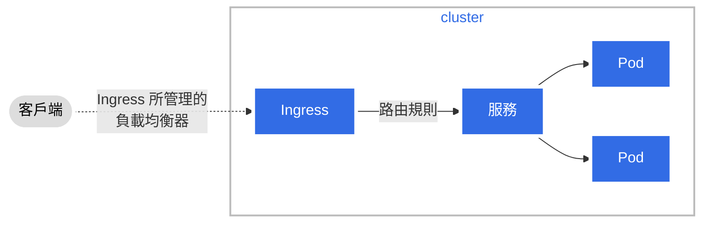

<!--
title: Diagram Guide
linktitle: Diagram guide
content_type: concept
weight: 15
-->

<!--Overview-->

<!--
This guide shows you how to create, edit and share diagrams using the Mermaid
JavaScript library. Mermaid.js allows you to generate diagrams using a simple
markdown-like syntax inside Markdown files. You can also use Mermaid to
generate `.svg` or `.png` image files that you can add to your documentation.

The target audience for this guide is anybody wishing to learn about Mermaid
and/or how to create and add diagrams to Kubernetes documentation.

Figure 1 outlines the topics covered in this section. 
-->
本指南為你展示如何建立、編輯和分享基於 Mermaid JavaScript 庫的圖表。
Mermaid.js 允許你使用簡單的、類似於 Markdown 的語法來在 Markdown 檔案中生成圖表。
你也可以使用 Mermaid 來建立 `.svg` 或 `.png` 圖片檔案，將其新增到你的文件中。

本指南的目標受眾是所有希望瞭解 Mermaid 的使用者，以及那些想了解如何建立圖表並將其新增到
Kubernetes 文件中的使用者。

圖 1 概要介紹的是本節所涉及的話題。


flowchart LR
subgraph m[Mermaid.js]
direction TB
S[ ]-.-
C[使用 markdown 來<br>構造圖表] -->
D[線上<br>編輯器]
end
A[為什麼圖表<br>很有用] --> m
m --> N[3 種建立<br>圖表的方法]
N --> T[示例]
T --> X[樣式<br>與標題]
X --> V[提示]


    classDef box fill:#fff,stroke:#000,stroke-width:1px,color:#000;
    classDef spacewhite fill:#ffffff,stroke:#fff,stroke-width:0px,color:#000
    class A,C,D,N,X,m,T,V box
    class S spacewhite

%% you can hyperlink Mermaid diagram nodes to a URL using click statements

click A "https://mermaid-js.github.io/mermaid-live-editor/edit/#eyJjb2RlIjoiZmxvd2NoYXJ0IExSXG4gICAgc3ViZ3JhcGggbVtNZXJtYWlkLmpzXVxuICAgIGRpcmVjdGlvbiBUQlxuICAgICAgICBTWyBdLS4tXG4gICAgICAgIENbYnVpbGQ8YnI-ZGlhZ3JhbXM8YnI-d2l0aCBtYXJrZG93bl0gLS0-XG4gICAgICAgIERbb24tbGluZTxicj5saXZlIGVkaXRvcl1cbiAgICBlbmRcbiAgICBBW1doeSBhcmUgZGlhZ3JhbXM8YnI-dXNlZnVsP10gLS0-IG1cbiAgICBtIC0tPiBOWzMgeCBtZXRob2RzPGJyPmZvciBjcmVhdGluZzxicj5kaWFncmFtc11cbiAgICBOIC0tPiBUW0V4YW1wbGVzXVxuICAgIFQgLS0-IFhbU3R5bGluZzxicj5hbmQ8YnI-Y2FwdGlvbnNdXG4gICAgWCAtLT4gVltUaXBzXVxuICAgIFxuIFxuICAgIGNsYXNzRGVmIGJveCBmaWxsOiNmZmYsc3Ryb2tlOiMwMDAsc3Ryb2tlLXdpZHRoOjFweCxjb2xvcjojMDAwO1xuICAgIGNsYXNzRGVmIHNwYWNld2hpdGUgZmlsbDojZmZmZmZmLHN0cm9rZTojZmZmLHN0cm9rZS13aWR0aDowcHgsY29sb3I6IzAwMFxuICAgIGNsYXNzIEEsQyxELE4sWCxtLFQsViBib3hcbiAgICBjbGFzcyBTIHNwYWNld2hpdGUiLCJtZXJtYWlkIjoie1xuICBcInRoZW1lXCI6IFwiZGVmYXVsdFwiXG59IiwidXBkYXRlRWRpdG9yIjpmYWxzZSwiYXV0b1N5bmMiOnRydWUsInVwZGF0ZURpYWdyYW0iOnRydWV9" _blank
click C "https://mermaid-js.github.io/mermaid-live-editor/edit/#eyJjb2RlIjoiZmxvd2NoYXJ0IExSXG4gICAgc3ViZ3JhcGggbVtNZXJtYWlkLmpzXVxuICAgIGRpcmVjdGlvbiBUQlxuICAgICAgICBTWyBdLS4tXG4gICAgICAgIENbYnVpbGQ8YnI-ZGlhZ3JhbXM8YnI-d2l0aCBtYXJrZG93bl0gLS0-XG4gICAgICAgIERbb24tbGluZTxicj5saXZlIGVkaXRvcl1cbiAgICBlbmRcbiAgICBBW1doeSBhcmUgZGlhZ3JhbXM8YnI-dXNlZnVsP10gLS0-IG1cbiAgICBtIC0tPiBOWzMgeCBtZXRob2RzPGJyPmZvciBjcmVhdGluZzxicj5kaWFncmFtc11cbiAgICBOIC0tPiBUW0V4YW1wbGVzXVxuICAgIFQgLS0-IFhbU3R5bGluZzxicj5hbmQ8YnI-Y2FwdGlvbnNdXG4gICAgWCAtLT4gVltUaXBzXVxuICAgIFxuIFxuICAgIGNsYXNzRGVmIGJveCBmaWxsOiNmZmYsc3Ryb2tlOiMwMDAsc3Ryb2tlLXdpZHRoOjFweCxjb2xvcjojMDAwO1xuICAgIGNsYXNzRGVmIHNwYWNld2hpdGUgZmlsbDojZmZmZmZmLHN0cm9rZTojZmZmLHN0cm9rZS13aWR0aDowcHgsY29sb3I6IzAwMFxuICAgIGNsYXNzIEEsQyxELE4sWCxtLFQsViBib3hcbiAgICBjbGFzcyBTIHNwYWNld2hpdGUiLCJtZXJtYWlkIjoie1xuICBcInRoZW1lXCI6IFwiZGVmYXVsdFwiXG59IiwidXBkYXRlRWRpdG9yIjpmYWxzZSwiYXV0b1N5bmMiOnRydWUsInVwZGF0ZURpYWdyYW0iOnRydWV9" _blank
click D "https://mermaid-js.github.io/mermaid-live-editor/edit/#eyJjb2RlIjoiZmxvd2NoYXJ0IExSXG4gICAgc3ViZ3JhcGggbVtNZXJtYWlkLmpzXVxuICAgIGRpcmVjdGlvbiBUQlxuICAgICAgICBTWyBdLS4tXG4gICAgICAgIENbYnVpbGQ8YnI-ZGlhZ3JhbXM8YnI-d2l0aCBtYXJrZG93bl0gLS0-XG4gICAgICAgIERbb24tbGluZTxicj5saXZlIGVkaXRvcl1cbiAgICBlbmRcbiAgICBBW1doeSBhcmUgZGlhZ3JhbXM8YnI-dXNlZnVsP10gLS0-IG1cbiAgICBtIC0tPiBOWzMgeCBtZXRob2RzPGJyPmZvciBjcmVhdGluZzxicj5kaWFncmFtc11cbiAgICBOIC0tPiBUW0V4YW1wbGVzXVxuICAgIFQgLS0-IFhbU3R5bGluZzxicj5hbmQ8YnI-Y2FwdGlvbnNdXG4gICAgWCAtLT4gVltUaXBzXVxuICAgIFxuIFxuICAgIGNsYXNzRGVmIGJveCBmaWxsOiNmZmYsc3Ryb2tlOiMwMDAsc3Ryb2tlLXdpZHRoOjFweCxjb2xvcjojMDAwO1xuICAgIGNsYXNzRGVmIHNwYWNld2hpdGUgZmlsbDojZmZmZmZmLHN0cm9rZTojZmZmLHN0cm9rZS13aWR0aDowcHgsY29sb3I6IzAwMFxuICAgIGNsYXNzIEEsQyxELE4sWCxtLFQsViBib3hcbiAgICBjbGFzcyBTIHNwYWNld2hpdGUiLCJtZXJtYWlkIjoie1xuICBcInRoZW1lXCI6IFwiZGVmYXVsdFwiXG59IiwidXBkYXRlRWRpdG9yIjpmYWxzZSwiYXV0b1N5bmMiOnRydWUsInVwZGF0ZURpYWdyYW0iOnRydWV9" _blank
click N "https://mermaid-js.github.io/mermaid-live-editor/edit/#eyJjb2RlIjoiZmxvd2NoYXJ0IExSXG4gICAgc3ViZ3JhcGggbVtNZXJtYWlkLmpzXVxuICAgIGRpcmVjdGlvbiBUQlxuICAgICAgICBTWyBdLS4tXG4gICAgICAgIENbYnVpbGQ8YnI-ZGlhZ3JhbXM8YnI-d2l0aCBtYXJrZG93bl0gLS0-XG4gICAgICAgIERbb24tbGluZTxicj5saXZlIGVkaXRvcl1cbiAgICBlbmRcbiAgICBBW1doeSBhcmUgZGlhZ3JhbXM8YnI-dXNlZnVsP10gLS0-IG1cbiAgICBtIC0tPiBOWzMgeCBtZXRob2RzPGJyPmZvciBjcmVhdGluZzxicj5kaWFncmFtc11cbiAgICBOIC0tPiBUW0V4YW1wbGVzXVxuICAgIFQgLS0-IFhbU3R5bGluZzxicj5hbmQ8YnI-Y2FwdGlvbnNdXG4gICAgWCAtLT4gVltUaXBzXVxuICAgIFxuIFxuICAgIGNsYXNzRGVmIGJveCBmaWxsOiNmZmYsc3Ryb2tlOiMwMDAsc3Ryb2tlLXdpZHRoOjFweCxjb2xvcjojMDAwO1xuICAgIGNsYXNzRGVmIHNwYWNld2hpdGUgZmlsbDojZmZmZmZmLHN0cm9rZTojZmZmLHN0cm9rZS13aWR0aDowcHgsY29sb3I6IzAwMFxuICAgIGNsYXNzIEEsQyxELE4sWCxtLFQsViBib3hcbiAgICBjbGFzcyBTIHNwYWNld2hpdGUiLCJtZXJtYWlkIjoie1xuICBcInRoZW1lXCI6IFwiZGVmYXVsdFwiXG59IiwidXBkYXRlRWRpdG9yIjpmYWxzZSwiYXV0b1N5bmMiOnRydWUsInVwZGF0ZURpYWdyYW0iOnRydWV9" _blank
click T "https://mermaid-js.github.io/mermaid-live-editor/edit/#eyJjb2RlIjoiZmxvd2NoYXJ0IExSXG4gICAgc3ViZ3JhcGggbVtNZXJtYWlkLmpzXVxuICAgIGRpcmVjdGlvbiBUQlxuICAgICAgICBTWyBdLS4tXG4gICAgICAgIENbYnVpbGQ8YnI-ZGlhZ3JhbXM8YnI-d2l0aCBtYXJrZG93bl0gLS0-XG4gICAgICAgIERbb24tbGluZTxicj5saXZlIGVkaXRvcl1cbiAgICBlbmRcbiAgICBBW1doeSBhcmUgZGlhZ3JhbXM8YnI-dXNlZnVsP10gLS0-IG1cbiAgICBtIC0tPiBOWzMgeCBtZXRob2RzPGJyPmZvciBjcmVhdGluZzxicj5kaWFncmFtc11cbiAgICBOIC0tPiBUW0V4YW1wbGVzXVxuICAgIFQgLS0-IFhbU3R5bGluZzxicj5hbmQ8YnI-Y2FwdGlvbnNdXG4gICAgWCAtLT4gVltUaXBzXVxuICAgIFxuIFxuICAgIGNsYXNzRGVmIGJveCBmaWxsOiNmZmYsc3Ryb2tlOiMwMDAsc3Ryb2tlLXdpZHRoOjFweCxjb2xvcjojMDAwO1xuICAgIGNsYXNzRGVmIHNwYWNld2hpdGUgZmlsbDojZmZmZmZmLHN0cm9rZTojZmZmLHN0cm9rZS13aWR0aDowcHgsY29sb3I6IzAwMFxuICAgIGNsYXNzIEEsQyxELE4sWCxtLFQsViBib3hcbiAgICBjbGFzcyBTIHNwYWNld2hpdGUiLCJtZXJtYWlkIjoie1xuICBcInRoZW1lXCI6IFwiZGVmYXVsdFwiXG59IiwidXBkYXRlRWRpdG9yIjpmYWxzZSwiYXV0b1N5bmMiOnRydWUsInVwZGF0ZURpYWdyYW0iOnRydWV9" _blank
click X "https://mermaid-js.github.io/mermaid-live-editor/edit/#eyJjb2RlIjoiZmxvd2NoYXJ0IExSXG4gICAgc3ViZ3JhcGggbVtNZXJtYWlkLmpzXVxuICAgIGRpcmVjdGlvbiBUQlxuICAgICAgICBTWyBdLS4tXG4gICAgICAgIENbYnVpbGQ8YnI-ZGlhZ3JhbXM8YnI-d2l0aCBtYXJrZG93bl0gLS0-XG4gICAgICAgIERbb24tbGluZTxicj5saXZlIGVkaXRvcl1cbiAgICBlbmRcbiAgICBBW1doeSBhcmUgZGlhZ3JhbXM8YnI-dXNlZnVsP10gLS0-IG1cbiAgICBtIC0tPiBOWzMgeCBtZXRob2RzPGJyPmZvciBjcmVhdGluZzxicj5kaWFncmFtc11cbiAgICBOIC0tPiBUW0V4YW1wbGVzXVxuICAgIFQgLS0-IFhbU3R5bGluZzxicj5hbmQ8YnI-Y2FwdGlvbnNdXG4gICAgWCAtLT4gVltUaXBzXVxuICAgIFxuIFxuICAgIGNsYXNzRGVmIGJveCBmaWxsOiNmZmYsc3Ryb2tlOiMwMDAsc3Ryb2tlLXdpZHRoOjFweCxjb2xvcjojMDAwO1xuICAgIGNsYXNzRGVmIHNwYWNld2hpdGUgZmlsbDojZmZmZmZmLHN0cm9rZTojZmZmLHN0cm9rZS13aWR0aDowcHgsY29sb3I6IzAwMFxuICAgIGNsYXNzIEEsQyxELE4sWCxtLFQsViBib3hcbiAgICBjbGFzcyBTIHNwYWNld2hpdGUiLCJtZXJtYWlkIjoie1xuICBcInRoZW1lXCI6IFwiZGVmYXVsdFwiXG59IiwidXBkYXRlRWRpdG9yIjpmYWxzZSwiYXV0b1N5bmMiOnRydWUsInVwZGF0ZURpYWdyYW0iOnRydWV9" _blank
click V "https://mermaid-js.github.io/mermaid-live-editor/edit/#eyJjb2RlIjoiZmxvd2NoYXJ0IExSXG4gICAgc3ViZ3JhcGggbVtNZXJtYWlkLmpzXVxuICAgIGRpcmVjdGlvbiBUQlxuICAgICAgICBTWyBdLS4tXG4gICAgICAgIENbYnVpbGQ8YnI-ZGlhZ3JhbXM8YnI-d2l0aCBtYXJrZG93bl0gLS0-XG4gICAgICAgIERbb24tbGluZTxicj5saXZlIGVkaXRvcl1cbiAgICBlbmRcbiAgICBBW1doeSBhcmUgZGlhZ3JhbXM8YnI-dXNlZnVsP10gLS0-IG1cbiAgICBtIC0tPiBOWzMgeCBtZXRob2RzPGJyPmZvciBjcmVhdGluZzxicj5kaWFncmFtc11cbiAgICBOIC0tPiBUW0V4YW1wbGVzXVxuICAgIFQgLS0-IFhbU3R5bGluZzxicj5hbmQ8YnI-Y2FwdGlvbnNdXG4gICAgWCAtLT4gVltUaXBzXVxuICAgIFxuIFxuICAgIGNsYXNzRGVmIGJveCBmaWxsOiNmZmYsc3Ryb2tlOiMwMDAsc3Ryb2tlLXdpZHRoOjFweCxjb2xvcjojMDAwO1xuICAgIGNsYXNzRGVmIHNwYWNld2hpdGUgZmlsbDojZmZmZmZmLHN0cm9rZTojZmZmLHN0cm9rZS13aWR0aDowcHgsY29sb3I6IzAwMFxuICAgIGNsYXNzIEEsQyxELE4sWCxtLFQsViBib3hcbiAgICBjbGFzcyBTIHNwYWNld2hpdGUiLCJtZXJtYWlkIjoie1xuICBcInRoZW1lXCI6IFwiZGVmYXVsdFwiXG59IiwidXBkYXRlRWRpdG9yIjpmYWxzZSwiYXV0b1N5bmMiOnRydWUsInVwZGF0ZURpYWdyYW0iOnRydWV9" _blank



<!--
Figure 1. Topics covered in this section.
-->
圖 1. 本節中涉及的話題.

<!--
All you need to begin working with Mermaid is the following:

* Basic understanding of markdown.
* Using the Mermaid live editor.
* Using [Hugo shortcodes](/docs/contribute/style/hugo-shortcodes/).
* Using the [Hugo  shortcode](https://gohugo.io/content-management/shortcodes/#figure).   
* Performing [Hugo local previews](/docs/contribute/new-content/open-a-pr/#preview-locally).
* Familiar with the [Contributing new content](/docs/contribute/new-content/) process.
-->
開始使用 Mermaid 之前，你需要以下準備：

* 對 Markdown 有一個基本的瞭解
* 使用 Mermaid 線上編輯器
* 使用 [Hugo 短程式碼（shortcode）](/zh-cn/docs/contribute/style/hugo-shortcodes/)
* 使用 [Hugo  短程式碼](https://gohugo.io/content-management/shortcodes/#figure)
* 執行 [Hugo 本地預覽](/zh-cn/docs/contribute/new-content/open-a-pr/#preview-locally)
* 熟悉[貢獻新內容](/zh-cn/docs/contribute/new-content/)的流程


<!--
You can click on each diagram in this section to view the code and rendered
diagram in the Mermaid live editor.
-->
你可以點選本節中的每個圖表來檢視其原始碼，以及在 Mermaid 線上編輯器中渲染的圖表結果。


<!--body-->

<!--
## Why you should use diagrams in documentation

Diagrams improve documentation clarity and comprehension. There are advantages for both the user and the contributor.
-->
## 你為什麼應該在程式碼中使用圖表

圖表可以增進文件的清晰度，便於理解。對於使用者和貢獻者而言都有好處。

<!--
The user benefits include:

* __Friendly landing spot__. A detailed text-only greeting page could
  intimidate users, in particular, first-time Kubernetes users. 
* __Faster grasp of concepts__. A diagram can help users understand the key
  points of a complex topic. Your diagram can serve as a visual learning guide
  to dive into the topic details. 
* __Better retention__. For some, it is easier to recall pictures rather than text.
-->
使用者獲得的好處有：
* __較為友好的初次體驗__：非常詳盡的、只包含文字的歡迎頁面對使用者而言是蠻恐怖的，
  尤其是初次接觸 Kubernetes 的使用者。
* __快速理解概念__：圖表可以幫助使用者理解複雜主題下的要點。
  你的圖表可以作為一種視覺化的學習指南，將使用者帶入主題的細節。
* __便於記憶__：對某些人而言，圖形（影象）要比文字更容易記憶。

<!--
The contributor benefits include:

* __Assist in developing the structure and content__ of your contribution. For
  example, you can start with a simple diagram covering the high-level points
  and then dive into details.  
* __Expand and grow the user community__. Easily consumed documentation
  augmented with diagrams attracts new users who might previously have been
  reluctant to engage due to perceived complexities. 
-->
對貢獻者而言的好處有：

* __幫助確立所貢獻文件的結構和內容__。例如，
  你可以先提供一個覆蓋所有頂層要點的圖表，然後再逐步展開細節。
* __培養使用者社群並提升其能力__ 容易理解的文件，附以圖表，能夠吸引新的使用者，
  尤其是那些因為預見到複雜性而不願參與的使用者。

<!--
You should consider your target audience. In addition to experienced K8s
users, you will have many who are new to Kubernetes. Even a simple diagram can
assist new users in absorbing Kubernetes concepts. They become emboldened and
more confident to further explore Kubernetes and the documentation.  
-->
你需要考慮你的目標受眾。除了一些有經驗的 K8s 使用者外，你還會遇到很多剛接觸
Kubernetes 的使用者。即使一張簡單的圖表也可以幫助新使用者吸收 Kubernetes 概念。
他們會變得更為大膽和自信，進一步地瞭解 Kubernetes 及其文件。

## Mermaid

<!--
[Mermaid](https://mermaid-js.github.io/mermaid/#/) is an open source
JavaScript library that allows you to create, edit and easily share diagrams
using a simple, markdown-like syntax configured inline in Markdown files.
-->
[Mermaid](https://mermaid-js.github.io/mermaid/#/) 是一個開源的 JavaScript 庫，
可以幫助你建立、編輯並很容易地分享圖表。這些圖表使用簡單的、類似 Markdown
的語法開發，並可內嵌到 Markdown 檔案中。

<!--
The following lists features of Mermaid: 

* Simple code syntax.
* Includes a web-based tool allowing you to code and preview your diagrams.
* Supports multiple formats including flowchart, state and sequence.
* Easy collaboration with colleagues by sharing a per-diagram URL. 
* Broad selection of shapes, lines, themes and styling. 
-->
下面是 Mermaid 的一些特性：

* 簡單的編碼語法
* 包含基於 Web 的工具，便於你編制和預覽你的圖表
* 支援包括流程圖、狀態圖、時序圖在內的多種格式
* 可以透過共享圖表的 URL 來與同事方便地合作
* 有豐富的形狀、線條、主題和樣式可供選擇

<!--
The following lists advantages of using Mermaid:

* No need for separate, non-Mermaid diagram tools.
* Adheres to existing PR workflow. You can think of Mermaid code as just
  Markdown text included in your PR.
* Simple tool builds simple diagrams. You don't want to get bogged down
  (re)crafting an overly complex and detailed picture. Keep it simple! 
-->
使用 Mermaid 的一些好處如下：

* 不需要使用另外的、非 Mermaid 的圖表工具
* 與現有的 PR 工作流結合的很好。你可以將 Mermaid 程式碼視為你的 PR 中所包含的
  Markdown 文字
* 簡單的工具生成簡單的圖表。你不需要精心製作或雕琢過於複雜或詳盡的圖片。
  保持簡單就好。

<!--
Mermaid provides a simple, open and transparent method for the SIG communities
to add, edit and collaborate on diagrams for new or existing documentation.
-->
Mermaid 提供一種簡單的、開放且透明的方法，便於 SIG 社群為新的或現有的文件新增、
編輯圖表並展開協作。


<!--
You can still use Mermaid to create/edit diagrams even if it's not supported
in your environment. This method is called __Mermaid+SVG__ and is explained
below.
-->
即使你的工作環境中不支援，你仍然可以使用 Mermaid 來建立、編輯圖表。
這種方法稱作 __Mermaid+SVG__，在後文詳細解釋。


<!--
### Live editor

The [Mermaid live editor](https://mermaid-js.github.io/mermaid-live-editor) is
a web-based tool that enables you to create, edit and review diagrams. 
-->
### 線上編輯器

[Mermaid 線上編輯器](https://mermaid-js.github.io/mermaid-live-editor)是一個基於 
Web 的工具，允許你建立、編輯和審閱圖表。

<!--
The following lists live editor functions:

* Displays Mermaid code and rendered diagram. 
* Generates a URL for each saved diagram. The URL is displayed in the URL
  field of your browser. You can share the URL with colleagues who can access
  and modify the diagram. 
* Option to download `.svg` or `.png` files. 
-->
線上編輯器的功能主要有：

* 顯示 Mermaid 程式碼和渲染的圖表。
* 為所儲存的每個圖表生成一個 URL。該 URL 顯示在你的瀏覽器的 URL 欄位中。
  你可以將 URL 分享給同事，便於他人訪問和更改圖表。
* 提供將圖表下載為 `.svg` 或 `.png` 檔案的選項。



<!--
The live editor is the easiest and fastest way to create and edit Mermaid diagrams. 
-->
線上編輯器是建立和編輯 Mermaid 圖表的最簡單的，也是最快的方式。


<!--
## Methods for creating diagrams

Figure 2 outlines the three methods to generate and add diagrams.
-->
## 建立圖表的方法   {#methods-for-creating-diagrams}

圖 2 給出三種生成和新增圖表的方法。


graph TB
A[貢獻者]
B[向 .md 檔案<br><br>中內嵌<br>Mermaid 程式碼]
C[Mermaid+SVG<br><br>將 Mermaid 所生成的<br>SVG 檔案新增到 .md 檔案]
D[外部工具<br><br>新增外部工具<br>所生成的 SVG<br>檔案到 .md 檔案]

    A --> B
    A --> C
    A --> D

    classDef box fill:#fff,stroke:#000,stroke-width:1px,color:#000;
    class A,B,C,D box

%% 你可以使用 click 語句為 Mermaid 節點設定指向某 URL 的超連結

click A "https://mermaid-js.github.io/mermaid-live-editor/edit/#eyJjb2RlIjoiZ3JhcGggVEJcbiAgICBBW0NvbnRyaWJ1dG9yXVxuICAgIEJbSW5saW5lPGJyPjxicj5NZXJtYWlkIGNvZGU8YnI-YWRkZWQgdG8gLm1kIGZpbGVdXG4gICAgQ1tNZXJtYWlkK1NWRzxicj48YnI-QWRkIG1lcm1haWQtZ2VuZXJhdGVkPGJyPnN2ZyBmaWxlIHRvIC5tZCBmaWxlXVxuICAgIERbRXh0ZXJuYWwgdG9vbDxicj48YnI-QWRkIGV4dGVybmFsLXRvb2wtPGJyPmdlbmVyYXRlZCBzdmcgZmlsZTxicj50byAubWQgZmlsZV1cblxuICAgIEEgLS0-IEJcbiAgICBBIC0tPiBDXG4gICAgQSAtLT4gRFxuXG4gICAgY2xhc3NEZWYgYm94IGZpbGw6I2ZmZixzdHJva2U6IzAwMCxzdHJva2Utd2lkdGg6MXB4LGNvbG9yOiMwMDA7XG4gICAgY2xhc3MgQSxCLEMsRCBib3giLCJtZXJtYWlkIjoie1xuICBcInRoZW1lXCI6IFwiZGVmYXVsdFwiXG59IiwidXBkYXRlRWRpdG9yIjpmYWxzZSwiYXV0b1N5bmMiOnRydWUsInVwZGF0ZURpYWdyYW0iOmZhbHNlfQ" _blank

click B "https://mermaid-js.github.io/mermaid-live-editor/edit/#eyJjb2RlIjoiZ3JhcGggVEJcbiAgICBBW0NvbnRyaWJ1dG9yXVxuICAgIEJbSW5saW5lPGJyPjxicj5NZXJtYWlkIGNvZGU8YnI-YWRkZWQgdG8gLm1kIGZpbGVdXG4gICAgQ1tNZXJtYWlkK1NWRzxicj48YnI-QWRkIG1lcm1haWQtZ2VuZXJhdGVkPGJyPnN2ZyBmaWxlIHRvIC5tZCBmaWxlXVxuICAgIERbRXh0ZXJuYWwgdG9vbDxicj48YnI-QWRkIGV4dGVybmFsLXRvb2wtPGJyPmdlbmVyYXRlZCBzdmcgZmlsZTxicj50byAubWQgZmlsZV1cblxuICAgIEEgLS0-IEJcbiAgICBBIC0tPiBDXG4gICAgQSAtLT4gRFxuXG4gICAgY2xhc3NEZWYgYm94IGZpbGw6I2ZmZixzdHJva2U6IzAwMCxzdHJva2Utd2lkdGg6MXB4LGNvbG9yOiMwMDA7XG4gICAgY2xhc3MgQSxCLEMsRCBib3giLCJtZXJtYWlkIjoie1xuICBcInRoZW1lXCI6IFwiZGVmYXVsdFwiXG59IiwidXBkYXRlRWRpdG9yIjpmYWxzZSwiYXV0b1N5bmMiOnRydWUsInVwZGF0ZURpYWdyYW0iOmZhbHNlfQ" _blank

click C "https://mermaid-js.github.io/mermaid-live-editor/edit/#eyJjb2RlIjoiZ3JhcGggVEJcbiAgICBBW0NvbnRyaWJ1dG9yXVxuICAgIEJbSW5saW5lPGJyPjxicj5NZXJtYWlkIGNvZGU8YnI-YWRkZWQgdG8gLm1kIGZpbGVdXG4gICAgQ1tNZXJtYWlkK1NWRzxicj48YnI-QWRkIG1lcm1haWQtZ2VuZXJhdGVkPGJyPnN2ZyBmaWxlIHRvIC5tZCBmaWxlXVxuICAgIERbRXh0ZXJuYWwgdG9vbDxicj48YnI-QWRkIGV4dGVybmFsLXRvb2wtPGJyPmdlbmVyYXRlZCBzdmcgZmlsZTxicj50byAubWQgZmlsZV1cblxuICAgIEEgLS0-IEJcbiAgICBBIC0tPiBDXG4gICAgQSAtLT4gRFxuXG4gICAgY2xhc3NEZWYgYm94IGZpbGw6I2ZmZixzdHJva2U6IzAwMCxzdHJva2Utd2lkdGg6MXB4LGNvbG9yOiMwMDA7XG4gICAgY2xhc3MgQSxCLEMsRCBib3giLCJtZXJtYWlkIjoie1xuICBcInRoZW1lXCI6IFwiZGVmYXVsdFwiXG59IiwidXBkYXRlRWRpdG9yIjpmYWxzZSwiYXV0b1N5bmMiOnRydWUsInVwZGF0ZURpYWdyYW0iOmZhbHNlfQ" _blank

click D "https://mermaid-js.github.io/mermaid-live-editor/edit/#eyJjb2RlIjoiZ3JhcGggVEJcbiAgICBBW0NvbnRyaWJ1dG9yXVxuICAgIEJbSW5saW5lPGJyPjxicj5NZXJtYWlkIGNvZGU8YnI-YWRkZWQgdG8gLm1kIGZpbGVdXG4gICAgQ1tNZXJtYWlkK1NWRzxicj48YnI-QWRkIG1lcm1haWQtZ2VuZXJhdGVkPGJyPnN2ZyBmaWxlIHRvIC5tZCBmaWxlXVxuICAgIERbRXh0ZXJuYWwgdG9vbDxicj48YnI-QWRkIGV4dGVybmFsLXRvb2wtPGJyPmdlbmVyYXRlZCBzdmcgZmlsZTxicj50byAubWQgZmlsZV1cblxuICAgIEEgLS0-IEJcbiAgICBBIC0tPiBDXG4gICAgQSAtLT4gRFxuXG4gICAgY2xhc3NEZWYgYm94IGZpbGw6I2ZmZixzdHJva2U6IzAwMCxzdHJva2Utd2lkdGg6MXB4LGNvbG9yOiMwMDA7XG4gICAgY2xhc3MgQSxCLEMsRCBib3giLCJtZXJtYWlkIjoie1xuICBcInRoZW1lXCI6IFwiZGVmYXVsdFwiXG59IiwidXBkYXRlRWRpdG9yIjpmYWxzZSwiYXV0b1N5bmMiOnRydWUsInVwZGF0ZURpYWdyYW0iOmZhbHNlfQ" _blank

 

<!--
Figure 2. Methods to create diagrams.
-->
圖 2. 建立圖表的方法


<!--
### Inline

Figure 3 outlines the steps to follow for adding a diagram using the Inline
method. 
-->
### 內嵌（Inline）

圖 3 給出的是使用內嵌方法來新增圖表所遵循的步驟。


graph LR
A[1. 使用線上編輯器<br>來建立或編輯<br>圖表] -->
B[2. 將圖表的 URL<br>儲存到某處] -->
C[3. 將 Mermaid 程式碼<br>複製到 markdown 檔案中] -->
D[4. 新增圖表標題]


    classDef box fill:#fff,stroke:#000,stroke-width:1px,color:#000;
    class A,B,C,D box

%% 你可以使用 click 語句為 Mermaid 節點設定指向某 URL 的超連結

click A "https://mermaid-js.github.io/mermaid-live-editor/edit/#eyJjb2RlIjoiZ3JhcGggTFJcbiAgICBBWzEuIFVzZSBsaXZlIGVkaXRvcjxicj4gdG8gY3JlYXRlL2VkaXQ8YnI-ZGlhZ3JhbV0gLS0-XG4gICAgQlsyLiBTdG9yZSBkaWFncmFtPGJyPlVSTCBzb21ld2hlcmVdIC0tPlxuICAgIENbMy4gQ29weSBNZXJtYWlkIGNvZGU8YnI-dG8gcGFnZSBtYXJrZG93biBmaWxlXSAtLT5cbiAgICBEWzQuIEFkZCBjYXB0aW9uXVxuIFxuXG4gICAgY2xhc3NEZWYgYm94IGZpbGw6I2ZmZixzdHJva2U6IzAwMCxzdHJva2Utd2lkdGg6MXB4LGNvbG9yOiMwMDA7XG4gICAgY2xhc3MgQSxCLEMsRCBib3hcbiAgICAiLCJtZXJtYWlkIjoie1xuICBcInRoZW1lXCI6IFwiZGVmYXVsdFwiXG59IiwidXBkYXRlRWRpdG9yIjpmYWxzZSwiYXV0b1N5bmMiOnRydWUsInVwZGF0ZURpYWdyYW0iOmZhbHNlfQ" _blank

click B "https://mermaid-js.github.io/mermaid-live-editor/edit/#eyJjb2RlIjoiZ3JhcGggTFJcbiAgICBBWzEuIFVzZSBsaXZlIGVkaXRvcjxicj4gdG8gY3JlYXRlL2VkaXQ8YnI-ZGlhZ3JhbV0gLS0-XG4gICAgQlsyLiBTdG9yZSBkaWFncmFtPGJyPlVSTCBzb21ld2hlcmVdIC0tPlxuICAgIENbMy4gQ29weSBNZXJtYWlkIGNvZGU8YnI-dG8gcGFnZSBtYXJrZG93biBmaWxlXSAtLT5cbiAgICBEWzQuIEFkZCBjYXB0aW9uXVxuIFxuXG4gICAgY2xhc3NEZWYgYm94IGZpbGw6I2ZmZixzdHJva2U6IzAwMCxzdHJva2Utd2lkdGg6MXB4LGNvbG9yOiMwMDA7XG4gICAgY2xhc3MgQSxCLEMsRCBib3hcbiAgICAiLCJtZXJtYWlkIjoie1xuICBcInRoZW1lXCI6IFwiZGVmYXVsdFwiXG59IiwidXBkYXRlRWRpdG9yIjpmYWxzZSwiYXV0b1N5bmMiOnRydWUsInVwZGF0ZURpYWdyYW0iOmZhbHNlfQ" _blank

click C "https://mermaid-js.github.io/mermaid-live-editor/edit/#eyJjb2RlIjoiZ3JhcGggTFJcbiAgICBBWzEuIFVzZSBsaXZlIGVkaXRvcjxicj4gdG8gY3JlYXRlL2VkaXQ8YnI-ZGlhZ3JhbV0gLS0-XG4gICAgQlsyLiBTdG9yZSBkaWFncmFtPGJyPlVSTCBzb21ld2hlcmVdIC0tPlxuICAgIENbMy4gQ29weSBNZXJtYWlkIGNvZGU8YnI-dG8gcGFnZSBtYXJrZG93biBmaWxlXSAtLT5cbiAgICBEWzQuIEFkZCBjYXB0aW9uXVxuIFxuXG4gICAgY2xhc3NEZWYgYm94IGZpbGw6I2ZmZixzdHJva2U6IzAwMCxzdHJva2Utd2lkdGg6MXB4LGNvbG9yOiMwMDA7XG4gICAgY2xhc3MgQSxCLEMsRCBib3hcbiAgICAiLCJtZXJtYWlkIjoie1xuICBcInRoZW1lXCI6IFwiZGVmYXVsdFwiXG59IiwidXBkYXRlRWRpdG9yIjpmYWxzZSwiYXV0b1N5bmMiOnRydWUsInVwZGF0ZURpYWdyYW0iOmZhbHNlfQ" _blank

click D "https://mermaid-js.github.io/mermaid-live-editor/edit/#eyJjb2RlIjoiZ3JhcGggTFJcbiAgICBBWzEuIFVzZSBsaXZlIGVkaXRvcjxicj4gdG8gY3JlYXRlL2VkaXQ8YnI-ZGlhZ3JhbV0gLS0-XG4gICAgQlsyLiBTdG9yZSBkaWFncmFtPGJyPlVSTCBzb21ld2hlcmVdIC0tPlxuICAgIENbMy4gQ29weSBNZXJtYWlkIGNvZGU8YnI-dG8gcGFnZSBtYXJrZG93biBmaWxlXSAtLT5cbiAgICBEWzQuIEFkZCBjYXB0aW9uXVxuIFxuXG4gICAgY2xhc3NEZWYgYm94IGZpbGw6I2ZmZixzdHJva2U6IzAwMCxzdHJva2Utd2lkdGg6MXB4LGNvbG9yOiMwMDA7XG4gICAgY2xhc3MgQSxCLEMsRCBib3hcbiAgICAiLCJtZXJtYWlkIjoie1xuICBcInRoZW1lXCI6IFwiZGVmYXVsdFwiXG59IiwidXBkYXRlRWRpdG9yIjpmYWxzZSwiYXV0b1N5bmMiOnRydWUsInVwZGF0ZURpYWdyYW0iOmZhbHNlfQ" _blank



<!--
Figure 3. Inline Method steps.
-->
圖 3. 內嵌方法的步驟

<!--
The following lists the steps you should follow for adding a diagram using the Inline method:

1. Create your diagram using the live editor. 
2. Store the diagram URL somewhere for later access.
3. Copy the mermaid code to the location in your `.md` file where you want the diagram to appear. 
4. Add a caption below the diagram using Markdown text.
-->
下面是使用內嵌方法來新增圖表時你要執行的步驟：

1. 使用線上編輯器建立你的圖表
1. 將圖表的 URL 儲存在某處以便以後訪問
1. 將 Mermaid 程式碼複製到你的 `.md` 檔案中你希望它出現的位置
1. 使用 Markdown 文字在圖表下方為其新增標題

<!--
A Hugo build runs the Mermaid code and turns it into a diagram.
-->
Hugo 在構造（網站）過程中會執行 Mermaid 程式碼，將其轉換為圖表。


<!--
You may find keeping track of diagram URLs is cumbersome. If so, make a note
in the `.md` file that the Mermaid code is self-documenting. Contributors can
copy the Mermaid code to and from the live editor for diagram edits.
-->
你可能認為記錄圖表 URL 是一個麻煩的過程。如果確實如此，你可以在 `.md` 檔案中作一個記錄，
標明該 Mermaid 程式碼是自說明的。貢獻者可以將 Mermaid 程式碼複製到線上編輯器中編輯，
或者將其從線上編輯器中複製出來。


<!--
Here is a sample code snippet contained in an `.md` file:    
-->
下面是一段包含在某 `.md` 檔案中的示例程式碼片段：

```
---
title: 我的文件
---
Figure 17 給出從 A 到 B 的一個簡單流程。
這裡是其他 markdown 文字
...
 
    graph TB
    A --> B


圖 17. 從 A 到 B

其他文字
```


<!--
You must include the ``, `` shortcode
tags at the start and end of the Mermaid code block. You should add a diagram
caption below the diagram. 
-->
你必須在 Mermaid 程式碼塊之前和之後分別新增 ``、``
短程式碼標記，而且你應該在圖表之後為其新增圖表標題。


<!--
For more details on diagram captions, see [How to use captions](#how-to-use-captions).
-->
有關新增圖表標題的細節，參閱[如何使用標題](#how-to-use-captions)。

<!--
The following lists advantages of the Inline method:

* Live editor tool. 
* Easy to copy Mermaid code to and from the live editor and your `.md` file.
* No need for separate `.svg` image file handling.
* Content text, diagram code and diagram caption contained in the same `.md` file.
-->
使用內嵌方法的好處有：

* 可以直接使用線上編輯器工具
* 很容易在線上編輯器與你的 `.md` 檔案之間來回複製 Mermaid 程式碼
* 不需要額外處理 `.svg` 圖片檔案
* 內容文字、圖表程式碼和圖表標題都位於同一個 `.md` 檔案中。

<!--
You should use the [local](/docs/contribute/new-content/open-a-pr/#preview-locally)
and Netlify previews to verify the diagram is properly rendered. 
-->
你應該使用[本地](/zh-cn/docs/contribute/new-content/open-a-pr/#preview-locally)和 Netlify
預覽來驗證圖表是可以正常渲染的。


<!--
The Mermaid live editor feature set may not support the K8s/website Mermaid feature set. 
You might see a syntax error or a blank screen after the Hugo build.
If that is the case, consider using the Mermaid+SVG method. 
-->
Mermaid 線上編輯器的功能特性可能不支援 K8s 網站的 Mermaid 特性。
你可能在 Hugo 構建過程中看到語法錯誤提示或者空白螢幕。
如果發生這類情況，可以考慮使用 Mermaid+SVG 方法。


### Mermaid+SVG

<!--
Figure 4 outlines the steps to follow for adding a diagram using the Mermaid+SVG method.
-->
圖 4 給出的是使用 Mermaid+SVG 方法新增圖表所要遵循的步驟：


flowchart LR
A[1. 使用線上編輯器<br>建立或編輯<br>圖表]
B[2. 將圖表的 URL<br>儲存到別處]
C[3. 生成 .svg 檔案<br>並將其下載到<br>images/ 目錄]
subgraph w[ ]
direction TB
D[4. 使用 figure 短程式碼<br>來在 .md 檔案中<br>引用 .svg 檔案] -->
E[5. 新增圖表標題]
end
A --> B
B --> C
C --> w

    classDef box fill:#fff,stroke:#000,stroke-width:1px,color:#000;
    class A,B,C,D,E,w box

click A "https://mermaid-js.github.io/mermaid-live-editor/edit/#eyJjb2RlIjoiZmxvd2NoYXJ0IExSXG4gICAgQVsxLiBVc2UgbGl2ZSBlZGl0b3I8YnI-IHRvIGNyZWF0ZS9lZGl0PGJyPmRpYWdyYW1dXG4gICAgQlsyLiBTdG9yZSBkaWFncmFtPGJyPlVSTCBzb21ld2hlcmVdXG4gICAgQ1szLiBHZW5lcmF0ZSAuc3ZnIGZpbGU8YnI-YW5kIGRvd25sb2FkIHRvPGJyPmltYWdlcy8gZm9sZGVyXVxuICAgIHN1YmdyYXBoIHdbIF1cbiAgICBkaXJlY3Rpb24gVEJcbiAgICBEWzQuIFVzZSBmaWd1cmUgc2hvcnRjb2RlPGJyPnRvIHJlZmVyZW5jZSAuc3ZnPGJyPmZpbGUgaW4gcGFnZTxicj4ubWQgZmlsZV0gLS0-XG4gICAgRVs1LiBBZGQgY2FwdGlvbl1cbiAgICBlbmRcbkEgLS0-IEJcbkIgLS0-IENcbkMgLS0-IHdcblxuICAgIGNsYXNzRGVmIGJveCBmaWxsOiNmZmYsc3Ryb2tlOiMwMDAsc3Ryb2tlLXdpZHRoOjFweCxjb2xvcjojMDAwO1xuICAgIGNsYXNzIEEsQixDLEQsRSx3IGJveFxuICAgICIsIm1lcm1haWQiOiJ7XG4gIFwidGhlbWVcIjogXCJkZWZhdWx0XCJcbn0iLCJ1cGRhdGVFZGl0b3IiOmZhbHNlLCJhdXRvU3luYyI6dHJ1ZSwidXBkYXRlRGlhZ3JhbSI6dHJ1ZX0" _blank

click B "https://mermaid-js.github.io/mermaid-live-editor/edit/#eyJjb2RlIjoiZmxvd2NoYXJ0IExSXG4gICAgQVsxLiBVc2UgbGl2ZSBlZGl0b3I8YnI-IHRvIGNyZWF0ZS9lZGl0PGJyPmRpYWdyYW1dXG4gICAgQlsyLiBTdG9yZSBkaWFncmFtPGJyPlVSTCBzb21ld2hlcmVdXG4gICAgQ1szLiBHZW5lcmF0ZSAuc3ZnIGZpbGU8YnI-YW5kIGRvd25sb2FkIHRvPGJyPmltYWdlcy8gZm9sZGVyXVxuICAgIHN1YmdyYXBoIHdbIF1cbiAgICBkaXJlY3Rpb24gVEJcbiAgICBEWzQuIFVzZSBmaWd1cmUgc2hvcnRjb2RlPGJyPnRvIHJlZmVyZW5jZSAuc3ZnPGJyPmZpbGUgaW4gcGFnZTxicj4ubWQgZmlsZV0gLS0-XG4gICAgRVs1LiBBZGQgY2FwdGlvbl1cbiAgICBlbmRcbkEgLS0-IEJcbkIgLS0-IENcbkMgLS0-IHdcblxuICAgIGNsYXNzRGVmIGJveCBmaWxsOiNmZmYsc3Ryb2tlOiMwMDAsc3Ryb2tlLXdpZHRoOjFweCxjb2xvcjojMDAwO1xuICAgIGNsYXNzIEEsQixDLEQsRSx3IGJveFxuICAgICIsIm1lcm1haWQiOiJ7XG4gIFwidGhlbWVcIjogXCJkZWZhdWx0XCJcbn0iLCJ1cGRhdGVFZGl0b3IiOmZhbHNlLCJhdXRvU3luYyI6dHJ1ZSwidXBkYXRlRGlhZ3JhbSI6dHJ1ZX0" _blank

click C "https://mermaid-js.github.io/mermaid-live-editor/edit/#eyJjb2RlIjoiZmxvd2NoYXJ0IExSXG4gICAgQVsxLiBVc2UgbGl2ZSBlZGl0b3I8YnI-IHRvIGNyZWF0ZS9lZGl0PGJyPmRpYWdyYW1dXG4gICAgQlsyLiBTdG9yZSBkaWFncmFtPGJyPlVSTCBzb21ld2hlcmVdXG4gICAgQ1szLiBHZW5lcmF0ZSAuc3ZnIGZpbGU8YnI-YW5kIGRvd25sb2FkIHRvPGJyPmltYWdlcy8gZm9sZGVyXVxuICAgIHN1YmdyYXBoIHdbIF1cbiAgICBkaXJlY3Rpb24gVEJcbiAgICBEWzQuIFVzZSBmaWd1cmUgc2hvcnRjb2RlPGJyPnRvIHJlZmVyZW5jZSAuc3ZnPGJyPmZpbGUgaW4gcGFnZTxicj4ubWQgZmlsZV0gLS0-XG4gICAgRVs1LiBBZGQgY2FwdGlvbl1cbiAgICBlbmRcbkEgLS0-IEJcbkIgLS0-IENcbkMgLS0-IHdcblxuICAgIGNsYXNzRGVmIGJveCBmaWxsOiNmZmYsc3Ryb2tlOiMwMDAsc3Ryb2tlLXdpZHRoOjFweCxjb2xvcjojMDAwO1xuICAgIGNsYXNzIEEsQixDLEQsRSx3IGJveFxuICAgICIsIm1lcm1haWQiOiJ7XG4gIFwidGhlbWVcIjogXCJkZWZhdWx0XCJcbn0iLCJ1cGRhdGVFZGl0b3IiOmZhbHNlLCJhdXRvU3luYyI6dHJ1ZSwidXBkYXRlRGlhZ3JhbSI6dHJ1ZX0" _blank

click D "https://mermaid-js.github.io/mermaid-live-editor/edit/#eyJjb2RlIjoiZmxvd2NoYXJ0IExSXG4gICAgQVsxLiBVc2UgbGl2ZSBlZGl0b3I8YnI-IHRvIGNyZWF0ZS9lZGl0PGJyPmRpYWdyYW1dXG4gICAgQlsyLiBTdG9yZSBkaWFncmFtPGJyPlVSTCBzb21ld2hlcmVdXG4gICAgQ1szLiBHZW5lcmF0ZSAuc3ZnIGZpbGU8YnI-YW5kIGRvd25sb2FkIHRvPGJyPmltYWdlcy8gZm9sZGVyXVxuICAgIHN1YmdyYXBoIHdbIF1cbiAgICBkaXJlY3Rpb24gVEJcbiAgICBEWzQuIFVzZSBmaWd1cmUgc2hvcnRjb2RlPGJyPnRvIHJlZmVyZW5jZSAuc3ZnPGJyPmZpbGUgaW4gcGFnZTxicj4ubWQgZmlsZV0gLS0-XG4gICAgRVs1LiBBZGQgY2FwdGlvbl1cbiAgICBlbmRcbkEgLS0-IEJcbkIgLS0-IENcbkMgLS0-IHdcblxuICAgIGNsYXNzRGVmIGJveCBmaWxsOiNmZmYsc3Ryb2tlOiMwMDAsc3Ryb2tlLXdpZHRoOjFweCxjb2xvcjojMDAwO1xuICAgIGNsYXNzIEEsQixDLEQsRSx3IGJveFxuICAgICIsIm1lcm1haWQiOiJ7XG4gIFwidGhlbWVcIjogXCJkZWZhdWx0XCJcbn0iLCJ1cGRhdGVFZGl0b3IiOmZhbHNlLCJhdXRvU3luYyI6dHJ1ZSwidXBkYXRlRGlhZ3JhbSI6dHJ1ZX0" _blank

click E "https://mermaid-js.github.io/mermaid-live-editor/edit/#eyJjb2RlIjoiZmxvd2NoYXJ0IExSXG4gICAgQVsxLiBVc2UgbGl2ZSBlZGl0b3I8YnI-IHRvIGNyZWF0ZS9lZGl0PGJyPmRpYWdyYW1dXG4gICAgQlsyLiBTdG9yZSBkaWFncmFtPGJyPlVSTCBzb21ld2hlcmVdXG4gICAgQ1szLiBHZW5lcmF0ZSAuc3ZnIGZpbGU8YnI-YW5kIGRvd25sb2FkIHRvPGJyPmltYWdlcy8gZm9sZGVyXVxuICAgIHN1YmdyYXBoIHdbIF1cbiAgICBkaXJlY3Rpb24gVEJcbiAgICBEWzQuIFVzZSBmaWd1cmUgc2hvcnRjb2RlPGJyPnRvIHJlZmVyZW5jZSAuc3ZnPGJyPmZpbGUgaW4gcGFnZTxicj4ubWQgZmlsZV0gLS0-XG4gICAgRVs1LiBBZGQgY2FwdGlvbl1cbiAgICBlbmRcbkEgLS0-IEJcbkIgLS0-IENcbkMgLS0-IHdcblxuICAgIGNsYXNzRGVmIGJveCBmaWxsOiNmZmYsc3Ryb2tlOiMwMDAsc3Ryb2tlLXdpZHRoOjFweCxjb2xvcjojMDAwO1xuICAgIGNsYXNzIEEsQixDLEQsRSx3IGJveFxuICAgICIsIm1lcm1haWQiOiJ7XG4gIFwidGhlbWVcIjogXCJkZWZhdWx0XCJcbn0iLCJ1cGRhdGVFZGl0b3IiOmZhbHNlLCJhdXRvU3luYyI6dHJ1ZSwidXBkYXRlRGlhZ3JhbSI6dHJ1ZX0" _blank




<!--
Figure 4. Mermaid+SVG method steps.
-->
圖 4. Mermaid+SVG 方法的步驟。

<!--
The following lists the steps you should follow for adding a diagram using the Mermaid+SVG method:

1. Create your diagram using the live editor. 
2. Store the diagram URL somewhere for later access.
3. Generate an `.svg` image file for the diagram and download it to the appropriate `images/` folder. 
4. Use the `` shortcode to reference the diagram in the `.md` file. 
5. Add a caption using the `` shortcode's `caption` parameter.
-->
使用 Mermaid+SVG 方法來新增圖表時你要遵從的步驟：

1. 使用線上編輯器建立你的圖表
1. 將圖表的 URL 儲存到某處以便以後訪問
1. 為你的圖表生成 `.svg` 檔案，並將其下載到合適的 `images/` 目錄下
1. 使用 `` 短程式碼在 `.md` 檔案中引用該圖表
1. 使用 `` 短程式碼的 `caption` 引數為圖表設定標題

<!--
For example, use the live editor to create a diagram called `boxnet`.
Store the diagram URL somewhere for later access. Generate and download a
`boxnet.svg` file to the appropriate `../images/` folder. 
-->
例如，使用線上編輯器建立一個名為 `boxnet` 的圖表。
將圖表的 URL 儲存到別處以便以後訪問。生成 `boxnet.svg` 檔案並將其下載到合適的
`../images/` 目錄下。

<!--
Use the `` shortcode in your PR's `.md` file to reference
the `.svg` image file and add a caption.
-->
在你的 PR 中的 `.md` 檔案內使用 `` 短程式碼來引用
`.svg` 圖片檔案，併為之新增標題。

<!--
```json

```
-->
```json

```

<!--
For more details on diagram captions, see [How to use captions](#how-to-use-captions).
-->
關於圖表標題的細節，可參閱[如何使用標題](#how-to-use-captions)。


<!--
The `` shortcode is the preferred method for adding `.svg` image files
to your documentation. You can also use the standard markdown image syntax like so:
``.
And you will need to add a caption below the diagram. 
-->
使用 `` 短程式碼是向你的文件中新增 `.svg` 圖片檔案的優選方法。
你也可以使用標準的 markdown 圖片語法，即
``。
如果是後面這種，則需要在圖表下面為其新增標題。


<!--
You should add the live editor URL as a comment block in the `.svg` image file using a text editor.
For example, you would include the following at the beginning of the `.svg` image file:
-->
你應該使用文字編輯器以註釋塊的形式在 `.svg` 圖片檔案中新增線上編輯器的 URL。
例如，你應該在 `.svg` 圖片檔案的開頭部分包含下面的內容：

```
<!-- 要檢視或者編輯 Mermaid 程式碼，可訪問下面的 URL：-->
<!-- https://mermaid-js.github.io/mermaid-live-editor/edit/#eyJjb ... <URL 的其餘部分> -->
```

<!--
The following lists advantages of the Mermaid+SVG method:

* Live editor tool.
* Live editor tool supports the most current Mermaid feature set.  
* Employ existing K8s/website methods for handling `.svg` image files.
* Environment doesn't require Mermaid support.
-->
使用 Mermaid+SVG 方法的好處有：

* 可以直接使用線上編輯器工具
* 線上編輯器支援的 Mermaid 特性集合最新
* 可以利用 K8s 網站用來處理 `.svg` 圖片檔案的現有方法
* 工作環境不需要 Mermaid 支援

<!--
Be sure to check that your diagram renders properly using the
[local](/docs/contribute/new-content/open-a-pr/#preview-locally)
and Netlify previews.
-->
要使用[本地](/zh-cn/docs/contribute/new-content/open-a-pr/#preview-locally)和
Netlify 預覽來檢查你的圖表可以正常渲染。

<!--
### External tool

Figure 5 outlines the steps to follow for adding a diagram using the External Tool method. 

First, use your external tool to create the diagram and save it as an `.svg`
or `.png` image file. After that, use the same steps as the __Mermaid+SVG__
method for adding `.svg` image files.
-->
### 外部工具

圖 5 給出使用外部工具來新增圖表時所遵循的步驟。

首先，要使用你的外部工具來建立圖表，並將其儲存為一個 `.svg` 檔案或 `.png` 圖片檔案。
之後，使用 __Mermaid+SVG__ 方法中相同的步驟新增 `.svg`（`.png`）檔案。


flowchart LR

A[1. 使用外部工具<br>來建立或編輯<br>圖表]
B[2. 如果可能儲存<br>圖表位置供<br> 其他貢獻者訪問]
C[3. 生成 .svg 檔案<br>或 .png 檔案<br>並將其下載到<br>合適的 images/ 目錄]

subgraph w[ ]
direction TB
D[4. 使用 figure 短程式碼<br>在你的 .md 檔案中<br>引用該 SVG 或 PNG<br>檔案] -->
E[5. 為圖表新增標題]
end
A --> B
B --> C
C --> w

    classDef box fill:#fff,stroke:#000,stroke-width:1px,color:#000;
    class A,B,C,D,E,w box

click A "https://mermaid-js.github.io/mermaid-live-editor/edit/#eyJjb2RlIjoiZmxvd2NoYXJ0IExSXG4gICAgQVsxLiBVc2UgZXh0ZXJuYWw8YnI-dG9vbCB0byBjcmVhdGUvZWRpdDxicj5kaWFncmFtXVxuICAgIEJbMi4gSWYgcG9zc2libGUsIHNhdmU8YnI-ZGlhZ3JhbSBjb29yZGluYXRlczxicj5mb3IgY29udHJpYnV0b3I8YnI-YWNjZXNzXVxuICAgIENbMy4gR2VuZXJhdGUgLnN2ZyA8YnI-b3IucG5nIGZpbGU8YnI-YW5kIGRvd25sb2FkIHRvPGJyPmFwcHJvcHJpYXRlPGJyPmltYWdlcy8gZm9sZGVyXVxuICAgIHN1YmdyYXBoIHdbIF1cbiAgICBkaXJlY3Rpb24gVEJcbiAgICBEWzQuIFVzZSBmaWd1cmUgc2hvcnRjb2RlPGJyPnRvIHJlZmVyZW5jZSBzdmcgb3I8YnI-cG5nIGZpbGUgaW48YnI-cGFnZSAubWQgZmlsZV0gLS0-XG4gICAgRVs1LiBBZGQgY2FwdGlvbl1cbiAgICBlbmRcbiAgICBBIC0tPiBCXG4gICAgQiAtLT4gQ1xuICAgIEMgLS0-IHdcbiAgICBjbGFzc0RlZiBib3ggZmlsbDojZmZmLHN0cm9rZTojMDAwLHN0cm9rZS13aWR0aDoxcHgsY29sb3I6IzAwMDtcbiAgICBjbGFzcyBBLEIsQyxELEUsdyBib3hcbiAgICAiLCJtZXJtYWlkIjoie1xuICBcInRoZW1lXCI6IFwiZGVmYXVsdFwiXG59IiwidXBkYXRlRWRpdG9yIjpmYWxzZSwiYXV0b1N5bmMiOnRydWUsInVwZGF0ZURpYWdyYW0iOmZhbHNlfQ"

click B "https://mermaid-js.github.io/mermaid-live-editor/edit/#eyJjb2RlIjoiZmxvd2NoYXJ0IExSXG4gICAgQVsxLiBVc2UgZXh0ZXJuYWw8YnI-dG9vbCB0byBjcmVhdGUvZWRpdDxicj5kaWFncmFtXVxuICAgIEJbMi4gSWYgcG9zc2libGUsIHNhdmU8YnI-ZGlhZ3JhbSBjb29yZGluYXRlczxicj5mb3IgY29udHJpYnV0b3I8YnI-YWNjZXNzXVxuICAgIENbMy4gR2VuZXJhdGUgLnN2ZyA8YnI-b3IucG5nIGZpbGU8YnI-YW5kIGRvd25sb2FkIHRvPGJyPmFwcHJvcHJpYXRlPGJyPmltYWdlcy8gZm9sZGVyXVxuICAgIHN1YmdyYXBoIHdbIF1cbiAgICBkaXJlY3Rpb24gVEJcbiAgICBEWzQuIFVzZSBmaWd1cmUgc2hvcnRjb2RlPGJyPnRvIHJlZmVyZW5jZSBzdmcgb3I8YnI-cG5nIGZpbGUgaW48YnI-cGFnZSAubWQgZmlsZV0gLS0-XG4gICAgRVs1LiBBZGQgY2FwdGlvbl1cbiAgICBlbmRcbiAgICBBIC0tPiBCXG4gICAgQiAtLT4gQ1xuICAgIEMgLS0-IHdcbiAgICBjbGFzc0RlZiBib3ggZmlsbDojZmZmLHN0cm9rZTojMDAwLHN0cm9rZS13aWR0aDoxcHgsY29sb3I6IzAwMDtcbiAgICBjbGFzcyBBLEIsQyxELEUsdyBib3hcbiAgICAiLCJtZXJtYWlkIjoie1xuICBcInRoZW1lXCI6IFwiZGVmYXVsdFwiXG59IiwidXBkYXRlRWRpdG9yIjpmYWxzZSwiYXV0b1N5bmMiOnRydWUsInVwZGF0ZURpYWdyYW0iOmZhbHNlfQ"

click C "https://mermaid-js.github.io/mermaid-live-editor/edit/#eyJjb2RlIjoiZmxvd2NoYXJ0IExSXG4gICAgQVsxLiBVc2UgZXh0ZXJuYWw8YnI-dG9vbCB0byBjcmVhdGUvZWRpdDxicj5kaWFncmFtXVxuICAgIEJbMi4gSWYgcG9zc2libGUsIHNhdmU8YnI-ZGlhZ3JhbSBjb29yZGluYXRlczxicj5mb3IgY29udHJpYnV0b3I8YnI-YWNjZXNzXVxuICAgIENbMy4gR2VuZXJhdGUgLnN2ZyA8YnI-b3IucG5nIGZpbGU8YnI-YW5kIGRvd25sb2FkIHRvPGJyPmFwcHJvcHJpYXRlPGJyPmltYWdlcy8gZm9sZGVyXVxuICAgIHN1YmdyYXBoIHdbIF1cbiAgICBkaXJlY3Rpb24gVEJcbiAgICBEWzQuIFVzZSBmaWd1cmUgc2hvcnRjb2RlPGJyPnRvIHJlZmVyZW5jZSBzdmcgb3I8YnI-cG5nIGZpbGUgaW48YnI-cGFnZSAubWQgZmlsZV0gLS0-XG4gICAgRVs1LiBBZGQgY2FwdGlvbl1cbiAgICBlbmRcbiAgICBBIC0tPiBCXG4gICAgQiAtLT4gQ1xuICAgIEMgLS0-IHdcbiAgICBjbGFzc0RlZiBib3ggZmlsbDojZmZmLHN0cm9rZTojMDAwLHN0cm9rZS13aWR0aDoxcHgsY29sb3I6IzAwMDtcbiAgICBjbGFzcyBBLEIsQyxELEUsdyBib3hcbiAgICAiLCJtZXJtYWlkIjoie1xuICBcInRoZW1lXCI6IFwiZGVmYXVsdFwiXG59IiwidXBkYXRlRWRpdG9yIjpmYWxzZSwiYXV0b1N5bmMiOnRydWUsInVwZGF0ZURpYWdyYW0iOmZhbHNlfQ"

click D "https://mermaid-js.github.io/mermaid-live-editor/edit/#eyJjb2RlIjoiZmxvd2NoYXJ0IExSXG4gICAgQVsxLiBVc2UgZXh0ZXJuYWw8YnI-dG9vbCB0byBjcmVhdGUvZWRpdDxicj5kaWFncmFtXVxuICAgIEJbMi4gSWYgcG9zc2libGUsIHNhdmU8YnI-ZGlhZ3JhbSBjb29yZGluYXRlczxicj5mb3IgY29udHJpYnV0b3I8YnI-YWNjZXNzXVxuICAgIENbMy4gR2VuZXJhdGUgLnN2ZyA8YnI-b3IucG5nIGZpbGU8YnI-YW5kIGRvd25sb2FkIHRvPGJyPmFwcHJvcHJpYXRlPGJyPmltYWdlcy8gZm9sZGVyXVxuICAgIHN1YmdyYXBoIHdbIF1cbiAgICBkaXJlY3Rpb24gVEJcbiAgICBEWzQuIFVzZSBmaWd1cmUgc2hvcnRjb2RlPGJyPnRvIHJlZmVyZW5jZSBzdmcgb3I8YnI-cG5nIGZpbGUgaW48YnI-cGFnZSAubWQgZmlsZV0gLS0-XG4gICAgRVs1LiBBZGQgY2FwdGlvbl1cbiAgICBlbmRcbiAgICBBIC0tPiBCXG4gICAgQiAtLT4gQ1xuICAgIEMgLS0-IHdcbiAgICBjbGFzc0RlZiBib3ggZmlsbDojZmZmLHN0cm9rZTojMDAwLHN0cm9rZS13aWR0aDoxcHgsY29sb3I6IzAwMDtcbiAgICBjbGFzcyBBLEIsQyxELEUsdyBib3hcbiAgICAiLCJtZXJtYWlkIjoie1xuICBcInRoZW1lXCI6IFwiZGVmYXVsdFwiXG59IiwidXBkYXRlRWRpdG9yIjpmYWxzZSwiYXV0b1N5bmMiOnRydWUsInVwZGF0ZURpYWdyYW0iOmZhbHNlfQ"

click E "https://mermaid-js.github.io/mermaid-live-editor/edit/#eyJjb2RlIjoiZmxvd2NoYXJ0IExSXG4gICAgQVsxLiBVc2UgZXh0ZXJuYWw8YnI-dG9vbCB0byBjcmVhdGUvZWRpdDxicj5kaWFncmFtXVxuICAgIEJbMi4gSWYgcG9zc2libGUsIHNhdmU8YnI-ZGlhZ3JhbSBjb29yZGluYXRlczxicj5mb3IgY29udHJpYnV0b3I8YnI-YWNjZXNzXVxuICAgIENbMy4gR2VuZXJhdGUgLnN2ZyA8YnI-b3IucG5nIGZpbGU8YnI-YW5kIGRvd25sb2FkIHRvPGJyPmFwcHJvcHJpYXRlPGJyPmltYWdlcy8gZm9sZGVyXVxuICAgIHN1YmdyYXBoIHdbIF1cbiAgICBkaXJlY3Rpb24gVEJcbiAgICBEWzQuIFVzZSBmaWd1cmUgc2hvcnRjb2RlPGJyPnRvIHJlZmVyZW5jZSBzdmcgb3I8YnI-cG5nIGZpbGUgaW48YnI-cGFnZSAubWQgZmlsZV0gLS0-XG4gICAgRVs1LiBBZGQgY2FwdGlvbl1cbiAgICBlbmRcbiAgICBBIC0tPiBCXG4gICAgQiAtLT4gQ1xuICAgIEMgLS0-IHdcbiAgICBjbGFzc0RlZiBib3ggZmlsbDojZmZmLHN0cm9rZTojMDAwLHN0cm9rZS13aWR0aDoxcHgsY29sb3I6IzAwMDtcbiAgICBjbGFzcyBBLEIsQyxELEUsdyBib3hcbiAgICAiLCJtZXJtYWlkIjoie1xuICBcInRoZW1lXCI6IFwiZGVmYXVsdFwiXG59IiwidXBkYXRlRWRpdG9yIjpmYWxzZSwiYXV0b1N5bmMiOnRydWUsInVwZGF0ZURpYWdyYW0iOmZhbHNlfQ"




<!--
Figure 5. External Tool method steps
-->
圖 5. 外部工具方法步驟.

<!--
The following lists the steps you should follow for adding a diagram using the External Tool method:

1. Use your external tool to create a diagram. 
2. Save the diagram coordinates for contributor access. For example, your tool
   may offer a link to the diagram image, or you could place the source code
   file, such as an `.xml` file, in a public repository for later contributor access.
3. Generate and save the diagram as an `.svg` or `.png` image file.
   Download this file to the appropriate `../images/` folder.
4. Use the `` shortcode to reference the diagram in the `.md` file.
5. Add a caption using the `` shortcode's `caption` parameter.
-->
使用外部工具方法來新增圖表時，你要遵從的步驟如下：

1. 使用你的外部工具來建立圖表。
1. 將圖表的位置儲存起來供其他貢獻者訪問。例如，你的工具可能提供一個指向圖表的連結，
   或者你可以將原始碼檔案（例如一個 `.xml` 檔案）放置到一個公開的倉庫，
   以便其他貢獻者訪問。
1. 生成圖表並將其下載為 `.svg` 或 `.png` 圖片檔案，儲存到合適的 `../images/` 目錄下。
1. 使用 `` 短程式碼從 `.md` 檔案中引用該圖表。
5. 使用 `` 短程式碼的 `caption` 引數為圖表設定標題。

<!--
Here is the `` shortcode for the `images/apple.svg` diagram: 
-->
下面是一個用於 `images/apple.svg` 圖表的 `` 短程式碼：

<!--
```text
 
```
-->
```text
 
```

<!--
If your external drawing tool permits:

* You can incorporate multiple `.svg` or `.png` logos, icons and images into your diagram.
  However, make sure you observe copyright and follow the Kubernetes documentation
  [guidelines](/docs/contribute/style/content-guide/) on the use of third party content.
* You should save the diagram source coordinates for later contributor access.
  For example, your tool may offer a link to the diagram image, or you could
  place the source code file, such as an `.xml` file, somewhere for contributor access.
-->
如果你的外部繪圖工具支援：

* 你可以將多個 `.svg` 或 `.png` 商標、圖示或圖片整合到你的圖表中。
  不過，你需要確保你查看了版權並遵守了 Kubernetes 文件關於使用第三方內容的
  [指南](/zh-cn/docs/contribute/style/content-guide/)。
* 你應該將圖表的源位置儲存起來，以便其他貢獻者訪問。
  例如，你的工具可能提供指向圖表檔案的連結，或者你應該將原始碼檔案
  （例如一個 `.xml` 檔案）放到某處以便其他貢獻者訪問。

<!--
For more information on K8s and CNCF logos and images, check out
[CNCF Artwork](https://github.com/cncf/artwork).
-->
關於 K8s 和 CNCF 商標與圖片的詳細資訊，可參閱 [CNCF Artwork](https://github.com/cncf/artwork)。

<!--
The following lists advantages of the External Tool method: 

* Contributor familiarity with external tool.
* Diagrams require more detail than what Mermaid can offer.

Don't forget to check that your diagram renders correctly using the
[local](/docs/contribute/new-content/open-a-pr/#preview-locally) and Netlify previews.
-->
使用外部工具的好處有：

* 貢獻者對外部工具更為熟悉
* 圖表可能需要 Mermaid 所無法提供的細節

不要忘記使用[本地](/zh-cn/docs/contribute/new-content/open-a-pr/#preview-locally)
和 Netlify 預覽來檢查你的圖表可以正常渲染。

<!--
## Examples

This section shows several examples of Mermaid diagrams. 
-->
## 示例

本節給出 Mermaid 的若干樣例。


<!--
The code block examples omit the Hugo  ``, ``
shortcode tags. This allows you to copy the code block into the live editor
to experiment on your own.
Note that the live editor doesn't recognize Hugo shortcodes. 
-->
程式碼塊示例中忽略了 Hugo ``、`` 短程式碼標記。
這樣，你就可以將這些程式碼段複製到線上編輯器中自行實驗。
注意，線上編輯器無法識別 Hugo 短程式碼。


<!--
### Example 1 - Pod topology spread constraints

Figure 6 shows the diagram appearing in the
[Pod topology pread constraints](/docs/concepts/workloads/pods/pod-topology-spread-constraints/#node-labels)
page.
-->
### 示例 1 - Pod 拓撲分佈約束

圖 6 展示的是 [Pod 拓撲分佈約束](/zh-cn/docs/concepts/workloads/pods/pod-topology-spread-constraints/#node-labels)
頁面所出現的圖表。


    graph TB
    subgraph "zoneB"
    n3(Node3)
    n4(Node4)
    end
    subgraph "zoneA"
    n1(Node1)
    n2(Node2)
    end
    
    classDef plain fill:#ddd,stroke:#fff,stroke-width:4px,color:#000;
    classDef k8s fill:#326ce5,stroke:#fff,stroke-width:4px,color:#fff;
    classDef cluster fill:#fff,stroke:#bbb,stroke-width:2px,color:#326ce5;
    class n1,n2,n3,n4 k8s;
    class zoneA,zoneB cluster;

click n3 "https://mermaid-js.github.io/mermaid-live-editor/edit/#eyJjb2RlIjoiZ3JhcGggVEJcbiAgICBzdWJncmFwaCBcInpvbmVCXCJcbiAgICAgICAgbjMoTm9kZTMpXG4gICAgICAgIG40KE5vZGU0KVxuICAgIGVuZFxuICAgIHN1YmdyYXBoIFwiem9uZUFcIlxuICAgICAgICBuMShOb2RlMSlcbiAgICAgICAgbjIoTm9kZTIpXG4gICAgZW5kXG5cbiAgICBjbGFzc0RlZiBwbGFpbiBmaWxsOiNkZGQsc3Ryb2tlOiNmZmYsc3Ryb2tlLXdpZHRoOjRweCxjb2xvcjojMDAwO1xuICAgIGNsYXNzRGVmIGs4cyBmaWxsOiMzMjZjZTUsc3Ryb2tlOiNmZmYsc3Ryb2tlLXdpZHRoOjRweCxjb2xvcjojZmZmO1xuICAgIGNsYXNzRGVmIGNsdXN0ZXIgZmlsbDojZmZmLHN0cm9rZTojYmJiLHN0cm9rZS13aWR0aDoycHgsY29sb3I6IzMyNmNlNTtcbiAgICBjbGFzcyBuMSxuMixuMyxuNCBrOHM7XG4gICAgY2xhc3Mgem9uZUEsem9uZUIgY2x1c3RlcjtcbiIsIm1lcm1haWQiOiJ7XG4gIFwidGhlbWVcIjogXCJkZWZhdWx0XCJcbn0iLCJ1cGRhdGVFZGl0b3IiOmZhbHNlLCJhdXRvU3luYyI6dHJ1ZSwidXBkYXRlRGlhZ3JhbSI6dHJ1ZX0" _blank

click n4 "https://mermaid-js.github.io/mermaid-live-editor/edit/#eyJjb2RlIjoiZ3JhcGggVEJcbiAgICBzdWJncmFwaCBcInpvbmVCXCJcbiAgICAgICAgbjMoTm9kZTMpXG4gICAgICAgIG40KE5vZGU0KVxuICAgIGVuZFxuICAgIHN1YmdyYXBoIFwiem9uZUFcIlxuICAgICAgICBuMShOb2RlMSlcbiAgICAgICAgbjIoTm9kZTIpXG4gICAgZW5kXG5cbiAgICBjbGFzc0RlZiBwbGFpbiBmaWxsOiNkZGQsc3Ryb2tlOiNmZmYsc3Ryb2tlLXdpZHRoOjRweCxjb2xvcjojMDAwO1xuICAgIGNsYXNzRGVmIGs4cyBmaWxsOiMzMjZjZTUsc3Ryb2tlOiNmZmYsc3Ryb2tlLXdpZHRoOjRweCxjb2xvcjojZmZmO1xuICAgIGNsYXNzRGVmIGNsdXN0ZXIgZmlsbDojZmZmLHN0cm9rZTojYmJiLHN0cm9rZS13aWR0aDoycHgsY29sb3I6IzMyNmNlNTtcbiAgICBjbGFzcyBuMSxuMixuMyxuNCBrOHM7XG4gICAgY2xhc3Mgem9uZUEsem9uZUIgY2x1c3RlcjtcbiIsIm1lcm1haWQiOiJ7XG4gIFwidGhlbWVcIjogXCJkZWZhdWx0XCJcbn0iLCJ1cGRhdGVFZGl0b3IiOmZhbHNlLCJhdXRvU3luYyI6dHJ1ZSwidXBkYXRlRGlhZ3JhbSI6dHJ1ZX0" _blank

click n1 "https://mermaid-js.github.io/mermaid-live-editor/edit/#eyJjb2RlIjoiZ3JhcGggVEJcbiAgICBzdWJncmFwaCBcInpvbmVCXCJcbiAgICAgICAgbjMoTm9kZTMpXG4gICAgICAgIG40KE5vZGU0KVxuICAgIGVuZFxuICAgIHN1YmdyYXBoIFwiem9uZUFcIlxuICAgICAgICBuMShOb2RlMSlcbiAgICAgICAgbjIoTm9kZTIpXG4gICAgZW5kXG5cbiAgICBjbGFzc0RlZiBwbGFpbiBmaWxsOiNkZGQsc3Ryb2tlOiNmZmYsc3Ryb2tlLXdpZHRoOjRweCxjb2xvcjojMDAwO1xuICAgIGNsYXNzRGVmIGs4cyBmaWxsOiMzMjZjZTUsc3Ryb2tlOiNmZmYsc3Ryb2tlLXdpZHRoOjRweCxjb2xvcjojZmZmO1xuICAgIGNsYXNzRGVmIGNsdXN0ZXIgZmlsbDojZmZmLHN0cm9rZTojYmJiLHN0cm9rZS13aWR0aDoycHgsY29sb3I6IzMyNmNlNTtcbiAgICBjbGFzcyBuMSxuMixuMyxuNCBrOHM7XG4gICAgY2xhc3Mgem9uZUEsem9uZUIgY2x1c3RlcjtcbiIsIm1lcm1haWQiOiJ7XG4gIFwidGhlbWVcIjogXCJkZWZhdWx0XCJcbn0iLCJ1cGRhdGVFZGl0b3IiOmZhbHNlLCJhdXRvU3luYyI6dHJ1ZSwidXBkYXRlRGlhZ3JhbSI6dHJ1ZX0" _blank

click n2 "https://mermaid-js.github.io/mermaid-live-editor/edit/#eyJjb2RlIjoiZ3JhcGggVEJcbiAgICBzdWJncmFwaCBcInpvbmVCXCJcbiAgICAgICAgbjMoTm9kZTMpXG4gICAgICAgIG40KE5vZGU0KVxuICAgIGVuZFxuICAgIHN1YmdyYXBoIFwiem9uZUFcIlxuICAgICAgICBuMShOb2RlMSlcbiAgICAgICAgbjIoTm9kZTIpXG4gICAgZW5kXG5cbiAgICBjbGFzc0RlZiBwbGFpbiBmaWxsOiNkZGQsc3Ryb2tlOiNmZmYsc3Ryb2tlLXdpZHRoOjRweCxjb2xvcjojMDAwO1xuICAgIGNsYXNzRGVmIGs4cyBmaWxsOiMzMjZjZTUsc3Ryb2tlOiNmZmYsc3Ryb2tlLXdpZHRoOjRweCxjb2xvcjojZmZmO1xuICAgIGNsYXNzRGVmIGNsdXN0ZXIgZmlsbDojZmZmLHN0cm9rZTojYmJiLHN0cm9rZS13aWR0aDoycHgsY29sb3I6IzMyNmNlNTtcbiAgICBjbGFzcyBuMSxuMixuMyxuNCBrOHM7XG4gICAgY2xhc3Mgem9uZUEsem9uZUIgY2x1c3RlcjtcbiIsIm1lcm1haWQiOiJ7XG4gIFwidGhlbWVcIjogXCJkZWZhdWx0XCJcbn0iLCJ1cGRhdGVFZGl0b3IiOmZhbHNlLCJhdXRvU3luYyI6dHJ1ZSwidXBkYXRlRGlhZ3JhbSI6dHJ1ZX0" _blank



<!--
Figure 6. Pod Topology Spread Constraints.

Code block:
-->
圖 6. Pod 拓撲分佈約束

程式碼塊：

``` 
graph TB
   subgraph "zoneB"
       n3(Node3)
       n4(Node4)
   end
   subgraph "zoneA"
       n1(Node1)
       n2(Node2)
   end
 
   classDef plain fill:#ddd,stroke:#fff,stroke-width:4px,color:#000;
   classDef k8s fill:#326ce5,stroke:#fff,stroke-width:4px,color:#fff;
   classDef cluster fill:#fff,stroke:#bbb,stroke-width:2px,color:#326ce5;
   class n1,n2,n3,n4 k8s;
   class zoneA,zoneB cluster;
```

<!--
### Example 2 - Ingress

Figure 7 shows the diagram appearing in the [What is Ingress](/docs/concepts/services-networking/ingress/#what-is-ingress) page.
-->
### 示例 2 - Ingress

圖 7 顯示的是 [Ingress 是什麼](/zh-cn/docs/concepts/services-networking/ingress/#what-is-ingress)
頁面所出現的圖表。


graph LR;
client([客戶端])-. Ingress 所管理的 <br> 負載均衡器 .->ingress[Ingress];
ingress-->|路由規則|service[服務];
subgraph cluster
ingress;
service-->pod1[Pod];
service-->pod2[Pod];
end
classDef plain fill:#ddd,stroke:#fff,stroke-width:4px,color:#000;
classDef k8s fill:#326ce5,stroke:#fff,stroke-width:4px,color:#fff;
classDef cluster fill:#fff,stroke:#bbb,stroke-width:2px,color:#326ce5;
class ingress,service,pod1,pod2 k8s;
class client plain;
class cluster cluster;

click client "https://mermaid-js.github.io/mermaid-live-editor/edit/#eyJjb2RlIjoiZ3JhcGggIExSXG4gIGNsaWVudChbY2xpZW50XSktLiBJbmdyZXNzLW1hbmFnZWQgPGJyPiBsb2FkIGJhbGFuY2VyIC4tPmluZ3Jlc3NbSW5ncmVzc107XG4gIGluZ3Jlc3MtLT58cm91dGluZyBydWxlfHNlcnZpY2VbU2VydmljZV07XG4gIHN1YmdyYXBoIGNsdXN0ZXJcbiAgaW5ncmVzcztcbiAgc2VydmljZS0tPnBvZDFbUG9kXTtcbiAgc2VydmljZS0tPnBvZDJbUG9kXTtcbiAgZW5kXG4gIGNsYXNzRGVmIHBsYWluIGZpbGw6I2RkZCxzdHJva2U6I2ZmZixzdHJva2Utd2lkdGg6NHB4LGNvbG9yOiMwMDA7XG4gIGNsYXNzRGVmIGs4cyBmaWxsOiMzMjZjZTUsc3Ryb2tlOiNmZmYsc3Ryb2tlLXdpZHRoOjRweCxjb2xvcjojZmZmO1xuICBjbGFzc0RlZiBjbHVzdGVyIGZpbGw6I2ZmZixzdHJva2U6I2JiYixzdHJva2Utd2lkdGg6MnB4LGNvbG9yOiMzMjZjZTU7XG4gIGNsYXNzIGluZ3Jlc3Msc2VydmljZSxwb2QxLHBvZDIgazhzO1xuICBjbGFzcyBjbGllbnQgcGxhaW47XG4gIGNsYXNzIGNsdXN0ZXIgY2x1c3RlcjtcbiIsIm1lcm1haWQiOiJ7XG4gIFwidGhlbWVcIjogXCJkZWZhdWx0XCJcbn0iLCJ1cGRhdGVFZGl0b3IiOmZhbHNlLCJhdXRvU3luYyI6dHJ1ZSwidXBkYXRlRGlhZ3JhbSI6ZmFsc2V9" _blank

click ingress "https://mermaid-js.github.io/mermaid-live-editor/edit/#eyJjb2RlIjoiZ3JhcGggIExSXG4gIGNsaWVudChbY2xpZW50XSktLiBJbmdyZXNzLW1hbmFnZWQgPGJyPiBsb2FkIGJhbGFuY2VyIC4tPmluZ3Jlc3NbSW5ncmVzc107XG4gIGluZ3Jlc3MtLT58cm91dGluZyBydWxlfHNlcnZpY2VbU2VydmljZV07XG4gIHN1YmdyYXBoIGNsdXN0ZXJcbiAgaW5ncmVzcztcbiAgc2VydmljZS0tPnBvZDFbUG9kXTtcbiAgc2VydmljZS0tPnBvZDJbUG9kXTtcbiAgZW5kXG4gIGNsYXNzRGVmIHBsYWluIGZpbGw6I2RkZCxzdHJva2U6I2ZmZixzdHJva2Utd2lkdGg6NHB4LGNvbG9yOiMwMDA7XG4gIGNsYXNzRGVmIGs4cyBmaWxsOiMzMjZjZTUsc3Ryb2tlOiNmZmYsc3Ryb2tlLXdpZHRoOjRweCxjb2xvcjojZmZmO1xuICBjbGFzc0RlZiBjbHVzdGVyIGZpbGw6I2ZmZixzdHJva2U6I2JiYixzdHJva2Utd2lkdGg6MnB4LGNvbG9yOiMzMjZjZTU7XG4gIGNsYXNzIGluZ3Jlc3Msc2VydmljZSxwb2QxLHBvZDIgazhzO1xuICBjbGFzcyBjbGllbnQgcGxhaW47XG4gIGNsYXNzIGNsdXN0ZXIgY2x1c3RlcjtcbiIsIm1lcm1haWQiOiJ7XG4gIFwidGhlbWVcIjogXCJkZWZhdWx0XCJcbn0iLCJ1cGRhdGVFZGl0b3IiOmZhbHNlLCJhdXRvU3luYyI6dHJ1ZSwidXBkYXRlRGlhZ3JhbSI6ZmFsc2V9" _blank

click service "https://mermaid-js.github.io/mermaid-live-editor/edit/#eyJjb2RlIjoiZ3JhcGggIExSXG4gIGNsaWVudChbY2xpZW50XSktLiBJbmdyZXNzLW1hbmFnZWQgPGJyPiBsb2FkIGJhbGFuY2VyIC4tPmluZ3Jlc3NbSW5ncmVzc107XG4gIGluZ3Jlc3MtLT58cm91dGluZyBydWxlfHNlcnZpY2VbU2VydmljZV07XG4gIHN1YmdyYXBoIGNsdXN0ZXJcbiAgaW5ncmVzcztcbiAgc2VydmljZS0tPnBvZDFbUG9kXTtcbiAgc2VydmljZS0tPnBvZDJbUG9kXTtcbiAgZW5kXG4gIGNsYXNzRGVmIHBsYWluIGZpbGw6I2RkZCxzdHJva2U6I2ZmZixzdHJva2Utd2lkdGg6NHB4LGNvbG9yOiMwMDA7XG4gIGNsYXNzRGVmIGs4cyBmaWxsOiMzMjZjZTUsc3Ryb2tlOiNmZmYsc3Ryb2tlLXdpZHRoOjRweCxjb2xvcjojZmZmO1xuICBjbGFzc0RlZiBjbHVzdGVyIGZpbGw6I2ZmZixzdHJva2U6I2JiYixzdHJva2Utd2lkdGg6MnB4LGNvbG9yOiMzMjZjZTU7XG4gIGNsYXNzIGluZ3Jlc3Msc2VydmljZSxwb2QxLHBvZDIgazhzO1xuICBjbGFzcyBjbGllbnQgcGxhaW47XG4gIGNsYXNzIGNsdXN0ZXIgY2x1c3RlcjtcbiIsIm1lcm1haWQiOiJ7XG4gIFwidGhlbWVcIjogXCJkZWZhdWx0XCJcbn0iLCJ1cGRhdGVFZGl0b3IiOmZhbHNlLCJhdXRvU3luYyI6dHJ1ZSwidXBkYXRlRGlhZ3JhbSI6ZmFsc2V9" _blank

click pod1 "https://mermaid-js.github.io/mermaid-live-editor/edit/#eyJjb2RlIjoiZ3JhcGggIExSXG4gIGNsaWVudChbY2xpZW50XSktLiBJbmdyZXNzLW1hbmFnZWQgPGJyPiBsb2FkIGJhbGFuY2VyIC4tPmluZ3Jlc3NbSW5ncmVzc107XG4gIGluZ3Jlc3MtLT58cm91dGluZyBydWxlfHNlcnZpY2VbU2VydmljZV07XG4gIHN1YmdyYXBoIGNsdXN0ZXJcbiAgaW5ncmVzcztcbiAgc2VydmljZS0tPnBvZDFbUG9kXTtcbiAgc2VydmljZS0tPnBvZDJbUG9kXTtcbiAgZW5kXG4gIGNsYXNzRGVmIHBsYWluIGZpbGw6I2RkZCxzdHJva2U6I2ZmZixzdHJva2Utd2lkdGg6NHB4LGNvbG9yOiMwMDA7XG4gIGNsYXNzRGVmIGs4cyBmaWxsOiMzMjZjZTUsc3Ryb2tlOiNmZmYsc3Ryb2tlLXdpZHRoOjRweCxjb2xvcjojZmZmO1xuICBjbGFzc0RlZiBjbHVzdGVyIGZpbGw6I2ZmZixzdHJva2U6I2JiYixzdHJva2Utd2lkdGg6MnB4LGNvbG9yOiMzMjZjZTU7XG4gIGNsYXNzIGluZ3Jlc3Msc2VydmljZSxwb2QxLHBvZDIgazhzO1xuICBjbGFzcyBjbGllbnQgcGxhaW47XG4gIGNsYXNzIGNsdXN0ZXIgY2x1c3RlcjtcbiIsIm1lcm1haWQiOiJ7XG4gIFwidGhlbWVcIjogXCJkZWZhdWx0XCJcbn0iLCJ1cGRhdGVFZGl0b3IiOmZhbHNlLCJhdXRvU3luYyI6dHJ1ZSwidXBkYXRlRGlhZ3JhbSI6ZmFsc2V9" _blank

click pod2 "https://mermaid-js.github.io/mermaid-live-editor/edit/#eyJjb2RlIjoiZ3JhcGggIExSXG4gIGNsaWVudChbY2xpZW50XSktLiBJbmdyZXNzLW1hbmFnZWQgPGJyPiBsb2FkIGJhbGFuY2VyIC4tPmluZ3Jlc3NbSW5ncmVzc107XG4gIGluZ3Jlc3MtLT58cm91dGluZyBydWxlfHNlcnZpY2VbU2VydmljZV07XG4gIHN1YmdyYXBoIGNsdXN0ZXJcbiAgaW5ncmVzcztcbiAgc2VydmljZS0tPnBvZDFbUG9kXTtcbiAgc2VydmljZS0tPnBvZDJbUG9kXTtcbiAgZW5kXG4gIGNsYXNzRGVmIHBsYWluIGZpbGw6I2RkZCxzdHJva2U6I2ZmZixzdHJva2Utd2lkdGg6NHB4LGNvbG9yOiMwMDA7XG4gIGNsYXNzRGVmIGs4cyBmaWxsOiMzMjZjZTUsc3Ryb2tlOiNmZmYsc3Ryb2tlLXdpZHRoOjRweCxjb2xvcjojZmZmO1xuICBjbGFzc0RlZiBjbHVzdGVyIGZpbGw6I2ZmZixzdHJva2U6I2JiYixzdHJva2Utd2lkdGg6MnB4LGNvbG9yOiMzMjZjZTU7XG4gIGNsYXNzIGluZ3Jlc3Msc2VydmljZSxwb2QxLHBvZDIgazhzO1xuICBjbGFzcyBjbGllbnQgcGxhaW47XG4gIGNsYXNzIGNsdXN0ZXIgY2x1c3RlcjtcbiIsIm1lcm1haWQiOiJ7XG4gIFwidGhlbWVcIjogXCJkZWZhdWx0XCJcbn0iLCJ1cGRhdGVFZGl0b3IiOmZhbHNlLCJhdXRvU3luYyI6dHJ1ZSwidXBkYXRlRGlhZ3JhbSI6ZmFsc2V9" _blank




<!--
Figure 7. Ingress

Code block:
-->
圖 7. Ingress

程式碼塊：



<!--
### Example 3 - K8s system flow

Figure 8 depicts a Mermaid sequence diagram showing the system flow between
K8s components to start a container. 
-->
### 示例 3 - K8s 系統流程

圖 8 給出的是一個 Mermaid 時序圖，展示啟動容器時 K8s 元件間的控制流。

{{< figure src="/zh-cn/docs/images/diagram-guide-example-3.svg" alt="K8s system flow diagram" class="diagram-large" caption="Figure 8. K8s system flow diagram" link="https://mermaid-js.github.io/mermaid-live-editor/edit/#eyJjb2RlIjoiJSV7aW5pdDp7XCJ0aGVtZVwiOlwibmV1dHJhbFwifX0lJVxuc2VxdWVuY2VEaWFncmFtXG4gICAgYWN0b3IgbWVcbiAgICBwYXJ0aWNpcGFudCBhcGlTcnYgYXMgY29udHJvbCBwbGFuZTxicj48YnI-YXBpLXNlcnZlclxuICAgIHBhcnRpY2lwYW50IGV0Y2QgYXMgY29udHJvbCBwbGFuZTxicj48YnI-ZXRjZCBkYXRhc3RvcmVcbiAgICBwYXJ0aWNpcGFudCBjbnRybE1nciBhcyBjb250cm9sIHBsYW5lPGJyPjxicj5jb250cm9sbGVyPGJyPm1hbmFnZXJcbiAgICBwYXJ0aWNpcGFudCBzY2hlZCBhcyBjb250cm9sIHBsYW5lPGJyPjxicj5zY2hlZHVsZXJcbiAgICBwYXJ0aWNpcGFudCBrdWJlbGV0IGFzIG5vZGU8YnI-PGJyPmt1YmVsZXRcbiAgICBwYXJ0aWNpcGFudCBjb250YWluZXIgYXMgbm9kZTxicj48YnI-Y29udGFpbmVyPGJyPnJ1bnRpbWVcbiAgICBtZS0-PmFwaVNydjogMS4ga3ViZWN0bCBjcmVhdGUgLWYgcG9kLnlhbWxcbiAgICBhcGlTcnYtLT4-ZXRjZDogMi4gc2F2ZSBuZXcgc3RhdGVcbiAgICBjbnRybE1nci0-PmFwaVNydjogMy4gY2hlY2sgZm9yIGNoYW5nZXNcbiAgICBzY2hlZC0-PmFwaVNydjogNC4gd2F0Y2ggZm9yIHVuYXNzaWduZWQgcG9kcyhzKVxuICAgIGFwaVNydi0-PnNjaGVkOiA1LiBub3RpZnkgYWJvdXQgcG9kIHcgbm9kZW5hbWU9XCIgXCJcbiAgICBzY2hlZC0-PmFwaVNydjogNi4gYXNzaWduIHBvZCB0byBub2RlXG4gICAgYXBpU3J2LS0-PmV0Y2Q6IDcuIHNhdmUgbmV3IHN0YXRlXG4gICAga3ViZWxldC0-PmFwaVNydjogOC4gbG9vayBmb3IgbmV3bHkgYXNzaWduZWQgcG9kKHMpXG4gICAgYXBpU3J2LT4-a3ViZWxldDogOS4gYmluZCBwb2QgdG8gbm9kZVxuICAgIGt1YmVsZXQtPj5jb250YWluZXI6IDEwLiBzdGFydCBjb250YWluZXJcbiAgICBrdWJlbGV0LT4-YXBpU3J2OiAxMS4gdXBkYXRlIHBvZCBzdGF0dXNcbiAgICBhcGlTcnYtLT4-ZXRjZDogMTIuIHNhdmUgbmV3IHN0YXRlIiwibWVybWFpZCI6IntcbiAgXCJ0aGVtZVwiOiBcImRlZmF1bHRcIlxufSIsInVwZGF0ZUVkaXRvciI6ZmFsc2UsImF1dG9TeW5jIjp0cnVlLCJ1cGRhdGVEaWFncmFtIjp0cnVlfQ" >}}


<!--
Code block:
-->
程式碼段：

```
%%{init:{"theme":"neutral"}}%%
sequenceDiagram
    actor me
    participant apiSrv as 控制面<br><br>api-server
    participant etcd as 控制面<br><br>etcd 資料儲存
    participant cntrlMgr as 控制面<br><br>控制器管理器
    participant sched as 控制面<br><br>排程器
    participant kubelet as 節點<br><br>kubelet
    participant container as 節點<br><br>容器執行時
    me->>apiSrv: 1. kubectl create -f pod.yaml
    apiSrv-->>etcd: 2. 儲存新狀態
    cntrlMgr->>apiSrv: 3. 檢查變更
    sched->>apiSrv: 4. 監視未分派的 Pod(s)
    apiSrv->>sched: 5. 通知 nodename=" " 的 Pod
    sched->>apiSrv: 6. 指派 Pod 到節點
    apiSrv-->>etcd: 7. 儲存新狀態
    kubelet->>apiSrv: 8. 查詢新指派的 Pod(s)
    apiSrv->>kubelet: 9. 將 Pod 繫結到節點
    kubelet->>container: 10. 啟動容器
    kubelet->>apiSrv: 11. 更新 Pod 狀態
    apiSrv-->>etcd: 12. 儲存新狀態
```

<!--
## How to style diagrams
-->
## 如何設定圖表樣式

<!--
You can style one or more diagram elements using well-known CSS nomenclature.
You accomplish this using two types of statements in the Mermaid code.

* `classDef` defines a class of style attributes.
* `class` defines one or more elements to apply the class to. 
-->
你可以使用大家都熟悉的 CSS 術語來為一個或多個圖表元素設定渲染樣式。
你可以在 Mermaid 程式碼中使用兩種型別的語句來完成這一工作：

* `classDef` 定義一類樣式屬性；
* `class` 指定 class 所適用的一種或多種元素。

<!--
In the code for
[figure 7](https://mermaid-js.github.io/mermaid-live-editor/edit/#eyJjb2RlIjoiZ3JhcGggIExSXG4gIGNsaWVudChbY2xpZW50XSktLiBJbmdyZXNzLW1hbmFnZWQgPGJyPiBsb2FkIGJhbGFuY2VyIC4tPmluZ3Jlc3NbSW5ncmVzc107XG4gIGluZ3Jlc3MtLT58cm91dGluZyBydWxlfHNlcnZpY2VbU2VydmljZV07XG4gIHN1YmdyYXBoIGNsdXN0ZXJcbiAgaW5ncmVzcztcbiAgc2VydmljZS0tPnBvZDFbUG9kXTtcbiAgc2VydmljZS0tPnBvZDJbUG9kXTtcbiAgZW5kXG4gIGNsYXNzRGVmIHBsYWluIGZpbGw6I2RkZCxzdHJva2U6I2ZmZixzdHJva2Utd2lkdGg6NHB4LGNvbG9yOiMwMDA7XG4gIGNsYXNzRGVmIGs4cyBmaWxsOiMzMjZjZTUsc3Ryb2tlOiNmZmYsc3Ryb2tlLXdpZHRoOjRweCxjb2xvcjojZmZmO1xuICBjbGFzc0RlZiBjbHVzdGVyIGZpbGw6I2ZmZixzdHJva2U6I2JiYixzdHJva2Utd2lkdGg6MnB4LGNvbG9yOiMzMjZjZTU7XG4gIGNsYXNzIGluZ3Jlc3Msc2VydmljZSxwb2QxLHBvZDIgazhzO1xuICBjbGFzcyBjbGllbnQgcGxhaW47XG4gIGNsYXNzIGNsdXN0ZXIgY2x1c3RlcjtcbiIsIm1lcm1haWQiOiJ7XG4gIFwidGhlbWVcIjogXCJkZWZhdWx0XCJcbn0iLCJ1cGRhdGVFZGl0b3IiOmZhbHNlLCJhdXRvU3luYyI6dHJ1ZSwidXBkYXRlRGlhZ3JhbSI6dHJ1ZX0),
you can see examples of both.
-->
在[圖 7](https://mermaid-js.github.io/mermaid-live-editor/edit/#eyJjb2RlIjoiZ3JhcGggIExSXG4gIGNsaWVudChbY2xpZW50XSktLiBJbmdyZXNzLW1hbmFnZWQgPGJyPiBsb2FkIGJhbGFuY2VyIC4tPmluZ3Jlc3NbSW5ncmVzc107XG4gIGluZ3Jlc3MtLT58cm91dGluZyBydWxlfHNlcnZpY2VbU2VydmljZV07XG4gIHN1YmdyYXBoIGNsdXN0ZXJcbiAgaW5ncmVzcztcbiAgc2VydmljZS0tPnBvZDFbUG9kXTtcbiAgc2VydmljZS0tPnBvZDJbUG9kXTtcbiAgZW5kXG4gIGNsYXNzRGVmIHBsYWluIGZpbGw6I2RkZCxzdHJva2U6I2ZmZixzdHJva2Utd2lkdGg6NHB4LGNvbG9yOiMwMDA7XG4gIGNsYXNzRGVmIGs4cyBmaWxsOiMzMjZjZTUsc3Ryb2tlOiNmZmYsc3Ryb2tlLXdpZHRoOjRweCxjb2xvcjojZmZmO1xuICBjbGFzc0RlZiBjbHVzdGVyIGZpbGw6I2ZmZixzdHJva2U6I2JiYixzdHJva2Utd2lkdGg6MnB4LGNvbG9yOiMzMjZjZTU7XG4gIGNsYXNzIGluZ3Jlc3Msc2VydmljZSxwb2QxLHBvZDIgazhzO1xuICBjbGFzcyBjbGllbnQgcGxhaW47XG4gIGNsYXNzIGNsdXN0ZXIgY2x1c3RlcjtcbiIsIm1lcm1haWQiOiJ7XG4gIFwidGhlbWVcIjogXCJkZWZhdWx0XCJcbn0iLCJ1cGRhdGVFZGl0b3IiOmZhbHNlLCJhdXRvU3luYyI6dHJ1ZSwidXBkYXRlRGlhZ3JhbSI6dHJ1ZX0)
中，你可以看到這兩種示例。

<!--
```
classDef k8s fill:#326ce5,stroke:#fff,stroke-width:4px,color:#fff; // defines style for the k8s class
class ingress,service,pod1,pod2 k8s; // k8s class is applied to elements ingress, service, pod1 and pod2.
```
-->
```
classDef k8s fill:#326ce5,stroke:#fff,stroke-width:4px,color:#fff; // 定義 k8s 類的樣式
class ingress,service,pod1,pod2 k8s; // k8s 類會應用到 ingress, service, pod1 and pod2 這些元素之上
```

<!--
You can include one or multiple `classDef` and `class` statements in your diagram.
You can also use the official K8s `#326ce5` hex color code for K8s components in your diagram.

For more information on styling and classes, see
[Mermaid Styling and classes docs](https://mermaid-js.github.io/mermaid/#/flowchart?id=styling-and-classes).
-->
你可以在你的圖表中包含一個或多個 `classDef` 和 `class` 語句。
你也可以在你的圖表中為 k8s 元件使用官方的 K8s `#326ce5` 十六進位制顏色程式碼。

關於樣式設定和類的更多資訊，可參閱
[Mermaid Styling and classes docs](https://mermaid-js.github.io/mermaid/#/flowchart?id=styling-and-classes)。

<!--
## How to use captions

A caption is a brief description of a diagram. A title or a short description
of the diagram are examples of captions. Captions aren't meant to replace
explanatory text you have in your documentation. Rather, they serve as a
"context link" between that text and your diagram. 
-->
## 如何使用標題   {#how-to-use-captions}

<!--
A caption is a brief description of a diagram. A title or a short description
of the diagram are examples of captions. Captions aren't meant to replace
explanatory text you have in your documentation. Rather, they serve as a
"context link" between that text and your diagram. 
-->
標題用來為圖表提供簡要的描述。標題或短描述都可以作為圖表標題。
標題不是用來替換你在文件中要提供的解釋性文字。
相反，它們是用來在文字與圖表之間建立“語境連線”的。

<!--
The combination of some text and a diagram tied together with a caption help
provide a concise representation of the information you wish to convey to the
user. 

Without captions, you are asking the user to scan the text above or below the
diagram to figure out a meaning. This can be frustrating for the user. 
-->
將一些文字和帶標題的圖表組合到一起，可以為你所想要向用戶傳遞的資訊提供一種更為精確的表達。

沒有標題的話，使用者就必須在圖表前後的文字中來回閱讀，從而瞭解其含義。
這會讓使用者感覺到很沮喪。

<!--
Figure 9 lays out the three components for proper captioning: diagram, diagram
caption and the diagram referral.
-->
圖 9 給出合適的標題所需要具備的三要素：圖表、圖表標題和圖表引用。


flowchart
A[圖表本身<br><br>內嵌 Mermaid 或<br>SVG 圖片檔案]
B[圖表標題<br><br>新增圖表編號和<br>標題文字]
C[圖表引用<br><br>在文字中用圖表<br>編號引用圖表]

    classDef box fill:#fff,stroke:#000,stroke-width:1px,color:#000;
    class A,B,C box

click A "https://mermaid-js.github.io/mermaid-live-editor/edit#eyJjb2RlIjoiZmxvd2NoYXJ0XG4gICAgQVtEaWFncmFtPGJyPjxicj5JbmxpbmUgTWVybWFpZCBvcjxicj5TVkcgaW1hZ2UgZmlsZXNdXG4gICAgQltEaWFncmFtIENhcHRpb248YnI-PGJyPkFkZCBGaWd1cmUgTnVtYmVyLiBhbmQ8YnI-Q2FwdGlvbiBUZXh0XVxuICAgIENbRGlhZ3JhbSBSZWZlcnJhbDxicj48YnI-UmVmZXJlbmVuY2UgRmlndXJlIE51bWJlcjxicj5pbiB0ZXh0XVxuXG4gICAgY2xhc3NEZWYgYm94IGZpbGw6I2ZmZixzdHJva2U6IzAwMCxzdHJva2Utd2lkdGg6MXB4LGNvbG9yOiMwMDA7XG4gICAgY2xhc3MgQSxCLEMgYm94IiwibWVybWFpZCI6IntcbiAgXCJ0aGVtZVwiOiBcImRlZmF1bHRcIlxufSIsInVwZGF0ZUVkaXRvciI6ZmFsc2UsImF1dG9TeW5jIjp0cnVlLCJ1cGRhdGVEaWFncmFtIjpmYWxzZX0" _blank

click B "https://mermaid-js.github.io/mermaid-live-editor/edit#eyJjb2RlIjoiZmxvd2NoYXJ0XG4gICAgQVtEaWFncmFtPGJyPjxicj5JbmxpbmUgTWVybWFpZCBvcjxicj5TVkcgaW1hZ2UgZmlsZXNdXG4gICAgQltEaWFncmFtIENhcHRpb248YnI-PGJyPkFkZCBGaWd1cmUgTnVtYmVyLiBhbmQ8YnI-Q2FwdGlvbiBUZXh0XVxuICAgIENbRGlhZ3JhbSBSZWZlcnJhbDxicj48YnI-UmVmZXJlbmVuY2UgRmlndXJlIE51bWJlcjxicj5pbiB0ZXh0XVxuXG4gICAgY2xhc3NEZWYgYm94IGZpbGw6I2ZmZixzdHJva2U6IzAwMCxzdHJva2Utd2lkdGg6MXB4LGNvbG9yOiMwMDA7XG4gICAgY2xhc3MgQSxCLEMgYm94IiwibWVybWFpZCI6IntcbiAgXCJ0aGVtZVwiOiBcImRlZmF1bHRcIlxufSIsInVwZGF0ZUVkaXRvciI6ZmFsc2UsImF1dG9TeW5jIjp0cnVlLCJ1cGRhdGVEaWFncmFtIjpmYWxzZX0" _blank

click C "https://mermaid-js.github.io/mermaid-live-editor/edit#eyJjb2RlIjoiZmxvd2NoYXJ0XG4gICAgQVtEaWFncmFtPGJyPjxicj5JbmxpbmUgTWVybWFpZCBvcjxicj5TVkcgaW1hZ2UgZmlsZXNdXG4gICAgQltEaWFncmFtIENhcHRpb248YnI-PGJyPkFkZCBGaWd1cmUgTnVtYmVyLiBhbmQ8YnI-Q2FwdGlvbiBUZXh0XVxuICAgIENbRGlhZ3JhbSBSZWZlcnJhbDxicj48YnI-UmVmZXJlbmVuY2UgRmlndXJlIE51bWJlcjxicj5pbiB0ZXh0XVxuXG4gICAgY2xhc3NEZWYgYm94IGZpbGw6I2ZmZixzdHJva2U6IzAwMCxzdHJva2Utd2lkdGg6MXB4LGNvbG9yOiMwMDA7XG4gICAgY2xhc3MgQSxCLEMgYm94IiwibWVybWFpZCI6IntcbiAgXCJ0aGVtZVwiOiBcImRlZmF1bHRcIlxufSIsInVwZGF0ZUVkaXRvciI6ZmFsc2UsImF1dG9TeW5jIjp0cnVlLCJ1cGRhdGVEaWFncmFtIjpmYWxzZX0" _blank



<!--
Figure 9. Caption Components.
-->
圖 9. 標題要素


<!--
You should always add a caption to each diagram in your documentation.
-->
你應該總是為文件中的每個圖表新增標題。


<!--
**Diagram**

The `Mermaid+SVG` and `External Tool` methods generate `.svg` image files.

Here is the `` shortcode for the diagram defined in an
`.svg` image file saved to `/images/docs/components-of-kubernetes.svg`:

```none

```
-->
**圖表本身**

Mermaid+SVG 和外部工具方法都會生成 `.svg` 圖片檔案。

下面的 `` 短程式碼是針對定義在保存於 
`/images/docs/components-of-kubernetes.svg` 中的 `.svg` 圖片檔案的。

```none

```

<!--
You should pass the `src`, `alt`, `class` and `caption` values into the
`` shortcode. You can adjust the size of the diagram using
`diagram-large`, `diagram-medium` and `diagram-small` classes.  
-->
你需要將 `src`、`alt`、`class` 和 `caption` 取值傳遞給 `` 短程式碼。
你可以使用 `diagram-large`、`diagram-medium` 和 `diagram-small` 類來調整圖表的尺寸。


<!--
Diagrams created using the `Inline` method don't use the ``
shortcode. The Mermaid code defines how the diagram will render on your page.
-->
使用內嵌方法來建立的圖表不使用 `` 短程式碼。
Mermaid 程式碼定義該圖表將如何在頁面上渲染。


<!--
See [Methods for creating diagrams](#methods-for-creating-diagrams)
for more information on the different methods for creating diagrams.
-->
關於建立圖表的不同方法，可參閱[建立圖表的方法](#methods-for-creating-diagrams)。

<!--
**Diagram Caption**

Next, add a diagram caption.

If you define your diagram in an `.svg` image file, then you should use the
`` shortcode's `caption` parameter.
-->
**圖表標題**

接下來，新增圖表標題。

如果你使用 `.svg` 圖片檔案來定義你的圖表，你就需要使用 ``
短程式碼的 `caption` 引數。

<!--
```none

```
-->
```none

```

<!--
If you define your diagram using inline Mermaid code, then you should use Markdown text.

```none
Figure 4. Kubernetes Architecture Components
```
-->
如果你使用內嵌的 Mermaid 程式碼來定義圖表，則你需要使用 Markdown 文字來新增標題。

```none
圖 4. Kubernetes 架構元件
```

<!--
The following lists several items to consider when adding diagram captions: 

* Use the `` shortcode to add a diagram caption for `Mermaid+SVG`
  and `External Tool` diagrams. 
* Use simple Markdown text to add a diagram caption for the `Inline` method.
* Prepend your diagram caption with `Figure NUMBER.`. You must use `Figure`
  and the number must be unique for each diagram in your documentation page.
  Add a period after the number.  
* Add your diagram caption text after the `Figure NUMBER.` on the same line.
  You must puncuate the caption with a period. Keep the caption text short.
* Position your diagram caption __BELOW__ your diagram.
-->
新增圖表標題時需要考慮的問題：

* 使用 `` 短程式碼來為 Mermaid+SVG 和外部工具方法制作的圖表新增標題。
* 對於內嵌方法制作的圖表，使用簡單的 Markdown 文字來為其新增標題。
* 在你的圖表標題前面新增 `圖 <編號>.`. 你必須使用 `圖` 字樣，
  並且編號必須對於文件頁面中所有圖表而言唯一。
  在編號之後新增一個英文句號。
* 將圖表標題新增到 `圖 <編號>.` 之後，並且在同一行。
  你必須為圖表標題新增英文句點作為其結束標誌。儘量保持標題文字簡短。
* 圖表標題要放在圖表 __之後__。

<!--
**Diagram Referral**

Finally, you can add a diagram referral. This is used inside your text and
should precede the diagram itself. It allows a user to connect your text with
the associated diagram. The `Figure NUMBER` in your referral and caption must
match.
-->
**圖表引用**

最後，你可以新增圖表引用。圖表引用位於你的文件正文中，並且應該出現在圖表之前。
這樣，使用者可以將你的文字與對應的圖表關聯起來。引用時所給的 `圖 <編號>`
部分要與圖表標題中對應部分一致。

<!--
You should avoid using spatial references such as `..the image below..` or
`..the following figure ..` 

Here is an example of a diagram referral:
-->
你要避免使用空間上的相對引用，例如 `..下面的圖片..` 或者 `..下面的圖形..`。

<!--
```text
Figure 10 depicts the components of the Kubernetes architecture.
The control plane ...
```
-->
```text
圖 10 展示的是 Kubernetes 體系結構。其控制面 ...
```

<!--
Diagram referrals are optional and there are cases where they might not be
suitable. If you are not sure, add a diagram referral to your text to see if
it looks and sounds okay. When in doubt, use a diagram referral.
-->
圖表引用是可選的，在有些場合中，新增這類引用是不合適的。
如果你不是很確定，可以在文字中新增圖表引用，以判斷是否看起來、讀起來比較通順。
如果仍然不確定，可以使用圖表引用。

<!--
**Complete picture**

Figure 10 shows the Kubernetes Architecture diagram that includes the diagram,
diagram caption and diagram referral. The `` shortcode
renders the diagram, adds the caption and includes the optional `link`
parameter so you can hyperlink the diagram. The diagram referral is contained
in this paragraph. 

Here is the `` shortcode for this diagram:
-->
**完整全圖**

圖 10 展示的是一個 Kubernetes 架構圖表，其中包含了圖表本身、圖表標題和圖表引用。

這裡的 `` 短程式碼負責渲染圖表，新增標題幷包含可選的 `link`
引數，以便於你為圖表提供超級連結。圖表引用也被包含在段落中。

下面是針對此圖表的 `` 短程式碼。

<!--
```

```
-->
```

```

<!--

-->


<!--
## Tips

* Always use the live editor to create/edit your diagram. 
  
* Always use Hugo local and Netlify previews to check out how the diagram
  appears in the documentation.
  
* Include diagram source pointers such as a URL, source code location, or
  indicate the code is self-documenting.
-->
## 提示  {#tips}
 
* 總是使用線上編輯器來建立和編輯你的圖表。
* 總是使用 Hugo 本地和 Netlify 預覽來檢查圖表在文件中的渲染效果。 
* 提供圖表原始碼指標，例如 URL、原始碼位置或者標明程式碼時是說明的。
<!-- 
* Always use diagram captions.
  
* Very helpful to include the diagram `.svg` or `.png` image and/or Mermaid
  source code in issues and PRs.

* With the `Mermaid+SVG` and `External Tool` methods, use `.svg` image files
  because they stay sharp when you zoom in on the diagram.

* Best practice for `.svg` files is to load it into an SVG editing tool and use the
  "Convert text to paths" function.
  This ensures that the diagram renders the same on all systems, regardless of font
  availability and font rendering support.
-->
* 總是提供圖表標題。
* 在問題報告或 PR 中包含 `.svg` 或 `.png` 圖片與/或 Mermaid 程式碼會很有幫助。
* 對於 Mermaid+SVG 方法和外部工具方法而言，儘量使用 `.svg` 圖片檔案，
  因為這類檔案在被放大之後仍能清晰地顯示。
* 對於 `.svg` 檔案的最佳實踐是將其載入到一個 SVG 編輯工具中，並使用
  “將文字轉換為路徑”功能完成轉換。
<!--
* No Mermaid support for additional icons or artwork.
  
* Hugo Mermaid shortcodes don't work in the live editor.
  
* Any time you modify a diagram in the live editor, you __must__ save it
  to generate a new URL for the diagram.
  
* Click on the diagrams in this section to view the code and diagram rendering
  in the live editor.
-->
* Mermaid 不支援額外的圖表或藝術形式。
* Hugo Mermaid 短程式碼在線上編輯器中無法顯示。
* 如果你想要在線上編輯器中更改圖表，你 __必須__ 儲存它以便為圖表生成新的 URL。
* 點選本節中的圖表，你可以檢視其原始碼及其在線上編輯器中的渲染效果。
<!--
* Look over the source code of this page, `diagram-guide.md`, for more examples.
  
* Check out the [Mermaid docs](https://mermaid-js.github.io/mermaid/#/)
  for explanations and examples.
-->
* 檢視本頁的原始碼，`diagram-guide.md` 檔案，可以將其作為示例。
* 查閱 [Mermaid docs](https://mermaid-js.github.io/mermaid/#/) 以獲得更多的解釋和示例。

<!--
Most important, __Keep Diagrams Simple__.
This will save time for you and fellow contributors, and allow for easier reading
by new and experienced users.
-->
最重要的一點，__保持圖表簡單__。
這樣做會節省你和其他貢獻者的時間，同時也會方便新的以及有經驗的使用者閱讀。

