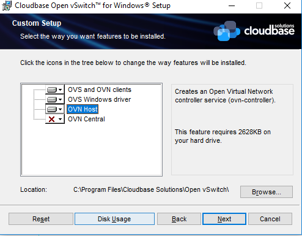

<!--
title: Using Windows Server Containers in Kubernetes
-->


**Note:** 这些说明最近基于 Windows Server 平台增强和 Kubernetes v1.9 版本进行了更新


<!--
**Note:** These instructions were recently updated based on Windows Server platform enhancements and the Kubernetes v1.9 release
-->

Kubernetes 1.5 版本基于 Windows Server 2016 操作系统引入了对 Windows Server 容器
的 Alpha 支持。随着 Windows Server 版本 1709 的发布和使用 Kubernetes v1.9，用户可以使用许多不同的
网络拓扑和 CNI 插件在本地或私有/公共云中部署 Kubernetes 集群。Kubernetes 上的 Windows Server 容器的一些
关键功能改进包括：

<!--
Kubernetes version 1.5 introduced Alpha support for Windows Server
Containers based on the Windows Server 2016 operating system. With the
release of Windows Server version 1709 and using Kubernetes v1.9 users
are able to deploy a Kubernetes cluster either on-premises or in a
private/public cloud using a number of different network topologies
and CNI plugins. Some key feature improvements for Windows Server
Containers on Kubernetes include:
-->

- 改进了对 pod 的支持!具有多个 Windows Server 容器(共享内核)的共享网络命名空间(隔离专区)

<!--
- Improved support for pods! Shared network namespace (compartment) with multiple Windows Server containers (shared kernel)
-->

- 通过每个 pod 使用单个网络端点降低网络复杂性

<!--
- Reduced network complexity by using a single network endpoint per pod
-->

- 使用虚拟过滤平台 (VFP)Hyper-v 交换机扩展(类似于 Linux iptables) 的基于内核的负载均衡

<!--
- Kernel-Based load-balancing using the Virtual Filtering Platform (VFP) Hyper-v Switch Extension (analogous to Linux iptables)
-->

- 容器运行时接口(CRI) pod 和 节点级统计

<!--
- Container Runtime Interface (CRI) pod and node level statistics
-->

- 支持 kubeadm 命令将 Windows Server 节点添加到 Kubernetes 环境中

<!--
- Support for kubeadm commands to add Windows Server nodes to a Kubernetes environment
-->

Kubernetes 控制平面(API服务器，调度程序，控制器管理器等)继续在 Linux 上运行，而 kubelet 和 kube-proxy 可以在 Windows Server 2016 或更高版本上运行

<!--
The Kubernetes control plane (API Server, Scheduler, Controller Manager, etc) continue to run on Linux, while the kubelet and kube-proxy can be run on Windows Server 2016 or later
-->


**Note:** Kubernetes 上的 Windows Server 容器是 Kubernetes v1.9 中的一个 Beta 特性


<!--
**Note:** Windows Server Containers on Kubernetes is a Beta feature in Kubernetes v1.9
-->

## 获取 Windows 二进制文件

<!--
## Get Windows Binaries
-->

我们建议使用可以在 [https://github.com/kubernetes/kubernetes/releases/latest](https://github.com/kubernetes/kubernetes/releases/latest) 上找到的发布的二进制文件。在更新日志下您可以找到 Windows-amd64 的节点二进制文件链接，其中包括 kubeadm，kubectl，kubelet 和 kube-proxy。

<!--
We recommend using the release binaries that can be found at [https://github.com/kubernetes/kubernetes/releases/latest](https://github.com/kubernetes/kubernetes/releases/latest). Under the CHANGELOG you can find the Node Binaries link for Windows-amd64, which will include kubeadm, kubectl, kubelet and kube-proxy.
-->

如果您希望自己构建代码，请参阅[此处](https://docs.microsoft.com/en-us/virtualization/windowscontainers/kubernetes/compiling-kubernetes-binaries)的详细构建说明。

<!--
If you wish to build the code yourself, please refer to detailed build instructions [here](https://docs.microsoft.com/en-us/virtualization/windowscontainers/kubernetes/compiling-kubernetes-binaries).
-->

## 环境准备
<!--
## Prerequisites
-->
在 Kubernetes 1.9 或更高版本中，使用以下内容支持 Kubernetes 的 Windows Server 容器：
<!--
In Kubernetes version 1.9 or later, Windows Server Containers for Kubernetes are supported using the following:
-->

1. Kubernetes 控制平面在现有的 Linux 基础架构(1.9版本或更高版本)上运行。
<!--
1. Kubernetes control plane running on existing Linux infrastructure (version 1.9 or later).
-->
2. Linux 的节点上的 Kubenet 网络插件设置。
<!--
2. Kubenet network plugin setup on the Linux nodes.
-->
3. Windows Server 2016 RTM 或更高版本，Windows Server 版本 1709 或更高版本是首选; 它解锁了共享网络命名空间等关键功能。
<!--
3. Windows Server 2016 RTM or later. Windows Server version 1709 or later is preferred; it unlocks key capabilities like shared network namespace.
-->
4. 适用于 Windows Server 节点的 Docker 版本 17.06.1-ee-2 或更高版本(Linux 节点和 Kubernetes 控制平面可以运行任何 Kubernetes 支持的 Docker 版本)。
<!--
4. Docker Version 17.06.1-ee-2 or later for Windows Server nodes (Linux nodes and Kubernetes control plane can run any Kubernetes supported Docker Version).
-->

## 网络

<!--
## Networking
-->

Windows 上有几种支持 Kubernetes v1.9 的网络配置，包括使用第三方网络插件的第三层路由和覆盖拓扑。
<!--
There are several supported network configurations with Kubernetes v1.9 on Windows, including both Layer-3 routed and overlay topologies using third-party network plugins.
-->

1. [上游 L3 路由](#upstream-l3-routing-topology) - 在上游 ToR 中配置的 IP 路由 
<!--
1. [Upstream L3 Routing](#upstream-l3-routing-topology) - IP routes configured in upstream ToR
-->
2. [主机网关](#host-gateway-topology) - 在每台主机上配置的 IP 路由
<!--
2. [Host-Gateway](#host-gateway-topology) - IP routes configured on each host
-->
3. [使用覆盖式 Open vSwitch(OVS) 和开放虚拟网络(OVN)](#using-ovn-with-ovs) - 覆盖网络(支持STT和Geneve隧道类型)
<!--
3. [Open vSwitch (OVS) & Open Virtual Network (OVN) with Overlay](#using-ovn-with-ovs) - overlay networks (supports STT and Geneve tunneling types)
-->
4. [未来 - 评审中] 覆盖 - 使用 Flannel 的 VXLAN 或者 IP-in-IP 封装
<!--
4. [Future - In Review] Overlay - VXLAN or IP-in-IP encapsulation using Flannel
-->
5. [未来] 使用 BGP(Calico) 的第三层路由 
<!--
5. [Future] Layer-3 Routing with BGP (Calico)
-->

选择要部署的网络配置和拓扑取决于物理网络拓扑和用户配置路由的能力，封装的性能问题以及与第三方网络插件集成的要求。
<!--
The selection of which network configuration and topology to deploy depends on the physical network topology and a user's ability to configure routes, performance concerns with encapsulation, and requirement to integrate with third-party network plugins.
-->

### 未来的 CNI 插件
另外两个 CNI 插件 [win-l2bridge(主机网关)和 win-overlay(vxlan)] 正在进行 PR 审核。这两个 CNI 插件准备好后，既可以直接使用，也可以与 Flannel 一起使用。

<!--
### Future CNI Plugins
An additional two CNI plugins [win-l2bridge (host-gateway) and win-overlay (vxlan)] are in [PR review](https://github.com/containernetworking/plugins/pull/85). These two CNI plugins, when ready, can either be used directly or with Flannel.
-->

### Linux
Linux 上已经使用桥接接口支持上述网络方法，桥接接口基本上创建了节点本地的专用网络。与 Windows 端类似，必须创建到所有其他 pod CIDR 的路由才能通过"公共" NIC 发送数据包。

<!--
### Linux
The above networking approaches are already supported on Linux using a bridge interface, which essentially creates a private network local to the node. Similar to the Windows side, routes to all other pod CIDRs must be created in order to send packets via the "public" NIC.
-->

### Windows
Windows 支持 CNI 网络模型，并使用插件与 Windows 主机网络服务(HNS)连接以配置主机网络和策略。在撰写本文时，Microsoft 唯一公开提供的 CNI 插件是从私人存储库构建的，可在此处获得[wincni.exe](https://github.com/Microsoft/SDN/blob/master/Kubernetes/windows/cni/wincni.exe)。它使用由管理员在每个节点上使用 HNS PowerShell 命令通过 Windows 主机网络服务(HNS)创建的 l2bridge 网络，如下面的 [Windows 主机设置](#windows-host-setup)部分所述。未来CNI插件的源代码将公开发布

<!--
### Windows
Windows supports the CNI network model and uses plugins to interface with the Windows Host Networking Service (HNS) to configure host networking and policy. At the time of this writing, the only publicly available CNI plugin from Microsoft is built from a private repo and available here [wincni.exe](https://github.com/Microsoft/SDN/blob/master/Kubernetes/windows/cni/wincni.exe). It uses an l2bridge network created through the Windows Host Networking Service (HNS) by an administrator using HNS PowerShell commands on each node as documented in the [Windows Host Setup](#windows-host-setup) section below. Source code for the future CNI plugins will be made available publicly.
-->

#### 上游 L3 路由拓扑
在这种拓扑结构中，通过在机架 (ToR)交换机/路由器的上游顶部配置静态 IP 路由，使用L3路由实现网络连接。每个群集节点都通过主机 IP 连接到管理网络。此外，每个节点使用本地'l2bridge'网络，并分配了一个 pod CIDR。给定工作节点上的所有 pod 将连接到 pod CIDR 子网('l2bridge'网络)。为了在不同节点上运行的 pod 之间实现网络通信，上游路由器配置了静态路由 pod CIDR 前缀 => 主机 IP。

<!--
#### Upstream L3 Routing Topology
In this topology, networking is achieved using L3 routing with static IP routes configured in an upstream Top of Rack (ToR) switch/router. Each cluster node is connected to the management network with a host IP. Additionally, each node uses a local 'l2bridge' network with a pod CIDR assigned. All pods on a given worker node will be connected to the pod CIDR subnet ('l2bridge' network). In order to enable network communication between pods running on different nodes, the upstream router has static routes configured with pod CIDR prefix => Host IP.
-->

以下示例图说明了使用上游 L3 路由设置的 Kubernetes 的 Windows Server 网络设置： 
<!--
The following example diagram illustrates the Windows Server networking setup for Kubernetes using Upstream L3 Routing Setup:
-->


<!--

-->

#### 主机网关拓扑
这种拓扑与上游 L3 路由拓扑相似，惟一的区别是静态 IP 路由是直接在每个集群节点上配置的，而不是在上游 ToR 中配置的。每个节点使用本地的 'l2bridge' 网络，并像以前一样分配 pod CIDR，并为分配给远程集群节点的所有其他 pod CIDR 子网提供路由表条目。

<!--
#### Host-Gateway Topology
This topology is similar to the Upstream L3 Routing topology with the only difference being that static IP routes are configured directly on each cluster node and not in the upstream ToR. Each node uses a local 'l2bridge' network with a pod CIDR assigned as before and has routing table entries for all other pod CIDR subnets assigned to the remote cluster nodes.
-->

#### OVN 和 OVS 一起使用
下图概述了组件之间的体系结构和交互：

<!--
#### Using OVN with OVS
The following diagram gives a general overview of the architecture and interaction between components:
-->


<!--

-->

(上图来自 [https://github.com/openvswitch/ovn-kubernetes#overlay-mode-architecture-diagram](https://github.com/openvswitch/ovn-kubernetes#overlay-mode-architecture-diagram))

<!--
(The above image is from [https://github.com/openvswitch/ovn-kubernetes#overlay-mode-architecture-diagram](https://github.com/openvswitch/ovn-kubernetes#overlay-mode-architecture-diagram))
-->

由于它的体系结构，OVN 有一个中央组件，它将您的网络意图存储在数据库中。其他组件如 kube-apiserver、kube-controller-manager、kube-scheduler 等也可以部署在该中心节点上。
<!--
Due to its architecture, OVN has a central component which stores your networking intent in a database. Other components i.e. kube-apiserver, kube-controller-manager, kube-scheduler etc. can be deployed on that central node as well.
-->

## 在 Kubernetes 上设置 Windows Server 容器
要在 Kubernetes 上运行 Windows Server 容器，您需要为 Windows 设置主机和 Kubernetes 节点组件。根据您的网络拓扑，可能需要为不同节点上的 pod 通信设置路由。

<!--
## Setting up Windows Server Containers on Kubernetes
To run Windows Server Containers on Kubernetes, you'll need to set up both your host machines and the Kubernetes node components for Windows. Depending on your network topology, routes may need to be set up for pod communication on different nodes.
-->

### 主机设置

<!--
### Host Setup
-->

#### 1. 上游 L3 路由拓扑和 2. 主机网关拓扑

<!--
#### For 1. Upstream L3 Routing Topology and 2. Host-Gateway Topology
-->

##### Linux 主机设置

<!--
##### Linux Host Setup
-->

1. Linux 主机应该根据它们各自的发行版文档和您将使用的 Kubernetes 版本的要求进行设置。
<!--
1. Linux hosts should be setup according to their respective distro documentation and the requirements of the Kubernetes version you will be using.
-->
2. 使用步骤[此处](https://github.com/MicrosoftDocs/Virtualization-Documentation/blob/live/virtualization/windowscontainers/kubernetes/creating-a-linux-master.md)配置Linux主节点
<!--
2. Configure Linux Master node using steps [here](https://github.com/MicrosoftDocs/Virtualization-Documentation/blob/live/virtualization/windowscontainers/kubernetes/creating-a-linux-master.md)
-->
3. [可选]安装CNI网络插件。
<!--
3. [Optional] CNI network plugin installed.
-->

##### Windows 主机设置

<!--
##### Windows Host Setup
-->

1. 运行所需 Windows Server 和 Docker 版本的 Windows Server 容器主机。请按照此帮助主题概述的安装说明进行操作：https://docs.microsoft.com/en-us/virtualization/windowscontainers/quick-start/quick-start-windows-server。
<!--
1. Windows Server container host running the required Windows Server and Docker versions. Follow the setup instructions outlined by this help topic: https://docs.microsoft.com/en-us/virtualization/windowscontainers/quick-start/quick-start-windows-server.
-->
2. 2. [获取 Windows 二进制文件](#get-windows-binaries) kubelet.exe, kube-proxy.exe, and kubectl.exe 使用说明
<!--
2. [Get Windows Binaries](#get-windows-binaries) kubelet.exe, kube-proxy.exe, and kubectl.exe using instructions
-->
3. 使用 X.509 密钥从 Linux 主节点复制节点规范文件(kube config)
<!--
3. Copy Node spec file (kube config) from Linux master node with X.509 keys
-->
4. 创建 HNS 网络，确保正确的 CNI 网络配置，并使用此脚本 [start-kubelet.ps1](https://github.com/Microsoft/SDN/blob/master/Kubernetes/windows/start-kubelet.ps1) 启动 kubelet.exe
<!--
4. Create the HNS Network, ensure the correct CNI network config, and start kubelet.exe using this script [start-kubelet.ps1](https://github.com/Microsoft/SDN/blob/master/Kubernetes/windows/start-kubelet.ps1)
-->
5. 使用此脚本启动 [start-kubeproxy.ps1](https://github.com/Microsoft/SDN/blob/master/Kubernetes/windows/start-kubeproxy.ps1) 启动 kube-proxy
<!--
Start kube-proxy using this script [start-kubeproxy.ps1](https://github.com/Microsoft/SDN/blob/master/Kubernetes/windows/start-kubeproxy.ps1)
-->
6. [仅限 #2 主机网关模式]使用此脚本 [AddRoutes.ps1](https://github.com/Microsoft/SDN/blob/master/Kubernetes/windows/AddRoutes.ps1) 在Windows主机上添加静态路由
<!--
6. [Only required for #2 Host-Gateway mode] Add static routes on Windows host using this script [AddRoutes.ps1](https://github.com/Microsoft/SDN/blob/master/Kubernetes/windows/AddRoutes.ps1)
-->
更详细的说明可以在[这里](https://github.com/MicrosoftDocs/Virtualization-Documentation/blob/live/virtualization/windowscontainers/kubernetes/getting-started-kubernetes-windows.md)找到。
<!--
More detailed instructions can be found [here](https://github.com/MicrosoftDocs/Virtualization-Documentation/blob/live/virtualization/windowscontainers/kubernetes/getting-started-kubernetes-windows.md).
-->

**Windows CNI 配置示例**

<!--
**Windows CNI Config Example**
-->

Windows CNI 插件基于 wincni.exe 的，配置文件，是基于上面显示的 ToR 示例图，指定了应用于 Windows node-1 的配置。特别有趣的是 Windows node-1 pod CIDR(10.10.187.64/26) 和 cbr0(10.10.187.66)的关联网关。异常列表指定服务 CIDR(11.0.0.0/8)，集群 CIDR(10.10.0.0/16) 和管理(或主机) CIDR（10.127.132.128/25）。
<!--
Today, Windows CNI plugin is based on wincni.exe code with the following example, configuration file. This is based on the ToR example diagram shown above, specifying the configuration to apply to Windows node-1. Of special interest is Windows node-1 pod CIDR (10.10.187.64/26) and the associated gateway of cbr0 (10.10.187.66). The exception list is specifying the Service CIDR (11.0.0.0/8), Cluster CIDR (10.10.0.0/16), and Management (or Host) CIDR (10.127.132.128/25).
-->

注意：此文件假设用户以前使用 <Verb>-HNSNetworkcmdlet 在每个 Windows 节点上创建了'l2bridge' 主机网络，如上面链接的 start-kubelet.ps1 和 start-kubeproxy.ps1 脚本中所示
<!--
Note: this file assumes that a user previous created 'l2bridge' host networks on each Windows node using `<Verb>-HNSNetwork` cmdlets as shown in the `start-kubelet.ps1` and `start-kubeproxy.ps1` scripts linked above
-->

```json
{
	"cniVersion": "0.2.0",
	"name": "l2bridge",
	"type": "wincni.exe",
	"master": "Ethernet",
	"ipam": {
		"environment": "azure",
		"subnet": "10.10.187.64/26",
		"routes": [{
			"GW": "10.10.187.66"
		}]
	},
	"dns": {
		"Nameservers": [
			"11.0.0.10"
		]
	},
	"AdditionalArgs": [{
			"Name": "EndpointPolicy",
			"Value": {
				"Type": "OutBoundNAT",
				"ExceptionList": [
					"11.0.0.0/8",
					"10.10.0.0/16",
					"10.127.132.128/25"
				]
			}
		},
		{
			"Name": "EndpointPolicy",
			"Value": {
				"Type": "ROUTE",
				"DestinationPrefix": "11.0.0.0/8",
				"NeedEncap": true
			}
		},
		{
			"Name": "EndpointPolicy",
			"Value": {
				"Type": "ROUTE",
				"DestinationPrefix": "10.127.132.213/32",
				"NeedEncap": true
			}
		}
	]
}
```

#### 3.使用覆盖方式打开 vSwitch(OVS) 和开放虚拟网络(OVN)

<!--
#### For 3. Open vSwitch (OVS) & Open Virtual Network (OVN) with Overlay
-->


**Note:** 通过 Ansible 剧本的全自动设置是[可用的](https://github.com/openvswitch/ovn-kubernetes/tree/master/contrib)。


<!--
**Note:** Fully automated setup via Ansible playbooks is [available](https://github.com/openvswitch/ovn-kubernetes/tree/master/contrib).
-->

对于手动设置，请继续以下步骤。
<!--
For manual setup, continue the following steps.
-->

##### Linux 主机设置

<!--
##### Linux Host Setup
-->

设置中心节点和所需组件超出了本文档的范围。您可以阅读[这些说明](https://github.com/openvswitch/ovn-kubernetes#k8s-master-node-initialization)。
<!--
Setting up the central node and the components needed is out of scope of this document. You can read [these instructions](https://github.com/openvswitch/ovn-kubernetes#k8s-master-node-initialization) for that.
-->

添加 Linux minion 也超出了范围，你可以在这里阅读：[Linux minion](https://github.com/openvswitch/ovn-kubernetes#k8s-minion-node-initializations)。
<!--
Adding a Linux minion is also out of scope and you can read it here: [Linux minion](https://github.com/openvswitch/ovn-kubernetes#k8s-minion-node-initializations).
-->


##### windows 主机设置

<!--
##### Windows Host Setup
-->

添加 Windows minion 需要您安装 OVS 和 OVN 二进制文件。运行所需 Windows Server 和 Docker 版本的 Windows Server 容器主机。请按照[此帮助主题](https://docs.microsoft.com/en-us/virtualization/windowscontainers/quick-start/quick-start-windows-server)概述的设置说明进行操作。从 Windows Server 2016 RTM 开始支持此类部署。
<!--
Adding a Windows minion requires you to install OVS and OVN binaries. Windows Server container host running the required Windows Server and Docker versions. Follow the setup instructions outlined by [this help topic](https://docs.microsoft.com/en-us/virtualization/windowscontainers/quick-start/quick-start-windows-server). This type of deployment is supported starting with Windows Server 2016 RTM.
-->

编译 OVS 并生成安装程序不在本文中讨论。请访问[此链接](http://docs.openvswitch.org/en/latest/intro/install/windows/#open-vswitch-on-windows)。对于预构建的认证安装程序，请访问[此链接](https://cloudbase.it/openvswitch/#download)并下载最新版本
<!--
Compiling OVS and generating the installer will not be treated in this document. For a step by step instruction please visit [this link](http://docs.openvswitch.org/en/latest/intro/install/windows/#open-vswitch-on-windows).
For a prebuilt certified installer please visit [this link](https://cloudbase.it/openvswitch/#download) and download the latest version of it.
-->

以下指南使用预构建的认证安装程序。
<!--
The following guide uses the prebuilt certified installer.
-->

安装 OVS 既可以通过 GUI 对话框完成，也可以在无人看管的情况下完成。将 Windows 主机添加到您的设置需要您拥有`OVN主机`和默认安装特性。下面是需要安装的对话框图像：
<!--
Installing OVS can be done either via the GUI dialogs or unattended. Adding a Windows host to your setup requires you to have `OVN Host` together with the default installation features. Below is the dialog image on what needs to be installed:
-->



<!--

-->

对于无人看管情况下的安装，请使用以下命令：
<!--
For an unattended installation please use the following command:
-->

```
cmd /c 'msiexec /i openvswitch.msi ADDLOCAL="OpenvSwitchCLI,OpenvSwitchDriver,OVNHost" /qn'
```

安装程序设置新的环境变量。请使用命令打开一个新的 shell 或注销/登录，以确保刷新了环境变量。
<!--
The installer propagates new environment variables. Please open a new command shell or logoff/logon to ensure the environment variables are refreshed.
-->

对于叠加，Windows 上的 OVS 需要透明的 docker 网络才能正常运行。请使用以下命令创建一个透明的 docker 网络，OVS 将使用该网络。powershell：
<!--
For overlay, OVS on Windows requires a transparent docker network to function properly. Please use the following to create a transparent docker network which will be used by OVS. From powershell:
-->

```
docker network create -d transparent --gateway $GATEWAY_IP --subnet $SUBNET `
    -o com.docker.network.windowsshim.interface="$INTERFACE_ALIAS" external
```

$SUBNET 是用于产生 pods 的 minion 子网(将由 kubernetes 使用的子网)，$GATEWAY_IP 是 $SUBNET 的第一个 IP，$INTERFACE_ALIAS 是用于创建覆盖隧道的接口(必须与 OVN 主机的 rests 连接)。
例：

<!--
Where $SUBNET is the minion subnet which will be used to spawn pods on (the one which will be used by kubernetes), $GATEWAY_IP is the first IP of the $SUBNET and $INTERFACE_ALIAS is the interface used for creating the overlay tunnels (must have connectivity with the rests of the OVN hosts).
Example:
-->

```
docker network create -d transparent --gateway 10.0.1.1 --subnet 10.0.1.0/24 `
    -o com.docker.network.windowsshim.interface="Ethernet0" external
```

创建 docker 网络后，请从 powershell 运行下面的命令。(创建OVS桥接器，在桥接器下添加接口，并启用OVS转发交换机扩展名)
<!--
After creating the docker network please run the next commands from powershell. (creates an OVS bridge, adds the interface under the bridge and enables the OVS forwarding switch extension)
-->

```
$a = Get-NetAdapter | where Name -Match HNSTransparent
Rename-NetAdapter $a[0].Name -NewName HNSTransparent
Stop-Service ovs-vswitchd -force; Disable-VMSwitchExtension "Cloudbase Open vSwitch Extension";
ovs-vsctl --no-wait del-br br-ex
ovs-vsctl --no-wait --may-exist add-br br-ex
ovs-vsctl --no-wait add-port br-ex HNSTransparent -- set interface HNSTransparent type=internal
ovs-vsctl --no-wait add-port br-ex $INTERFACE_ALIAS
Enable-VMSwitchExtension "Cloudbase Open vSwitch Extension"; sleep 2; Restart-Service ovs-vswitchd
```

除此之外，Windows主机的设置与Linux主机相同。从[这里](https://github.com/openvswitch/ovn-kubernetes#k8s-minion-node-initializations)开始执行以下步骤。
<!--
Besides of the above, setting up a Windows host is the same as the Linux host. Follow the steps from [here](https://github.com/openvswitch/ovn-kubernetes#k8s-minion-node-initializations).
-->

**Windows CNI 设置**

<!--
**Windows CNI Setup**
-->

现在，Windows OVN&OVS CNI 插件是基于 ovn_cni.exe 可以从[此处](https://cloudbase.it/downloads/ovn_cni.exe)下载。CNI 配置文件示例如下:
<!--
Today, Windows OVN&OVS CNI plugin is based on ovn_cni.exe which can be downloaded from [here](https://cloudbase.it/downloads/ovn_cni.exe). A sample of CNI config file is the following:
-->

```
{
    "name": "net",
    "type": "ovn_cni.exe",
    "bridge": "br-int",
    "isGateway": "true",
    "ipMasq": "false",
    "ipam": {
         "type": "host-local",
         "subnet": "$SUBNET"
         }
}
```

$SUBNET 是上一个 ```docker network create``` 命令中使用的子网。
<!--
Where $SUBNET is the subnet that was used in the previous ```docker network create``` command.
-->

有关谷歌云平台(GCP)，即谷歌计算引擎(GCE)的完整指南，请访问[这里](https://github.com/apprenda/kubernetes-ovn-heterogeneous-cluster#heterogeneous-kubernetes-cluster-on-top-of-ovn)。
<!--
For a complete guide on Google Cloud Platform (GCP), namely Google Compute Engine (GCE) visit [this](https://github.com/apprenda/kubernetes-ovn-heterogeneous-cluster#heterogeneous-kubernetes-cluster-on-top-of-ovn).
-->

有关亚马逊网络服务(AWS)，请访问[这里](https://github.com/justeat/kubernetes-windows-aws-ovs#kubernetes-on-windows-in-aws-using-ovn)。
<!--
For a complete guide on Amazon Web Services (AWS) visit [this](https://github.com/justeat/kubernetes-windows-aws-ovs#kubernetes-on-windows-in-aws-using-ovn).
-->

## 启动群集
要启动集群，您需要启动基于 Linux 的 Kubernetes 控制平面和基于 Windows Server 的 Kubernetes 节点组件(kubelet 和 kube-proxy)。对于 OVS 和 OVN，仅需要 kubelet。

<!--
## Starting the Cluster
To start your cluster, you'll need to start both the Linux-based Kubernetes control plane, and the Windows Server-based Kubernetes node components (kubelet and kube-proxy). For the OVS & OVN only the kubelet is required.
-->

## 启动基于 Linux-based 的控制平面
使用您喜欢的方法在 Linux 上启动 Kubernetes 集群。请注意，集群 CIDR 可能需要更新。

<!--
## Starting the Linux-based Control Plane
Use your preferred method to start Kubernetes cluster on Linux. Please note that Cluster CIDR might need to be updated.
-->

## 支持kubeadm加入

<!--
## Support for kubeadm join
-->

如果您的群集是由[kubeadm](/zh/docs/setup/independent/create-cluster-kubeadm/)，创建的
使用上面列出的方法之一正确地设置网络(网络是在 kubeadm 之外设置的)，您可以使用 kubeadm 向集群添加 Windows 节点。在较高的级别上，首先必须使用 kubeadm(Linux) 初始化主节点，然后设置基于 CNI 的网络(在 kubeadm 之外)，最后开始将 Windows 或 Linux 工作节点连接到集群。如需其他文件和参考资料，请访问上文的 kubeadm 链接。

<!--
If your cluster has been created by [kubeadm](/docs/setup/independent/create-cluster-kubeadm/),
and your networking is setup correctly using one of the methods listed above (networking is setup outside of kubeadm), you can use kubeadm to add a Windows node to your cluster. At a high level, you first have to initialize the master with kubeadm (Linux), then set up the CNI based networking (outside of kubeadm), and finally start joining Windows or Linux worker nodes to the cluster. For additional documentation and reference material, visit the kubeadm link above.
-->

kubeadm 二进制文件可以在 [Kubernetes 版本](https://github.com/kubernetes/kubernetes/release)的节点二进制文件归档中找到。添加 Windows 节点与添加 Linux 节点没有任何不同：

<!--
The kubeadm binary can be found at [Kubernetes Releases](https://github.com/kubernetes/kubernetes/releases), inside the node binaries archive. Adding a Windows node is not any different than adding a Linux node:
-->

`kubeadm.exe join --token <token> <master-ip>:<master-port> --discovery-token-ca-cert-hash sha256:<hash>`

有关更多详细信息请参阅[加入您的节点](/zh/docs/setup/independent/create-cluster-kubeadm/#joining-your-nodes)。
<!--
See [joining-your-nodes](/docs/setup/independent/create-cluster-kubeadm/#joining-your-nodes) for more details.
-->

## 支持的功能

<!--
## Supported Features
-->

下面列出的示例假设在 Windows Server 1709 上运行 Windows 节点。如果您正在运行 Windows Server 2016，示例将需要更新镜像以指定 `image: microsoft/windowsservercore:ltsc2016`。这是因为在使用进程隔离时，需要容器镜像匹配主机操作系统版本。不指定标记将隐式地使用 `:latest` 标记，这可能导致令人惊讶的行为。有关 Windows Service Core 镜像标记的更多信息，请与[https://hub.docker.com/r/microsoft/windowsservercore/](https://hub.docker.com/r/microsoft/windowsservercore/)联系。
<!--
The examples listed below assume running Windows nodes on Windows Server 1709. If you are running Windows Server 2016, the examples will need the image updated to specify `image: microsoft/windowsservercore:ltsc2016`. This is due to the requirement for container images to match the host operating system version when using process isolation. Not specifying a tag will implicitly use the `:latest` tag which can lead to surprising behaviors. Please consult with [https://hub.docker.com/r/microsoft/windowsservercore/](https://hub.docker.com/r/microsoft/windowsservercore/) for additional information on Windows Server Core image tagging.
-->


### 在 Windows 上调度 Pod
由于您的群集同时具有 Linux 和 Windows 节点，因此必须明确设置 nodeSelector 约束以便能够将 pod 安排到 Windows 节点。必须将 nodeSelector 的标签 beta.kubernetes.io/os 设置为值 windows; 请参阅以下示例：

<!--
### Scheduling Pods on Windows
Because your cluster has both Linux and Windows nodes, you must explicitly set the `nodeSelector` constraint to be able to schedule pods to Windows nodes. You must set nodeSelector with the label `beta.kubernetes.io/os` to the value `windows`; see the following example:
-->




**Note:** 本例假设您在 Windows Server 1709 上运行，因此使用镜像标记来支持它。如果使用不同的版本，则需要更新标记。例如，如果在 Windows Server 2016 上，更新为使用 `"image": "microsoft/iis"`，默认为该操作系统版本。


<!--
**Note:** This example assumes you are running on Windows Server 1709, so uses the image tag to support that. If you are on a different version, you will need to update the tag. For example, if on Windows Server 2016, update to use `"image": "microsoft/iis"` which will default to that OS version.
-->

### Secrets 和 ConfigMaps
secret和configmap可以在Windows Service 容器中使用，但是必须作为环境变量使用。有关更多细节，请参见下面的限制部分。

<!--
### Secrets and ConfigMaps
Secrets and ConfigMaps can be utilized in Windows Server Containers, but must be used as environment variables. See limitations section below for additional details.
-->

**例子：**

<!--
**Examples:**
-->

Windows pod 与 secrets 映射到环境变量
<!--
Windows pod with secrets mapped to environment variables
-->



具有 configMap 值的 Windows Pod 映射到环境变量
<!--
Windows Pod with configMap values mapped to environment variables
-->



### 卷
一些受支持的卷挂载可以是本地卷，emptyDir 卷和主机路径卷。需要记住的一点是，路径必须转义，或者使用前斜杠，例如：`mountPath: "C:\\etc\\foo"` or `mountPath: "C:/etc/foo"`。

<!--
### Volumes
Some supported Volume Mounts are local, emptyDir, hostPath.  One thing to remember is that paths must either be escaped, or use forward slashes, for example `mountPath: "C:\\etc\\foo"` or `mountPath: "C:/etc/foo"`.
-->

对于受支持的卷类型，支持持久卷的声明。
<!--
Persistent Volume Claims are supported for supported volume types.
-->

**例子：**

<!--
**Examples:**
-->

带有主机路径卷的 Windows pod
<!--
Windows pod with a hostPath volume
-->




具有多个 emptyDir 卷的 Windows pod
<!--
Windows pod with multiple emptyDir volumes
-->



### 守护线程集

<!--
### DaemonSets
-->

支持守护线程集
<!--
DaemonSets are supported
-->



### 指标

<!--
### Metrics
-->

Windows Stats 使用混合模型：pod 和容器级别的统计数据来自 CRI(通过 dockershim)，而节点级别的统计数据来自“winstats”包，该包使用特定于 Windows 的 perf 计数器导出 cadvisor 之类的数据结构。
<!--
Windows Stats use a hybrid model: pod and container level stats come from CRI (via dockershim), while node level stats come from the "winstats" package that exports cadvisor like data structures using windows specific perf counters from the node.
-->

### 容器资源

<!--
### Container Resources
-->

现在可以为 v1.10 中的 windows 容器设置容器资源(CPU和内存)。
<!--
Container resources (CPU and memory) could be set now for windows containers in v1.10.
-->



### Hyper-V 容器

<!--
### Hyper-V Containers
-->

Hyper-V 容器在 v1.10 中作为实验支持。要创建 Hyper-V 容器，kubelet 应该从特性 gates `HyperVContainer=true` 开始，Pod 应该包含注释 `experimental.windows.kubernetes.io/isolation-type=hyperv`。
<!--
Hyper-V containers are supported as experimental in v1.10. To create a Hyper-V container, kubelet should be started with feature gates `HyperVContainer=true` and Pod should include annotation `experimental.windows.kubernetes.io/isolation-type=hyperv`.
-->



### Kubelet 和 kube-proxy 现在可以作为 Windows 服务运行

<!--
### Kubelet and kube-proxy can now run as Windows services
-->

从 kubernetes v1.11 开始，kubelet 和 kube-proxy 可以作为 Windows 服务运行。
<!--
Starting with kubernetes v1.11, kubelet and kube-proxy can run as Windows services.
-->

这意味着您现在可以通过 `sc` 命令将它们注册为 Windows 服务。有关如何使用 `sc` 创建 Windows 服务的更多细节，请参阅[此处](https://support.microsoft.com/en-us/help/251192/how-to-create-a-windows-service-by-using-sc-exe)。
<!--
This means that you can now register them as Windows services via `sc` command. More details about how to create Windows services with `sc` can be found [here](https://support.microsoft.com/en-us/help/251192/how-to-create-a-windows-service-by-using-sc-exe).
-->

**例子：**

<!--
**Examples:**
-->

创建服务
<!--
To create the service:
-->

```
PS > sc.exe create <component_name> binPath= "<path_to_binary> --service <other_args>"
CMD > sc create <component_name> binPath= "<path_to_binary> --service <other_args>"
```

请注意，如果参数包含空格，则必须对其进行转义。例：
<!--
Please note that if the arguments contain spaces, it must be escaped. Example:
-->

```
PS > sc.exe create kubelet binPath= "C:\kubelet.exe --service --hostname-override 'minion' <other_args>"
CMD > sc create kubelet binPath= "C:\kubelet.exe --service --hostname-override 'minion' <other_args>"
```

启动服务：
<!--
To start the service:
-->

```
PS > Start-Service kubelet; Start-Service kube-proxy
CMD > net start kubelet && net start kube-proxy
```

停止服务
<!--
To stop the service:
-->

```
PS > Stop-Service kubelet (-Force); Stop-Service kube-proxy (-Force)
CMD > net stop kubelet && net stop kube-proxy
```

查询服务
<!--
To query the service:
-->

```
PS > Get-Service kubelet; Get-Service kube-proxy;
CMD > sc.exe queryex kubelet && sc qc kubelet && sc.exe queryex kube-proxy && sc.exe qc kube-proxy
```

## Windows Server 容器与 v1.9 的已知限制

<!--
## Known Limitations for Windows Server Containers with v1.9
-->

在未来的Kubernetes版本中，社区将解决其中一些限制：
<!--
Some of these limitations will be addressed by the community in future releases of Kubernetes:
-->

- 共享网络名称空间(隔间)与多个 Windows Server 容器(共享内核)每个 pod 只支持在 Windows Server 1709 或更高

<!--
- Shared network namespace (compartment) with multiple Windows Server containers (shared kernel) per pod is only supported on Windows Server 1709 or later
-->

- 不支持使用 secret 和 configmap 作为卷装载

<!--
- Using Secrets and ConfigMaps as volume mounts is not supported
-->

- Windows不支持挂载传播

<!--
- Mount propagation is not supported on Windows
-->

- 不支持有状态应用程序的状态集功能

<!--
- The StatefulSet functionality for stateful applications is not supported
-->

- Windows Server 容器 pod 的相同 pod 自动缩放尚未经过验证，pod 端之间无法工作。

<!--
- Horizontal Pod Autoscaling for Windows Server Container pods has not been verified to work end-to-end
-->

- 不支持Hyper-V隔离容器。

<!--
- Hyper-V isolated containers are not supported. 
-->

- Windows 容器操作系统必须与主机操作系统匹配。如果它不这样做，pod 就会陷入崩溃循环。

<!--
- Windows container OS must match the Host OS. If it does not, the pod will get stuck in a crash loop.
-->

- 在 L3 或主机 GW 的网络模型下，由于 Windows 问题，Windows 节点无法访问

<!--
- Under the networking models of L3 or Host GW, Kubernetes Services are inaccessible to Windows nodes due to a Windows issue. This is not an issue if using OVN/OVS for networking.
-->

- Windows kubelet.exe 在 VMware Fusion 下运行 Windows Server 时，可能无法启动[issue 57110](https://github.com/kubernetes/kubernetes/pull/57124)

<!--
- Windows kubelet.exe may fail to start when running on Windows Server under VMware Fusion [issue 57110](https://github.com/kubernetes/kubernetes/pull/57124)
-->

- Flannel 和 Weavenet 尚未得到支持

<!--
- Flannel and Weavenet are not yet supported
-->

- 一些 .Net 核心应用程序希望环境变量的名称中带有冒号 (`:`)。Kubernetes 目前不允许这样做。根据[此处](https://docs.microsoft.com/en-us/aspnet/core/fundamentals/configuration/?tabs=basicconfiguration#configuration-by-environment)所述，用双下划线 (`__`) 替换冒号 (':')

<!--
- Some .Net Core applications expect environment variables with a colon (`:`) in the name.  Kubernetes currently does not allow this.  Replace colon (`:`) with  double underscore (`__`) as documented [here](https://docs.microsoft.com/en-us/aspnet/core/fundamentals/configuration/?tabs=basicconfiguration#configuration-by-environment).
-->

- 由于 cgroups 在 windows 上不受支持，kubelet.exe 应该以以下附加参数开始 `--cgroups-per-qos=false --enforce-node-allocatable=""` [issue 61716](https://github.com/kubernetes/kubernetes/issues/61716)

<!--
- As cgroups are not supported on windows, kubelet.exe should be started with the following additional arguments `--cgroups-per-qos=false --enforce-node-allocatable=""` [issue 61716](https://github.com/kubernetes/kubernetes/issues/61716)
-->

## 后续步骤和资源

<!--
## Next steps and resources
-->

- 对Windows版本的支持从v1.9开始测试，欢迎您提供反馈。有关参与的信息，请访问[SIG-Windows](https://github.com/kubernetes/community/blob/master/sig-windows/README.md)
- 故障排除和常见问题：[链接](https://docs.microsoft.com/en-us/virtualization/windowscontainers/kubernetes/common-problems)

<!--
- Support for Windows is in Beta as of v1.9 and your feedback is welcome. For information on getting involved, please head to [SIG-Windows](https://github.com/kubernetes/community/blob/master/sig-windows/README.md)
- Troubleshooting and Common Problems: [Link](https://docs.microsoft.com/en-us/virtualization/windowscontainers/kubernetes/common-problems)
-->
