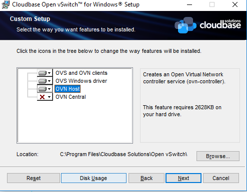

**Note:** These instructions were recently updated based on Windows Server platform enhancements and the Kubernetes v1.9 release
{: .note}

Kubernetes version 1.5 introduced Alpha support for Windows Server Containers based on the Windows Server 2016 operating system. With the release of Windows Server version 1709 and using Kubernetes v1.9 users are able to deploy a Kubernetes cluster either on-premises or in a private/public cloud using a number of different network topologies and CNI plugins. Some key feature improvements for Windows Server Containers on Kubernetes include:
- Improved support for pods! Shared network namespace (compartment) with multiple Windows Server containers (shared kernel)
- Reduced network complexity by using a single network endpoint per pod
- Kernel-Based load-balancing using the Virtual Filtering Platform (VFP) Hyper-v Switch Extension (analogous to Linux iptables)
- Container Runtime Interface (CRI) pod and node level statistics
- Support for kubeadm commands to add Windows Server nodes to a Kubernetes environment

The Kubernetes control plane (API Server, Scheduler, Controller Manager, etc) continue to run on Linux, while the kubelet and kube-proxy can be run on Windows Server 2016 or later

**Note:** Windows Server Containers on Kubernetes is a Beta feature in Kubernetes v1.9
{: .note}

## Get Windows Binaries
We recommend using the release binaries that can be found at [https://github.com/kubernetes/kubernetes/releases/latest](https://github.com/kubernetes/kubernetes/releases/latest). Under the CHANGELOG you can find the Node Binaries link for Windows-amd64, which will include kubeadm, kubectl, kubelet and kube-proxy.

If you wish to build the code yourself, please refer to detailed build instructions [here](https://docs.microsoft.com/en-us/virtualization/windowscontainers/kubernetes/compiling-kubernetes-binaries).

## Prerequisites
In Kubernetes version 1.9 or later, Windows Server Containers for Kubernetes are supported using the following:

1. Kubernetes control plane running on existing Linux infrastructure (version 1.9 or later).
2. Kubenet network plugin setup on the Linux nodes.
3. Windows Server 2016 RTM or later. Windows Server version 1709 or later is preferred; it unlocks key capabilities like shared network namespace.
4. Docker Version 17.06.1-ee-2 or later for Windows Server nodes (Linux nodes and Kubernetes control plane can run any Kubernetes supported Docker Version).

## Networking
There are several supported network configurations with Kubernetes v1.9 on Windows, including both Layer-3 routed and overlay topologies using third-party network plugins.

1. [Upstream L3 Routing](#upstream-l3-routing-topology) - IP routes configured in upstream ToR
2. [Host-Gateway](#host-gateway-topology) - IP routes configured on each host
3. [Open vSwitch (OVS) & Open Virtual Network (OVN) with Overlay](#using-ovn-with-ovs) - overlay networks (supports STT and Geneve tunneling types)
4. [Future - In Review] Overlay - VXLAN or IP-in-IP encapsulation using Flannel
5. [Future] Layer-3 Routing with BGP (Calico)

The selection of which network configuration and topology to deploy depends on the physical network topology and a user's ability to configure routes, performance concerns with encapsulation, and requirement to integrate with third-party network plugins.

### Future CNI Plugins
An additional two CNI plugins [win-l2bridge (host-gateway) and win-overlay (vxlan)] are in [PR review](https://github.com/containernetworking/plugins/pull/85). These two CNI plugins, when ready, can either be used directly or with Flannel.

### Linux
The above networking approaches are already supported on Linux using a bridge interface, which essentially creates a private network local to the node. Similar to the Windows side, routes to all other pod CIDRs must be created in order to send packets via the "public" NIC.

### Windows
Windows supports the CNI network model and uses plugins to interface with the Windows Host Networking Service (HNS) to configure host networking and policy. At the time of this writing, the only publicly available CNI plugin from Microsoft is built from a private repo and available here [wincni.exe](https://github.com/Microsoft/SDN/blob/master/Kubernetes/windows/cni/wincni.exe). It uses an l2bridge network created through the Windows Host Networking Service (HNS) by an administrator using HNS PowerShell commands on each node as documented in the [Windows Host Setup](#windows-host-setup) section below. Source code for the future CNI plugins will be made available publicly.

#### Upstream L3 Routing Topology
In this topology, networking is achieved using L3 routing with static IP routes configured in an upstream Top of Rack (ToR) switch/router. Each cluster node is connected to the management network with a host IP. Additionally, each node uses a local 'l2bridge' network with a pod CIDR assigned. All pods on a given worker node will be connected to the pod CIDR subnet ('l2bridge' network). In order to enable network communication between pods running on different nodes, the upstream router has static routes configured with pod CIDR prefix => Host IP.

The following example diagram illustrates the Windows Server networking setup for Kubernetes using Upstream L3 Routing Setup:


#### Host-Gateway Topology
This topology is similar to the Upstream L3 Routing topology with the only difference being that static IP routes are configured directly on each cluster node and not in the upstream ToR. Each node uses a local 'l2bridge' network with a pod CIDR assigned as before and has routing table entries for all other pod CIDR subnets assigned to the remote cluster nodes.

#### Using OVN with OVS
The following diagram gives a general overview of the architecture and interaction between components:


(The above image is from [https://github.com/openvswitch/ovn-kubernetes#overlay-mode-architecture-diagram](https://github.com/openvswitch/ovn-kubernetes#overlay-mode-architecture-diagram))

Due to its architecture, OVN has a central component which stores your networking intent in a database. Other components i.e. kube-apiserver, kube-controller-manager, kube-scheduler etc. can be deployed on that central node as well.

## Setting up Windows Server Containers on Kubernetes
To run Windows Server Containers on Kubernetes, you'll need to set up both your host machines and the Kubernetes node components for Windows. Depending on your network topology, routes may need to be set up for pod communication on different nodes.

### Host Setup

#### For 1. Upstream L3 Routing Topology and 2. Host-Gateway Topology

##### Linux Host Setup

1. Linux hosts should be setup according to their respective distro documentation and the requirements of the Kubernetes version you will be using.
2. Configure Linux Master node using steps [here](https://github.com/MicrosoftDocs/Virtualization-Documentation/blob/live/virtualization/windowscontainers/kubernetes/creating-a-linux-master.md)
3. [Optional] CNI network plugin installed.

##### Windows Host Setup


1. Windows Server container host running the required Windows Server and Docker versions. Follow the setup instructions outlined by this help topic: https://docs.microsoft.com/en-us/virtualization/windowscontainers/quick-start/quick-start-windows-server.
2. [Get Windows Binaries](#get-windows-binaries) kubelet.exe, kube-proxy.exe, and kubectl.exe using instructions
3. Copy Node spec file (kube config) from Linux master node with X.509 keys
4. Create the HNS Network, ensure the correct CNI network config, and start kubelet.exe using this script [start-kubelet.ps1](https://github.com/Microsoft/SDN/blob/master/Kubernetes/windows/start-kubelet.ps1)
5. Start kube-proxy using this script [start-kubeproxy.ps1](https://github.com/Microsoft/SDN/blob/master/Kubernetes/windows/start-kubeproxy.ps1)
6. [Only required for #2 Host-Gateway mode] Add static routes on Windows host using this script [AddRoutes.ps1](https://github.com/Microsoft/SDN/blob/master/Kubernetes/windows/AddRoutes.ps1)

More detailed instructions can be found [here](https://github.com/MicrosoftDocs/Virtualization-Documentation/blob/live/virtualization/windowscontainers/kubernetes/getting-started-kubernetes-windows.md).

**Windows CNI Config Example**
Today, Windows CNI plugin is based on wincni.exe code with the following example, configuration file. This is based on the ToR example diagram shown above, specifying the configuration to apply to Windows node-1. Of special interest is Windows node-1 pod CIDR (10.10.187.64/26) and the associated gateway of cbr0 (10.10.187.66). The exception list is specifying the Service CIDR (11.0.0.0/8), Cluster CIDR (10.10.0.0/16), and Management (or Host) CIDR (10.127.132.128/25).

Note: this file assumes that a user previous created 'l2bridge' host networks on each Windows node using `<Verb>-HNSNetwork` cmdlets as shown in the `start-kubelet.ps1` and `start-kubeproxy.ps1` scripts linked above

```json
{
	"cniVersion": "0.2.0",
	"name": "l2bridge",
	"type": "wincni.exe",
	"master": "Ethernet",
	"ipam": {
		"environment": "azure",
		"subnet": "10.10.187.64/26",
		"routes": [{
			"GW": "10.10.187.66"
		}]
	},
	"dns": {
		"Nameservers": [
			"11.0.0.10"
		]
	},
	"AdditionalArgs": [{
			"Name": "EndpointPolicy",
			"Value": {
				"Type": "OutBoundNAT",
				"ExceptionList": [
					"11.0.0.0/8",
					"10.10.0.0/16",
					"10.127.132.128/25"
				]
			}
		},
		{
			"Name": "EndpointPolicy",
			"Value": {
				"Type": "ROUTE",
				"DestinationPrefix": "11.0.0.0/8",
				"NeedEncap": true
			}
		},
		{
			"Name": "EndpointPolicy",
			"Value": {
				"Type": "ROUTE",
				"DestinationPrefix": "10.127.132.213/32",
				"NeedEncap": true
			}
		}
	]
}
```

#### For 3. Open vSwitch (OVS) & Open Virtual Network (OVN) with Overlay

##### Linux Host Setup

Setting up the central node and the components needed is out of scope of this document. You can read [these instructions](https://github.com/openvswitch/ovn-kubernetes#k8s-master-node-initialization) for that.

Adding a Linux minion is also out of scope and you can read it here: [Linux minion](https://github.com/openvswitch/ovn-kubernetes#k8s-minion-node-initializations).


##### Windows Host Setup

Adding a Windows minion requires you to install OVS and OVN binaries. Windows Server container host running the required Windows Server and Docker versions. Follow the setup instructions outlined by [this help topic](https://docs.microsoft.com/en-us/virtualization/windowscontainers/quick-start/quick-start-windows-server). This type of deployment is supported starting with Windows Server 2016 RTM.

Compiling OVS and generating the installer will not be treated in this document. For a step by step instruction please visit [this link](http://docs.openvswitch.org/en/latest/intro/install/windows/#open-vswitch-on-windows).
For a prebuilt certified installer please visit [this link](https://cloudbase.it/openvswitch/#download) and download the latest version of it.

The following guide uses the prebuilt certified installer.

Installing OVS can be done either via the GUI dialogs or unattended. Adding a Windows host to your setup requires you to have `OVN Host` together with the default installation features. Below is the dialog image on what needs to be installed:



For an unattended installation please use the following command:
```
cmd /c 'msiexec /i openvswitch.msi ADDLOCAL="OpenvSwitchCLI,OpenvSwitchDriver,OVNHost" /qn'
```

The installer propagates new environment variables. Please open a new command shell or logoff/logon to ensure the environment variables are refreshed.

For overlay, OVS on Windows requires a transparent docker network to function properly. Please use the following to create a transparent docker network which will be used by OVS. From powershell:
```
docker network create -d transparent --gateway $GATEWAY_IP --subnet $SUBNET `
    -o com.docker.network.windowsshim.interface="$INTERFACE_ALIAS" external
```
Where $SUBNET is the minion subnet which will be used to spawn pods on (the one which will be used by kubernetes), $GATEWAY_IP is the first IP of the $SUBNET and $INTERFACE_ALIAS is the interface used for creating the overlay tunnels (must have connectivity with the rests of the OVN hosts).
Example:
```
docker network create -d transparent --gateway 10.0.1.1 --subnet 10.0.1.0/24 `
    -o com.docker.network.windowsshim.interface="Ethernet0" external
```
After creating the docker network please run the next commands from powershell. (creates an OVS bridge, adds the interface under the bridge and enables the OVS forwarding switch extension)
```
$a = Get-NetAdapter | where Name -Match HNSTransparent
Rename-NetAdapter $a[0].Name -NewName HNSTransparent
Stop-Service ovs-vswitchd -force; Disable-VMSwitchExtension "Cloudbase Open vSwitch Extension";
ovs-vsctl --no-wait del-br br-ex
ovs-vsctl --no-wait --may-exist add-br br-ex
ovs-vsctl --no-wait add-port br-ex HNSTransparent -- set interface HNSTransparent type=internal
ovs-vsctl --no-wait add-port br-ex $INTERFACE_ALIAS
Enable-VMSwitchExtension "Cloudbase Open vSwitch Extension"; sleep 2; Restart-Service ovs-vswitchd
```
Besides of the above, setting up a Windows host is the same as the Linux host. Follow the steps from [here](https://github.com/openvswitch/ovn-kubernetes#k8s-minion-node-initializations).

**Windows CNI Setup**

Today, Windows OVN&OVS CNI plugin is based on ovn_cni.exe which can be downloaded from [here](https://cloudbase.it/downloads/ovn_cni.exe). A sample of CNI config file is the following:
```
{
    "name": "net",
    "type": "ovn_cni.exe",
    "bridge": "br-int",
    "isGateway": "true",
    "ipMasq": "false",
    "ipam": {
         "type": "host-local",
         "subnet": "$SUBNET"
         }
}
```
Where $SUBNET is the subnet that was used in the previous ```docker network create``` command.

For a complete guide on Google Cloud Platform (GCP), namely Google Compute Engine (GCE) visit [this](https://github.com/apprenda/kubernetes-ovn-heterogeneous-cluster#heterogeneous-kubernetes-cluster-on-top-of-ovn).

For a complete guide on Amazon Web Services (AWS) visit [this](https://github.com/justeat/kubernetes-windows-aws-ovs#kubernetes-on-windows-in-aws-using-ovn).

## Starting the Cluster
To start your cluster, you'll need to start both the Linux-based Kubernetes control plane, and the Windows Server-based Kubernetes node components (kubelet and kube-proxy). For the OVS & OVN only the kubelet is required.

## Starting the Linux-based Control Plane
Use your preferred method to start Kubernetes cluster on Linux. Please note that Cluster CIDR might need to be updated.

## Support for kubeadm join

If your cluster has been created by [kubeadm](https://kubernetes.io/docs/setup/independent/create-cluster-kubeadm/),
and your networking is setup correctly using one of the methods listed above (networking is setup outside of kubeadm), you can use kubeadm to add a Windows node to your cluster. At a high level, you first have to initialize the master with kubeadm (Linux), then set up the CNI based networking (outside of kubeadm), and finally start joining Windows or Linux worker nodes to the cluster. For additional documentation and reference material, visit the kubeadm link above.

The kubeadm binary can be found at [Kubernetes Releases](https://github.com/kubernetes/kubernetes/releases), inside the node binaries archive. Adding a Windows node is not any different than adding a Linux node:

`kubeadm.exe join --token <token> <master-ip>:<master-port> --discovery-token-ca-cert-hash sha256:<hash>`

See [joining-your-nodes](https://kubernetes.io/docs/setup/independent/create-cluster-kubeadm/#44-joining-your-nodes) for more details.

## Supported Features

The examples listed below assume running Windows nodes on Windows Server 1709. If you are running Windows Server 2016, the examples will need the image updated to specify `image: microsoft/windowsservercore:ltsc2016`. This is due to the requirement for container images to match the host operating system version when using process isolation. Not specifying a tag will implicitly use the `:latest` tag which can lead to surprising behaviors. Please consult with [https://hub.docker.com/r/microsoft/windowsservercore/](https://hub.docker.com/r/microsoft/windowsservercore/) for additional information on Windows Server Core image tagging.

### Scheduling Pods on Windows
Because your cluster has both Linux and Windows nodes, you must explicitly set the `nodeSelector` constraint to be able to schedule pods to Windows nodes. You must set nodeSelector with the label `beta.kubernetes.io/os` to the value `windows`; see the following example:

```yaml
{
  "apiVersion": "v1",
  "kind": "Pod",
  "metadata": {
    "name": "iis",
    "labels": {
      "name": "iis"
    }
  },
  "spec": {
    "containers": [
      {
        "name": "iis",
        "image": "microsoft/iis:windowsservercore-1709",
        "ports": [
          {
            "containerPort": 80
          }
        ]
      }
    ],
    "nodeSelector": {
      "beta.kubernetes.io/os": "windows"
    }
  }
}
```
**Note:** this example assumes you are running on Windows Server 1709, so uses the image tag to support that. If you are on a different version, you will need to update the tag. For example, if on Windows Server 2016, update to use `"image": "microsoft/iis"` which will default to that OS version.

### Secrets and ConfigMaps
Secrets and ConfigMaps can be utilized in Windows Server Containers, but must be used as environment variables. See limitations section below for additional details.

**Examples:**

 Windows pod with secrets mapped to environment variables
 ```yaml
 apiVersion: v1
    kind: Secret
    metadata:
      name: mysecret
    type: Opaque
    data:
      username: YWRtaW4=
      password: MWYyZDFlMmU2N2Rm

    ---

    apiVersion: v1
    kind: Pod
    metadata:
      name: my-secret-pod
    spec:
      containers:
      - name: my-secret-pod
        image: microsoft/windowsservercore:1709
        env:
          - name: USERNAME
            valueFrom:
              secretKeyRef:
                name: mysecret
                key: username
          - name: PASSWORD
            valueFrom:
              secretKeyRef:
                name: mysecret
                key: password
      nodeSelector:
        beta.kubernetes.io/os: windows
```

 Windows pod with configMap values mapped to environment variables

```yaml
kind: ConfigMap
apiVersion: v1
metadata:
  name: example-config
data:
  example.property.1: hello
  example.property.2: world

---

apiVersion: v1
kind: Pod
metadata:
  name: my-configmap-pod
spec:
  containers:
  - name: my-configmap-pod
    image: microsoft/windowsservercore:1709
    env:
      - name: EXAMPLE_PROPERTY_1
        valueFrom:
          configMapKeyRef:
            name: example-config
            key: example.property.1
      - name: EXAMPLE_PROPERTY_2
        valueFrom:
          configMapKeyRef:
            name: example-config
            key: example.property.2
  nodeSelector:
    beta.kubernetes.io/os: windows
```

### Volumes
Some supported Volume Mounts are local, emptyDir, hostPath.  One thing to remember is that paths must either be escaped, or use forward slashes, for example `mountPath: "C:\\etc\\foo"` or `mountPath: "C:/etc/foo"`.

Persistent Volume Claims are supported for supported volume types.

**Examples:**

 Windows pod with a hostPath volume
 ```yaml
 apiVersion: v1
 kind: Pod
 metadata:
   name: my-hostpath-volume-pod
 spec:
   containers:
   - name: my-hostpath-volume-pod
     image: microsoft/windowsservercore:1709
     volumeMounts:
     - name: foo
       mountPath: "C:\\etc\\foo"
       readOnly: true
   nodeSelector:
     beta.kubernetes.io/os: windows
   volumes:
   - name: foo
     hostPath:
       path: "C:\\etc\\foo"
 ```

 Windows pod with multiple emptyDir volumes

 ```yaml
 apiVersion: v1
 kind: Pod
 metadata:
   name: my-empty-dir-pod
 spec:
   containers:
   - image: microsoft/windowsservercore:1709
     name: my-empty-dir-pod
     volumeMounts:
     - mountPath: /cache
       name: cache-volume
     - mountPath: C:/scratch
       name: scratch-volume
   volumes:
   - name: cache-volume
     emptyDir: {}
   - name: scratch-volume
     emptyDir: {}
   nodeSelector:
     beta.kubernetes.io/os: windows
 ```

### DaemonSets

DaemonSets are supported

```yaml
apiVersion: extensions/v1beta1
kind: DaemonSet
metadata:
  name: my-DaemonSet
  labels:
    app: foo
spec:
  template:
    metadata:
      labels:
        app: foo
    spec:
      containers:
      - name: foo
        image: microsoft/windowsservercore:1709
      nodeSelector:
        beta.kubernetes.io/os: windows
```

### Metrics

Windows Stats use a hybrid model: pod and container level stats come from CRI (via dockershim), while node level stats come from the "winstats" package that exports cadvisor like data structures using windows specific perf counters from the node.

### Container Resources

Container resources (CPU and memory) could be set now for windows containers in v1.10.

```yaml
apiVersion: apps/v1
kind: Deployment
metadata:
  name: iis
spec:
  replicas: 3
  template:
    metadata:
      labels:
        app: iis
    spec:
      containers:
      - name: iis
        image: microsoft/iis
        resources:
          limits:
            memory: "128Mi"
            cpu: 2
        ports:
        - containerPort: 80
```

### Hyper-V Containers

Hyper-V containers are supported as experimental in v1.10. To create a Hyper-V container, kubelet should be started with feature gates `HyperVContainer=true` and Pod should include annotation `experimental.windows.kubernetes.io/isolation-type=hyperv`.

```yaml
apiVersion: apps/v1
kind: Deployment
metadata:
  name: iis
spec:
  replicas: 3
  template:
    metadata:
      labels:
        app: iis
      annotations:
        experimental.windows.kubernetes.io/isolation-type: hyperv
    spec:
      containers:
      - name: iis
        image: microsoft/iis
        ports:
        - containerPort: 80
```

## Known Limitations for Windows Server Containers with v1.9
Some of these limitations will be addressed by the community in future releases of Kubernetes
- Shared network namespace (compartment) with multiple Windows Server containers (shared kernel) per pod is only supported on Windows Server 1709 or later
- Using Secrets and ConfigMaps as volume mounts is not supported
- Mount propagation is not supported on Windows
- The StatefulSet functionality for stateful applications is not supported
- Horizontal Pod Autoscaling for Windows Server Container pods has not been verified to work end-to-end
- Hyper-V isolated containers are not supported. 
- Windows container OS must match the Host OS. If it does not, the pod will get stuck in a crash loop.
- Under the networking models of L3 or Host GW, Kubernetes Services are inaccessible to Windows nodes due to a Windows issue. This is not an issue if using OVN/OVS for networking.
- Windows kubelet.exe may fail to start when running on Windows Server under VMware Fusion [issue 57110](https://github.com/kubernetes/kubernetes/pull/57124)
- Flannel and Weavenet are not yet supported
- Windows container OS must match the Host OS. If it does not, the pod will get stuck in a crash loop.
- Under the networking models of L3 or Host GW, Kubernetes Services are inaccessible to Windows nodes due to a Windows issue. This is not an issue if using OVN/OVS for networking.
- Windows kubelet.exe may fail to start when running on Windows Server under VMware Fusion [issue 57110](https://github.com/kubernetes/kubernetes/pull/57124)
- Flannel and Weavenet are not yet supported
- Some .Net Core applications expect environment variables with a colon (`:`) in the name.  Kubernetes currently does not allow this.  Replace colon (`:`) with  double underscore (`__`) as documented [here](https://docs.microsoft.com/en-us/aspnet/core/fundamentals/configuration/?tabs=basicconfiguration#configuration-by-environment).

## Next steps and resources

- Support for Windows is in Beta as of v1.9 and your feedback is welcome. For information on getting involved, please head to [SIG-Windows](https://github.com/kubernetes/community/blob/master/sig-windows/README.md)
- Troubleshooting and Common Problems: [Link](https://docs.microsoft.com/en-us/virtualization/windowscontainers/kubernetes/common-problems)
