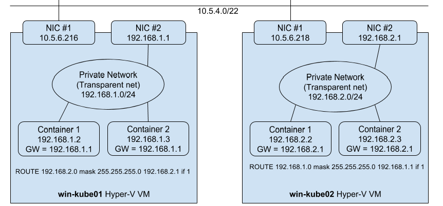

**Note:** These instructions were recently updated based on Windows Server platform enhancements

Kubernetes version 1.5 introduced support for Windows Server Containers based on the Windows Server 2016 OS. With the release of Windows Server version 1709 and using Kubernetes v1.8 users are able to deploy a K8s cluster either on-premises or in a private/public cloud using a number of different network toplogies and CNI plugins. Platform improvements include:
- Improved support for Pods! Shared network namespace (compartment) with multiple Windows Server containers (shared kernel)
- Reduced network complexity by using a single network endpoint per Pod
- Kernel-Based load-balancing using the Virtual Filtering Platform (VFP) Hyper-v Switch Extension (analogous to Linux iptables)

 The Kubernetes control plane (API Server, Scheduler, Controller Manager, etc) continue to run on Linux, while the kubelet and kube-proxy can be run on Windows Server version 1709.

**Note:** Windows Server Containers on Kubernetes is an Alpha feature in Kubernetes 1.8.

**Note:** There is one outstanding PR ([51063 Fixes to enable Windows CNI](https://github.com/kubernetes/kubernetes/pull/51063))which has not been merged into v1.8 and is required for Windows CNI to work with kubelet. Users will need to build a private kubelet binary to consume this change. Please refer to instructions here [TODO - George's guide]

## Prerequisites
In Kubernetes version 1.8, Windows Server Containers for Kubernetes is supported using the following:

1. Kubernetes control plane running on existing Linux infrastructure (version 1.8 or later).
2. Kubenet network plugin setup on the Linux nodes.
3. Windows Server version 1709 (RTM version 10.0.16299.15 or later).
4. Docker Version 17.06.1-ee-2 or later for Windows Server nodes (Linux nodes and Kubernetes control plane can run any Kubernetes supported Docker Version).

## Networking
There are several supported network configurations with Windows Server version 1709 and K8s v1.8 including both Layer-3 routed and overlay topologies using third-party network plugins. 
1. Upstream L3 Routing - IP routes configured in upstream ToR
2. Host-Gateway - IP routes configured on each host
3. OVN & OVS with Overlay - OVS switch extension and OVN controller creates VXLAN overlay network
4. [Future] Overlay - VXLAN or IP-in-IP encapsulation using Flannel
5. [Future] Layer-3 Routing with BGP (Calico)

The selection of which network configuration and topology to deploy depends on the physical network topolgy and a user's ability to configure routes, performance concerns with encapsulation, and requirement to integrate with third-party network plugins.

### Linux
The above networking approach is already supported on Linux using a bridge interface, which essentially creates a private network local to the node. Similar to the Windows side, routes to all other pod CIDRs must be created in order to send packets via the "public" NIC.

### Windows
Windows supports the CNI network model and uses plugins to interface with the Windows Host Networking Service (HNS) to configure host networking and policy. An administrator creates a local host network using HNS PowerShell commands on each node as documented in the **_Windows Host Setup_** section below.

#### Upstream L3 Routing Topology
In this topology, networking is achieved using L3 routing with static IP routes configured in an upstream Top of Rack (ToR) switch/router. Each cluster node is connected to the management network with a host IP. Additionally, each node uses a local 'l2bridge' network with a Pod CIDR assigned. All pods on a given worker node will be connected to the POD CIDR subnet ('l2bridge' network). In order to enable network communication between pods running on different nodes. The upstream router has static routes configured with POD CIDR prefix => Host IP.

Each Window Server node should have the following configuration:

TODO: Add diagram

#### Host-Gateway Topology
This topology is similar to the Upstream L3 Routing topology with the only difference being that static IP routes are configured directly on each cluster node and not in the upstream ToR. Each node uses a local 'l2bridge' network with a Pod CIDR assigned as before and has routing table entries for all other Pod CIDR subnets assigned to the remote cluster nodes.

TODO: Add diagram

#### Overlay using OVN controller and OVS Switch Extension

TODO


The following diagram illustrates the Windows Server networking setup for Kubernetes Setup:


## Setting up Windows Server Containers on Kubernetes
To run Windows Server Containers on Kubernetes, you'll need to set up both your host machines and the Kubernetes node components for Windows and depending on your network topology, setup Routes for Pod communication on different nodes.

### Host Setup

**Linux Host Setup**

1. Linux hosts should be setup according to their respective distro documentation and the requirements of the Kubernetes version you will be using. 
2. Configure Linux Master node using steps here [TODO - Add link to George's page]
3. [Optional] CNI network plugin installed.

**Windows Host Setup**

1. Windows Server container host running Windows Server version 1709 and Docker v17.06 or later. Follow the setup instructions outlined by this help topic: https://docs.microsoft.com/en-us/virtualization/windowscontainers/quick-start/quick-start-windows-server.
2. Build or download kubelet.exe, kube-proxy.exe, and kubectl.exe using instructions found here [TODO - George's guide]
3. Copy Node spec file (config) from Linux master node with X.509 keys
 -- TODO: Create node-specific keys
4. Create HNS Network
5. Ensure correct CNI network config
5. Start kubelet.exe using script [TODO - Add link to George's script]
6. Start kube-proxy using script [TODO - Add link to George's script]
7. [Optional] Add static routes on Windows host

### Component Setup

TODO - Add link to George's documentation

Requirements

TODO - George Check
* Git
* Go 1.7.1+
* make (if using Linux or MacOS)
* Important notes and other dependencies are listed [here](https://git.k8s.io/community/contributors/devel/development.md#building-kubernetes-on-a-local-osshell-environment)

Remove if it makes sense and info is in George's documentation


**kubelet**

To build the *kubelet*, run:

1. `cd $GOPATH/src/k8s.io/kubernetes`
2. Build *kubelet*
   1. Linux/MacOS: `KUBE_BUILD_PLATFORMS=windows/amd64 make WHAT=cmd/kubelet`
   2. Windows: `go build cmd/kubelet/kubelet.go`

**kube-proxy**

To build *kube-proxy*, run:

1. `cd $GOPATH/src/k8s.io/kubernetes`
2. Build *kube-proxy*
   1. Linux/MacOS: `KUBE_BUILD_PLATFORMS=windows/amd64 make WHAT=cmd/kube-proxy`
   2. Windows: `go build cmd/kube-proxy/proxy.go`

### Route Setup
The below example setup assumes one Linux and two Windows Server 2016 nodes and a cluster CIDR 192.168.0.0/16

| Hostname | Routable IP address | Pod CIDR |
| --- | --- | --- |
| Lin01 | `<IP of Lin01 host>` | 192.168.0.0/24 |
| Win01 | `<IP of Win01 host>` | 192.168.1.0/24 |
| Win02 | `<IP of Win02 host>` | 192.168.2.0/24 |

**Lin01**

```
ip route add 192.168.1.0/24 via <IP of Win01 host>
ip route add 192.168.2.0/24 via <IP of Win02 host>
```


## Starting the Cluster
To start your cluster, you'll need to start both the Linux-based Kubernetes control plane, and the Windows Server-based Kubernetes node components. 

## Starting the Linux-based Control Plane
Use your preferred method to start Kubernetes cluster on Linux. Please note that Cluster CIDR might need to be updated.

## Starting the Windows Node Components
To start kubelet on your Windows node:
Run the following in a PowerShell window. Be aware that if the node reboots or the process exits, you will have to rerun the commands below to restart the kubelet.

TODO - Either link to George's doc or update in-line below

1. Set environment variable *CONTAINER_NETWORK* value to the docker container network to use
`$env:CONTAINER_NETWORK = "<docker network>"`

2. Run *kubelet* executable using the below command
`kubelet.exe --hostname-override=<ip address/hostname of the windows node>  --pod-infra-container-image="apprenda/pause" --resolv-conf="" --api_servers=<api server location>`

To start kube-proxy on your Windows node:

Run the following in a PowerShell window with administrative privileges. Be aware that if the node reboots or the process exits, you will have to rerun the commands below to restart the kube-proxy.

1. Set environment variable *INTERFACE_TO_ADD_SERVICE_IP* value to `vEthernet (KubeProxySwitch)` which we created in **_Windows Host Setup_** above
`$env:INTERFACE_TO_ADD_SERVICE_IP = "vEthernet (KubeProxySwitch)"`

2. Run *kube-proxy* executable using the below command
`.\proxy.exe --v=3 --proxy-mode=userspace --hostname-override=<ip address/hostname of the windows node> --master=<api server location> --bind-address=<ip address of the windows node>`

## Scheduling Pods on Windows
Because your cluster has both Linux and Windows nodes, you must explicitly set the nodeSelector constraint to be able to schedule Pods to Windows nodes. You must set nodeSelector with the label beta.kubernetes.io/os to the value windows; see the following example:

```
{
  "apiVersion": "v1",
  "kind": "Pod",
  "metadata": {
    "name": "iis",
    "labels": {
      "name": "iis"
    }
  },
  "spec": {
    "containers": [
      {
        "name": "iis",
        "image": "microsoft/iis",
        "ports": [
          {
            "containerPort": 80
          }
        ]
      }
    ],
    "nodeSelector": {
      "beta.kubernetes.io/os": "windows"
    }
  }
}
```

## Known Limitations:
1. Secrets currently do not work because of a bug in Windows Server Containers described [here](https://github.com/docker/docker/issues/28401).
2. ConfigMaps have not been implemented yet.