# 上游文档贡献流程

时间：2017-08-29 更新时间： 2017-08-30 作者：何小龙@caicloud.io 才云科技

如果您还没有自己的 `Github` 账户, 可以按下面的方式注册一个。Kubernetes 中文社区的文档都是在 Github 完成翻译协作的，因此注册账户是必须步骤。

注：由于上游的 Merge 工作量很大，而且大家的翻译已经在 K8SMeetup 已经有初步 Review。因此，向上游提交 `PR` 尽可能多个文件一起提交，不建议单文件提交。

提交PR后一定要记得更新[任务表](https://docs.google.com/spreadsheets/d/1FDFCv9RK5nSMgLXhPrJ5k7r5QvHnNEFnXbvoFiM8v20/edit#gid=1015862274) `Upstream Pull Request link`,方便我们 `Review` 跟进。

## Step1. 注册自己的代码托管账户

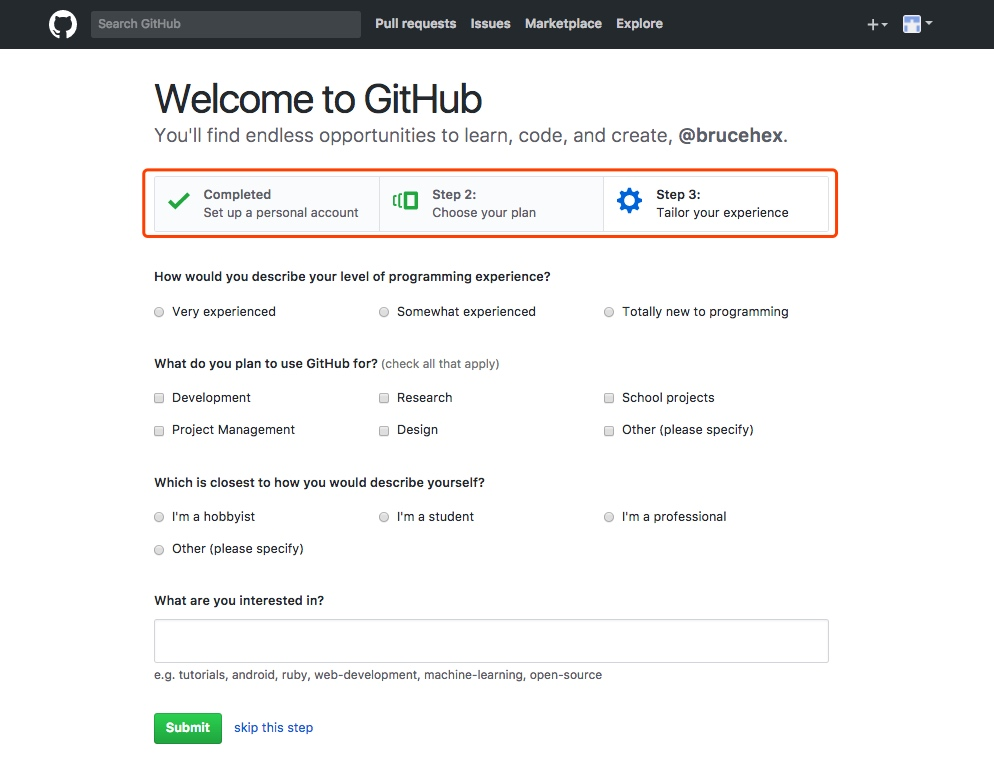

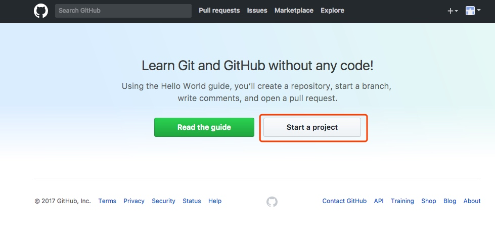


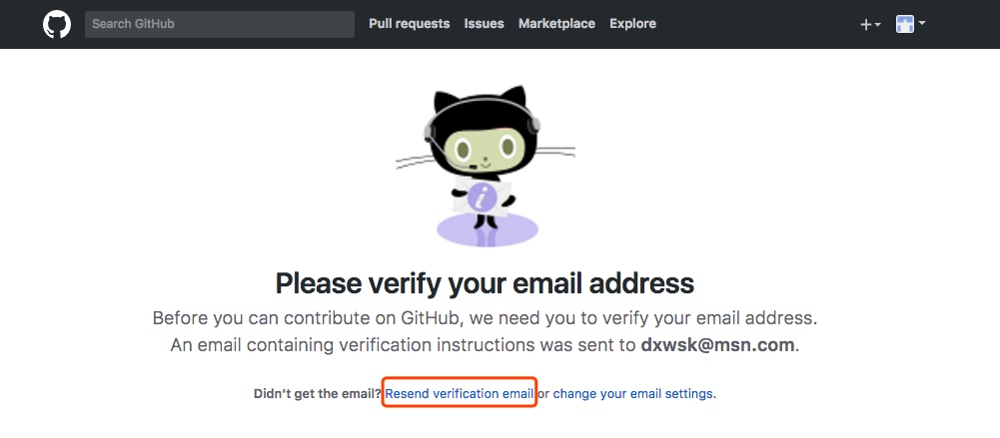


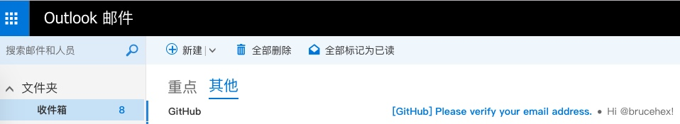

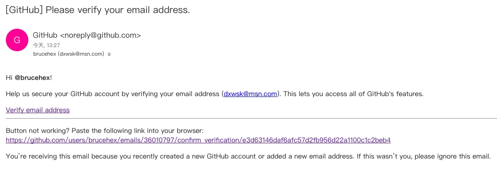


邮箱验证完成，就可以开始我们的翻译之旅了...

## Step2. Fork K8SMeetup 翻译代码库和预览代码库

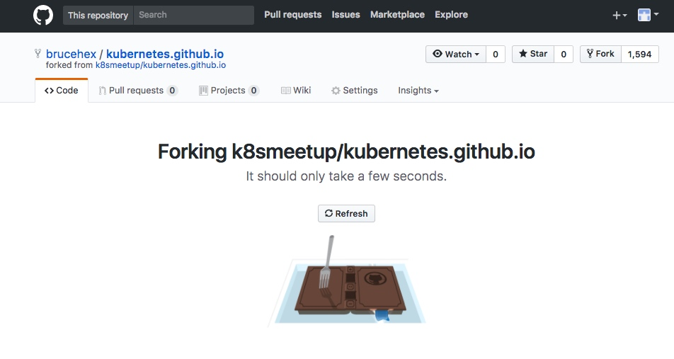


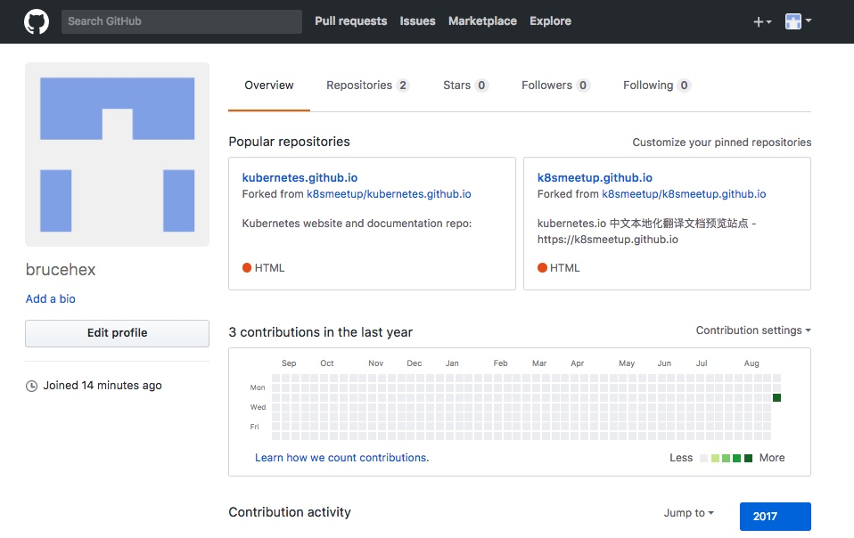

## Step3. 领取翻译任务并标记

为了便于协作，任务表格存放在 Google Sheets 上面，需自行解决访问问题，有需要帮助的，可以在微信群里问。点击此[链接](https://docs.google.com/spreadsheets/d/1FDFCv9RK5nSMgLXhPrJ5k7r5QvHnNEFnXbvoFiM8v20/edit#gid=1015862274)打开任务表格。

文章有六种状态，可参考翻译库的 README 说明：

领取任务，仅需更新 Status 、 Translator 两列，更新翻译状态，填写自己的姓名即可。

本文以首页 `/index.html` 翻译文件为例，首先领取任务，改变 `Status` 状态后，背景会自动标红，提示其他译者，此文已被领取。

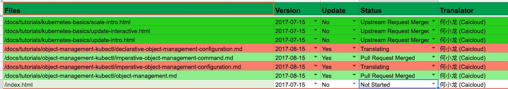

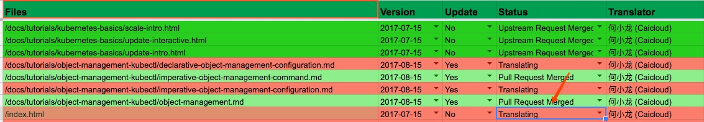

## Step4. K8SMeetup 翻译过程状态变更


如上图，将 GITHUB 代码库克隆至本地。

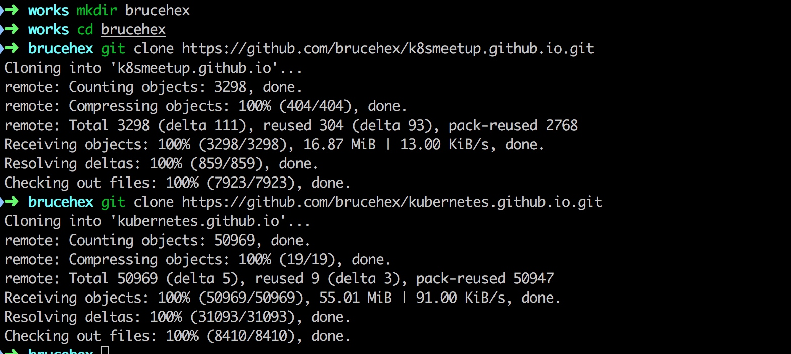


```
cd ~/ && mkdir brucehex
cd ~/brucehex
git clone https://github.com/brucehex/kubernetes.github.io.git
git clone https://github.com/brucehex/k8smeetup.github.io.git
```

建议使用 `atom` 安装 `markdown` 插件翻译文档，编辑器不做强制要求，建议翻译时看一下翻译库的 README 文档。

简单一句话：一段英文、一段中文，原始英文不要移除，有日期的版本文件不需要翻译，样例翻译：

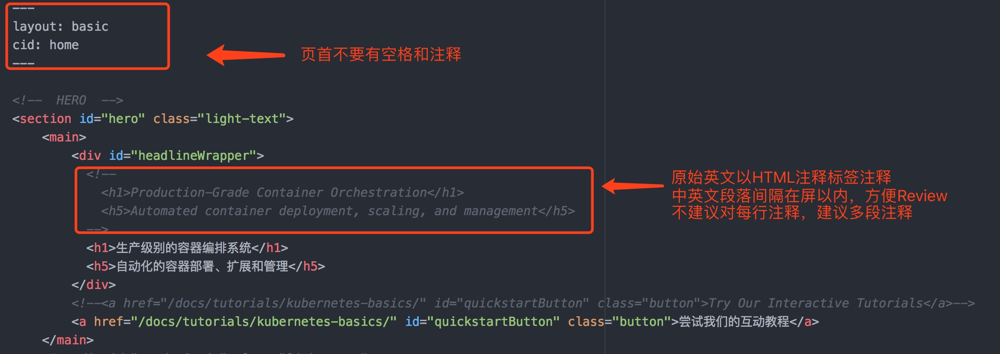

翻译完 `/index.html` 文件，提交到自己的代码仓库。

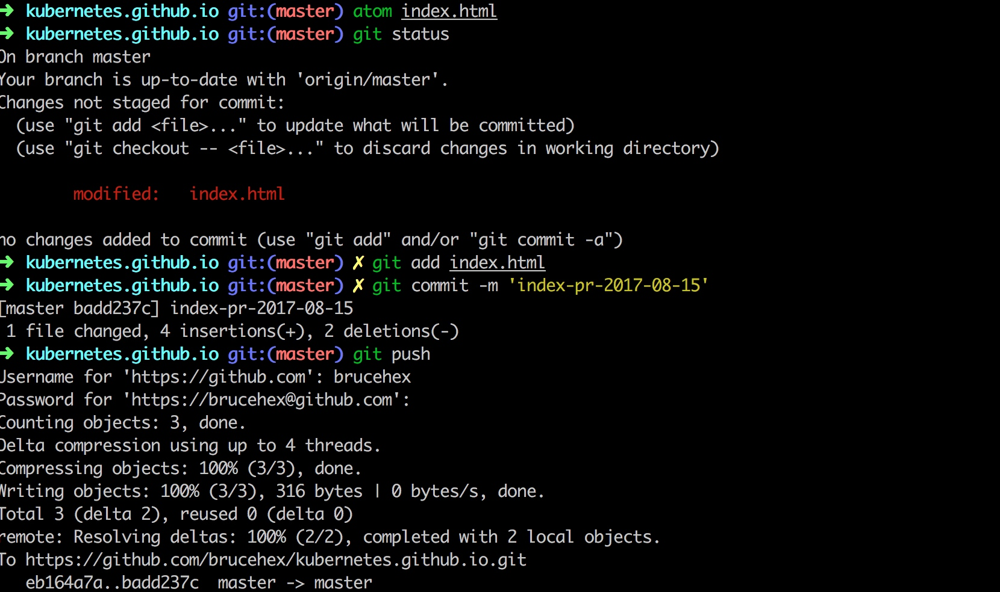

```
cd ~/brucehex/kubernetes.github.io
git add .
git commit -m 'index-pr-2017-08-15'
git push
```

建议 一个 PR 提交一个文件，方便 review, 翻译更新同步到自己的 github 代码库，同时更新任务表状态为 `Pull Request Sent`。

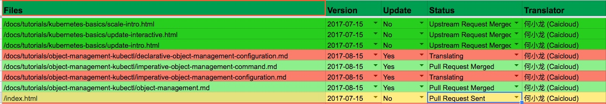

进入自己的 GITHUB 翻译代码库，创建 K8SMeetup PR

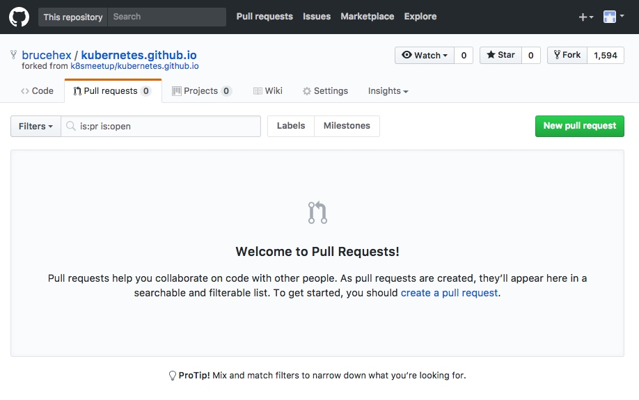

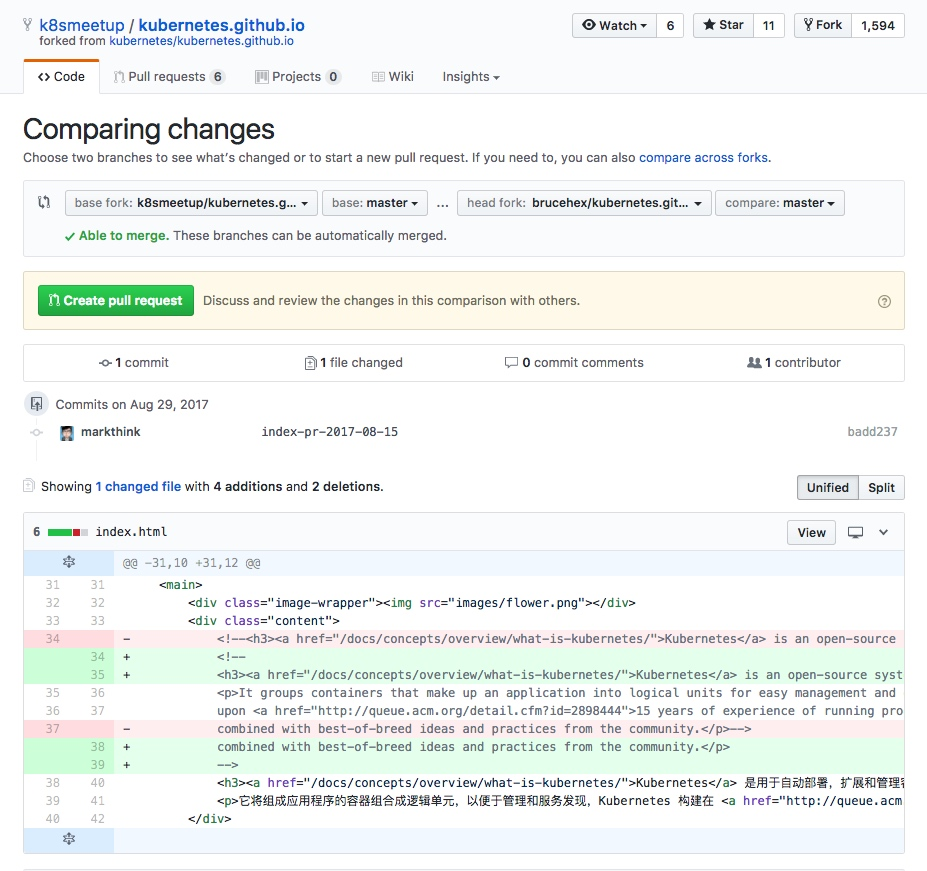


同时更新任务表状态为 `Under Internal Review`,等待其他译者内部 review 。

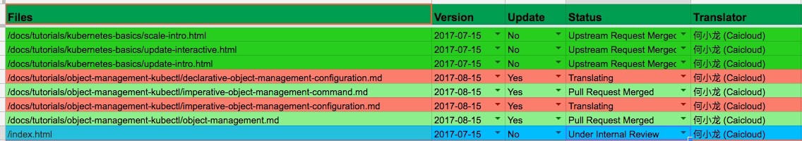

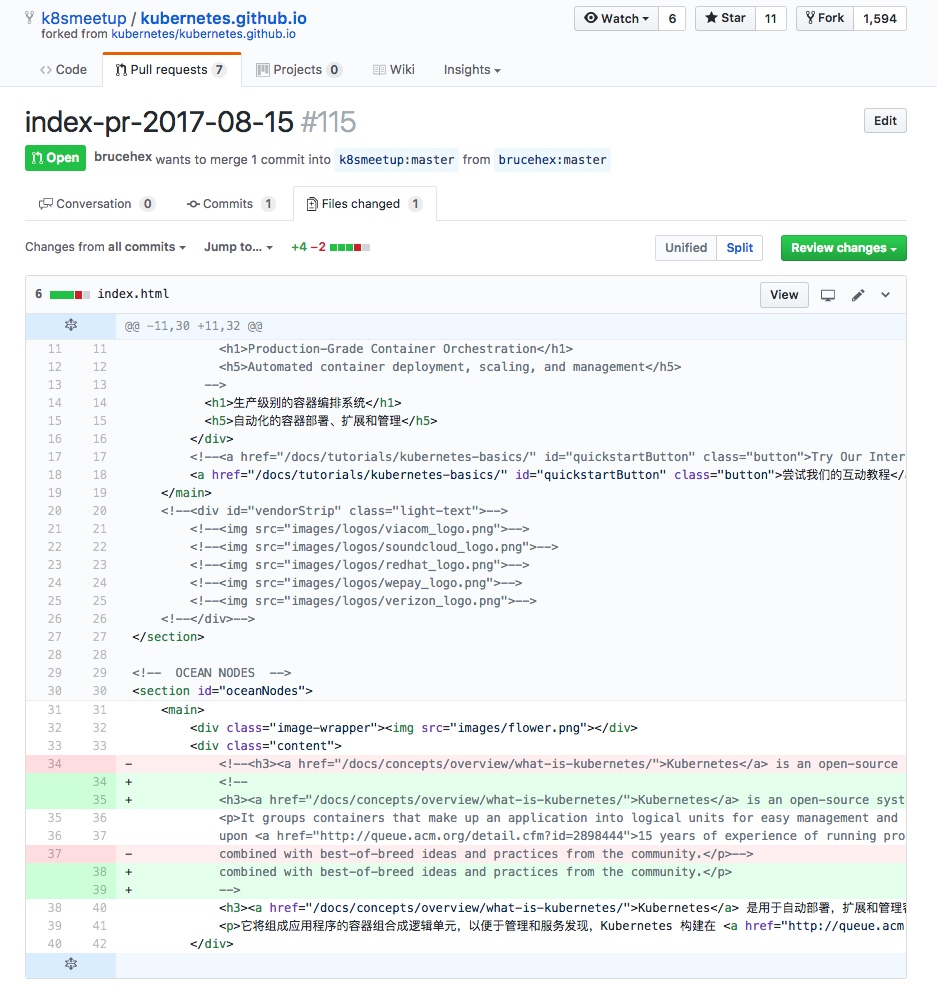

其他译者可以能翻译文章进行评论，由译者修改更新，当内部 Review 完成，由管理员 Merge 代码仓库，任务表状态由 Merge 代码仓库权限的人更新翻译状态为 `Pull Request Merged`, 同时管理员每周会将已经 Merged 的文章同步更新到预览库中。
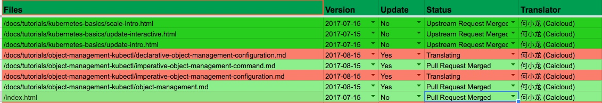

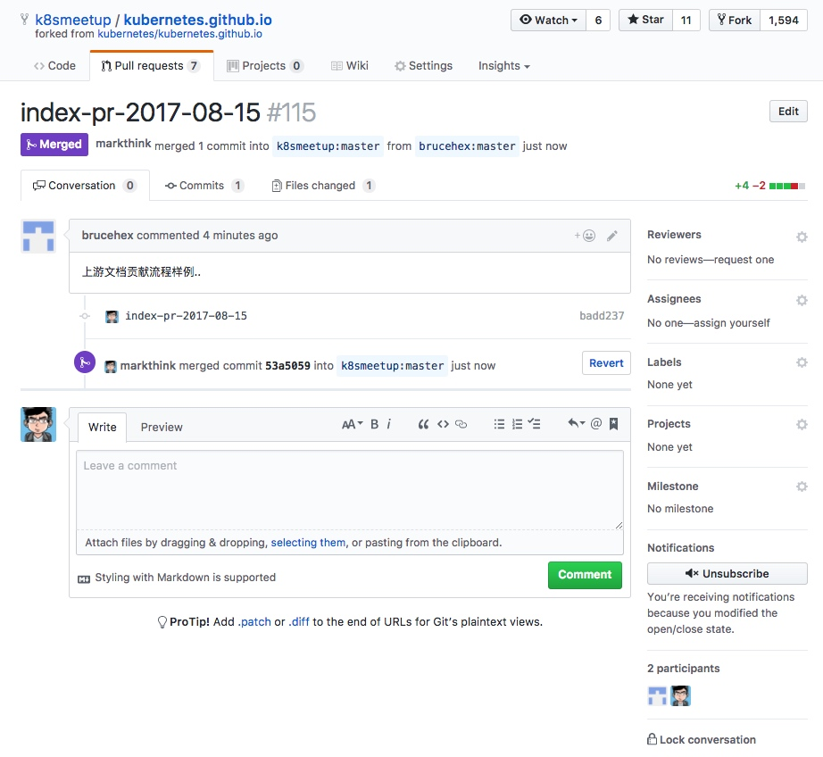

每周我们会发布[翻译周报](https://github.com/k8smeetup/kubernetes.github.io/blob/master/contribution.md),含每周的译文和译者列表，各自的译者可以点击查看预览库翻译效果，如果有问题，在提新的PR，我们会及时更新。如果没有问题，就可以同步预览库，提取自己的翻译文档，向上游推送 PR。

注：建议向上游推送PR时，尽可能多篇一起提交，不建议一篇文档一个PR，上游的 PR 合并工作量很大，而且K8SMeetup 社区已经对翻译的内容进行了初步审核，因此多篇一次提交比较好。

## Step5. 查看任务表格和翻译效果链接


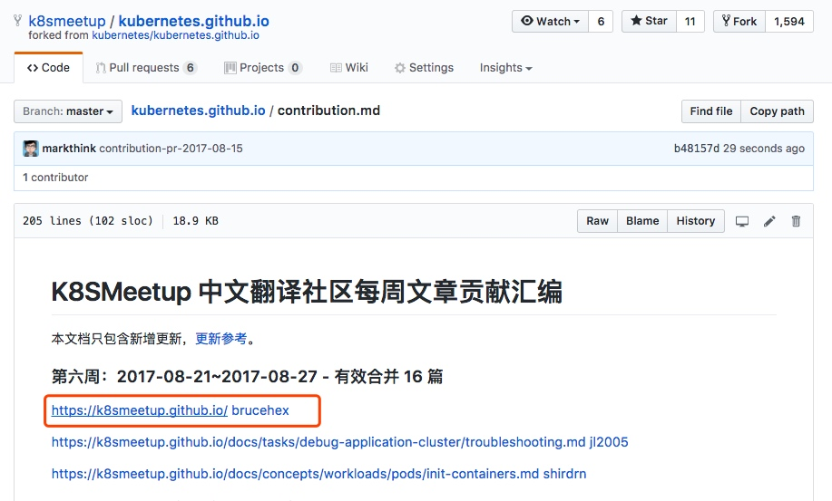


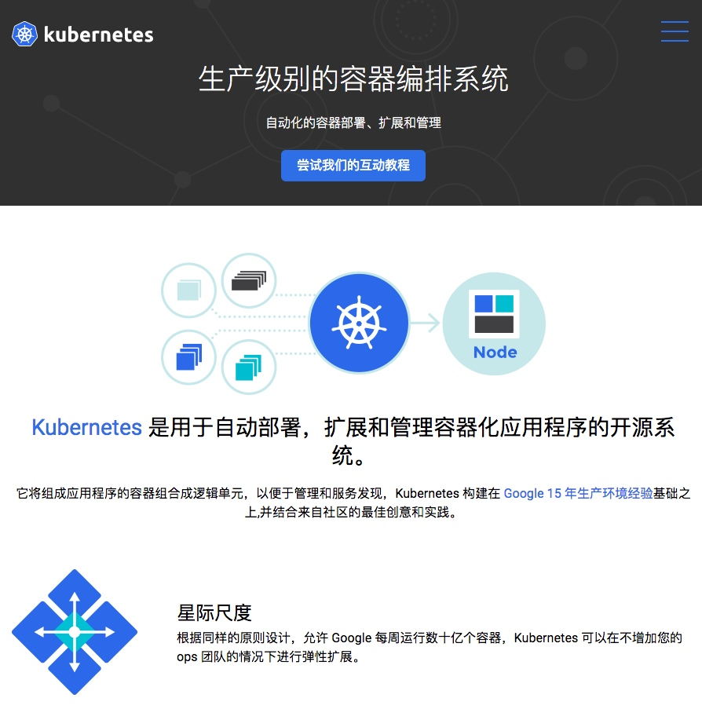

通过预览库查看没有问题，此时就可以从预览库抽取我们的翻译文章了。

## Step6. 同步 K8SMeetup 翻译文档库

进入我们自己的翻译库，查看翻译分支库：

```
cd ~/brucehex/kubernetes.github.io
git branch
```

当我们 `clone` 完一个项目，可以使用`git remote -v`来查看你fork的远程仓库的地址；默认的clone操作完成后，远端仓库的地址别名为：`origin`，为了需要与原项目保持更新，你还需要将原项目地址给添加进来，使用如下命令添加远端仓库地址:

```
// 添加 Kubernetes 仓库(向上游提交 PR 使用)
git remote add k8s https://github.com/kubernetes/kubernetes.github.io.git
// 添加 K8SMeetup 仓库(同步 K8SMeetup 翻译库使用)
git remote add k8smeetup https://github.com/k8smeetup/kubernetes.github.io.git
```
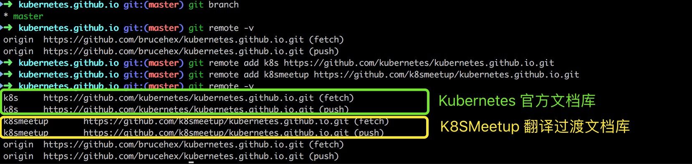

K8SMeetup 翻译文档库更新步骤:

1. 打开`git`命令行工具，进入项目本地路径；
2. 执行`git fetch k8smeetup`命令，检出`k8smeetup`分支以及各自的更新；
3. 切换到自己的本地分支主干：`git checkout master`
4. 命令:`git merge k8smeetup/master` 将原项目中的更改更新到本地分支，这样就能使本地的`fork`分支与原项目保持同步。
5. 执行`git push`将本地分支的修改推送到远端`fork`的项目；

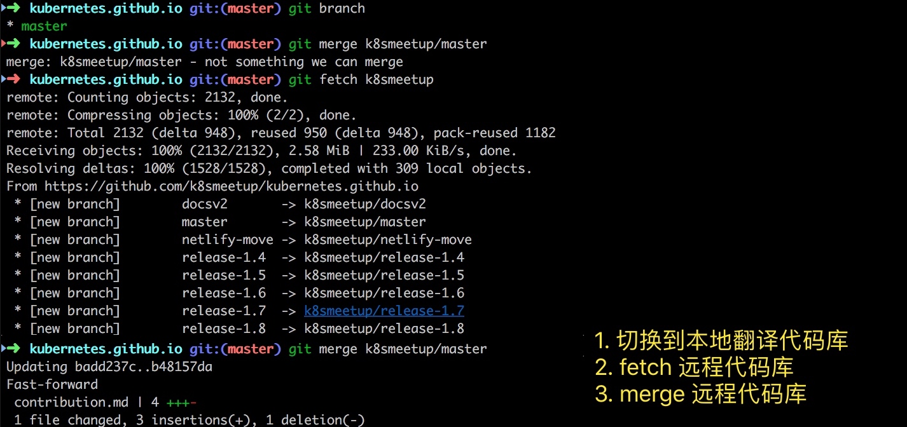

更新同步翻译库至自己的 Github 仓库。
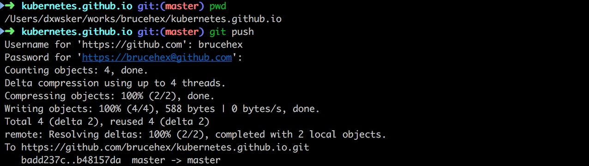

## Step7. 从预览库提取翻译文件向上游推送 PR

```
cd ~/works/brucehex/kubernetes.github.io
# 创建孤立分支
git checkout --orphan upstream
# 删除所有内容
git rm -rf .
# 拉取最新的 Kubernetes 官方文档库
git pull k8s master

# 将翻译文件移到 官方文档移到 `/cn/docs`目录
cp ../k8smeetup.github.io/index.html cn
git add .
git commit -m 'index-pr-2017-08-15'
git push origin upstream:upstream
```
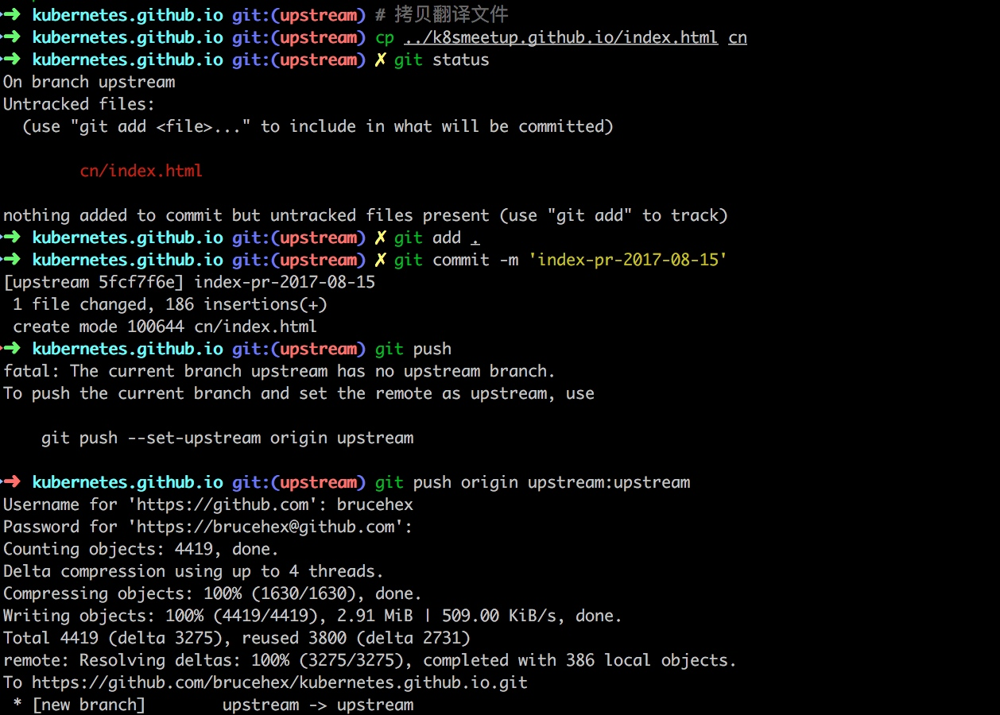

此时我们有一个新的分支 `upstream` 用于向 Kubernetes 官网提交 PR。

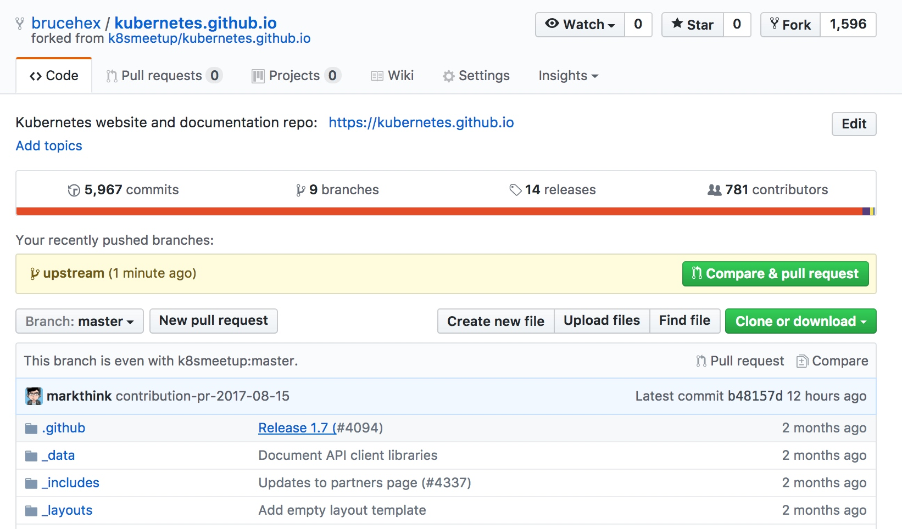


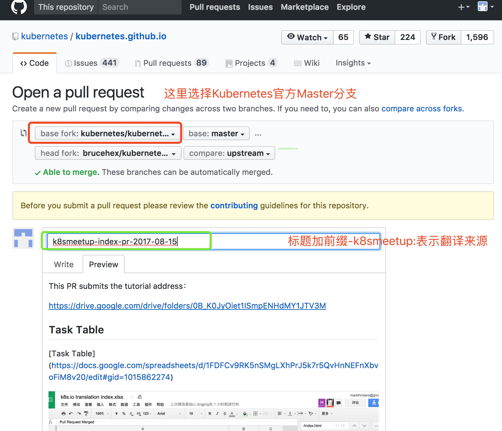


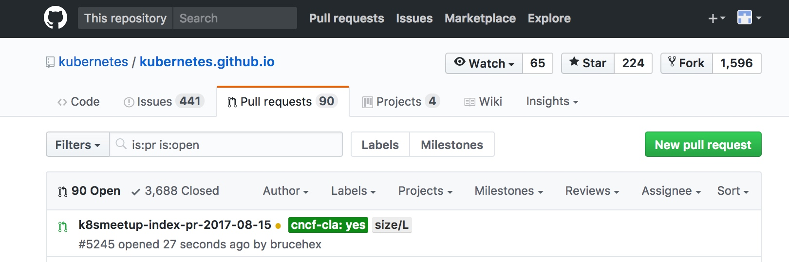

提完 PR 记得更新任务表格 `Upstream Pull Request link` ，方便我们跟踪上游 Merge 进度。

此例更新地址：https://github.com/kubernetes/kubernetes.github.io/pull/5245


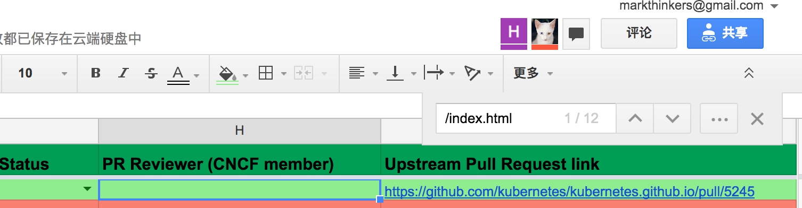

接来我们 Review PR，Review PR 需要 CNCF 会员成员权限。

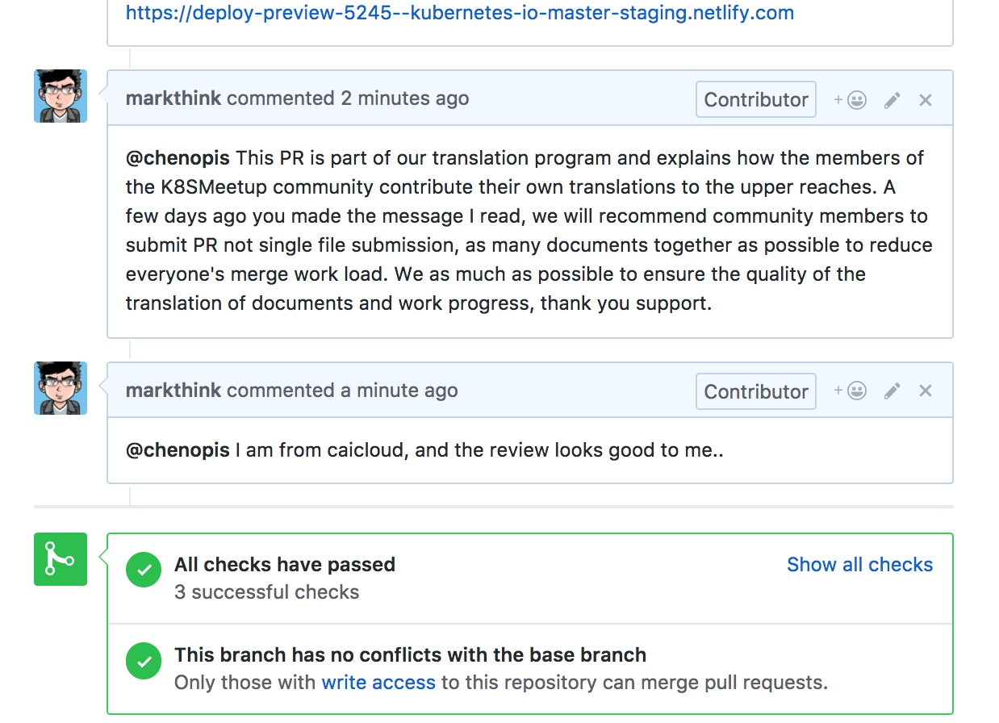

至此，我们完成了此基础教程。
